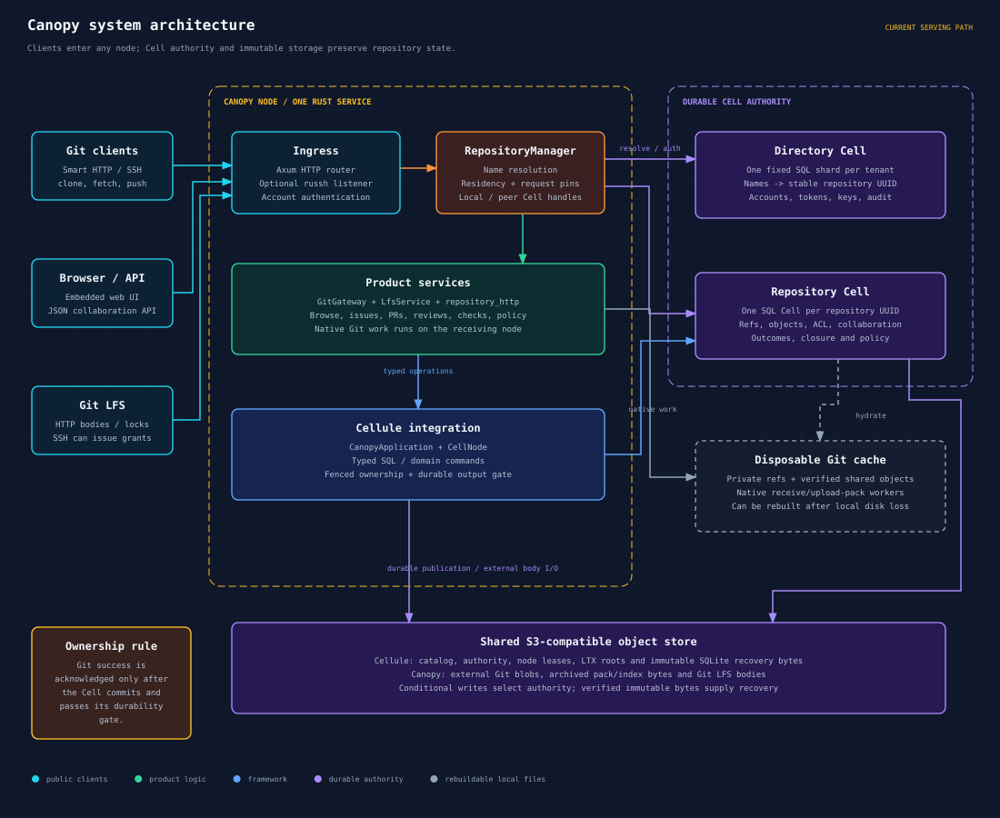
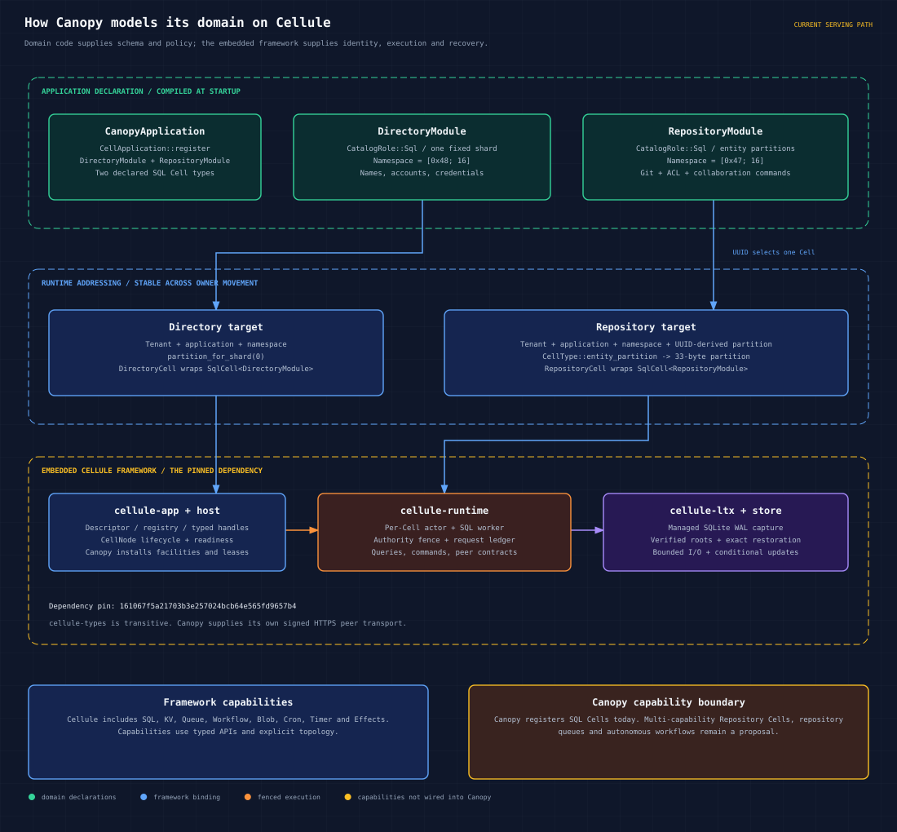
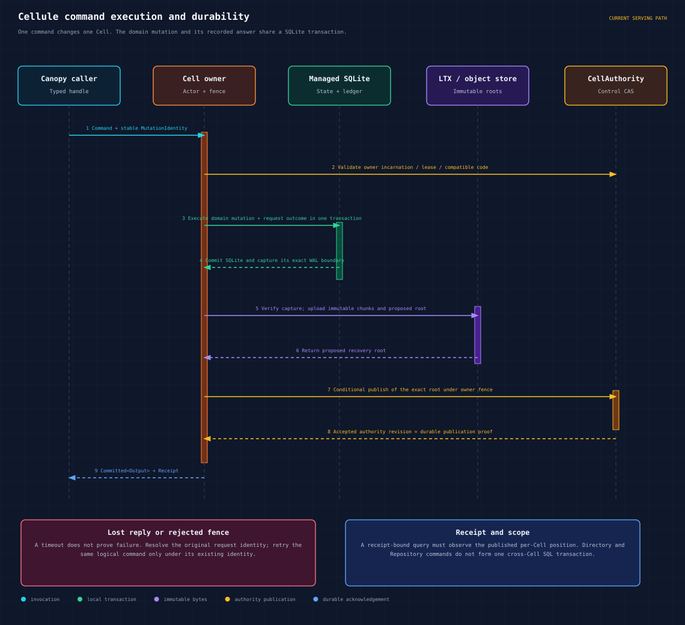
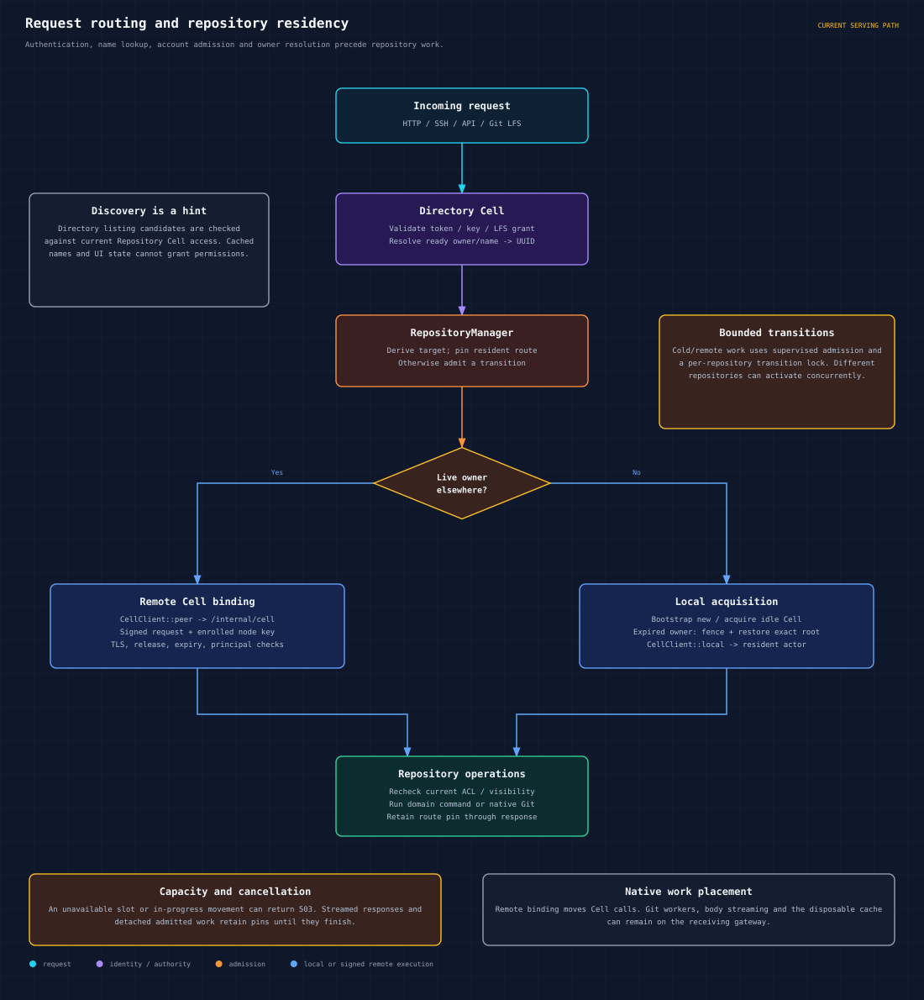
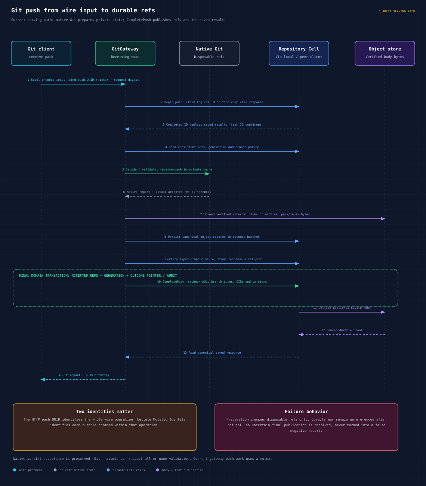
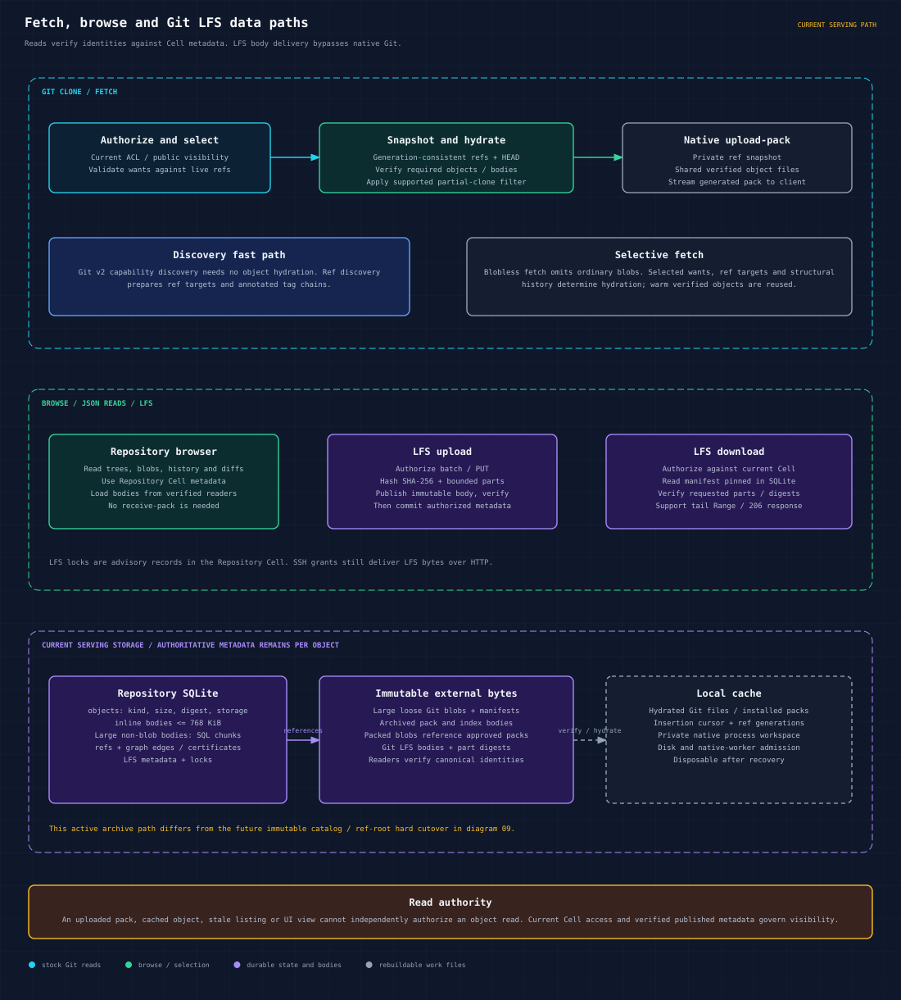
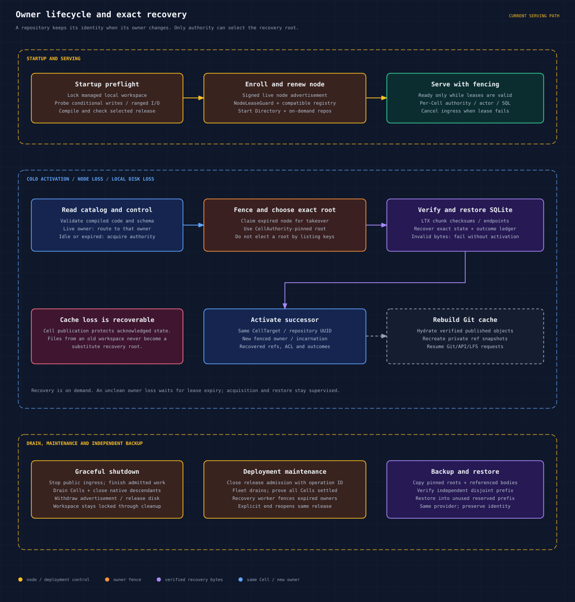
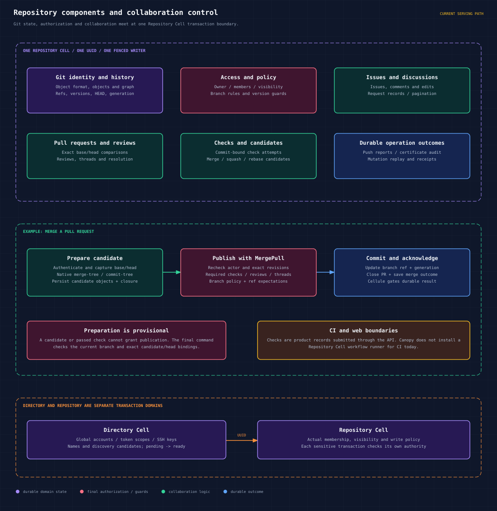
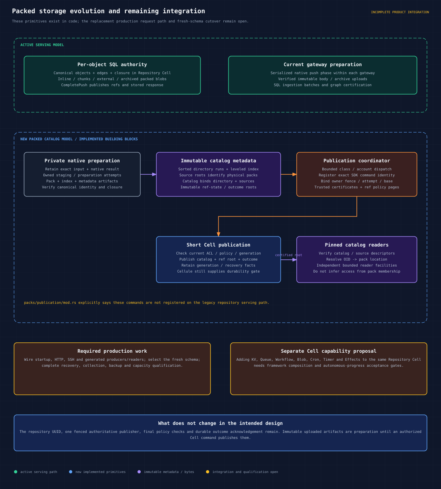

# Canopy design

Canopy is a Git hosting service embedded in the Cellule framework. The Directory Cell owns names and account identity; each repository UUID selects its own Repository Cell containing Git authority, access policy and collaboration state. Native Git prepares and serves wire protocol data through a disposable cache. A successful write depends on durable Cell publication, so rebuilding that cache does not discard acknowledged repository state.

This document explains the system design, its authority and transaction boundaries, request and control flow, persistence, recovery, resource ownership and evolution. It is intended for engineers changing Canopy or operating a deployment. It describes the inspected Canopy revision `9438bb865959fb975d5349ba8b9908b461653821` and the Cellule dependency pinned by Cargo to `161067f5a21703b3e257024bcb64e565fd9657b4`, as of October 4, 2026. Several older documents record different pins; this guide uses the current declarations and executable registration. Diagrams show implementation boundaries, not measured production capacity.

Use the [browsable gallery](diagram/canopy-architecture/index.html) to inspect the diagrams. Every diagram is a standalone SVG with a matching PNG at twice its logical resolution. The [persisted contracts](docs/contracts.md) define detailed protocol and storage behavior; the [delivery plan](docs/delivery-plan.md), [roadmap](ROADMAP.md) and [performance plan](docs/performance-plan.md) remain the records of qualification and open release gates.

## Design scope and implementation status

This is a description of the inspected implementation and its design implications. It does not introduce a new storage format or declare the service production ready. The snapshot includes an active Git hosting path and a newer packed-storage subsystem whose complete production integration remains open.

| Area | Status in this design | Boundary |
| --- | --- | --- |
| Git hosting and collaboration | Implemented serving path | Smart HTTP, optional SSH, browse/API, Git LFS and SQL-backed repository features |
| Cellule integration | Implemented SQL Cells | Directory and Repository modules, typed calls, ownership fencing, durable outcomes and restoration |
| Multi-node routing | Implemented | Receiving gateways can call a live remote Cell owner through signed HTTPS |
| Archived pack storage | Implemented optimization | Per-object SQL authority remains the serving model |
| Immutable catalogs and ref-state roots | Implemented primitives with incomplete integration | Fresh-schema startup, all producers/readers and production hard cutover remain open |
| Composed repository capabilities | Proposed | KV, Queue, Workflow, Blob, Cron, Timer and Effects are not installed in today's Repository Cells |
| Production capacity and complete fault qualification | Open gates | A local result does not establish a deployment-wide resource or availability guarantee |

The design preserves one Canopy binary, native Git, a managed local workspace, shared immutable storage and HTTPS ingress. It does not depend on a separate repository microservice, a second authoritative Git filesystem, or a distributed SQL transaction spanning every repository. The distinction between current behavior and future work is particularly important when reading the packed-storage and capability proposals.

## Document map

- [Goals and constraints](#goals-and-constraints) and [authority and invariants](#authority-and-invariants) explain the rules that implementation changes must preserve.
- [System components](#system-components) and [modeling Canopy on Cellule](#modeling-canopy-on-cellule) explain placement, contracts and stable identities.
- [Durable commands](#durable-command-execution), [routing](#request-routing-and-residency), [push](#git-push-and-replay), and [reads and LFS](#fetch-browse-and-git-lfs) trace execution.
- [Recovery](#owner-recovery-and-operational-control) and [collaboration](#collaboration-and-final-policy-checks) explain ownership changes and final policy decisions.
- [Storage evolution](#packed-storage-and-framework-capability-evolution), [resource ownership](#resource-admission-and-request-lifetimes), [security](#security-and-trust-boundaries), and [failure handling](#failure-handling) describe boundaries across those flows.
- [Tradeoffs](#design-decisions-and-tradeoffs), [verification](#verification-and-change-obligations), and [diagram maintenance](#regenerate-and-verify-the-diagrams) explain how to assess and maintain the design.

## Diagram index

| Diagram | What it explains | SVG | PNG |
| --- | --- | --- | --- |
| 01 | Public clients, node components and storage authority | [System overview](diagram/canopy-architecture/01-system-overview.svg) | [PNG](diagram/canopy-architecture/01-system-overview@2x.png) |
| 02 | How Canopy models Directory and Repository Cells on Cellule | [Framework mapping](diagram/canopy-architecture/02-canopy-on-cellule.svg) | [PNG](diagram/canopy-architecture/02-canopy-on-cellule@2x.png) |
| 03 | Commands, SQLite, LTX and the durable acknowledgement boundary | [Durable command](diagram/canopy-architecture/03-durable-command.svg) | [PNG](diagram/canopy-architecture/03-durable-command@2x.png) |
| 04 | Authentication, residency, local routing and signed peer routing | [Request routing](diagram/canopy-architecture/04-request-routing.svg) | [PNG](diagram/canopy-architecture/04-request-routing@2x.png) |
| 05 | Push preparation, object ingestion, policy checks and exact replay | [Git push](diagram/canopy-architecture/05-git-push.svg) | [PNG](diagram/canopy-architecture/05-git-push@2x.png) |
| 06 | Fetch, browse, LFS and current physical storage choices | [Reads and LFS](diagram/canopy-architecture/06-read-and-lfs.svg) | [PNG](diagram/canopy-architecture/06-read-and-lfs@2x.png) |
| 07 | Startup, leases, takeover, exact restore, drain and backup | [Owner recovery](diagram/canopy-architecture/07-owner-recovery.svg) | [PNG](diagram/canopy-architecture/07-owner-recovery@2x.png) |
| 08 | Repository features and merge publication controls | [Domain and policy](diagram/canopy-architecture/08-domain-and-policy.svg) | [PNG](diagram/canopy-architecture/08-domain-and-policy@2x.png) |
| 09 | Packed catalog primitives, remaining integration and capability proposals | [Storage evolution](diagram/canopy-architecture/09-packed-storage-evolution.svg) | [PNG](diagram/canopy-architecture/09-packed-storage-evolution@2x.png) |

## Goals and constraints

The hosting design combines stock Git behavior with repository-local durable policy. Git processes prepare or serve bytes; authoritative commands decide which changes become repository state. A successful acknowledgement must survive loss of the serving node's local files.

| Goal | Design mechanism | Constraint or consequence |
| --- | --- | --- |
| Preserve acknowledged repository state | Fenced Cell authority and verified SQLite recovery roots | Local commit or object upload alone cannot authorize a success reply |
| Keep repository identity stable | UUID-derived Cell targets separate from owner/name aliases | Name changes and owner movement must not redirect stale operations to another repository |
| Check policy at publication | Refs, ACLs, graph certificates, rules and outcomes share a Repository Cell | Native preparation cannot authorize a later write by itself |
| Let any gateway receive traffic | Local or signed peer Cell bindings | Cell execution can move independently of native Git and body streaming |
| Recover from local disk loss | Restore accepted Cell roots and rebuild native caches | Cache contents and object listings cannot select authority |
| Bound admitted work | Residency, account, transfer, disk and native resource ownership | Admission accounting still needs OS containment and workload qualification |
| Preserve existing Git behavior | Stock Git workers and canonical object verification | Compatibility must be tested for each supported protocol and object format |

There is no fixed logical repository-size quota used as a substitute for resource admission. SQLite representation limits, request codec bounds, batch sizes, disk budgets and worker admission are different constraints. None is evidence that the node can serve a particular number of repositories or developers. See the [implementation limits](docs/implementation.md) and [native resource contract](docs/design/native-resource-admission.md).

## Authority and invariants

### Terms and state ownership

| Term | Meaning | Authority boundary |
| --- | --- | --- |
| Directory Cell | Shared name, account and credential state | One fixed SQL shard within the configured tenant/application |
| Repository Cell | Durable Git and collaboration state for one repository UUID | One independently fenced Cell |
| Cell target | Tenant, application, namespace and partition | Stable address independent of the node that currently owns it |
| Owner fence | Authority for a particular owner incarnation/session | Prevents a superseded owner from publishing authoritative state |
| Mutation identity | Identity of one Cellule command attempt and its recorded result | Reused when resolving or retrying the same command |
| Push identity | Product-level UUID bound to actor and encoded input digest | Names the complete HTTP push across several Cell commands |
| Receipt | Proof of an accepted per-Cell write position | Can constrain a later read of that Cell |
| Recovery root | Exact immutable SQLite recovery state selected by Cell authority | Publication makes a prepared root authoritative |
| Native cache | Local private refs and verified object files used by Git workers | Rebuildable data with explicit disk/process ownership |

SQLite rows and immutable body references are durable repository state. The object store carries both Cellule control/recovery data and Canopy product bodies, but those have different roles. Conditional control updates select authority; content verification establishes the identity of immutable bytes. A stored object is not automatically reachable, published or safe to collect.

### Rules that changes must preserve

1. Each repository UUID has one durable Cell identity. A name lookup, cache directory or receiving node cannot replace that identity.
2. A Cell's accepted root is selected through fenced authority. Neither the newest-looking local database nor the result of a bucket listing can select recovery state.
3. A durable command records its domain mutation and replay outcome in the same SQLite transaction. A successful caller response follows the configured durability gate.
4. Ref publication rechecks current repository authorization, graph requirements, policy and expected ref versions. Preparation evidence does not bypass that final decision.
5. Unknown outcomes retain their original mutation/push identities. A timeout is not proof that the operation failed.
6. External bytes are verified and available before authoritative metadata points to them. Unreferenced prepared bytes do not expose repository refs.
7. Request pins, disk charges and native claims remain owned until their work and cleanup have actually settled. Cancellation alone is not release evidence.
8. Directory and Repository Cells are separate transaction domains. Multi-step creation and discovery need explicit coordination and rechecks.

These rules follow the [persisted contracts](docs/contracts.md), [application registration](crates/canopy-server/src/lib.rs), [runtime assembly](crates/canopy-server/src/server/mod.rs) and [native ownership contract](docs/design/native-process-ownership.md). They apply to the active serving model and must remain true through a future storage cutover.

## System components



The `canopy` binary runs one Rust service. Axum handles HTTP, JSON APIs, the embedded browser and Git LFS; an optional russh listener handles SSH Git operations. `RepositoryManager` resolves identities, admits repository transitions, binds local or remote Cell clients and retains request pins. `GitGateway` turns repository state into a native Git workspace and translates native results into authoritative Cell operations. `LfsService` verifies and publishes LFS bodies independently of native Git.

The Rust workspace has three crates. `canopy-git-format` supplies object kinds, SHA-1/SHA-256 identities and canonical hashing. `canopy-object-storage` owns immutable body and artifact operations. `canopy-server` composes those crates with Cellule and owns product schemas, protocols, authorization and deployment lifecycle. These are linked components of the service, not separately deployed microservices. See the [workspace map](docs/workspace.md) and [server assembly](crates/canopy-server/src/server/mod.rs).

### Component responsibilities

| Component | Responsibility | State it may publish |
| --- | --- | --- |
| HTTP and SSH ingress | Admit protocol input, authenticate and manage transport lifetime | Through registered product operations |
| RepositoryManager | Resolve targets, own resident bindings, transition locks and request pins | Catalog/acquisition/release through Cellule and name coordination through Directory |
| GitGateway | Prepare native work, ingest verified objects, certify closure and finalize pushes | Repository commands; private native refs stay provisional |
| Repository HTTP and browse services | Expose repository and collaboration operations | Registered commands with current actor/precondition checks |
| LfsService | Publish and verify LFS bodies, metadata and advisory locks | Authorized Repository Cell metadata after body verification |
| CanopyApplication and modules | Describe topology, schema, operation IDs/codecs and handlers | Compiled application contracts |
| CellNode and runtime | Supervise Cell execution, durable outputs, ownership and recovery | Fenced Cell control and published roots |
| Object storage | Retain immutable recovery and product bytes | Conditional control records and verified immutable objects |

### Execution and control placement

The request data path includes input spooling, native Git, verified readers and body streaming. The ownership control path includes release selection, catalog records, node enrollment, Cell acquisition and conditional root publication. They meet when a product operation calls a registered Cell command or query. This separation allows a receiving gateway to keep its native process and socket while authoritative SQL execution happens on another node.

The Directory is shared state, so account and name operations do not scale by creating a new Directory for every repository. Repository state is partitioned by UUID, allowing unrelated repositories to have different owners. The architecture does not imply that one hot repository can have multiple concurrent authoritative SQL writers.

## Modeling Canopy on Cellule



`CanopyApplication::register` installs `DirectoryModule` and `RepositoryModule`, then declares their SQL Cell types. Modules describe schema migrations, operation IDs, codecs, code digests and limits. A compiled registry binds these contracts to the application and selected release. Product wrappers invoke registered commands and queries through typed handles. See [application and repository registration](crates/canopy-server/src/lib.rs) and [Directory registration](crates/canopy-server/src/directory/mod.rs).

| Canopy concept | Cellule representation | Consequence |
| --- | --- | --- |
| Deployment identity | Tenant and application IDs | Scope every durable target |
| Directory | SQL namespace `[0x48; 16]`, fixed shard zero | One shared name and identity authority per tenant/application |
| Repository | SQL namespace `[0x47; 16]`, entity partition derived from UUID | One independently owned Cell for each repository |
| Directory operations | `SqlCell<DirectoryModule>` plus credential commands | Account state and name changes stay inside the Directory boundary |
| Repository operations | `SqlCell<RepositoryModule>` plus typed domain commands | Ref publication can check ACL, graph and policy in one transaction |
| Mutation | `MutationIdentity` and recorded outcome | Retries preserve one logical command identity |
| Observed write position | `Receipt` | A later read can require that per-Cell position |
| Node lifecycle | `CellNode` and installed runtime/replica facilities | Readiness and shutdown depend on supervised framework state |

The repository partition is a prefix byte followed by a domain-separated 32-byte digest; `RepositoryCell::new` verifies that the supplied UUID derives the supplied target. A rename changes the Directory mapping while retaining the repository UUID and Cell identity. Creating a repository uses a durable pending name reservation, initializes the Cell and then marks the name ready. Those steps coordinate separate Cells; they do not form a distributed SQL transaction.

`cellule-app` compiles topology and exposes handles. `cellule-host` supervises the node. `cellule-runtime` manages actors, SQL execution, request outcomes and fenced authority. `cellule-ltx` captures SQLite changes and verifies restoration; `cellule-store` supplies bounded object operations and conditional updates. Canopy supplies public ingress, user authorization, credentials and deployment policy. The [Cellule framework architecture at the pinned revision](https://github.com/crabbuild/cellule/blob/161067f5a21703b3e257024bcb64e565fd9657b4/docs/architecture.md) documents these boundaries.

### Module contracts and typed handles

A module is the executable contract installed into a Cell. Its operation descriptors specify IDs, codec versions, schema compatibility and input/output bounds; its code identity covers the authoritative implementation. `SqlCell<RepositoryModule>` and `SqlCell<DirectoryModule>` bind calls to these registered contracts. Product wrappers add domain operations while leaving routing, command identity, receipts and durable output handling to Cellule.

The application declaration and runtime assembly serve different purposes. `CanopyApplication` declares the available Cell types; server startup installs runtime/replica facilities, enrolls the node and binds actual targets. Adding a Rust module or schema table does not automatically make an operation callable on the production path. Registration and release admission must agree with the handlers that execute and restore it.

### Repository creation and alias changes

Creation first reserves the owner/name with a canonical UUID and a pending state in Directory. It then initializes that UUID's Repository Cell and marks the reservation ready. A request interrupted between these phases must preserve the existing reservation rather than allocate a different identity for the same operation. The pending/ready protocol coordinates the two durable boundaries.

Rename compares the expected UUID and moves the ready Directory name while retaining repository identity. Administrative operations that carry repository identity must reject name reuse that would otherwise retarget a stale write. The Repository Cell continues to own its object format, owner identity and repository policy. See [creation and discovery](docs/contracts.md#repository-creation-and-authorized-discovery).

## Durable command execution



A command executes at the current fenced owner of one Cell. Its SQLite transaction records the domain change and the request outcome together. On the object-store path assembled here, LTX captures the committed WAL boundary, verifies and publishes immutable recovery bytes, and supplies a proposed root. A conditional authority update publishes that exact root under the owner fence. The caller receives `Committed<Output>` and a receipt after this durability gate.

Authority fencing prevents a former owner from publishing new authoritative state after ownership changes. A transport timeout can occur after a command committed; resolving its original identity distinguishes a completed outcome from an unstarted operation. A receipt is scoped to a Cell, owner incarnation and commit sequence. It can constrain a subsequent query, but it cannot create an atomic transaction across Directory and Repository Cells. Cellule also documents an optional follower-log durability path; the diagram describes Canopy's inspected object-store setup.

### Commit and acknowledgement ordering

The local SQLite transaction is an execution boundary. The accepted authority revision is the durable publication boundary. Between them, LTX must capture the exact WAL endpoint and immutable recovery bytes must become available. The authority update binds that recovery root to the valid owner fence. The caller must not receive a durable success acknowledgement solely because local SQL committed or uploads completed.

The recorded outcome travels with the same restored SQLite state as the domain mutation. If a node disappears after publication but before its reply arrives, a new owner can recover both. If a proposed root was uploaded but never selected, that upload does not supersede the last accepted root. This is why failure handling uses command resolution and authority state rather than interpreting transport errors as domain results.

### Read consistency and optimistic preconditions

A receipt-bound query asks to observe at least the relevant published position of one Cell. It does not make a Directory lookup and a Repository query atomic. Discovery therefore rechecks current repository access, and final writes carry expected identities and versions into their own transaction.

Git ref snapshots use a shared generation with HEAD. Continuation pages must retain that generation; a changed generation invalidates the scan. Ref writes compare both the expected OID and monotonic version. Deleting and recreating a name cannot make an old plan valid again merely because the OID matches. These are separate mechanisms: receipts constrain observation, generations bind a multi-page read, and versions fence optimistic writes. See [ref snapshots](docs/contracts.md#ref-snapshots-and-default-branch).

## Request routing and residency



HTTP credentials, SSH keys and LFS grants are checked using Directory state. Ready owner/name entries resolve to stable repository UUIDs. Repository routing then binds a `CellClient::local` to a resident actor or a `CellClient::peer` to the current remote owner. Canopy's peer transport signs requests to `POST /internal/cell` and verifies the enrolled sender, signature, release, expiry and principal over HTTPS. It is Canopy's own transport over runtime peer contracts; the optional Cellule peer adapter is not a Canopy dependency. See [peer routing](crates/canopy-server/src/server/peer.rs).

The receiving node can run native Git and stream product bodies while Cell calls go to another node. Public requests therefore do not require sticky load-balancer sessions. Node advertisement and Cell ownership are separate controls: the advertisement proves a node session is live; the Cell control record identifies authority for a particular Cell.

Cold and remote transitions use bounded account admission and a lock for that repository. The configured residency limit counts locally bound repository gateways, including remote bindings. When no slot is free, an inactive gateway can be evicted; local ownership must be released before its slot is reused. Requests and response streams pin their route. Supervised activation and cleanup continue after client cancellation. Full admission or ownership movement can return a retryable 503. See [residency](crates/canopy-server/src/server/residency/mod.rs) and [admission](crates/canopy-server/src/admission.rs).

### Routing decisions

| Observed state | Routing action | Required condition |
| --- | --- | --- |
| Resident local binding | Call the local Cell client | The binding remains valid and request-pinned |
| Live owner on another node | Bind a signed peer client | Current authority identifies an enrolled live owner and HTTPS endpoint |
| New or idle target | Admit local acquisition/bootstrap | Catalog/release checks and runtime capacity permit it |
| Expired owner | Fence and restore under new ownership | Recover exactly the root selected by authority |
| Full pinned resident set or busy movement | Return retryable capacity/unavailability | Do not steal an active slot or infer owner death from latency |

A remote binding owns a local gateway entry but not the remote SQLite workspace. Evicting that binding does not release the remote Cell. When remote authority changes, subsequent routing refreshes the binding using current ownership. Node discovery is a routing input, while Cell control remains the ownership authority.

## Git push and replay



The gateway spools input to admitted scratch storage and binds the logical push UUID to the account, repository context and encoded request digest. `begin_push` detects completed operations before gzip decoding and native preparation. Reusing an ID with different bytes or an actor produces a conflict. Upload reception can overlap, but the current gateway serializes its ID check, native push work and publication phase through a mutex. See [gateway control flow](crates/canopy-server/src/git_gateway/mod.rs) and [owned preflight](crates/canopy-server/src/git_gateway/preflight.rs).

New attempts capture consistent refs and policy, run native `receive-pack` against private refs and derive the actual accepted changes. Ingestion verifies canonical object identities, publishes required external bytes, persists bounded object batches and certifies typed graph closure. The gateway stages the response and ref plan. `CompletePush` rechecks current permissions, branch rules, expected OIDs and monotonic ref versions, then commits accepted refs, the generation change and the canonical response pointer together. Cellule publishes the durable result before the client sees success. See [push execution](crates/canopy-server/src/git_gateway/push.rs), [saved outcomes](crates/canopy-server/src/push/mod.rs) and [shared ref guards](crates/canopy-server/src/refs.rs).

There are two identity layers: the push UUID identifies the complete wire operation; Cellule mutation identities identify its individual durable commands. A retry of a completed push replays the saved result and does not reapply old refs over later repository changes. Native partial acceptance is preserved, while stock Git `--atomic` requests atomic validation. Preparation failure cannot publish private refs, although verified unreferenced objects can remain. An uncertain final publication must be resolved rather than reported as a definite refusal.

### Preparation and final publication

| Phase | Work | Authoritative effect |
| --- | --- | --- |
| Input identity | Spool encoded input and bind actor, UUID and digest | Establish the product operation and detect completed replay |
| Native preparation | Build a private ref snapshot and run receive-pack | Produce provisional objects and the actual native report |
| Verified ingestion | Check canonical hashes, store object metadata/bodies and certify typed graph closure | Make verified objects available without publishing the final ref plan |
| Staging | Retain ordered ref changes and exact response data | Prepare a bounded final command |
| CompletePush | Recheck permissions, policy, OIDs and versions; commit refs, generation and response pointer | Publish the accepted repository transition atomically |
| Durable output | Publish the exact SQLite root through Cellule | Authorize the successful report to the client |

Preparation can overlap unrelated operations, but the active gateway's push mutex serializes its native/ref-publication phase. A single push may involve several object batches and Cell commands; it is not one long distributed transaction over all uploaded bytes. The final command is the point that joins accepted refs with the canonical saved outcome.

Graph closure validates typed dependencies: branch tips are commits; commit trees/parents, tree entries and tag targets require the appropriate reachable objects. Gitlinks refer to another repository and do not require local object presence. Certification supports final publication without repeatedly traversing already certified history. It does not replace every metadata or portability check performed by `git fsck`.

### Retry scope and transport differences

HTTP exposes the product push UUID so a caller can recover an uncertain report under the same input binding. A completed retry returns the saved status, headers and verified body instead of running receive-pack again. Reusing that UUID with a different actor or encoded digest conflicts. This replay must not overwrite refs changed by later independent pushes.

SSH uses the same object ingestion and durable ref-publication rules but does not expose the HTTP push retry-ID contract. Documentation and clients must not promise that opening a new SSH command recovers the exact result of an earlier disconnected command. See [SSH transport](docs/contracts.md#ssh-transport) and [lost push reply recovery](docs/operations.md#recover-a-lost-push-reply).

## Fetch browse and Git LFS



Fetch reads generation-consistent refs and HEAD, validates wants against current repository reachability, hydrates selected verified bodies and lets native `upload-pack` generate the response. Warm verified object files are shared across private ref snapshots. Git v2 capability discovery avoids object hydration; ref discovery prepares ref targets and tag chains. Blobless fetch omits ordinary blobs, and supported filters guide further body selection. Browse APIs use repository metadata and verified object readers for trees, blobs, history and comparisons. See [fetch](crates/canopy-server/src/git_gateway/fetch.rs), [hydration](crates/canopy-server/src/git_gateway/hydration.rs) and [Git reads](crates/canopy-server/src/git_read/mod.rs).

The active [repository schema](crates/canopy-server/src/schema.sql) stores per-object kind, size, digest and storage choice. Inline objects are bounded at 768 KiB; larger structural objects use SQL chunks. Large loose blobs use immutable external bodies. The serving code also archives pack/index bodies and can store packed-blob references while retaining per-object SQL authority. This active optimization is distinct from the future immutable catalog design.

LFS transfers use HTTP even when SSH issues the authorization grant. Upload hashes and publishes bounded immutable parts, verifies the complete body and then commits authorized metadata. Download uses the manifest digest pinned in SQLite and verifies requested parts, including tail range responses. Locks are advisory Repository Cell records. See [LFS upload](crates/canopy-server/src/lfs/upload.rs) and [LFS read](crates/canopy-server/src/lfs/read.rs). Canopy's immutable body store is product code; it is not a registered Cellule Blob capability.

### Storage representations

| Representation | Durable metadata | Byte location | Verification role |
| --- | --- | --- | --- |
| Inline Git object | Kind, size, digest and OID | Repository SQLite row | Recompute canonical object identity |
| Chunked structural object | Bound upload/chunk metadata | Repository SQLite chunks | Verify complete object before publication |
| External loose blob | Size, digests and immutable body reference | Canopy object storage | Check body bytes against SQL metadata and Git identity |
| Packed blob | Per-object SQL record and archive binding | Immutable archived pack/index | Authenticate archive/object mapping and object bytes |
| LFS object | SHA-256, size and manifest binding | Immutable LFS body parts | Verify manifest-bound parts and requested ranges |
| SQLite recovery data | Authority-selected root and LTX metadata | Cellule immutable recovery storage | Restore the exact accepted Cell state |

Each representation has an authoritative reference and a verified reader. A native cache may contain an additional copy, but cache presence does not create an object record or authorize a ref. The independent content checks matter because an object-store key or physical pack offset is only a location, not proof of the bytes' identity.

### Snapshot lifetime

An admitted fetch retains a coherent ref generation and its cache/input ownership through streaming. Later writes can advance the repository while that request serves its selected immutable snapshot. Discovery does not need to wait for an unrelated history hydration job. Authorization still precedes access; cached refs and warm objects cannot grant read permissions. The absence of production collection currently keeps unreferenced immutable bytes available, but a future collector must explicitly protect active readers and their retained roots.

## Owner recovery and operational control



Startup locks the managed workspace, probes provider behavior, compiles the application, checks release admission and enrolls a signed node lease. Readiness depends on valid framework state and leases. A new Cell bootstraps; an idle Cell restores under acquired authority; a dead owner requires lease expiry and a fenced takeover. Recovery restores the root pinned by Cell authority, verifies required bytes and restores the outcome ledger before activation. Local databases and object listings cannot select a newer-looking root. Native caches rebuild afterward. See [acquisition and startup](crates/canopy-server/src/server/mod.rs) and [workspace management](crates/canopy-server/src/server/workspace/mod.rs).

Graceful shutdown stops ingress, finishes admitted work, drains Cells and withdraws the node advertisement. Deployment maintenance closes release admission and uses an operation UUID until drain and recovery are proven complete; an explicit end reopens the release. Backup copies pinned roots and referenced external bodies into a disjoint prefix, verifies that independent copy and restores into an unused reserved destination. The current path is a same-provider copy. These controls do not complete schema migration, cross-provider export or collection. See the [operations runbook](docs/operations.md).

### Startup and release admission

Startup constructs and validates native admission, locks the local workspace, checks provider capabilities and the selected compiled release, then enrolls the signed node session. It checks release readiness around enrollment and before exposing ingress. Release changes or failed lease validation can close readiness and request supervised shutdown. A Cell's catalog and registered handlers must be compatible with the selected release before acquisition.

Maintenance admission, local file exclusion and ownership fencing are distinct controls. Maintenance can close new work across the release; the workspace lock prevents competing local runtimes; Cell authority fences the writer. A released listener or expired heartbeat alone does not prove that every admitted native or Cell operation finished.

### Drain and workspace reuse

One supervisor retains startup, admitted work, native processes, Cell drain, leases and workspace exclusion. Canceling the caller's startup/shutdown wait requests or observes cleanup; it does not discard that supervisor. Native admission closes, tracked ingress/work joins, native owners drain, then Cellule shuts down. Only confirmed drain authorizes workspace release and advertisement withdrawal.

If drain or cleanup is uncertain, the workspace fence or native claim remains retained. On Unix, worker ownership includes inherited completion/lock descriptors so participating descendants cannot outlive the accounting boundary unnoticed. Linux listener guards additionally prevent a fork-inherited listener from surviving a completed handoff. These mechanisms do not claim general containment of every possible helper on every OS. See [native process ownership](docs/design/native-process-ownership.md) and [resource admission](docs/design/native-resource-admission.md#shutdown-boundary).

### Backup and restoration boundaries

A backup is a verified independent copy of pinned recovery roots and referenced product bodies, with its own operation identity and destination. Restoring an empty reserved deployment from that copy differs from reconstructing a live owner's local cache. The former must preserve the copied release/schema and destination admission; the latter follows current Cell authority. Maintenance recoveries for explicitly supported retained contracts do not imply a general old-release migration or cross-provider restore path.

## Collaboration and final policy checks



The Repository Cell stores ACLs and visibility alongside issues, PRs, reviews, line discussions, commit checks and branch rules. This placement lets final commands check current policy against the same state that they mutate. Directory listings only suggest candidate repositories; the product rechecks actual Repository Cell access before exposing them.

For a merge, preparation captures exact base/head revisions and may use native `merge-tree` or `commit-tree` to construct candidate objects. `MergePull` checks the actor, revisions, current branch state, required checks, reviews and unresolved discussions before changing the branch and PR state. The candidate remains provisional until that command publishes. Check results are API records tied to commits and attempts; they do not imply that Canopy currently runs CI through a Cellule Workflow capability. See [merge command](crates/canopy-server/src/pulls/merge/command.rs), [candidates](crates/canopy-server/src/pulls/candidates/mod.rs) and [branch rules](crates/canopy-server/src/branch_rules/command.rs).

### Why policy belongs beside refs

An ACL grant, branch rule, review or check can change after native preparation starts. Co-locating these facts with refs lets the final Repository Cell command examine their current versions and exact reviewed revisions in the same transaction that changes the branch. A ready merge candidate describes prepared bytes; it does not grant a standing right to merge them later.

Issues, comments and PR records use repository-local identities and optimistic versions. Check attempts retain reporter/context policy and terminal results. These records participate in repository recovery, so owner movement does not split collaboration history from the Git branch state it governs. External runners, durable event delivery and autonomous workflow execution are separate integration work.

## Packed storage and framework capability evolution



The newer `packs` subsystem implements immutable native-pack metadata, canonical directory runs, leveled indexes, source roots, catalogs, ref-state roots and exact outcome artifacts. Staging and preparation retain attempts and input custody; trusted certificates bind verified work to the repository, owner fence and base. A bounded publication coordinator dispatches registered commands by class and account. Short final commands publish catalog/ref state and outcomes while rechecking authority and policy. Uploaded artifacts remain preparation until authorized publication selects them.

The [publication module](crates/canopy-server/src/packs/publication/mod.rs) explicitly states that its commands are not registered on the legacy serving path. The [implementation status](docs/large-repository-implementation-status.md) lists production startup, HTTP, SSH, generated producers/readers and the fresh-schema hard cutover as open work, along with recovery, collection, backup and capacity qualification. The atlas therefore separates implemented primitives from a complete replacement serving system.

A separate [repository capability proposal](docs/repository-cell-primitives.md) aims to compose SQL, KV, Queue, Workflow, Blob, Cron, Timer and Effects within one repository identity, fence and recovery boundary. Current `RepositoryModule` declares `CatalogRole::Sql` and has empty workflow/activity inventories. Autonomous per-repository work and composed capabilities remain acceptance goals. Framework support for a primitive does not mean Canopy has wired that primitive into its Repository Cells.

### Hard cutover requirements

The new model shifts large inventories, ref snapshots and exact outcomes into immutable artifacts while retaining short authoritative SQL publication commands. Prepared certificates bind verified artifacts to the repository, owner fence and base state. Service-owned staging, checkpoints and recovery records must retain the original command inputs across uncertainty; rebuilding a similar-looking command is not exact recovery.

Completing this model requires compatible registration and recovery admission, production HTTP/SSH producers, all readers, a fresh-schema format selection, retained-root collection, isolated restore, maintenance and capacity qualification. The current implementation status, rather than the presence of individual types or local tests, determines whether each gate is closed. The active archived-pack optimization must not be presented as the completed immutable-catalog cutover.

### Composed capabilities are a separate design

Installing additional primitives into a repository requires explicit capability metadata, registry validation, typed APIs, durable work inspection and runner/lifecycle integration under the same target and fence. A SQL table named queue is not sufficient. Current release/acquisition logic must account for every installed primitive's live work before moving or retiring the Cell.

Canopy's product-level blob/LFS store and check records do not instantiate Cellule Blob or Workflow capabilities. The proposal describes the desired composition; it must be rechecked against the exact framework revision selected for implementation. Historical dependency pins in that proposal are not the pin of the serving snapshot documented here.

## Resource admission and request lifetimes

Canopy uses several independent admission boundaries. They protect different retained resources and cannot be replaced by one count of open HTTP requests.

| Boundary | What it owns | Release condition |
| --- | --- | --- |
| Repository residency | Local gateway slot, route binding and transition state | No request pins; confirmed local Cell release and cleanup when applicable |
| Account/transition admission | Accepted activation or product work | Admitted operation and supervised cleanup settle |
| Transfer admission | Git/LFS input and output work | Body/trailers finish or transport cleanup completes |
| Local disk budget | Spools, cache generations and temporary body files | Confirmed deletion/reclamation, retaining charges on uncertain cleanup |
| Native resource vector | Process slots, CPU admission units, memory claims and descriptor claims | Process ownership/reaping and inherited completion drain are proven |
| Packed preparation/publication services | Bounded retained inputs, commands, results and observation state | Exact terminal result or safe explicit lifecycle transition |

The node constructs one `NativeResources` pool from required `native_limits` configuration and shares it across gateways/services. A claim admits the complete vector atomically or returns typed exhaustion. Foreground and reserved maintenance shares are disjoint; an unused reservation is not silently borrowed. Every shared Git process requires a private permit. This prevents independent repositories from each assuming the whole node budget is available.

The configured CPU units and memory bytes are admission estimates. They do not throttle CPU or cap actual RSS. OS/container limits, native helper behavior and full-history workloads need separate qualification. Node-native admission also does not implement per-account vector fairness by itself. The [configuration example](config.example.json) illustrates a profile; it is not a throughput or memory guarantee.

A streamed response retains the route pin and relevant ownership until EOF, trailers, error or disconnect cleanup. Native cancellation transfers ownership to the independent reaper; signaling a process group cannot immediately return capacity. Unknown cleanup can quarantine credits and keep drain pending. New admission receives capacity/unavailability responses instead of creating an unbounded retained waiting queue. See [native resource admission](docs/design/native-resource-admission.md) and [disk/request ownership](docs/contracts.md#repository-routing-and-residency).

## Security and trust boundaries

### Public requests and repository policy

The Directory owns accounts, token digests, scopes, expirations, SSH key enrollment and administrative audit. HTTP authentication checks credential and account state; SSH authentication requires verified key possession in addition to a stored active key. Repository read/write/admin decisions remain in current Repository Cell state. The immutable repository owner and individual collaborator grants are different from fleet node identity.

Directory credential-management commands repeat their authorization in their transaction. Repository commands repeat repository policy at their final write. Account disablement or token expiry prevents subsequent admission, while an already authenticated request can finish according to its documented lifetime and current repository ACL checks. A cached name, browser view or discovery candidate cannot restore revoked permissions. Anonymous reads require current public visibility, and forbidden repository metadata is hidden according to the API contract.

### Internal peers and infrastructure

The peer adapter authenticates enrolled node sessions, not end-user credentials. It verifies the signed Canopy node principal/action, tenant/application/namespace, release and expiry, and routes using authoritative ownership plus the matching signed advertisement. Outbound HTTPS verifies the endpoint certificate and hostname; a configured private CA adds trust. Redirects, environment proxies and transport retries are disabled so untrusted fields cannot redirect Cell commands or silently replace an uncertain mutation.

Canopy uses signed requests over HTTPS; this adapter does not use Cellule's separate mTLS helper. The object store, TLS terminator and enrolled signing keys are trusted fleet infrastructure. A compromised enrolled node has internal Cell authority and is outside the end-user ACL boundary. Content hashes authenticate bytes; they do not replace TLS, credential protection or deployment access controls. See [peer routing contracts](docs/contracts.md#peer-routing) and [peer implementation](crates/canopy-server/src/server/peer.rs).

## Failure handling

The key distinction is whether failure occurs before execution, during preparation, or after a command may have published. Only authoritative resolution can turn an unknown command into a known result or known absence.

| Failure or race | Design response | State that must remain protected |
| --- | --- | --- |
| Admission is full or movement is busy | Return retryable unavailability before accepting more work | Existing pins, slots and resource claims |
| A live Cell owner is remote | Route signed Cell calls to that owner | Stable target and current ownership |
| Owner/session expires | Fence takeover and restore the accepted root | Acknowledged SQL state and outcome ledger |
| Local SQL commits but root publication is unproven | Do not issue durable success; resolve the original identity | Last accepted authority root |
| Root publishes but the reply is lost | Resolve/replay the original command or product push | Exact saved outcome and later independent ref changes |
| External upload succeeds but final publication fails | Leave bytes provisional/unreferenced | Authoritative refs and metadata |
| ACL, rule or ref changes during preparation | Final command rechecks and can refuse/conflict | Current policy and monotonic ref versions |
| A ref generation changes during pagination | Discard the partial scan and retry within its bounded policy | One coherent refs/HEAD snapshot |
| A cache or body cannot be verified | Do not expose unverified bytes as repository state | Canonical object identity and selected durable references |
| Client cancels accepted work | Retain supervised operation/native cleanup until settlement | Request identity, route pins, disk charges and process claims |
| Shutdown cannot prove drain | Retain exclusion/claims; do not reuse the workspace as clean | Local worker and authority safety |
| Backup or maintenance reply is ambiguous | Continue using the original operation UUID and status protocol | Exact operation ownership and isolated destination |

An API conflict and a transport timeout therefore require different handling. A known conflict provides a domain decision; an unknown reply requires resolution. Changing the logical operation ID to bypass uncertainty can create a second operation and violates the replay contract. Detailed operator procedures live in the [operations runbook](docs/operations.md).

## Design decisions and tradeoffs

These are implications of the current architecture, rather than additional production promises.

| Decision | Benefit | Cost or limit |
| --- | --- | --- |
| One SQL Cell per repository | Ref, ACL and collaboration decisions can share a transaction | One hot repository retains a single authoritative execution boundary |
| Shared Directory separate from repositories | Names and accounts have one durable identity authority | Creation/discovery need coordination across Cells; Directory is shared work |
| Native Git over private rebuildable caches | Uses stock wire/pack behavior while keeping durable state independent of local files | Hydration, scratch, native helpers and resource ownership add work |
| Durable exact outcomes | Unknown replies can resolve without reapplying old mutations | Retained outcomes, staged input and exact identity need lifecycle/retention rules |
| Immutable external bodies with SQL references | Large bytes need not live inline in SQLite | Upload and SQL publication are separate phases; orphan collection needs root proof |
| Any gateway with signed peer calls | Public routing need not be sticky to the SQL owner | Adds peer authentication, remote latency and uncertainty handling |
| Final policy rechecks | Prepared work cannot bypass later authorization/ref changes | Preparation may be discarded after substantial native work |
| Explicit admission and maintenance reservations | Retained resource demand is accounted before launch | Estimates require measurement; quarantined claims reduce available capacity |
| Fresh-schema packed-storage cutover | Can establish one coherent producer/reader/authority format | Cannot claim completion until every registration, reader and recovery gate is satisfied |

## Verification and change obligations

Changes should identify which invariant and transaction boundary they affect before modifying code. Protocol or storage changes update the [persisted contracts](docs/contracts.md) alongside focused tests; compatibility and fault results record the exact revision, provider, tools, workload and hardware. The [delivery plan](docs/delivery-plan.md) determines release acceptance, while the [performance plan](docs/performance-plan.md) separates measured results from targets.

| Change area | Required design evidence |
| --- | --- |
| Module registration or codec/schema | Compatible descriptors and exact release/code identity; explicit upgrade or fresh-prefix policy |
| Ref/push publication | SHA-1/SHA-256 client behavior, stale versions, policy changes, rollback and exact replay |
| Routing or ownership | Live remote binding, competing acquisition, lease loss, fenced takeover and exact restoration |
| Streaming or native work | Cancellation, disconnect, descendant/reaper ownership, disk accounting and honest drain |
| External bytes or pack readers | Canonical identity, corruption/range failures, immutable reference binding and recovery |
| Backup, retention or cutover | Complete retained root set, independent restore, concurrent readers/writers and fault injection |
| Capacity claim | Whole-operation CPU/RSS/disk/descriptor behavior, mixed workload and recorded environment |

Operational visibility is also an open release concern. The design needs low-cardinality signals for admission/refusals, active/transitioning Cells, native claims/drain, lease/release health, object-store failures, disk use and operation latency. Existing health/tracing or bounded native counters must not be described as a completed metrics/alerting contract. See [operational visibility](ROADMAP.md#r06-operational-visibility-and-runbooks).

Safe versioned migrations, complete provider/fault qualification, conservative collection, cross-provider backup, full observability, repeatable deployment, immutable-storage hard cutover and composed capabilities remain separate acceptance work. A change should close a gate only with its stated evidence; it must not widen timeouts, invent fixed logical size caps or reinterpret admission estimates as measured capacity.

## Regenerate and verify the diagrams

The [generator](diagram/canopy-architecture/generate.py) contains the SVG source layouts, labels and source map. It uses embedded styles and system monospace fonts, with no external rendering dependency in the SVG files.

```sh
python3 diagram/canopy-architecture/generate.py
python3 diagram/canopy-architecture/render_pngs.py
python3 diagram/canopy-architecture/build_gallery.py
```

The PNG export helper requires `rsvg-convert` on `PATH` and renders at twice the SVG viewBox dimensions. The gallery embeds the SVGs directly and works offline. Sequence diagrams draw activation bars behind dashed lifelines, with message arrows on top. The atlas is documentation only; repository runtime behavior is unchanged.
