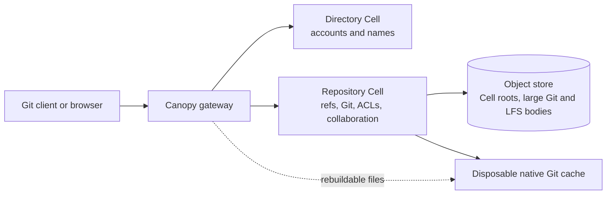
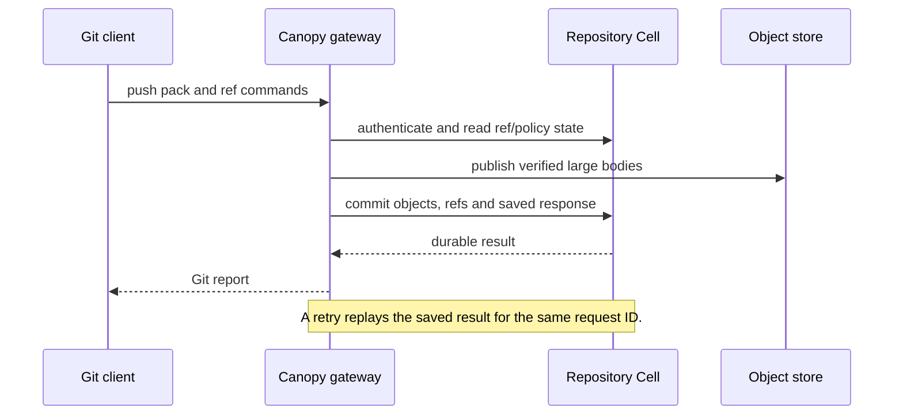

# Canopy

Canopy is an experimental Git hosting service built on [Cellule](https://github.com/crabbuild/cellule). It speaks stock Git over smart HTTP and optional SSH, stores repository authority in a durable SQLite Repository Cell, and keeps large Git and Git LFS bodies in an object store.

> Canopy's Git hosting core works today. Production readiness remains in progress. Treat this repository as a development preview until the [roadmap](ROADMAP.md) and [delivery gates](docs/delivery-plan.md) say otherwise.

[]

## Start here

| You want to… | Start with |
| --- | --- |
| Run a local node | [Local quickstart](#run-a-local-node) |
| Create and push a repository | [First repository](#create-and-push-a-repository) |
| Check supported Git operations | [Git compatibility](docs/git-compatibility.md) |
| Understand durability and retry behavior | [Persisted contracts](docs/contracts.md) |
| Deploy inside a bounded Linux profile | [Deployment guide](deploy/README.md) |
| Evaluate release readiness | [Delivery plan](docs/delivery-plan.md) |
| Measure capacity and latency | [Performance plan](docs/performance-plan.md) |
| Extend a Repository Cell | [Cell capability proposal](docs/repository-cell-primitives.md) |

## What Canopy provides

Canopy combines a Git gateway with repository-local durable state:

- Git smart HTTP and optional SSH for SHA-1 and SHA-256 repositories
- Push, clone, fetch, shallow and partial clone workflows
- Git LFS upload, download and advisory locks
- Private and public repositories with account tokens and repository grants
- Issues, comments, pull requests, reviews, line discussions and commit checks
- Branch rules plus fast-forward, merge, squash and rebase candidates
- Browser views for repositories, issues, pull requests and account administration
- Node routing, owner takeover, local-disk recovery, backup and restore paths

These are implementation capabilities, not a production capacity guarantee. The [compatibility reference](docs/git-compatibility.md) records tested boundaries. The [delivery plan](docs/delivery-plan.md) records what still needs qualification.

## How the system works

The Directory Cell resolves names and accounts. Each repository UUID maps to one Repository Cell, which owns refs, Git metadata, access control, and collaboration records. Native Git uses a disposable local cache; Canopy rebuilds it from durable state after local-disk loss.



The [architecture diagram](docs/architecture.svg) shows the same ownership model with durable and rebuildable state called out explicitly.

### A durable push in one view

Canopy reports success only after it has authorized the request, verified the incoming objects, and committed the ref update with a replayable response.



## Run a local node

This path runs one development node against an S3-compatible object store. Use a new storage prefix. Earlier preview layouts do not have a migration path yet.

### Prerequisites

- Rust 1.97 or newer
- Git 2.50.1, the currently qualified version
- An S3-compatible object store with conditional writes and ranged reads
- Python 3 for generating local secrets
- `git-lfs` if you want LFS support or integration tests

### Configure and start

1. Copy the example configuration into the ignored deployment directory:

   ```bash
   cp config.example.json deploy/config.json
   ```

2. Edit `deploy/config.json` with a fresh `storage_url`, stable tenant and application IDs, a unique `node_id`, a writable `data_dir`, and the local `listen` and `public_url` values.

3. Generate bootstrap secrets. Store them in your shell or secret manager, not in the configuration file:

   ```bash
   python3 -c 'import secrets; print("cnp_" + secrets.token_hex(32))'
   python3 -c 'import secrets; print(secrets.token_hex(32))'
   ```

   The first value becomes `CANOPY_GIT_TOKEN`. The second becomes `CANOPY_NODE_SIGNING_KEY_HEX`.

4. Start the server from the repository root:

   ```bash
   export CANOPY_GIT_TOKEN='cnp_your_bootstrap_token_here'
   export CANOPY_NODE_SIGNING_KEY_HEX='your_64_character_hex_key_here'
   cargo run --release --locked --bin canopy -- deploy/config.json
   ```

5. Check process liveness and Cell readiness:

   ```bash
   curl --fail http://127.0.0.1:8080/healthz
   curl --fail http://127.0.0.1:8080/readyz
   ```

`/healthz` reports process liveness. `/readyz` reports Cell readiness. Stop the server with `SIGINT` or `SIGTERM` so it can drain admitted requests and withdraw its node advertisement. Do not run two processes against the same `data_dir`.

For a cgroup v2 container profile with explicit CPU, memory, process, descriptor, and tmpfs limits, use the [bounded Linux deployment](deploy/README.md).

## Create and push a repository

Set `CANOPY_BASE_URL` and export the bootstrap token in a second terminal outside the Canopy checkout:

```bash
export CANOPY_BASE_URL='http://127.0.0.1:8080'
export CANOPY_OWNER='canopy'
export CANOPY_GIT_TOKEN='cnp_your_bootstrap_token_here'

curl --fail-with-body \
  --header "Authorization: Bearer ${CANOPY_GIT_TOKEN}" \
  --header 'Content-Type: application/json' \
  --data '{"name":"example"}' \
  "${CANOPY_BASE_URL}/api/repositories"
```

Clone the returned `clone_url`. For a private repository, use the configured owner as the username and the token as the password. Keep credentials out of the remote URL.

```bash
git clone "${CANOPY_BASE_URL}/${CANOPY_OWNER}/example.git"
cd example
printf '%s\n' '# Example' > README.md
git add README.md
git -c user.name='Example Author' \
  -c user.email='author@example.com' \
  commit -m 'Initial commit'
git push -u origin main
```

The default repository format is SHA-1. Create a SHA-256 repository by adding `"object_format":"sha256"` to the creation request. The format is fixed when the repository is created.

## Use Canopy

The embedded browser covers common repository, issue, pull request, review, and account tasks. Open `/` on the Canopy listener. Use HTTPS at a deployment ingress.

| Task | Entry point |
| --- | --- |
| Browse code, issues, or pull requests | Open `/` and authenticate for private repositories |
| Change repository visibility | Use the repository browser or the visibility API in [persisted contracts](docs/contracts.md#public-visibility-and-anonymous-readers) |
| Manage accounts and tokens | Open **Account** or follow the token lifecycle in [persisted contracts](docs/contracts.md#token-lifecycle) |
| Add Git LFS | Run `git lfs install`, then use the normal Git remote |
| Protect a branch | Configure checks and [branch rules](docs/contracts.md#exact-branch-rules) |
| Diagnose a refused request | Check `401` credentials, `403` access, `409` preconditions, `503` admission, or `507` disk budget |

Repository content is displayed as text. Canopy does not execute HTML, Markdown, symlinks, submodules, or Git LFS pointers in the browser. Use Git for large files and full history.

## Compatibility snapshot

| Area | Current support |
| --- | --- |
| Git transport | Smart HTTP; optional SSH; protocol v0 and v2 |
| Repository formats | SHA-1 and SHA-256 |
| History transfer | Clone, push, fetch, shallow clone, partial clone, lazy fetch, mirror operations |
| Collaboration | Issues, pull requests, reviews, line discussions, checks, branch rules, merge candidates |
| Git LFS | Batch/basic transfer, immutable bodies, advisory locks |
| Recovery | Fresh local-disk restore, signed Cell routing, maintenance drain, same-provider backup and restore |

Read [Git compatibility](docs/git-compatibility.md) before depending on a feature. It separates verified operations from restricted behavior and provider-specific qualification.

## Operate a deployment

Use these documents for operations and evidence:

- [Bounded Linux deployment](deploy/README.md): build, configure, smoke-test, recover, and measure one constrained node
- [Persisted contracts](docs/contracts.md): ownership, publication, authentication, backup, restore, and retry semantics
- [Delivery plan](docs/delivery-plan.md): release gates and qualification history
- [Performance plan](docs/performance-plan.md): workload design, targets, measurements, and limits of each result

The object store remains the durable authority for published Cell state and large immutable bodies. A disposable Git cache may be deleted and rebuilt. Keep tenant, application, node, signing-key, image, and storage identities stable across restarts.

## Develop and verify

Run the normal Rust checks from the repository root:

```bash
cargo fmt --check
cargo check --locked
cargo test --locked
```

The resource-intensive provider and size qualifications need Docker, Git LFS, an AWS-compatible CLI, and a dedicated test volume. Start with the commands in [Git compatibility](docs/git-compatibility.md#provider-and-size-qualification). The current repository does not claim that hosted CI has completed every qualification gate.

## Contributing

Keep behavior, tests, and documentation aligned:

1. Update the relevant [persisted contract](docs/contracts.md).
2. Add or update a stock-client, API, or fault test.
3. Record the revision, provider, workload, and hardware for measurements.
4. Update the matching compatibility row or [delivery gate](docs/delivery-plan.md).
5. Add a diagram when ownership, sequencing, or recovery is easier to understand visually.

## Documentation map

The [documentation hub](docs/README.md) explains which document answers each kind of question. In brief:

| Document | Use it to… |
| --- | --- |
| [Git compatibility](docs/git-compatibility.md) | Check client, transport, provider, and size boundaries |
| [Persisted contracts](docs/contracts.md) | Implement or review durable behavior |
| [Delivery plan](docs/delivery-plan.md) | Decide whether a release gate is closed |
| [Performance plan](docs/performance-plan.md) | Design or interpret capacity measurements |
| [Repository Cell primitives](docs/repository-cell-primitives.md) | Evaluate the future multi-primitive Cell design |
| [Roadmap](ROADMAP.md) | Track product and production-readiness work |

## Project status

Canopy declares the [Apache License 2.0](https://www.apache.org/licenses/LICENSE-2.0) in `Cargo.toml`. The codebase is actively evolving. Persistent schema migrations, full fault qualification, provider qualification, collection, observability, and a repeatable production deployment remain open work. Check the [roadmap](ROADMAP.md) and [delivery gates](docs/delivery-plan.md) before deploying beyond development.
