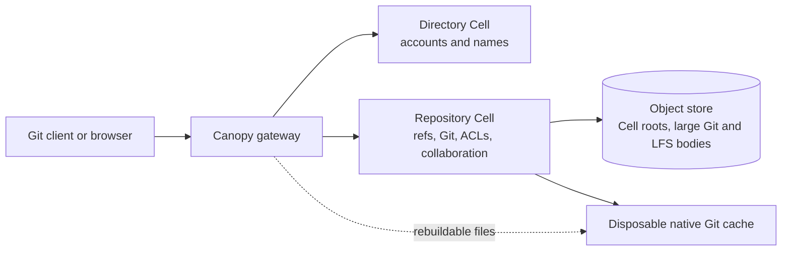
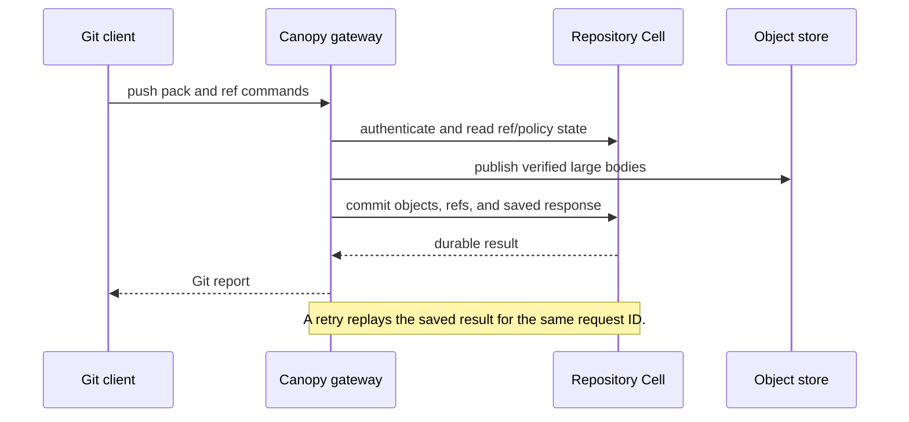

# Canopy

Canopy is a Git hosting service built on Cellule. It accepts stock Git over smart
HTTP and optional SSH, stores each repository's durable state in its own SQLite
Repository Cell, and uses an object store for recovery and large Git/LFS bodies.
Its Git hosting core works, but [production readiness is still in progress](ROADMAP.md).

**Start here:** [Run a node](#run-a-local-node) · [Create and use a repository](#create-and-use-a-repository) · [Use the browser and Git LFS](#use-canopy) · [Operate a deployment](#operate-a-deployment) · [API reference](#api-reference) · [Documentation map](docs/README.md)

## Read this README by task

The detailed reference remains below. Use this map to jump to the part that matches your work:

| You want to… | Start with |
| --- | --- |
| Understand the storage model | [How Canopy stores a repository](#how-canopy-stores-a-repository) |
| Run a development node | [Run a local node](#run-a-local-node) |
| Create, clone, and push a repository | [Create and use a repository](#create-and-use-a-repository) |
| Use the browser, collaboration, or Git LFS | [Use Canopy](#use-canopy) |
| Automate repository operations | [API reference](#api-reference) |
| Operate multiple nodes or recover data | [Operate a deployment](#operate-a-deployment) |
| Understand limits and implementation tradeoffs | [Implementation details and limits](#implementation-details-and-limits) |
| Verify a build or run the process smoke | [Verify a build](#verify-a-build) |

## What works today

| Area | Current capability | Read more |
| --- | --- | --- |
| Git | SHA-1 and SHA-256 repositories, smart HTTP, optional SSH, push/clone/fetch, partial and shallow clone | [Compatibility and evidence](docs/git-compatibility.md) |
| Collaboration | Private and public repositories, scoped accounts and grants, issues, pull requests, reviews, line discussions, merge candidates, checks and branch rules | [Use Canopy](#use-canopy) and [API reference](#api-reference) |
| Git LFS | Basic upload/download, verified immutable bodies, advisory locks, SSH-issued HTTP grants | [LFS behavior](#git-lfs-storage) |
| Recovery | Fresh local-disk restoration, signed Cell routing between nodes, maintenance drain/recovery, same-provider backup and restore | [Operate a deployment](#operate-a-deployment) |
| Browser | Embedded repository, issue, pull-request and account views | [Repository browser](#repository-browser) |

These are implementation capabilities, not a production capacity guarantee.
The [roadmap](ROADMAP.md) lists remaining work such as migrations, full fault
qualification, collection, provider qualification, observability and a repeatable
deployment. The [delivery plan](docs/delivery-plan.md) records release gates;
the [performance plan](docs/performance-plan.md) separates measured results from
targets. For a concrete Git workflow, check [compatibility](docs/git-compatibility.md)
before relying on a feature in a new environment.

## How Canopy stores a repository


The **Directory Cell** maps an owner and repository name to a stable repository
UUID and owns accounts. Each UUID identifies a **Repository Cell** containing
authoritative refs, Git metadata, ACLs and collaboration records. Large Git
blobs and LFS bodies are immutable external objects referenced by that Cell.
Native Git handles wire protocols using a **disposable cache**: after local disk
loss, Canopy restores published Cell state from the object store and rebuilds
the cache. See the [persisted contracts](docs/contracts.md) for publication and
recovery rules.



The existing [architecture SVG](docs/architecture.svg) provides the same model with durable and rebuildable state shown visually. The dashed cache is safe to rebuild; the Directory Cell, Repository Cell, and published object-store bodies are part of the durable authority.

### A durable push in one view

The gateway reports a successful push after it has authenticated the request, verified incoming objects, published required external bodies, and committed the ref update with a replayable response.



## Run a local node

This is a development path for one node with an existing S3-compatible object
store. The [bounded Linux deployment](deploy/README.md) describes the container
profile and its resource limits. Use a **new storage prefix** for this build;
there is no migration from earlier preview layouts yet.

1. Install Rust 1.97 or newer and Git with `http-backend`,
   `merge-tree --write-tree` (`-z --name-only --no-messages`) and `commit-tree`.
   Git 2.50.1 is the qualified version. Install `git-lfs` if you plan to use
   LFS or run the integration tests, and Python 3 for the optional secret and
   UUID generation commands below.
2. Copy [`config.example.json`](config.example.json) to `deploy/config.json`
   (which Git ignores): `cp config.example.json deploy/config.json`. Set
   `storage_url` to a fresh prefix in your store;
   choose stable tenant/application IDs, fleet/image digests and owner name.
   Give the node a unique `node_id`, a writable `data_dir`, and the local
   `listen`/`public_url` addresses. `peer_endpoint` is the node's reachable
   HTTPS origin when using multiple nodes. Adjust the disk and active-repository
   limits for the machine. The example values are illustrative, not a
   deployment identity.
3. Make provider credentials available through that provider's environment.
   Set `CANOPY_GIT_TOKEN` to the owner's bootstrap credential and
   `CANOPY_NODE_SIGNING_KEY_HEX` to a private 32-byte key encoded as 64 hex
   characters. Save both securely; keep the same owner credential and node key
   across restarts. The token bootstraps a durable admin account. For a new
   local prefix, generate both values with the commands below, then place them
   in your secret environment. The first output is the owner token; the second
   is the node signing key.

   ```bash
   python3 -c 'import secrets; print("cnp_" + secrets.token_hex(32))'
   python3 -c 'import secrets; print(secrets.token_hex(32))'
   ```

4. From the repository root, start the service:

   ```bash
   cargo run --release --locked --bin canopy -- deploy/config.json
   ```

Check liveness and Cell readiness at the configured listener:

```bash
curl --fail http://127.0.0.1:8080/healthz
curl --fail http://127.0.0.1:8080/readyz
```

`/healthz` reports process liveness; `/readyz` reports Cell readiness. Stop
with SIGINT or SIGTERM so the server drains admitted requests and withdraws
its node advertisement. The object store must support conditional create/update
and ranged reads; startup probes those capabilities. Keep provider credentials
out of configuration files. The node locks its local data directory; do not
run a second process against the same directory.

### Create and use a repository

In a second terminal outside the Canopy checkout, make `CANOPY_GIT_TOKEN`
available and create a private SHA-1 repository (the default format):

```bash
curl --fail-with-body \
  --header "Authorization: Bearer $CANOPY_GIT_TOKEN" \
  --header 'Content-Type: application/json' \
  --data '{"name":"example"}' \
  http://127.0.0.1:8080/api/repositories
git clone http://127.0.0.1:8080/canopy/example.git
```

Replace `canopy` in the clone URL with your configured `owner`, or use the
`clone_url` returned by creation. For a private repository, Git prompts for
HTTP Basic credentials: use the owner name as username and the bootstrap token
as password. A Git credential helper can remember them for later fetches and
pushes. Do not place tokens in the remote URL. The [browser](#repository-browser)
can create repositories too.

In the cloned directory, make the first commit and push:

```bash
cd example
printf '%s\n' '# Example' > README.md
git add README.md
git -c user.name='Example Author' -c user.email='author@example.com' commit -m 'Initial commit'
git push -u origin main
```

To create a SHA-256 repository instead, send
`{"name":"example-sha256","object_format":"sha256"}` and use a compatible
Git client. The object format is fixed when the repository is created.

## Use Canopy

The embedded browser covers common tasks; the API supports automation and
operations that have no browser control yet. Git clients use
`/<owner>/<repository>.git` over HTTP, or the optional SSH listener. Private
Git and LFS requests use an active account token plus a repository grant.

### Common paths

| Task | Where to begin |
| --- | --- |
| Browse code, issues and pull requests | Open `/` on the Canopy listener; connect with an existing token for private repositories. |
| Change visibility or collaborators | Use the repository browser for visibility; use the [access API](#accounts-and-repository-access) for grants. |
| Manage account tokens | Open **Account**; use the [token API](#token-lifecycle) for automation. |
| Add Git LFS | Install `git-lfs`, run `git lfs install` in your client, then track and push files through the normal Git remote. |
| Protect a branch | Configure a check reporter and [branch rules](#checks-and-branch-rules), then use a reviewed pull request. |
| Diagnose a refused request | Inspect `401` credentials, `403` scope/grant, `409` version or policy conflict, `503` admission/retry, or `507` local disk budget in the relevant section below. |

### Repository browser

Open `/` on the Canopy HTTP listener to browse public repositories or connect
using your existing access token. The embedded interface lists authorized
repositories and creates repositories with an owner token. It selects branches
and tags, browses directories, previews or downloads small files, and follows
first-parent commit history. Merge commits
link to each parent. No separate frontend build or asset service is required.
The token remains in tab memory and clears on disconnect or reload. Use HTTPS
at the deployment ingress. Repository text is displayed literally; HTML,
Markdown, symlinks, submodules and LFS pointers are never executed or followed.

Views pin an immutable object ID after selecting a reference. Use **Refresh
branch** to resolve its latest tip. Directory/history pages contain up to 32
entries; previews/downloads contain at most 256 KiB. Larger files require Git.
The **Issues** tab supports open/closed filters, paged discussions, issue/comment
creation, edits and close/reopen. Write-scoped tokens may participate; authors
and repository writers can edit. Discussion text is displayed literally.
If a submission reply is lost, keep the page open and use **Retry submission**
to recover the same post. Edit conflicts preserve your draft for copying and
require **Reload current version** before another edit. Drafts are not retained
across navigation, disconnect or reload.

The **Pull requests** tab opens, edits, closes and reopens requests between local
branches. It includes draft state, paged reviews, unified text diffs, current
approval requirements and commit check results. Reviews bind the displayed pull
version and both branch tips. Writers can fast-forward or prepare a merge/squash/rebase
candidate, inspect its files, fetch it for testing, then explicitly publish it.
Publication rechecks the revision, permissions, reviews and required checks.
Stale or conflicting candidates cannot be published. Check reporting, branch
policy configuration and access management remain API operations. Line
discussions can be opened from diff line numbers, replied to, and resolved or
reopened. Their original file/line snapshots remain available after
branch changes. Conflict resolution is pending. Merged requests retain
their pre-merge comparison, and **View reviewed changes** opens the exact version
bound to a review, including after branch movement or deletion.
See [browser API contracts](docs/contracts.md#repository-browser) for raw-byte
paths, pagination, limits and authorization behavior.

### Public repositories

Repositories start private. An owner with an admin-scoped token can use **Change
visibility** in the repository browser, or `GET` then
`PUT /api/repositories/<name>/visibility`. The PUT body contains `repository_id`,
`expected_generation` from the GET, and `visibility` (`private` or `public`).
A stale generation returns 409; after an uncertain response, read current state
before retrying. Visibility shares the repository ref generation, so concurrent
pushes or default-branch edits can require a refresh too.

Public repositories allow anonymous discovery, stock Git clone/fetch, LFS
batch/download, code browsing, issues, pull requests, reviews and check reads.
Authenticated readers with write-scoped tokens can participate in discussions;
Git/LFS writes, approvals and merges still require explicit repository write
access. Anonymous mutations are denied. Supplied invalid credentials return 401,
even on public repositories. Collaborator rosters remain owner-only.

Making a repository private blocks newly authorized anonymous reads. Requests
already admitted can finish, and downloaded copies cannot be recalled. Successful
data responses and Git/LFS responses use `Cache-Control: no-store`. Public
discovery candidates are retained and rechecked against the Repository Cell on
every listing; a stale index entry
never grants access.

### Git LFS storage

Canopy provides the Git LFS batch/basic HTTP API itself. Stock `git-lfs` clients
upload and download through Canopy; bytes live in the configured object store at
`repos/<repository-uuid>/lfs/<sha256>`, while the repository's SQLite Cell stores
their size and verified hashes. No separate LFS server is needed. Uploads verify
SHA-256 and store immutable bytes before publishing the SQLite reference.

Transfers pass through Canopy with 8 MiB immutable parts and no fixed file-size
quota. Uploads hash bytes incrementally in temporary multipart storage, then
conditionally copy each verified part and publish a small immutable manifest.
The logical key holds the manifest; `<key>.parts/<hex-index>` holds its bytes.
Downloads verify both hashes before delivering their final range. The node's
eight-transfer admission covers these operations, cleanup and outstanding output.
Presigned direct-to-storage transfers are not implemented. Git LFS also supports
[client configuration for a separate LFS server](https://github.com/git-lfs/git-lfs/blob/main/docs/api/server-discovery.md#custom-configuration)
using `lfs.url`; that server manages its own access and backups. Canopy does not
proxy external LFS servers or include their bodies in its backup.

### Git LFS locks

`git lfs lock`, `git lfs locks` and `git lfs unlock` use repository-scoped
SQLite locks. The standard `/info/lfs/locks/verify` endpoint lets stock Git LFS
pre-push checks reject changes to another account's locked paths. Locks apply
across branches. Listing requires read access; creation, verification and
unlocking require write access. A writer can explicitly use `--force` to remove
another account's lock. Locks survive node restart and fresh-disk recovery.

Locking is advisory: a client can bypass Git LFS verification. It is not a
server-side branch protection rule. HTTP credentials and SSH-issued LFS
grants both support these lock operations. Lock pages contain
at most 100 entries, with continuation cursors; paths are canonical relative
UTF-8 strings up to 4096 bytes. This adds an unreleased SQLite table and requires
a fresh development storage prefix when switching from older builds.

### Account administration

After connecting, choose **Account**. Admin-scoped credentials can list, issue
and revoke their own account's tokens. Site-owner admins can also page through
accounts, create accounts, manage other accounts' tokens and disable accounts.
Read/write credentials show their identity and explain the required admin scope.
Repository grants remain separate from token scopes and are managed through the API.

Token rows show scope, ID, creation time, expiry, revocation and **This session**.
Times use the browser's local time; refresh to update status. Issuance defaults
to 30 days, with 7-day, 90-day and non-expiring choices. Account creation issues
one non-expiring initial token. The browser generates secrets using Web Crypto
and shows them only in the issuance dialog. Save the secret before closing;
Canopy stores only its digest and cannot retrieve it later. Nothing is placed in
URLs or browser storage. A lost response preserves the exact request and secret
for **Retry token issuance** or **Retry account creation**. Reloading or closing
an unconfirmed issuance can lose a credential that the server already accepted.

Revocation and disablement have explicit confirmations. Confirmed revocation of
the current credential disconnects the tab. The server protects the site's last
non-expiring admin credential. Disabled accounts remain listed with their name
reserved; re-enable and account deletion are not implemented.

`GET /api/session` requires an active credential of any scope and returns
`{account, token_scope, token_id, site_admin}` without the secret or digest.
`GET /api/accounts?after=<name>` requires a site-owner admin credential and
returns `{accounts: [{name, enabled}], next_after}`. Pages contain up to 32
accounts, including disabled identities, ordered by name. Continue with
`next_after` until null; a full final page may require one empty request. Each
page observes current state independently. Account listing rechecks the exact
credential and its expiry in the Directory query at owner execution time.
Both endpoints use `Cache-Control: no-store`.

Site-owner admins can open **Account history** for committed account creation,
disablement, token issuance and revocation. Entries identify the actor and public
credential IDs, target account, scope, expiry and execution time. History is
newest first with **Older changes** pagination; retries that change nothing add
no entries. The initial trusted bootstrap is labeled **System bootstrap**.
`GET /api/audit/accounts?before=<event-id>` exposes the same 32-entry pages and
returns `{events, next_before}`. IDs/cursors are decimal strings. Secrets and
credential digests are excluded. History and the change commit atomically in the
Directory Cell and restore together. Repository-policy changes, denied attempts,
retention/export and account deletion remain separate work.

## API reference

The routes below are a behavior reference. Replace `<name>`, `<account>`, UUIDs,
object IDs and generations with values returned by your deployment. JSON
examples containing angle-bracketed strings illustrate the required shape;
those strings are not usable IDs. Read [persisted contracts](docs/contracts.md)
for exact limits and failure semantics.

### API map

| Surface | Reference section |
| --- | --- |
| Repository lifecycle and default branch | [Repository creation, discovery, and rename](#repository-creation-discovery-and-rename), [Default branch](#default-branch) |
| Accounts, grants, and tokens | [Accounts and repository access](#accounts-and-repository-access), [Token lifecycle](#token-lifecycle) |
| Issues, pull requests, reviews, and line discussions | [Issues and comments](#issues-and-comments), [Pull requests and reviews](#pull-requests-and-reviews), [Compare revisions and discuss lines](#compare-revisions-and-discuss-lines) |
| Merge, checks, and branch rules | [Merge and rebase](#merge-and-rebase), [Checks and branch rules](#checks-and-branch-rules) |
| SSH transport and keys | [SSH keys and transport](#ssh-keys-and-transport) |

The [persisted contracts](docs/contracts.md) remain the canonical reference for byte limits, authorization timing, replay semantics, and recovery guarantees.

### Repository creation, discovery, and rename

`POST /api/repositories` with `{"name":"example"}` creates a repository for the
configured owner and returns its UUID and clone URL. `GET /api/repositories`
lists ready repositories that the viewer can access, including anonymous public
reads. Pass the returned `next_cursor` as `after` until it is null. Pages inspect at most 32
UUID-ordered candidates and can be short or empty with a non-null cursor,
including when access was revoked or Cell movement capacity runs out.
A page that cannot make progress returns 503 with `Retry-After: 1`.
`GET /api/repositories/<name>` returns the UUID, clone URL, repository role,
default branch, ref generation and visibility, plus `viewer.account` and
`viewer.token_scope` for an authenticated request (`viewer: null` anonymously).
Missing or inaccessible names return 404.
`PATCH /api/repositories/<old_name>` with
`{"name":"new_name","repository_id":"<returned UUID>"}` atomically renames a ready
repository. The UUID is a precondition and remains unchanged; a retry with
the same UUID and new name returns the renamed repository. Create and rename
require the configured owner's token; list and get also admit collaborators.
Git and LFS use
`/<owner>/<repository_name>.git`. Repository creation reserves a UUID in the
Directory Cell, provisions its own Repository Cell, then marks the name ready.
Later requests recover that Cell on demand from the directory.

### Default branch

`GET /api/repositories/<name>/default-branch` returns `repository_id`, the fully
qualified `reference` (initially `refs/heads/main`), and `generation`.
Repository readers can inspect it. An owner with an admin-scoped token can
`PUT` the same URL with
`{"repository_id":"<UUID>","reference":"refs/heads/trunk","expected_generation":7}`.
Use the UUID and generation returned by GET. A concurrent ref or HEAD change
returns 409; read current state before retrying. The target must exist unless
there are no live branches. Stock Git discovery and clone use this durable HEAD,
including after restart. Protocol v2 also reports an unborn target. Branch
deletion preserves HEAD's name; recreating the branch makes it live again.

### Accounts and repository access

The configured token bootstraps a durable owner account in the Directory Cell.
`POST /api/accounts` creates another account with a client-generated `cnp_`
token followed by 64 random hexadecimal digits and a `read`, `write`, or
`admin` token scope. Its JSON fields are `name`, `token`, and `scope`.
Only the configured owner can create accounts and change collaborators.
`POST /api/accounts/<account>/disable` with an admin-scoped owner credential
disables an account and returns 204, including on repeat requests. The site owner
cannot be disabled (409). All of the account's credentials then fail new API,
Git and LFS authentication. Its name, repository grants and authored data remain
reserved; account creation cannot reactivate it. There is no re-enable or account
deletion endpoint yet. Requests authenticated before disablement may finish.
`PUT /api/repositories/<name>/collaborators/<account>` with
`{"role":"read"}` or `{"role":"write"}` grants access to one repository;
`DELETE` on the same URL revokes it. The owner retains access. Git smart HTTP
and LFS require both sufficient token scope and repository role. A ref update
rechecks the writer in the ref transaction; an LFS upload rechecks the writer
when publishing metadata.

`GET /api/repositories/<name>/collaborators` lets an admin-scoped owner inspect
access. It returns `repository_id`, `owner`, `collaborators` (account and role),
and `next_after`. The owner is separate from explicit collaborator grants.
Pages contain up to 32 grants ordered by account name; pass `?after=<next_after>`
until the cursor is null. Each page observes current membership independently;
changes before the cursor require a fresh scan.

### Issues and comments

Issues and comments live in the same Repository Cell as Git and its ACL:

| Method | Path | Action |
| --- | --- | --- |
| GET / POST | `/api/repositories/<name>/issues` | List summaries / create an issue |
| GET / PUT | `/api/repositories/<name>/issues/<number>` | Read / replace title, body and state |
| GET / POST | `/api/repositories/<name>/issues/<number>/comments` | List / add comments |
| PUT | `/api/repositories/<name>/issues/<number>/comments/<comment>` | Replace comment text |

Reads require repository read access, including anonymous public access. Mutations
require a write-scoped token. Repository readers can create issues and comments; authors
and repository writers can edit. Revocation is checked again in the Cell write.

All mutation bodies include `repository_id`, obtained from repository discovery.
Create an issue with `id` (a fresh canonical UUID), `title`, and `body`; create a
comment with `id` and `body`. Both return `{"number":1}` with HTTP 200. Retrying
the original payload returns the same number, including after edits or recovery.
Reusing its UUID with different original content or author returns 409.

Issue PUT supplies `expected_version`, `title`, `body`, and `state` (`open` or
`closed`). Comment PUT supplies `expected_version` and `body`. Success returns
204; stale versions return 409. Read current state after an ambiguous edit reply.
Titles allow 256 UTF-8 bytes, bodies 16 KiB; comments cannot be empty. Request
bodies admit 128 KiB of JSON with a 30-second reception deadline.

Issue lists omit bodies and return up to 32 summaries; comment pages contain up
to 16 full comments. Use numeric `after` / `next_after` cursors until null. Issue
lists optionally accept `state=open` or `state=closed`; the default includes both.
Pages observe current state independently. Bodies are returned as raw text; no
Markdown or HTML rendering, attachments, labels, assignees, or deletion API yet.

### Pull requests and reviews

Pull requests and reviews are repository-local SQLite records:

| Method | Path | Action |
| --- | --- | --- |
| GET / POST | `/api/repositories/<name>/pulls` | List summaries / open a pull |
| GET / PUT | `/api/repositories/<name>/pulls/<number>` | Read / edit, close or reopen |
| GET / POST | `/api/repositories/<name>/pulls/<number>/reviews` | Read history / submit a review |
| POST | `/api/repositories/<name>/pulls/<number>/comparison` | Read exact-revision changed files, patches or file bytes |
| GET / POST | `/api/repositories/<name>/pulls/<number>/threads` | List / start anchored line discussions |
| GET / PUT | `/api/repositories/<name>/pulls/<number>/threads/<thread>` | Read / resolve or reopen at an expected version |
| GET / POST | `/api/repositories/<name>/pulls/<number>/threads/<thread>/comments` | List / append discussion replies |
| GET | `/api/repositories/<name>/pulls/<number>/review-policy` | Read current review requirements and counts |
| POST | `/api/repositories/<name>/pulls/<number>/merge` | Publish a reviewed fast-forward, merge commit, squash or rebase |
| POST | `/api/repositories/<name>/pulls/<number>/merge-candidates` | Prepare a merge commit, squash or rebase |
| GET | `/api/repositories/<name>/pulls/<number>/merge-candidates/<id>` | Read the frozen candidate and fetch ref |

To open a pull, POST `repository_id`, a fresh UUID `id`, `title`, `body`, `draft`,
`source_ref`, `source_oid`, `base_ref`, and `base_oid`. Use fully qualified branch
names and current lowercase object IDs from Git in the repository's format.
Both branches must exist in this repository and point to different commits.
Creation returns `{"number":1}`.
Exact UUID/payload retries preserve the original number and later edits.

GET returns editorial `version`, source/base objects with `reference`, current
`oid` and ref `version`, and the original commit identities. A deleted branch has
`oid: null`; deletion retains its ref version. PUT supplies `repository_id`,
`expected_version`, `title`, `body`, `state` (`open` or `closed`), and `draft`.
The author or a repository writer may edit; branch names remain fixed. PUT
returns 204, or 409 for a stale version. Closing a pull never changes Git refs.

Review POST supplies `repository_id`, a fresh UUID `id`, `kind` (`comment`,
`approve`, or `request_changes`), `body`, and this revision copied from GET:

```json
{
  "pull_version": 1,
  "source_oid": "<source object ID>",
  "source_version": 1,
  "base_oid": "<base object ID>",
  "base_version": 1
}
```

Reviews are immutable; new decisions use new UUIDs. Review creation returns its
`number`. An exact retry preserves that number and ordering. Members may open
pulls and comment using write-scoped tokens. Approval or requested changes require
a repository writer other than the author, on an open, ready pull. All reviews
require the exact current revision; stale, deleted or equal tips return 409.

History marks a decision `applicable` only for the current pull/ref versions and
reviewer's current grant, and only for that reviewer's newest decision. Comments
do not replace decisions. Branch movement, editorial edits, close/reopen and
revoke/regrant invalidate earlier decisions. Repeating an unchanged membership
grant does not. Lists return up to 32 pull summaries or 16 reviews with numeric
`after` / `next_after`; pulls support an optional `state` filter. Text limits match
issues: 256-byte titles, 16 KiB bodies; review comments must be nonblank.

### Compare revisions and discuss lines

Comparison POSTs are read operations and require current repository read access,
`repository_id`, a tagged `target`, and one of the queries below. Use
`{"kind":"current","revision":<the revision object above>}` for a live view,
`{"kind":"review","number":<review number>}` for a saved review, or
`{"kind":"merged"}` for the published request's pre-merge revision. Historical
selectors resolve immutable records belonging to this pull; callers cannot
substitute arbitrary historical OIDs. `{"kind":"thread","number":<thread number>}`
reads the snapshot retained by a line discussion.

```json
{"kind":"files","after":null}
```

```json
{"kind":"file","path_base64":"UkVBRE1FLm1k","side":"after"}
```

```json
{"kind":"patch","path_base64":"UkVBRE1FLm1k"}
```

Changed files compare the unique merge-base tree to the source tree. Responses
include `comparison` with `merge_base`, `revision`, up to 32 `files`, and
`next_after`. Each file has a byte-preserving `path_base64`, optional UTF-8 `path`,
and nullable `before`/`after` entries containing six-digit octal `mode` and `oid`.
Pass `next_after` as `query.after` with the same target for the next page.
Renames appear as deletion plus addition. Unrelated or ambiguous histories and
moved revisions return 409; traversal limits return 413 without a partial list.

A file query uses `side: "before"` for the merge base or `"after"` for the source.
The `file` response includes the entry, size, and `content_status`: `included`,
`too_large`, or `gitlink`. `content_base64` contains at most 256 KiB of raw blob
bytes when included; otherwise it is null. All base64 uses the URL-safe alphabet
without padding. Symlinks return target text; Gitlinks and LFS pointers are never
followed. Large blobs return metadata without fetching external content.

A patch query returns `patch` with the selected `revision`, `merge_base`, path,
nullable `before`/`after` entries, `status` and `hunks`. Text hunks use three context
lines and Git-compatible `old_start`, `old_lines`, `new_start`, `new_lines`.
Each line has `kind` (`context`, `delete`, `add`), `text` without its final LF,
and `no_newline`. CR bytes are preserved. Non-text states are `binary`,
`too_large` (either side exceeds 256 KiB) and `gitlink`, with empty hunks.
Mode-only changes and empty files may also have no hunks. Text work/output budgets
return 413 without a partial diff; see [limits](docs/contracts.md#unified-text-patches).
The web view displays hunks literally, marks missing final newlines and CRs,
and links both immutable files. It never executes repository content.

Start a line discussion by POSTing to `.../pulls/<number>/threads`:

```json
{
  "repository_id": "<repository UUID>",
  "id": "<new discussion UUID>",
  "target": {"kind":"review","number":1},
  "path_base64": "UkVBRE1FLm1k",
  "side": "after",
  "line": 12,
  "body": "Could we explain this change?"
}
```

Creation accepts current, review or merged targets. The side/line must occur in a
text hunk returned by the patch query, including context lines. The server verifies
the blob and coordinates; clients cannot supply an anchor OID. A thread keeps its
original revision, merge base, byte path, side, line and blob identity.
Current readers with write-scoped tokens may start/reply; replies use a new UUID
and `body`. Exact retries return the original number. Discussion text and replies
are immutable; corrections can be added as replies. Lists page at 16 records with
numeric `after`/`next_after`.

Resolve/reopen with `repository_id`, `expected_version` and `resolved: true|false`.
The thread author, pull author or repository writer may do so with a write-scoped
token. Stale versions return 409. Resolution is informational and does not replace
required approvals or checks. See [line discussion contracts](docs/contracts.md#line-discussions).
This unreleased schema adds discussion tables and requires a fresh development
storage prefix; there is no upgrade migration yet.

### Merge and rebase

Merge POSTs require a write-scoped token and current repository write access:

```json
{
  "repository_id": "<repository UUID>",
  "id": "<new merge request UUID>",
  "revision": {
    "pull_version": 1,
    "source_oid": "<source object ID>",
    "source_version": 1,
    "base_oid": "<base object ID>",
    "base_version": 1
  },
  "strategy": "fast_forward"
}
```

For `fast_forward`, the source must descend from the current base. Current reviews, required checks
and exact ref versions are checked in the transaction that advances the base and
marks the pull `merged`. The response contains `merge` with `id`, `number`, `oid`
and `merged_at_ms`, plus the exact pre-merge `revision`; pull details retain that
record. Exact retries with the same
UUID and payload return the original result, including after a lost reply or
later branch movement. Changed payloads or actors conflict. Retry an uncertain
result with the original request ID and revision. Merged pulls cannot be reopened
or edited; `state=merged` is available on the list endpoint.

The review-policy response reports its observed `revision`, `ready`, rule version,
required approvals, eligible approval count, outstanding requested changes and
`reviews_satisfied`. It does not claim checks have passed or history can merge.
For `merge_commit` or `squash`, first POST `/merge-candidates` with the same
`repository_id` and `revision`, a new UUID `id`, the selected `strategy`, and a
nonblank `message` (up to 16 KiB UTF-8). It returns `repository_id`, `candidate` and `fetch_ref`.
The candidate result is `ready` with `oid` and `tree_oid`, `conflicted` with
URL-safe unpadded `paths_base64`, or `unrelated`. GET may also show `pending`
after interrupted preparation. Exact preparation retries return the same result.
Only a ready candidate advertises a fetch ref. Set `fetch_ref` to the
`fetch_ref` value returned by preparation, then inspect that exact candidate:

```bash
git fetch origin "$fetch_ref"
git checkout --detach FETCH_HEAD
```

Run checks on that candidate OID. Then POST `/merge` with a new merge UUID,
original `revision`, the same `strategy`, and `candidate_id`. A merge commit
has ordered base/source parents; a squash has only the base parent. Publication
rechecks current reviews and required checks against the candidate commit.
Source or base movement invalidates publication, including movement away and
back. Conflicted candidates cannot publish. The `refs/canopy` namespace is
server-owned and rejects every push update, including owner pushes.

Native Git handles three-way content merges, renames and multiple merge bases.
Merge drivers and signing commands from host Git configuration are disabled.
For `rebase`, prepare with `message: ""`: original authors, author dates,
message bytes, encodings and extra headers are preserved. Each source-only
commit is replayed onto the base in order; empty commits are retained. The
committer becomes the preparing account at the reserved time; original commit
and ancestry signatures are removed. The source branch is unchanged.

Rebase preparation accepts a linear history of at most 128 commits, each at most
64 KiB before and after rewriting. It returns `rebase_unavailable` with reason
`merge_history`, `no_commits`, `limit` or `commit_format` when it cannot prepare;
these results cannot publish. Resolve conflicts or rewrite unsupported history
locally and push, then prepare a new candidate. A conflict at any intermediate
commit stops replay even when the final source tree would merge cleanly.
Conflict resolution in the browser, forks and retargeting remain to be delivered.

### Checks and branch rules

Commit checks record results from a configured reporter; they do not execute CI
jobs. Exact-branch rules can require successful results.

| Method | Path | Action |
| --- | --- | --- |
| GET | `/api/repositories/<name>/check-contexts` | List contexts, including disabled ones |
| PUT | `/api/repositories/<name>/check-contexts/<context>` | Owner configures reporter and enablement |
| GET / POST | `/api/repositories/<name>/commits/<oid>/checks` | Read latest attempts / start an attempt |
| GET / PUT | `/api/repositories/<name>/checks/<id>` | Read an attempt / report progress or result |

Context PUT requires an admin-scoped owner token and `repository_id`,
`expected_version` (zero for creation), `reporter` (a repository member), and
`enabled`. Context names use lowercase components up to 64 bytes. Each policy
change advances its version and invalidates earlier-version results.

The reporter uses a write-scoped token to POST `repository_id`, a fresh UUID `id`,
`context`, and `context_version`. The Git commit must already be stored. The
attempt starts `queued`; POST returns its `id`. An exact retry preserves that
attempt. PUT supplies `repository_id`, `expected_version`, `state`, and `summary`
(up to 4 KiB). States advance to `in_progress`, `success`, `failure`, or `cancelled`.
Terminal results are immutable; reruns need a new UUID. PUT returns 204; stale
versions or changed context policy return 409.

Repository readers can inspect checks. Commit views select the newest-created
attempt for each enabled context at its current version; a late result or retry
from an older attempt cannot replace it. A missing current attempt appears as
`run: null`. Context/commit pages contain at most 32 entries with name-based
`after` / `next_after` cursors. Historical attempts remain readable by UUID.

Branch protection uses `GET /api/repositories/<name>/branch-rules` and an
admin-scoped owner `PUT` to that URL:

```json
{
  "repository_id": "<repository UUID>",
  "rule": {
    "reference": "refs/heads/main",
    "expected_version": 0,
    "enabled": true,
    "deny_deletions": true,
    "fast_forward_only": true,
    "required_checks": ["unit-tests"],
    "require_pull_request": true,
    "required_approvals": 1
  }
}
```

Rules name exact branch refs and apply to every writer, including the owner.
Configure required check contexts first. The newest attempt for each required
context at its current version must be `success`; missing, pending, failed, or
stale results reject the update. Push a candidate to an unprotected branch, run
and report its checks, then merge its reviewed pull into the protected branch.
Previously accepted results remain trusted after reporter access is revoked;
disable or update the context to invalidate them.

PUT returns 204; stale rule versions or unavailable required contexts return 409.
Use `expected_version: 0` for creation and the returned version for later changes.
Disable with `enabled: false`; the name/version remains reserved. GET is available
to repository readers and returns `repository_id`, `rules`, and `next_after` with
up to 32 ref-ordered rules per page, including disabled ones. Each rule lists its
version and complete policy. Up to 16 unique contexts are permitted per rule.

Every rule replacement supplies `require_pull_request` and `required_approvals`.
An enabled required-PR rule rejects direct pushes, deletion and recreation,
including owner pushes; a merge must have enough eligible approvals and no
applicable requested changes. Counts range from 0 through 16. Zero still requires
a pull when `require_pull_request` is true. Set both false/zero to permit direct
pushes under the other branch checks. Establish the base branch before enabling
a required-PR rule. Current reviewers must still have the same write grant;
old approval retries, new comments and revoke/regrant cannot restore eligibility.

Ordinary pushes retain allowed sibling refs when another ref is rejected;
`git push --atomic` rejects the group. The final Cell transaction rechecks policy,
so a concurrent rule/check change rejects the accepted group through Git
report-status before any success report is sent. Ref names must be UTF-8;
native Git and the host filesystem still impose path constraints. Push
preflight accepts at most 100,000 updates within 40 MiB of packet-line commands.
Plans are staged in bounded SQLite chunks and published in one transaction;
ref format and command limits receive native Git rejection reports.
The Cell records ref publication or rejection atomically with the response
selection; an exact completed retry returns the same report without reapplying
refs. Clients that decline report-status receive HTTP 409 on a late rejection.

Signed pushes use `git push --signed=true` with `gpg.format=ssh` and a
`user.signingkey` whose public key is registered with write scope on the
authenticated Canopy account. Git verifies the signature and nonce; the Repository Cell
records certificate bytes and prevents replay under a different push ID.

### Token lifecycle

Accounts can hold multiple scoped tokens. An admin-scoped token can manage its
own account's tokens; the configured owner can manage any account's tokens:

| Method | Path | Result |
| --- | --- | --- |
| GET | `/api/accounts/<account>/tokens?after=<UUID>` | Up to 32 metadata records and `next_after`; omit `after` for the first page |
| POST | `/api/accounts/<account>/tokens` | Issue with `{"id":"<UUID>","token":"cnp_<64 random hex digits>","scope":"read"}`; returns 204 |
| DELETE | `/api/accounts/<account>/tokens/<UUID>` | Revoke one token; returns 204 |

Choose a new canonical UUID and random secret for each issuance. An exact retry
with the same active ID, secret, scope and expiry succeeds; conflicting, expired
or revoked identities return 409. Optional `expires_at_ms` is an absolute Unix
millisecond timestamp strictly in the future; omitted/null means no expiry.
Listing includes that timestamp (or null), ID, scope, enabled state and creation
time. `enabled` records revocation state: an enabled token can still be expired.
Expired/revoked IDs and secrets stay reserved. Revoking the site's last
non-expiring admin token returns 409, including under concurrent requests.
Expiring admins do not satisfy that recovery guard.

Each account admits at most 64 active tokens and 256 new tokens per
rolling 24 hours, including its initial credential. HTTP 429 distinguishes an
active-capacity limit from the issuance window. Revoke a credential or wait for
its expiry to free active capacity; revocation and expiry do not erase issuance
history. Exact active-record retries do not consume another slot. Limits apply
to the target account, including issuance by the site owner, and survive recovery.

For rotation, issue a replacement, verify it, update clients, then revoke the old
token. For the site owner, also update `CANOPY_GIT_TOKEN` in the deployment before
retiring its configured credential: startup requires an active owner admin token.
Revocation and expiry block subsequent API, Git and LFS authentication.
Already admitted Git/LFS operations may finish; token issuance, account creation and disablement
recheck the authorizing credential and expiry in their mutation transaction.
Expiry uses the Directory owner's clock at execution; keep fleet clocks
synchronized.
Bootstrap and initial account credentials are non-expiring.

### SSH keys and transport

SSH public keys have a separate durable registry, managed by the same account/site
admin tokens. The optional SSH listener supports stock Git clone, push and fetch.
Key management currently uses the API:

| Method | Path | Result |
| --- | --- | --- |
| GET | `/api/accounts/<account>/ssh-keys?after=<UUID>` | Up to 32 key records and `next_after` |
| POST | `/api/accounts/<account>/ssh-keys` | Register with `{"id":"<UUID>","public_key":"ssh-ed25519 AAAA...","scope":"write"}`; returns 204 |
| DELETE | `/api/accounts/<account>/ssh-keys/<UUID>` | Revoke one key; returns 204 |

Keys may have `read` or `write` scope. Accepted key formats are plain OpenSSH
Ed25519, ECDSA and RSA (2048–8192 bits); authorized_keys options, certificates,
DSA and security-key formats are rejected. Comments are discarded. Listing
returns the canonical public key, OpenSSH SHA-256 fingerprint, ID, scope,
creation time and enabled state. No private key is accepted or stored.
An exact active registration retry returns 204. Conflicting IDs, ownership,
scopes or revoked key material return 409, including when the comment changes.
Revoked keys remain reserved; register a fresh key to rotate. Disabled accounts
cannot resolve to an SSH identity. Each account has separate limits of 64 active
SSH keys and 256 registrations per rolling 24 hours (429 on either limit).
Registration/revocation recheck the exact admin token in their Directory
transaction and append an account-history event atomically. Events use
`ssh_key_id` for the affected key, with `token_id` null.

Enable SSH by adding a listener and a stable OpenSSH private host key to the
server configuration:

```json
{
  "ssh": {
    "listen": "0.0.0.0:2222",
    "host_key": "/run/secrets/canopy_ssh_host_ed25519_key"
  }
}
```

Generate the host key with `ssh-keygen -t ed25519 -N '' -f /path/to/host_key`
and preserve it across restarts. The configured key must be decrypted and
readable by the server.
Publish its fingerprint to clients through a trusted channel. Git URLs use the
SSH user `git`, for example `ssh://git@example.com:2222/canopy/project.git`.
The registered client key identifies the account; repository permissions and key
scope both apply. New commands on existing connections recheck revocation and
account status. Shell, SFTP, forwarding and arbitrary environment requests are
denied. HTTP and SSH share the same node/account transfer limits and durable
push publication path.

SSH prepares advertised ref/tag targets before negotiation and hydrates non-blob
history reachable from each request's wants before forwarding them to Git.
Unfiltered requests hydrate reachable blobs in the same certified Cell graph
walk. Exact `blob:none` requests hydrate only explicit missing blobs. Other
requests apply the native filter while selecting missing reachable blobs, before
forwarding wants to native Git. Tree and object-type constraints skip omitted
bodies; size filters still load missing bodies because native Git needs their sizes.
Git LFS can use the same SSH key: `git-lfs-authenticate` returns the configured
HTTP LFS endpoint and a five-minute credential for that repository and operation.
No separate HTTP credential helper or `lfs.url` is required. File bytes still use
HTTP basic transfers to Canopy's object-store-backed LFS service. Each request
checks grant expiry, parent SSH key/account status and current repository access.
Grants cannot authorize Git or management API requests. Pure SSH LFS transfers
remain unsupported.
The local compatibility suite covers stock Git transfers and fresh-disk recovery;
late policy/access refusal and disconnected-push drain are also covered locally.
Provider failure, owner-loss and capacity qualification remain open.

## Operate a deployment

For an installation with resource ceilings, start with the
[bounded Linux profile](deploy/README.md). Save operation UUIDs and backup
receipts outside the shell session. The commands below use an installed `canopy`
binary and the `deploy/config.json` file from the local setup; substitute your
deployment's binary and configuration paths.

| Operational task | Start with |
| --- | --- |
| Route requests across nodes | [Multiple nodes](#multiple-nodes) |
| Drain or recover a deployment | [Deployment maintenance](#deployment-maintenance) |
| Copy or restore durable state | [Backup and restore](#backup-and-restore) |
| Recover an uncertain push result | [Recover a lost push reply](#recover-a-lost-push-reply) |

Each operational flow names the identity, precondition, command, and recovery behavior it requires. Keep the UUIDs and receipts it tells you to save.

### Multiple nodes

Use the same storage prefix, tenant/application IDs, fleet/image digests, owner,
active bootstrap credential and application build on all nodes. Give each node a
distinct `node_id`, signing key, data directory and reachable `peer_endpoint`.
That endpoint must be an HTTPS origin whose TLS ingress forwards
`POST /internal/cell` unchanged to the node's HTTP listener. Public Git/API URLs
may point to a load balancer; requests do not require a sticky session.

Peer clients verify TLS certificates and hostnames using public trust roots.
For a private CA, set the optional `peer_ca_certificate` configuration field to
its PEM file path. There is no insecure TLS mode. Requests are separately signed
with the sending node's enrolled key and checked against its live advertisement.
Keep signing keys and object-store write access restricted to trusted fleet nodes:
the peer capability permits internal Cell operations, including Directory SQL.
TLS termination is trusted infrastructure; this transport does not claim mTLS.

Unknown owners and in-progress movement can return 503. After an owner stops,
the surviving gateway restores the Directory on demand; Repository Cells are
reacquired on the next request. An unclean exit requires lease expiry before
takeover. Cross-node placement races and larger hot sets still need qualification.

### Deployment maintenance

Each storage prefix has one durable tenant/application identity and a selected
compiled release. First startup initializes an empty deployment; later nodes
must match its release and configured image identity. A nonempty catalog without
release metadata is rejected. Existing preview prefixes require explicit future
migration; do not point this build at them as an upgrade.

To close admission and drain the fleet, choose a fresh operation UUID and use
the same binary and configuration as the deployment:

```bash
CANOPY_OPERATION_UUID="$(python3 -c 'import uuid; print(uuid.uuid4())')"
canopy maintenance deploy/config.json begin "$CANOPY_OPERATION_UUID"
canopy maintenance deploy/config.json status
```

`begin` records the operation before returning. Nodes observe the closed release
during lease renewal, stop ingress, drain accepted work, close SQLite and withdraw
their advertisements. The binary exits after supervised shutdown. `status` emits
JSON with the release, advertised session count, unsettled Cell count and
`drained`. Offline work must wait for `drained: true`. Expired advertisements and
owned/unpublished Cells do not count as drained. `end` requires that proof and
the matching operation UUID, then permits the same compiled release to start.
Retries use the same UUID while it remains the current operation. Replaying its
completed begin does not start a new drain. Once another operation starts, do not
replay older UUIDs; completed operation history is not retained. Save the UUID
outside the shell session if recovery might run later.

After `status` reports `drained: true` and offline work is complete, reopen admission:

```bash
canopy maintenance deploy/config.json end "$CANOPY_OPERATION_UUID"
```

The begin/status/end commands need object-store credentials, but no Git token or
node signing key. If a node dies during drain, wait for its lease to expire and
run the recovery worker with the same operation UUID:

```bash
canopy maintenance deploy/config.json recover "$CANOPY_OPERATION_UUID"
canopy maintenance deploy/config.json status
```

When recovery finishes and `status` reports `drained: true`, run `end` with the
same operation UUID as above.

Recovery needs `CANOPY_NODE_SIGNING_KEY_HEX` and an exclusively available local
`data_dir`. It enrolls a temporary node, fences expired owners, restores their
Cells one at a time and releases them. It opens no HTTP listener and needs no Git
token. Live owners, conflicting recovery claims, unresolved follower logs and
failed root verification return an error. Retry the same operation after the
reported condition is resolved; recovery never resumes serving automatically.
Do not remove authority records or force `drained` to bypass an error.

Upgrade/migration and object collection remain pending. Maintenance and owner
recovery do not provide a separate backup copy.

### Backup and restore

Use a fresh pin UUID and disjoint prefixes in the same configured bucket/provider:

```bash
CANOPY_BACKUP_UUID="$(python3 -c 'import uuid; print(uuid.uuid4())')"
canopy backup deploy/config.json create "$CANOPY_BACKUP_UUID" backups/snapshot-1
canopy backup deploy/config.json verify "$CANOPY_BACKUP_UUID" backups/snapshot-1
```

Record `CANOPY_BACKUP_UUID` with the backup receipt. Later verify and restore
commands must use that same pin UUID and the same backup prefix.

To restore into an unused destination prefix:

```bash
canopy backup deploy/config.json restore "$CANOPY_BACKUP_UUID" backups/snapshot-1 restored/service-1
```

Prefixes are full object keys within the configured bucket, not URLs or paths
relative to `storage_url`. Each command needs provider credentials, the node
signing key and an exclusively available `data_dir`; no Git token or HTTP listener
is required. Successful commands emit a JSON receipt with Cell/body counts.
For S3, Canopy uses conditional multipart copy; the store and credentials must
support that operation.

Capture requires the selected release to remain Ready. It reads every catalog
head and Cell control twice and rejects concurrent changes. On busy deployments,
stop nodes cleanly without entering Maintenance, then capture. Retry an uncertain
operation with the same UUID and destination; a new snapshot needs a new UUID.

The copy includes runtime roots, SQLite state, external Git blobs and LFS bodies.
Verification reads only the backup prefix, so the original prefix may be lost.
Restore preserves the pinned identity and release and needs matching configuration
and binary. Point a fresh node's `storage_url` at the completed destination.
An atomic prefix reservation prevents serving backups or incomplete restores.
Occupied destinations and different operations are rejected; retry the same
failed operation after repairing its reported cause. Replaying a completed restore
does not reset subsequently published service state.

This is a same-provider copy, not protection from losing the entire bucket or
provider. Cross-provider export, old-release migration, automated retention and
the complete interruption fault matrix remain pending. Do not use older binaries
that lack prefix reservations with these backup/restore destinations.

### Recover a lost push reply

For a receive-pack POST, a client or proxy can supply `Idempotency-Key` as one
canonical lowercase, hyphenated UUID. Use one ID per logical operation. Canopy
binds it to the repository, authenticated account and request digest. Repeating
the same request returns the recorded status, headers and per-ref report without
applying the refs again, including after owner takeover. Reusing an ID with
different request bytes or another account returns HTTP 409. Current token
scope and repository access are checked on every replay.

Replay requires the same body, content type and Git protocol setting. A new
`git push` invocation may generate different pack bytes; reusing its header does
not guarantee replay. An HTTP client or proxy must retain the original request.
Recorded replies include `X-Canopy-Push-Id`. If no ID was supplied, the server
generates one; a client that loses that reply cannot discover the generated ID.
Advertisements and fetches ignore this header.

The Repository Cell stages the reply in SQLite chunks, then publishes its
pointer and accepted ref updates in one transaction. Git rejection and no-op
reports are recorded too. Once a complete command list is decoded, cache
preparation and native execution failures produce durable per-ref rejections.
Retry with a new ID after recovery; the original ID replays its refusal.
Incomplete uploads, decode failures and unavailable or uncertain response
publication can still return transport errors. Response bodies are limited to
64 MiB and serialized response headers to 64 KiB. Completed records and abandoned
staging chunks currently have no expiry or collector and consume repository storage.

## Implementation details and limits

See [Git compatibility](docs/git-compatibility.md) for verified operations,
current limits and remaining transport and object-format qualification.

This repository is an implementation under construction. The `canopy` binary
starts one leased Cellule node and serves repositories created through its API.
It probes the object store's fencing capabilities, publishes and renews a signed node
advertisement, and restores the repository Cell from object storage when its
local SQLite file is lost. `git-http-backend` supplies Git smart HTTP wire
handling, including protocol v2 negotiation. The SQLite Cell is the durable
authority, and a bare Git repository is only a rebuildable cache. Integration
tests use stock `git` and `git-lfs` clients to push and clone, including a
restart with a fresh local SQLite file.

Nodes sharing a deployment can serve requests for Cells owned by another live
node. Repository creation acquires its Cell on the receiving node; other gateways
use signed HTTPS Cell RPCs to that owner. Git caches stay disposable on each
gateway. The Directory Cell has one owner, with on-demand recovery after release
or lease expiry. Automatic fleet balancing and production capacity qualification
remain pending.

### Resource and scaling limits

These are current admission limits, not measured production throughput:

| Resource | Current behavior |
| --- | --- |
| Concurrent Git/LFS transfers | Eight per node; excess requests return `503` and `Retry-After: 1`. |
| Fetch request body | Up to 64 MiB; clone/fetch response packs stream with backpressure. |
| Push report | Buffered up to 64 MiB; push bodies have no fixed byte quota. |
| Git blob and LFS body | Immutable 8 MiB parts, with no fixed logical file-size quota. |
| Active repository gateways | `max_active_repositories` per node (1–9,999); stored repositories may exceed this. |
| Local admitted disk | Set by `local_disk_limit_bytes`; exhaustion returns `507`. |

The current service supports one repository owner.
Incoming Git requests stream to temporary files charged to the same disk budget
as the node's SQLite files. Push bodies have no fixed byte quota; fetch requests
remain bounded at 64 MiB. Push reports are buffered up to 64 MiB, while clone/fetch
packs stream with backpressure. Git blobs and LFS objects use immutable 8 MiB
parts without a fixed logical file-size quota. Trees, commits and tags above
768 KiB use SQLite chunks without a fixed individual object-size quota.
Git LFS basic downloads resume with a tail `Range` request and a verified
`206` response. The server reads only the requested parts and verifies each
against a manifest digest pinned in SQLite.
Publication and graph parsing still materialize non-blob bodies, so very large
structural objects depend on available worker memory.
Partial uploads stay invisible to Git.
Each node admits eight Git/LFS transfers across all repositories. Overload
returns 503 with `Retry-After: 1`; retry after capacity is available. Health,
readiness and management routes remain outside this transfer limit. LFS
batch reception has a 120-second deadline. LFS object uploads have a 120-second
input idle timeout with no whole-transfer deadline (408 on timeout). Eight is
an initial operational bound, not a measured production capacity target.
Ref advertisements use generation-checked pagination; sustained concurrent
changes return a retryable 503. Gzip-compressed Git requests are supported.
Gzip is fully validated before Git runs; decoded bytes have the same request
size limits and share disk admission with the encoded upload.
Disposable Git caches retain shared disk reservations. Hydration admits bytes
before writing; native Git writes are measured before durable ref publication.
Exhaustion returns 507. Direct binary execution does not hard-bound native Git's
peak scratch usage. The [bounded Linux container profile](deploy/README.md)
enforces aggregate memory, CPU, process and writable-filesystem ceilings.
All native Git workers use an isolated environment: host Git configuration,
object paths, tracing and provider credentials are removed. Home and temporary
paths point into the disposable cache; Git is selected through the host `PATH`.
Pack/index work uses two workers with explicit delta/cache/mapping budgets.
Smart HTTP streams eligible blobs above 8 MiB and skips delta search for them;
smaller files retain delta compression. Merge operations retain ordinary text
semantics. These are resource policies, not hard process or filesystem limits.
See [native pack policy](docs/contracts.md#native-pack-resource-policy) and
[container containment](docs/contracts.md#bounded-linux-container).

### Local workspace and shutdown

The node locks its `data_dir` and owns `runtime-v1/` beneath it. On Unix,
restart removes abandoned local state before restoring Cells from object storage;
live Git descendants prevent cleanup. Unknown runtime markers and cleanup errors
stop startup. Keep the lock files in place; files outside the managed runtime
are untouched. Windows orphan-worker recovery still requires manual cleanup
after all server and Git processes have stopped.

The server handle supervises startup and shutdown. Dropping it requests a drain;
cancelling a startup or shutdown wait cannot interrupt admitted Cell work or
release the workspace early. A failed node drain or destruction of the Tokio
runtime before confirmed drain retains the workspace lock until process restart.
Keep the runtime alive until shutdown finishes for graceful cleanup.

### Repository residency and routing

Local recovery uses SQLite's representable database range without a Canopy byte
quota. The node reserves a SQL slot for Directory ownership and admits
`max_active_repositories` repository
gateways, each bound to a local or remote Cell. This required configuration field
accepts 1–9,999; the SQL pool receives that limit plus the Directory slot.
`config.example.json` uses 100. Choose a limit from the node's measured memory,
descriptor and disk budgets; this count is not an aggregate resource ceiling.
Stored repository count can exceed the active limit. Additional repositories evict an inactive
gateway; local Cell ownership is released before its slot is reused. On a temporary
Runtime movement-rate denial, admission waits one second before a single retry.
Requests and streamed responses pin their repository; admission returns 503 when
no repository can be safely released. Cold/remote routing admits at most 32
transition operations, executing concurrently across different repositories or
waiting for the same repository's transition. Each authenticated account may use
at most 16 of those slots across its tokens and repository routes; anonymous
readers share one separate 16-slot allowance. Slots are reserved before activation
I/O and stay reserved through eviction cleanup. Full admission returns 503;
disconnected clients retain admission until supervised work ends. Ready local
repositories keep routing independently. SQL execution uses the
runtime's CPU-sized worker pool, capped at sixteen, with per-Cell ownership.
The [density benchmark and remaining scaling plan](docs/performance-plan.md)
separate repository count, active Cells and simultaneous transfers.
Git v2 capability discovery needs no object cache. Native v0 advertisements and
v2 `ls-refs` prepare only ref targets and annotated-tag chains in a temporary
cache. Blobless fetch omits ordinary blobs; fetch prepares non-blob history and
selected blobs reachable from requested tips. Push still prepares full history.
Direct blob/tree refs require their
own bodies, and very large ref sets still need separate capacity qualification.
A terminal ownership-release failure leaves
that repository unavailable until node restart; confirmed-release cleanup errors
are retried on later admission. There is no
account deletion API, organization model or production capacity evidence.
`Cargo.toml` pins Cellule's runtime, app, host, LTX and store crates to revision
`a28de7bc09ce36d87e642adc4f4b6be50d6fcb69`. Canopy remains a separate
product crate and builds without a local Cellule checkout. There are no Crab
product/server or Xet dependencies.

### Storage compatibility and graph verification

Use a **fresh storage prefix** for this build. Cellule derives a 33-byte entity
partition from the repository UUID; the UUID is also persisted in repository
SQLite for backup recovery. This is a hard cutover: previous runtime
prefixes/backups are unsupported. Startup rejects unmarked application roots,
and release admission rejects a different compiled release. See the
[runtime integration contract](docs/contracts.md#cellule-integration).

Before ref publication, bounded certificate batches verify the durable Git
graph: commit trees and parents, tree entries and tag targets must exist with
the correct object type. Each batch covers at most 128 objects, targeting 64 MiB of
SQLite object bytes. Ref publication checks certified tips atomically with
permissions and ref versions; branch tips must be commits. Submodule gitlinks may name commits in another repository.
SQLite certificates let later pushes reuse validated history. Push ingestion streams
candidates from accepted ref tips, excludes previously published history, and
reads missing objects through one persistent Git batch process. Object sizes
are checked before allocation and canonical OIDs before storage. SQLite lookups
group up to 128 candidate IDs; object publication groups up to 128 records and
3 MiB of inline bytes in one Cell transaction, targeting 64 MiB of SQLite
object bytes verified per batch. A conflicting record rejects
the whole batch. Recovery tests include annotated tags, submodules and
`git fsck` on the restored clone.

### Cache hydration and partial clone

Cold cache hydration reads insertion-ordered pages of at most 128 records and 768 KiB
of inline bodies. It verifies inline identities on a blocking worker; chunked
and external bodies retain their own verification before cache writes. Pages
reduce SQLite query overhead. Blobless fetch (`--filter=blob:none`) skips ordinary
blob bodies until explicitly requested. Other fetches enumerate missing blobs
reachable from requested tips, applying the native filter before hydration.
Tree and object-type constraints, including those in combined filters, skip
omitted bodies; size filters still need missing blob bodies. Advertised ref/tag targets are always prepared.
Non-blob history is still prepared across the repository. Supported filters and remaining gaps are listed in
[Git compatibility](docs/git-compatibility.md).
While a gateway remains resident, verified object files are shared across private
ref snapshots, pushes and merge candidates. An indexed insertion cursor limits
refresh to newly published object headers and missing bodies. Each refresh captures
a fixed upper bound; each fully verified page advances the cursor. Failed pages
retry without skipping bytes. Native output stays private until it is
published to the Cell and subsequently verified into the reusable cache. See the
[process proof and remaining limits](docs/performance-plan.md#indexed-object-refresh).

## Verify a build

Choose a writable Cargo target directory with enough room for the build and
tests. The repository's `target/` directory is ignored by Git:

```bash
export CARGO_TARGET_DIR="${CARGO_TARGET_DIR:-$PWD/target}"
cargo test --locked
cargo clippy --all-targets --locked -- -D warnings
cargo fmt --all -- --check
```

The integration tests need `git` and `git-lfs` on `PATH`. See
[delivery plan](docs/delivery-plan.md) for the remaining release gates and
[contracts](docs/contracts.md) for persisted identities and storage rules.

For a black-box process smoke, build the optimized `canopy` binary, provide a
test S3-compatible bucket and credentials through the provider's environment
variables, and run:

```bash
cargo build --release --locked --bin canopy
python3 scripts/smoke_s3_process.py \
  --binary "$CARGO_TARGET_DIR/release/canopy" \
  --storage-url s3://your-test-bucket \
  --work-parent "$CARGO_TARGET_DIR"
```

The script needs `openssl` on `PATH`, `CANOPY_NODE_SIGNING_KEY_HEX` and provider
credentials in the environment. It writes under a unique prefix in the supplied
bucket. Its default run covers:

| Stage | Evidence checked |
| --- | --- |
| Repository lifecycle | Two stock Git/LFS repositories, collaborator grant and revocation, rename, fresh local-database restart, lease-expiry takeover, then clone from a third process. |
| Authorization and records | Owner roster and collaborator access after takeover; retired token denied for API, Git and LFS; edited issues/comments and original-create retries survive restart and takeover. |
| Git publication | Branch deletion remains absent through takeover and can be recreated; mixed push accepts only allowed refs; atomic push rejects the whole mixed update. |
| Lost replies and checks | A proxy drops a successful push reply; replay after takeover returns the original report without undoing a later deletion. An old check-start retry cannot replace the newest attempt. |
| Two-node routing | Local HTTPS proxies with a private test CA route eight Git/LFS repositories through the opposite owner; after one node dies, the surviving gateway takes over Directory and repository Cells without restarting. |
| Backup and restore | The real CLI copies a separate fixture, deletes its original prefix, then verifies and restores Git/LFS bytes and issue data into a fresh process. Fixtures include an 80 MiB Git blob, an 80 MiB LFS file and an empty LFS object. |

Optional flags expand the qualification:

| Flag | What it exercises |
| --- | --- |
| `--large-clone` | Push two 80 MiB random blobs, then clone with protocol v0 and v2 after takeover. Each pack exceeds 64 MiB; both file hashes and `git fsck` must match. This checks transfer size, not production capacity. |
| `--many-objects 256` | Push 256 files, update one file with an annotated tag, then clone after takeover. Combined with `--large-clone`, exercise resident eviction across four repositories and Git/LFS recovery before restart. |
| `--sqlite-chunks` | Push a 32,000-entry tree and commit/tag messages above 1 MiB; verify raw bytes and OIDs after takeover with strict `git fsck`. |
| `--corpus-repository /path/to/existing/repository` | Read that checkout's HEAD history, bundle it into temporary fixtures under `--work-parent`, then compare every reachable object's type, size and bytes in v0/v2 clones after takeover, with strict `git fsck`. Other source branches and tags are outside this check. |

For a local container store, verify that the intended data/log volume is shared
into the container VM. An unshared host path can consume the VM root disk.
Check free inodes and bytes, including provider temporary storage. On RustFS
`1.0.0-beta.8-glibc`, the 80 MiB backup fixture exhausted a 4 GiB tmpfs and
completed on a dedicated Docker volume, ending at 5.4 GiB with 5.1 GiB under
its internal temporary directory. Size the test store accordingly; this is an
observation from that run, not a production storage bound.

To measure cold recovery, set
`RUST_LOG=warn,canopy_server::git_gateway=debug,canopy_server::server::residency=debug`.
The node reports Cell acquisition time and cache hydration time, with object
count, raw/cache bytes and time spent in page reads, body retrieval and cache
writes. Page time includes inline integrity verification; cache time includes
worker scheduling, OID verification, compression and admitted disk writes.
Use release builds for performance measurements.

The chunk, default-branch, repository-discovery, token-metadata, collaboration,
visibility and object insertion-sequence layouts change the unreleased schema; use a fresh development storage prefix when moving
from older builds. No upgrade migration or mixed-build rolling upgrade is supported yet.
Do not reuse an existing development prefix with this changed initialization schema.

## Contributing

Keep behavior, tests, and documentation aligned when you change Canopy:

1. Update the relevant [persisted contract](docs/contracts.md).
2. Add or update a stock-client, API, or fault test.
3. Record the revision, provider, workload, and hardware for measurements.
4. Update the matching compatibility row or [delivery gate](docs/delivery-plan.md).
5. Add a diagram when ownership, sequencing, or recovery is easier to understand visually.

## License

Canopy declares the [Apache License 2.0](https://www.apache.org/licenses/LICENSE-2.0) in `Cargo.toml`.
