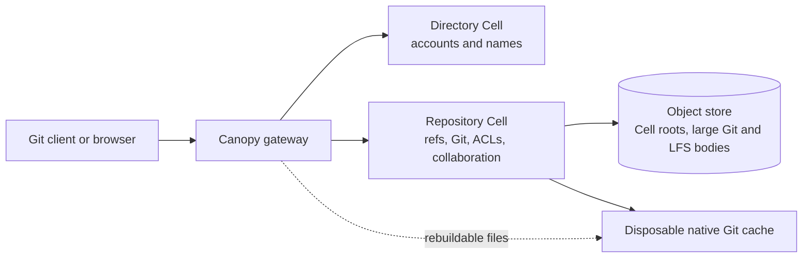
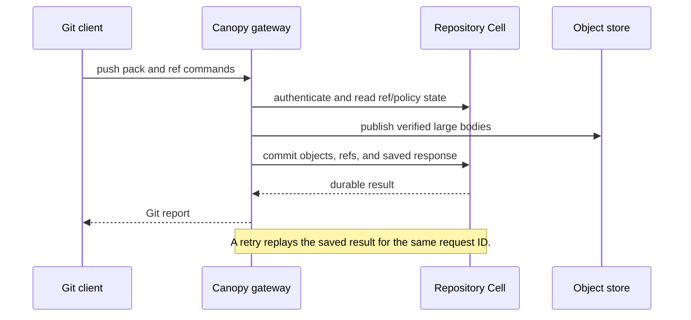

# Canopy

Canopy is a Git hosting service built on Cellule. It accepts stock Git over smart
HTTP and optional SSH, stores each repository's durable state in its own SQLite
Repository Cell, and uses an object store for recovery and large Git/LFS bodies.
Its Git hosting core works, but [production readiness is still in progress](ROADMAP.md).

**Start here:** [Run a node](#run-a-local-node) · [Create and use a repository](#create-and-use-a-repository) · [Use the browser and Git LFS](docs/user-guide.md) · [Operate a deployment](docs/operations.md) · [API reference](docs/api-reference.md) · [Documentation map](docs/README.md)

## Read this README by task

This page keeps the project overview, setup path, and first repository workflow. Use this map to jump to the detailed guide that matches your work:

| You want to… | Start with |
| --- | --- |
| Understand the storage model | [How Canopy stores a repository](#how-canopy-stores-a-repository) |
| Run a development node | [Run a local node](#run-a-local-node) |
| Create, clone, and push a repository | [Create and use a repository](#create-and-use-a-repository) |
| Use the browser, collaboration, or Git LFS | [Use Canopy](docs/user-guide.md) |
| Automate repository operations | [API reference](docs/api-reference.md) |
| Operate multiple nodes or recover data | [Operations runbook](docs/operations.md) |
| Understand limits and implementation tradeoffs | [Implementation details](docs/implementation.md) |
| Verify a build or run the process smoke | [Implementation and verification](docs/implementation.md#verify-a-build) |

## What works today

| Area | Current capability | Read more |
| --- | --- | --- |
| Git | SHA-1 and SHA-256 repositories, smart HTTP, optional SSH, push/clone/fetch, partial and shallow clone | [Compatibility and evidence](docs/git-compatibility.md) |
| Collaboration | Private and public repositories, scoped accounts and grants, issues, pull requests, reviews, line discussions, merge candidates, checks and branch rules | [User guide](docs/user-guide.md) and [API reference](docs/api-reference.md) |
| Git LFS | Basic upload/download, verified immutable bodies, advisory locks, SSH-issued HTTP grants | [Git LFS behavior](docs/user-guide.md#git-lfs-storage) |
| Recovery | Fresh local-disk restoration, signed Cell routing between nodes, maintenance drain/recovery, same-provider backup and restore | [Operations runbook](docs/operations.md) |
| Browser | Embedded repository, issue, pull-request and account views | [Repository browser](docs/user-guide.md#repository-browser) |

These are implementation capabilities, not a production capacity guarantee.
The [roadmap](ROADMAP.md) lists remaining work such as migrations, full fault
qualification, collection, provider qualification, observability and a repeatable
deployment. The [delivery plan](docs/delivery-plan.md) records release gates;
the [performance plan](docs/performance-plan.md) separates measured results from
targets. For a concrete Git workflow, check [compatibility](docs/git-compatibility.md)
before relying on a feature in a new environment.

## How Canopy stores a repository


The **Directory Cell** maps an owner and repository name to a stable repository
UUID and owns accounts. Each UUID identifies a **Repository Cell** containing
authoritative refs, Git metadata, ACLs and collaboration records. Large Git
blobs and LFS bodies are immutable external objects referenced by that Cell.
Native Git handles wire protocols using a **disposable cache**: after local disk
loss, Canopy restores published Cell state from the object store and rebuilds
the cache. See the [persisted contracts](docs/contracts.md) for publication and
recovery rules.



The existing [architecture SVG](docs/architecture.svg) provides the same model with durable and rebuildable state shown visually. The dashed cache is safe to rebuild; the Directory Cell, Repository Cell, and published object-store bodies are part of the durable authority.

### A durable push in one view

The gateway reports a successful push after it has authenticated the request, verified incoming objects, published required external bodies, and committed the ref update with a replayable response.



## Run a local node

This is a development path for one node with an existing S3-compatible object
store. The [bounded Linux deployment](deploy/README.md) describes the container
profile and its resource limits. Use a **new storage prefix** for this build;
there is no migration from earlier preview layouts yet.

1. Install Rust 1.97 or newer and Git with `http-backend`,
   `merge-tree --write-tree` (`-z --name-only --no-messages`) and `commit-tree`.
   Git 2.50.1 is the qualified version. Install `git-lfs` if you plan to use
   LFS or run the integration tests, and Python 3 for the optional secret and
   UUID generation commands below.
2. Copy [`config.example.json`](config.example.json) to `deploy/config.json`
   (which Git ignores): `cp config.example.json deploy/config.json`. Set
   `storage_url` to a fresh prefix in your store;
   choose stable tenant/application IDs, fleet/image digests and owner name.
   Give the node a unique `node_id`, a writable `data_dir`, and the local
   `listen`/`public_url` addresses. `peer_endpoint` is the node's reachable
   HTTPS origin when using multiple nodes. Adjust the disk and active-repository
   limits for the machine. The example values are illustrative, not a
   deployment identity.
3. Make provider credentials available through that provider's environment.
   Set `CANOPY_GIT_TOKEN` to the owner's bootstrap credential and
   `CANOPY_NODE_SIGNING_KEY_HEX` to a private 32-byte key encoded as 64 hex
   characters. Save both securely; keep the same owner credential and node key
   across restarts. The token bootstraps a durable admin account. For a new
   local prefix, generate both values with the commands below, then place them
   in your secret environment. The first output is the owner token; the second
   is the node signing key.

   ```bash
   python3 -c 'import secrets; print("cnp_" + secrets.token_hex(32))'
   python3 -c 'import secrets; print(secrets.token_hex(32))'
   ```

4. From the repository root, start the service:

   ```bash
   cargo run --release --locked --bin canopy -- deploy/config.json
   ```

Check liveness and Cell readiness at the configured listener:

```bash
curl --fail http://127.0.0.1:8080/healthz
curl --fail http://127.0.0.1:8080/readyz
```

`/healthz` reports process liveness; `/readyz` reports Cell readiness. Stop
with SIGINT or SIGTERM so the server drains admitted requests and withdraws
its node advertisement. The object store must support conditional create/update
and ranged reads; startup probes those capabilities. Keep provider credentials
out of configuration files. The node locks its local data directory; do not
run a second process against the same directory.

### Create and use a repository

In a second terminal outside the Canopy checkout, make `CANOPY_GIT_TOKEN`
available and create a private SHA-1 repository (the default format):

```bash
curl --fail-with-body \
  --header "Authorization: Bearer $CANOPY_GIT_TOKEN" \
  --header 'Content-Type: application/json' \
  --data '{"name":"example"}' \
  http://127.0.0.1:8080/api/repositories
git clone http://127.0.0.1:8080/canopy/example.git
```

Replace `canopy` in the clone URL with your configured `owner`, or use the
`clone_url` returned by creation. For a private repository, Git prompts for
HTTP Basic credentials: use the owner name as username and the bootstrap token
as password. A Git credential helper can remember them for later fetches and
pushes. Do not place tokens in the remote URL. The [browser guide](docs/user-guide.md#repository-browser)
can create repositories too.

In the cloned directory, make the first commit and push:

```bash
cd example
printf '%s\n' '# Example' > README.md
git add README.md
git -c user.name='Example Author' -c user.email='author@example.com' commit -m 'Initial commit'
git push -u origin main
```

To create a SHA-256 repository instead, send
`{"name":"example-sha256","object_format":"sha256"}` and use a compatible
Git client. The object format is fixed when the repository is created.


## Continue with the documentation

The README is the project landing page. The detailed behavior, operational procedures, limits, and qualification evidence remain in dedicated documents:

| You need to… | Read |
| --- | --- |
| Browse repositories, issues, pull requests, Git LFS, or accounts | [User guide](docs/user-guide.md) |
| Automate repository, collaboration, merge, checks, token, or SSH operations | [API reference](docs/api-reference.md) |
| Drain nodes, recover owners, back up state, restore deployments, or replay a lost push reply | [Operations runbook](docs/operations.md) |
| Understand resource limits, residency, cache hydration, and verification | [Implementation and verification](docs/implementation.md) |
| Check stock Git and Git LFS support | [Git compatibility](docs/git-compatibility.md) |
| Review durable identities and retry behavior | [Persisted contracts](docs/contracts.md) |
| Decide whether a release gate is closed | [Delivery plan](docs/delivery-plan.md) |
| Plan or interpret capacity measurements | [Performance plan](docs/performance-plan.md) |
| Evaluate future multi-capability Repository Cells | [Repository Cell primitives](docs/repository-cell-primitives.md) |

The long-form material moved from this README is preserved in those pages. The [documentation hub](docs/README.md) explains how the pages fit together.

## Contributing

Keep behavior, tests, and documentation aligned when you change Canopy:

1. Update the relevant [persisted contract](docs/contracts.md).
2. Add or update a stock-client, API, or fault test.
3. Record the revision, provider, workload, and hardware for measurements.
4. Update the matching compatibility row or [delivery gate](docs/delivery-plan.md).
5. Add a diagram when ownership, sequencing, or recovery is easier to understand visually.

## License

Canopy declares the [Apache License 2.0](https://www.apache.org/licenses/LICENSE-2.0) in `Cargo.toml`.
