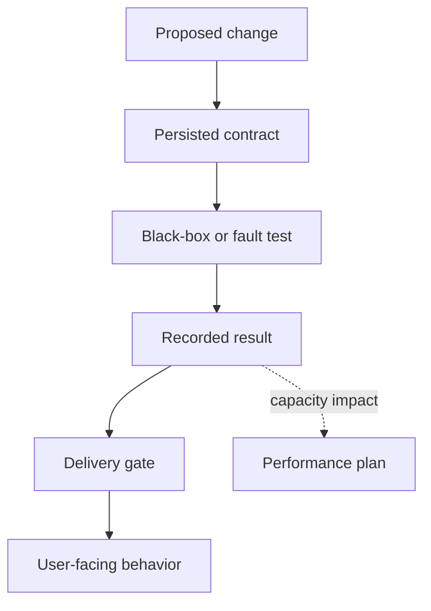
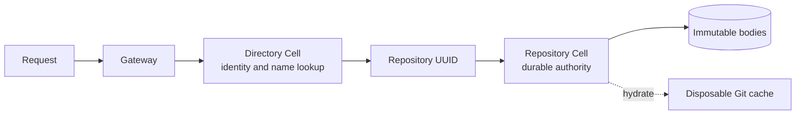

# Canopy documentation

This hub helps you choose the shortest path through Canopy's technical documentation. The root [README](../README.md) gets a node running. These documents explain compatibility, durable behavior, qualification evidence, capacity work, and future Cell capabilities.

> **Status rule:** an implemented behavior is not automatically a production guarantee. Read the evidence and release gate for the exact revision, provider, workload, and hardware.

## Choose a starting point

| If you need to… | Read | Document type |
| --- | --- | --- |
| Run Canopy or create a repository | [Project README](../README.md) | Tutorial |
| Deploy one constrained Linux node | [Bounded Linux deployment](../deploy/README.md) | How-to |
| Check whether a Git workflow works | [Git compatibility](git-compatibility.md) | Reference |
| Implement API or storage behavior | [Persisted contracts](contracts.md) | Reference |
| Decide whether a release gate is closed | [Delivery plan](delivery-plan.md) | Reference |
| Plan a capacity experiment | [Performance plan](performance-plan.md) | How-to |
| Evaluate future SQL, KV, queue, and workflow composition | [Repository Cell primitives](repository-cell-primitives.md) | Conceptual |
| Track product and operational gaps | [Roadmap](../ROADMAP.md) | Reference |

## Follow the evidence chain

Use the documents in this order when a change affects a protocol, storage rule, or resource boundary:

This chain keeps three claims separate:

- **Implemented**: the current code has the behavior described
- **Measured**: a recorded run passed or failed for its stated setup
- **Target or open gate**: the desired behavior still needs implementation or qualification

## Understand the storage model

The Directory Cell resolves accounts and repository names. Each repository UUID identifies a Repository Cell that owns durable Git and collaboration state. Native Git files are a disposable cache. Large Git and LFS bodies live in immutable object-store objects referenced by SQLite state.

The [architecture SVG](architecture.svg) provides a visual version of this model. The [persisted contracts](contracts.md) define publication, ownership, recovery, and retry behavior.

## Read a document effectively

Each long reference starts with a navigation table and a summary. Use the section headings to jump to one surface, then check its limits and acceptance evidence before changing code.

| You are reviewing… | Check these sections first |
| --- | --- |
| A new endpoint or mutation | Identity, authorization, idempotency, conflict behavior, and response limits in [contracts](contracts.md) |
| Git or LFS support | Verified operations and restrictions in [compatibility](git-compatibility.md) |
| A release decision | Gate table first, then the matching qualification record in [delivery plan](delivery-plan.md) |
| A latency or density claim | Workload definition, setup, measurements, and caveats in [performance](performance-plan.md) |
| A Cellule runtime change | Current contract gap and acceptance gates in [repository Cell primitives](repository-cell-primitives.md) |

## Contribution checklist

Update the related documentation when you change behavior:

1. Add or revise the persisted contract.
2. Add a stock-client, API, or fault test.
3. Record the revision, provider, workload, and hardware for any measurement.
4. Update the matching delivery gate and compatibility table.
5. Add a diagram when a reader must understand ownership, sequencing, or recovery.

Keep examples executable, label code fences, use sentence-case headings, and prefer tables or lists when a paragraph contains three or more independent items.
