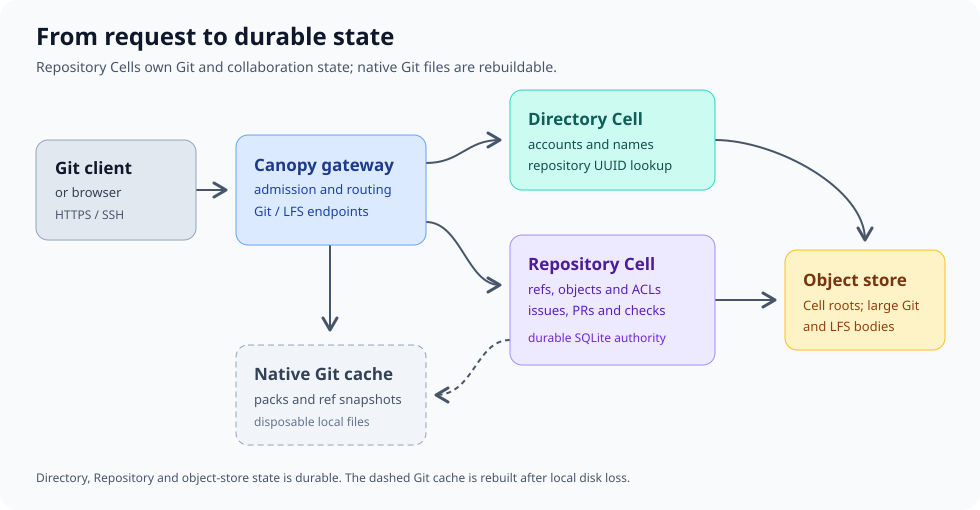
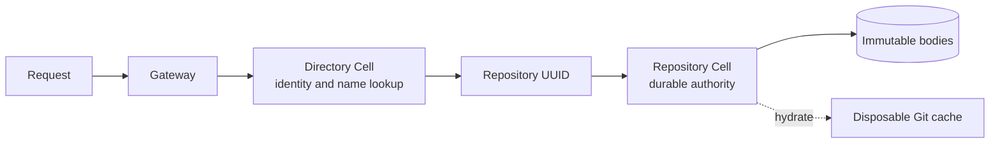

# Find the right Canopy document

Use this page to choose a document by task. Canopy's hosting core supports stock Git and Git LFS, but the [roadmap](../ROADMAP.md) and [delivery gates](delivery-plan.md) still list work required before an unattended team deployment. A result from one test revision or storage provider does not automatically apply to another.

> **Status rule:** an implemented behavior is not automatically a production guarantee. Read the evidence and release gate for the exact revision, provider, workload, and hardware.

## Choose a starting point

| If you need to… | Read | What you will find |
| --- | --- | --- |
| Understand the server and try a local deployment | [Project README](../README.md) and [bounded deployment](../deploy/README.md) | Configuration, runtime commands, resource boundary and recovery procedures |
| Decide which Git operations work | [Git compatibility](git-compatibility.md) | Stock-client evidence, restrictions and provider qualification commands |
| Implement an API or storage change | [Persisted contracts](contracts.md) | Identity, authorization, protocol, durability and HTTP behavior |
| Decide whether a release gate is closed | [Delivery plan](delivery-plan.md) | Required proof, current state and chronological implementation evidence |
| Plan or evaluate capacity | [Repository density and latency](performance-plan.md) | Workloads, targets, measured results and limits of each result |
| Check the latest Cellule dependency update | [September 30 requalification](performance/2026-09-30-cellule-main.md) | Exact revision, passing checks, failed suites and storage-blocked performance gates |
| Understand the large-object deadline fix | [Count chunks once per transaction](performance/2026-09-30-chunk-count.md) | Snapshot safety, query-work regression, phase timings and remaining verification |
| Inspect current-pin full-corpus load and recovery results | [Complete-corpus diagnostics](performance/2026-09-30-full-corpus.md) | All-identity verification, dropped arrivals, latency windows and acknowledged-write recovery |
| Understand concurrent cold-request routing | [Cold-owner race follow-up](performance/2026-09-30-cold-owner-race.md) | Synchronized failure, live-owner routing fix and candidate verification |
| Extend a repository Cell beyond SQL | [Full repository Cell capabilities](repository-cell-primitives.md) | Cellule dependency changes and acceptance gates for composed primitives |
| Track production-readiness work | [Roadmap](../ROADMAP.md) | Milestones and checklists across operations, product features and scale |

## Understand where data lives

The Directory Cell resolves names and accounts. Each repository has its own Repository Cell, which owns the durable Git and collaboration state. Native Git uses a disposable cache for wire protocols. Large Git blobs and Git LFS bodies live in immutable object-store objects referenced by the repository's SQLite state.

The diagram shows ownership, not a second copy of authority in the Git cache. After local disk loss, Canopy restores published Cell state from the object store and rebuilds that cache. Read the [persisted contracts](contracts.md) for the exact publication and recovery rules.

## Interpret evidence correctly

Each technical document distinguishes three kinds of statements:

| Label | Meaning |
| --- | --- |
| **Implemented** | The current code has the behavior described; the linked test or contract gives its boundary |
| **Measured** | A recorded run passed or failed for its stated revision, provider, workload and hardware |
| **Target or open gate** | The desired behavior still needs implementation, qualification or both |

The [delivery plan](delivery-plan.md) is the source of record for release gates. The [performance plan](performance-plan.md) records capacity evidence and proposed targets; its 10,000-repository reference target is not measured capacity. The [roadmap](../ROADMAP.md) orders the remaining work without replacing either source.

## Follow a change through the docs

For a protocol or storage change, use this order:

1. Read the current behavior and limits in [Git compatibility](git-compatibility.md) or [persisted contracts](contracts.md).
2. Find the corresponding acceptance gate in the [delivery plan](delivery-plan.md).
3. If the change affects resource use, compare it with the workload and measurements in the [performance plan](performance-plan.md).
4. Update the contract, a stock-client or fault test, and the recorded gate result together.

This order keeps a working implementation, a durable guarantee and a measured capacity claim separate.

## Detailed reference pages

The long-form material is split by reader task so you can scan the landing page and open only the reference you need:

| Page | Use it to… |
| --- | --- |
| [User guide](user-guide.md) | Browse repositories, collaborate, use Git LFS, and administer accounts |
| [API reference](api-reference.md) | Automate repository, collaboration, merge, checks, token, and SSH operations |
| [Operations runbook](operations.md) | Drain nodes, recover owners, back up state, restore deployments, and replay uncertain pushes |
| [Implementation and verification](implementation.md) | Understand limits, residency, cache hydration, and build or smoke-test evidence |

These pages preserve the detailed README material while giving each surface its own entry point.

## Contribution checklist

Update the related documentation when you change behavior:

1. Add or revise the persisted contract.
2. Add a stock-client, API, or fault test.
3. Record the revision, provider, workload, and hardware for any measurement.
4. Update the matching delivery gate and compatibility table.
5. Add a diagram when a reader must understand ownership, sequencing, or recovery.

Keep examples executable, label code fences, use sentence-case headings, and prefer tables or lists when a paragraph contains three or more independent items.
