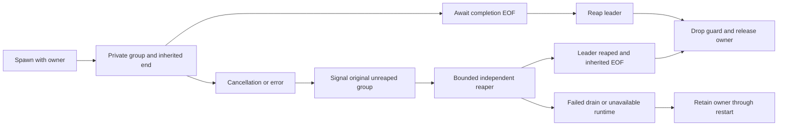

# Native process ownership and drain

The shared GitProcess guard now lives in native_git::process and serves HTTP/SSH transport, isolated pack validation, cache maintenance, native blob extraction, candidate preparation, ref listing and decoded-object batch/history workers. The decoded-object path previously used direct-child kill-on-drop; transport guards previously released owners after sending a process-group kill signal. Signaling a process is not evidence that its work has stopped.

The guard reuses its existing generic owner: cache generations, input files and account/transfer permits stay together. It does not create another object inventory, compatibility store or publication certificate. The guard now also requires a private permit from the [shared native resource pool](native-resource-admission.md). Actual CPU/RSS/file/process containment and the production packed-catalog cutover remain separate deliverables.

## Spawn and supported fence

On Unix, create a private process group and an anonymous socket pair before spawn. Duplicate the child end into a descriptor of at least three, outside the standard streams that spawning replaces. Keep both parent descriptors close-on-exec by default. Clear close-on-exec only for the duplicated child end inside its pre-exec callback, using async-signal-safe fcntl. The cache's existing inherited workspace lock remains independent and continues to fence filesystem cleanup.

Drop the Command immediately after spawn, including failed spawn and completion-fence setup failure, before dropping the caller's owners. This releases parent copies of inherited descriptors; the running child and its descendants retain their ends. One completion read descriptor remains in the guard. A native/helper process that preserves the inherited end prevents EOF until it exits or closes that end, including after it closes standard streams or escapes the initial process group.

The child wrapper exposes only stdin/stdout/stderr and read-only PID inspection. The actual Child and wait/try_wait stay private. Callers cannot reap the leader before the guard's drain check. This matters because an unreaped leader's PID cannot be reused for an unrelated process group while cancellation is preparing its signal.

## Completion and cancellation

Callers retain their existing total-work/idle deadlines, drain standard output and bounded diagnostics, then invoke GitProcess.wait. On Unix, wait for EOF on the private completion descriptor before reaping the leader. Unexpected completion-channel data or an I/O error rejects completion. A closed stdout/stderr pair alone cannot complete the operation while a participating descendant is still alive. Once the leader is reaped, disable later group signals.

On cancellation/error/drop, signal the original private group while its leader is still unreaped. Transfer the Child, completion descriptor and generic owner into a service-owned reaper. Reap the leader and await inherited-end EOF independently; only successful completion of both releases the owner. The reaper is independent of the requesting future. A helper that escapes the process group still retains its owner while it holds the descriptor; the guard does not pretend that the initial kill signal terminated it.

A successful completed wait uses an immediate drop path without spawning a reaper task. Other cases use at most 512 shared reaper slots. Missing runtime, saturation, failed drain or runtime shutdown conservatively quarantine the owner through restart. These conditions emit an error and do not return account/disk/cache credits for potentially live work. The node supervisor now closes and drains the shared native pool before Cell shutdown, workspace release and heartbeat withdrawal. Quarantined claims keep that boundary pending; quarantine is the failure behavior, not an operational substitute for drain. Escaped or stuck workers can consume admission indefinitely and must be visible to operations.

The guard preserves native exit-status handling. Group/fence completion does not certify object identity, graph closure, current authorization or durable publication; those still use the existing verification and fenced Cell APIs. The ref-list helper now uses the same guard, a one-hour work deadline and bounded stderr; its existing whole-ref-list collection remains and needs the namespace/resource profile before cutover.

## Required containment and qualification

This descriptor fence covers descendants that preserve the inherited completion end. A process can explicitly close it while continuing to run. The selected Git version, allowed helpers and command profile must qualify descriptor preservation. The fence is not a universal process-membership oracle, a hard RSS limit or authority to delete remote artifacts. Production OS/container containment must bound memory, CPU, process/file counts and escaped descendants, and its drain must be qualified before resource release or remote reclamation depends on stronger guarantees. Complete retained-root inventory and renewable serving/backup pins remain required for deletion.

On non-Unix platforms the guard retains owners through direct-child reaping, but has no Unix process-group or inherited-descriptor proof. Equivalent job containment and descendant drain remain unimplemented; the packed-storage release cannot claim that platform's process-tree safety from these checks. No production format marker or registry is selected by this change.

Decoded-object actors use the shared process guard and the existing cache workspace fence. They and ref-list helpers now require explicit native-resource permits from the owning node scope. A () generic owner still supplies no account admission; the native permit independently retains the node claims through drain. Profile qualification, fair preparation admission and hard OS limits remain required. Physical input, metadata, closure, edge spools and detached SQL/I/O jobs keep their own admitted ownership.

## Evidence and remaining gates

Unix fault fixtures cover a leader that exits after a helper closes all standard streams, cancellation with a helper that creates a new session, and a separately spawned daemon-style fixture with closed stdin/stdout. They confirm pending completion, retained transfer credit, safe descriptor placement and release after actual inherited-end drain. The escaped-session helper uses the same test executable and a bounded lifetime; it introduces no Python dependency or mutation of the parent test process's standard descriptors/environment.

Existing HTTP backpressure/disconnect/deadline/spawn-failure checks, decoded-object cancellation/stream-integrity checks, native SHA-1/SHA-256 isolated verification, ancestry and maintenance fixtures use the new guard. Production network and owner-loss/restore suites remain required regression evidence. These checks establish this ownership protocol, not 10,000-engineer throughput, hard native memory bounds, full input adoption or completed production hard cutover.
