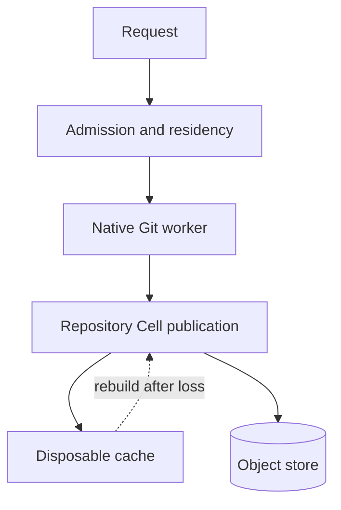

# Implementation details and limits

This reference preserves the complete implementation notes, resource limits, residency behavior, storage compatibility rules, cache hydration details, and build verification procedure from the project README.

> **Document type:** Reference and verification guide. **Goal:** understand current implementation boundaries, run the build checks, and interpret resource or recovery claims correctly.



## Runtime behavior and limits

See [Git compatibility](git-compatibility.md) for verified operations,
current limits and remaining transport and object-format qualification.

This repository is an implementation under construction. The `canopy` binary
starts one leased Cellule node and serves repositories created through its API.
It probes the object store's fencing capabilities, publishes and renews a signed node
advertisement, and restores the repository Cell from object storage when its
local SQLite file is lost. `git-http-backend` supplies Git smart HTTP wire
handling, including protocol v2 negotiation. The SQLite Cell is the durable
authority, and a bare Git repository is only a rebuildable cache. Integration
tests use stock `git` and `git-lfs` clients to push and clone, including a
restart with a fresh local SQLite file.

Nodes sharing a deployment can serve requests for Cells owned by another live
node. Repository creation acquires its Cell on the receiving node; other gateways
use signed HTTPS Cell RPCs to that owner. Git caches stay disposable on each
gateway. The Directory Cell has one owner, with on-demand recovery after release
or lease expiry. Automatic fleet balancing and production capacity qualification
remain pending.

### Resource and scaling limits

These are current admission limits, not measured production throughput:

| Resource | Current behavior |
| --- | --- |
| Concurrent Git/LFS transfers | Eight per node; excess requests return `503` and `Retry-After: 1`. |
| Fetch request body | Up to 64 MiB; clone/fetch response packs stream with backpressure. |
| Push report | Buffered up to 64 MiB; push bodies have no fixed byte quota. |
| Git blob and LFS body | Immutable 8 MiB parts, with no fixed logical file-size quota. |
| Active repository gateways | `max_active_repositories` per node (1–9,999); stored repositories may exceed this. |
| Local admitted disk | Set by `local_disk_limit_bytes`; exhaustion returns `507`. |

The current service supports one repository owner.
Incoming Git requests stream to temporary files charged to the same disk budget
as the node's SQLite files. Push bodies have no fixed byte quota; fetch requests
remain bounded at 64 MiB. Push reports are buffered up to 64 MiB, while clone/fetch
packs stream with backpressure. Git blobs and LFS objects use immutable 8 MiB
parts without a fixed logical file-size quota. Trees, commits and tags above
768 KiB use SQLite chunks without a fixed individual object-size quota.
Git LFS basic downloads resume with a tail `Range` request and a verified
`206` response. The server reads only the requested parts and verifies each
against a manifest digest pinned in SQLite.
Publication and graph parsing still materialize non-blob bodies, so very large
structural objects depend on available worker memory.
Partial uploads stay invisible to Git.
Each node admits eight Git/LFS transfers across all repositories. Overload
returns 503 with `Retry-After: 1`; retry after capacity is available. Health,
readiness and management routes remain outside this transfer limit. LFS
batch reception has a 120-second deadline. LFS object uploads have a 120-second
input idle timeout with no whole-transfer deadline (408 on timeout). Eight is
an initial operational bound, not a measured production capacity target.
Ref advertisements use generation-checked pagination; sustained concurrent
changes return a retryable 503. Gzip-compressed Git requests are supported.
Gzip is fully validated before Git runs; decoded bytes have the same request
size limits and share disk admission with the encoded upload.
Disposable Git caches retain shared disk reservations. Hydration admits bytes
before writing; native Git writes are measured before durable ref publication.
Exhaustion returns 507. Direct binary execution does not hard-bound native Git's
peak scratch usage. The [bounded Linux container profile](../deploy/README.md)
enforces aggregate memory, CPU, process and writable-filesystem ceilings.
All native Git workers use an isolated environment: host Git configuration,
object paths, tracing and provider credentials are removed. Home and temporary
paths point into the disposable cache; Git is selected through the host `PATH`.
Pack/index work uses two workers with explicit delta/cache/mapping budgets.
Smart HTTP streams eligible blobs above 8 MiB and skips delta search for them;
smaller files retain delta compression. Merge operations retain ordinary text
semantics. These are resource policies, not hard process or filesystem limits.
See [native pack policy](contracts.md#native-pack-resource-policy) and
[container containment](contracts.md#bounded-linux-container).

### Local workspace and shutdown

The node locks its `data_dir` and owns `canopy-pack-v1/` beneath it. On Unix,
restart removes abandoned local state before restoring Cells from object storage;
live Git descendants prevent cleanup. Unknown runtime markers and cleanup errors
stop startup. Keep the lock files in place; files outside the managed runtime
are untouched. Windows orphan-worker recovery still requires manual cleanup
after all server and Git processes have stopped.

The server handle supervises startup and shutdown. Dropping it requests a drain;
cancelling a startup or shutdown wait cannot interrupt admitted Cell work or
release the workspace early. A failed node drain or destruction of the Tokio
runtime before confirmed drain retains the workspace lock until process restart.
Keep the runtime alive until shutdown finishes for graceful cleanup.

### Repository residency and routing

Local recovery uses SQLite's representable database range without a Canopy byte
quota. The node reserves a SQL slot for Directory ownership and admits
`max_active_repositories` repository
gateways, each bound to a local or remote Cell. This required configuration field
accepts 1–9,999; the SQL pool receives that limit plus the Directory slot.
`config.example.json` uses 100. Choose a limit from the node's measured memory,
descriptor and disk budgets; this count is not an aggregate resource ceiling.
Stored repository count can exceed the active limit. Additional repositories evict an inactive
gateway; local Cell ownership is released before its slot is reused. On a temporary
Runtime movement-rate denial, admission waits one second before a single retry.
Requests and streamed responses pin their repository; admission returns 503 when
no repository can be safely released. Cold/remote routing admits at most 32
transition operations, executing concurrently across different repositories or
waiting for the same repository's transition. Each authenticated account may use
at most 16 of those slots across its tokens and repository routes; anonymous
readers share one separate 16-slot allowance. Slots are reserved before activation
I/O and stay reserved through eviction cleanup. Full admission returns 503;
disconnected clients retain admission until supervised work ends. Ready local
repositories keep routing independently. SQL execution uses the
runtime's CPU-sized worker pool, capped at sixteen, with per-Cell ownership.
The [density benchmark and remaining scaling plan](performance-plan.md)
separate repository count, active Cells and simultaneous transfers.
Git v2 capability discovery needs no object cache. Native v0 advertisements and
v2 `ls-refs` prepare only ref targets and annotated-tag chains in a temporary
cache. Blobless fetch omits ordinary blobs; fetch prepares non-blob history and
selected blobs reachable from requested tips. Push still prepares full history.
Direct blob/tree refs require their
own bodies, and very large ref sets still need separate capacity qualification.
A terminal ownership-release failure leaves
that repository unavailable until node restart; confirmed-release cleanup errors
are retried on later admission. There is no
account deletion API, organization model or production capacity evidence.
`Cargo.toml` pins Cellule's runtime, app, host, LTX and store crates to revision
`a28de7bc09ce36d87e642adc4f4b6be50d6fcb69`. Canopy remains a separate
product crate and builds without a local Cellule checkout. There are no Crab
product/server or Xet dependencies.

### Storage compatibility and graph verification

Use a **fresh storage prefix** for this build. Cellule derives a 33-byte entity
partition from the repository UUID; the UUID is also persisted in repository
SQLite for backup recovery. This is a hard cutover: previous runtime
prefixes/backups are unsupported. Startup rejects unmarked application roots,
and release admission rejects a different compiled release. See the
[runtime integration contract](contracts.md#cellule-integration).

Before ref publication, bounded certificate batches verify the durable Git
graph: commit trees and parents, tree entries and tag targets must exist with
the correct object type. Each batch covers at most 128 objects, targeting 64 MiB of
SQLite object bytes. Ref publication checks certified tips atomically with
permissions and ref versions; branch tips must be commits. Submodule gitlinks may name commits in another repository.
SQLite certificates let later pushes reuse validated history. Push ingestion streams
candidates from accepted ref tips, excludes previously published history, and
reads missing objects through one persistent Git batch process. Object sizes
are checked before allocation and canonical OIDs before storage. SQLite lookups
group up to 128 candidate IDs; object publication groups up to 128 records and
3 MiB of inline bytes in one Cell transaction, targeting 64 MiB of SQLite
object bytes verified per batch. A conflicting record rejects
the whole batch. Recovery tests include annotated tags, submodules and
`git fsck` on the restored clone.

### Cache hydration and partial clone

Cold cache hydration reads insertion-ordered pages of at most 128 records and 768 KiB
of inline bodies. It verifies inline identities on a blocking worker; chunked
and external bodies retain their own verification before cache writes. Pages
reduce SQLite query overhead. Blobless fetch (`--filter=blob:none`) skips ordinary
blob bodies until explicitly requested. Other fetches enumerate missing blobs
reachable from requested tips, applying the native filter before hydration.
Tree and object-type constraints, including those in combined filters, skip
omitted bodies; size filters still need missing blob bodies. Advertised ref/tag targets are always prepared.
Non-blob history is still prepared across the repository. Supported filters and remaining gaps are listed in
[Git compatibility](git-compatibility.md).
While a gateway remains resident, verified object files are shared across private
ref snapshots, pushes and merge candidates. An indexed insertion cursor limits
refresh to newly published object headers and missing bodies. Each refresh captures
a fixed upper bound; each fully verified page advances the cursor. Failed pages
retry without skipping bytes. Native output stays private until it is
published to the Cell and subsequently verified into the reusable cache. See the
[process proof and remaining limits](performance-plan.md#indexed-object-refresh).

## Verify a build

Choose a writable Cargo target directory with enough room for the build and
tests. The repository's `target/` directory is ignored by Git:

```bash
export CARGO_TARGET_DIR="${CARGO_TARGET_DIR:-$PWD/target}"
cargo test --workspace --locked
cargo clippy --workspace --all-targets --locked -- -D warnings
cargo fmt --all -- --check
```

The integration tests need `git` and `git-lfs` on `PATH`. See
[delivery plan](delivery-plan.md) for the remaining release gates and
[contracts](contracts.md) for persisted identities and storage rules.

For a black-box process smoke, build the optimized `canopy` binary, provide a
test S3-compatible bucket and credentials through the provider's environment
variables, and run:

```bash
cargo build --release --locked --bin canopy
python3 scripts/smoke_s3_process.py \
  --binary "$CARGO_TARGET_DIR/release/canopy" \
  --storage-url s3://your-test-bucket \
  --work-parent "$CARGO_TARGET_DIR"
```

The script needs `openssl` on `PATH`, `CANOPY_NODE_SIGNING_KEY_HEX` and provider
credentials in the environment. It writes under a unique prefix in the supplied
bucket. Its default run covers:

| Stage | Evidence checked |
| --- | --- |
| Repository lifecycle | Two stock Git/LFS repositories, collaborator grant and revocation, rename, fresh local-database restart, lease-expiry takeover, then clone from a third process. |
| Authorization and records | Owner roster and collaborator access after takeover; retired token denied for API, Git and LFS; edited issues/comments and original-create retries survive restart and takeover. |
| Git publication | Branch deletion remains absent through takeover and can be recreated; mixed push accepts only allowed refs; atomic push rejects the whole mixed update. |
| Lost replies and checks | A proxy drops a successful push reply; replay after takeover returns the original report without undoing a later deletion. An old check-start retry cannot replace the newest attempt. |
| Two-node routing | Local HTTPS proxies with a private test CA route eight Git/LFS repositories through the opposite owner; after one node dies, the surviving gateway takes over Directory and repository Cells without restarting. |
| Backup and restore | The real CLI copies a separate fixture, deletes its original prefix, then verifies and restores Git/LFS bytes and issue data into a fresh process. Fixtures include an 80 MiB Git blob, an 80 MiB LFS file and an empty LFS object. |

Optional flags expand the qualification:

| Flag | What it exercises |
| --- | --- |
| `--large-clone` | Push two 80 MiB random blobs, then clone with protocol v0 and v2 after takeover. Each pack exceeds 64 MiB; both file hashes and `git fsck` must match. This checks transfer size, not production capacity. |
| `--many-objects 256` | Push 256 files, update one file with an annotated tag, then clone after takeover. Combined with `--large-clone`, exercise resident eviction across four repositories and Git/LFS recovery before restart. |
| `--sqlite-chunks` | Push a 32,000-entry tree and commit/tag messages above 1 MiB; verify raw bytes and OIDs after takeover with strict `git fsck`. |
| `--corpus-repository /path/to/existing/repository` | Read that checkout's HEAD history, bundle it into temporary fixtures under `--work-parent`, then compare every reachable object's type, size and bytes in v0/v2 clones after takeover, with strict `git fsck`. Other source branches and tags are outside this check. |

For a local container store, verify that the intended data/log volume is shared
into the container VM. An unshared host path can consume the VM root disk.
Check free inodes and bytes, including provider temporary storage. On RustFS
`1.0.0-beta.8-glibc`, the 80 MiB backup fixture exhausted a 4 GiB tmpfs and
completed on a dedicated Docker volume, ending at 5.4 GiB with 5.1 GiB under
its internal temporary directory. Size the test store accordingly; this is an
observation from that run, not a production storage bound.

To measure cold recovery, set
`RUST_LOG=warn,canopy_server::git_gateway=debug,canopy_server::server::residency=debug`.
The node reports Cell acquisition time and cache hydration time, with object
count, raw/cache bytes and time spent in page reads, body retrieval and cache
writes. Page time includes inline integrity verification; cache time includes
worker scheduling, OID verification, compression and admitted disk writes.
Use release builds for performance measurements.

The chunk, default-branch, repository-discovery, token-metadata, collaboration,
visibility and object insertion-sequence layouts change the unreleased schema; use a fresh development storage prefix when moving
from older builds. No upgrade migration or mixed-build rolling upgrade is supported yet.
Do not reuse an existing development prefix with this changed initialization schema.

## Contributing

Keep behavior, tests, and documentation aligned when you change Canopy:

1. Update the relevant [persisted contract](contracts.md).
2. Add or update a stock-client, API, or fault test.
3. Record the revision, provider, workload, and hardware for measurements.
4. Update the matching compatibility row or [delivery gate](delivery-plan.md).
5. Add a diagram when ownership, sequencing, or recovery is easier to understand visually.

## License

Canopy declares the [Apache License 2.0](https://www.apache.org/licenses/LICENSE-2.0) in `Cargo.toml`.
