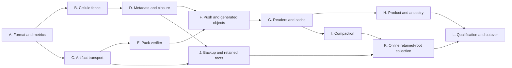

# Canopy packed repository implementation plan

**Mandatory scale amendment:** [Large-team scalability requirements](large-team-scalability.md) supersedes the per-object Cell schema, globally serialized preparation and normal globally drained deletion in this plan for the >10,000-engineer workload. Its dependency-ordered deliverables and mixed-load gates are part of the implementation scope. Do not land the earlier DDL as the fresh-format release schema and defer bulk metadata/catalogs to a later migration.

Implement the [packed repository design](large-repository-storage-design.md) as one incompatible deployment format. Every Git object uses a native pack; existing object, graph, ref, push and collaboration structures are reused. Start on fresh data. Do not build migration tooling, dual writers or a compatibility `ObjectStorage` variant.

**Deliverable status:** the design, executable schema fragment, schema checks and native Git smoke fixture are delivered. Runtime changes listed below are not implemented by these documents. Existing working-tree cache/benchmark work is separate and should be integrated, not overwritten. No Kubernetes, Linux or Chromium capacity claim is closed by the small fixtures.

Track actual primitive integration and remaining full scope in [implementation status](large-repository-implementation-status.md). The [final publication lifecycle](design/final-publication-lifecycle.md) now connects private final factories, staging worker/result drain, exact renewal/checkpoint recovery and account-fair dispatch without another command payload layout. It remains a process-local composition requiring production wiring and durable takeover. The earlier schema fixture is superseded for the large-team release; its passing checks do not validate the new catalog architecture.

The [durable original-request checkpoint](design/durable-push-request.md) now reuses the authenticated artifact transport and native input index: register encoded bytes before receive, then append captured native descriptors under exact predecessor CAS. Staging/bound reconstruction recomputes the scoped request identity, and restored-owner adoption preserves the original roots without copying. The [durable native-result checkpoint](design/durable-native-result.md) now preserves the exact native response/options/signature witness and versioned plan, freezes the descriptor inventory, and supports current-custody reconstruction and whole-root adoption. The final short ref-plan command interface, production takeover orchestration and every producer/reader conversion remain required in F/G/J; these APIs do not complete those packages.

## Implementation sequence

Each package has one reviewable outcome. The schema cutover and all producer/consumer changes land together in the release; intermediate development commits are allowed to be unreleasable. Avoid temporary production fallbacks merely to make an intermediate commit deployable.



Suggested ownership is a Canopy storage implementer for C–G/I, a Canopy runtime/product implementer for A/H/J/K, and the Cellule maintainer for B and the retained-root portion of J. These are code ownership boundaries, not a requirement for multiple agents or a particular staffing model. With limited staffing, follow dependency order.

## A. Establish the new deployment format and measurements

**Files:** `crates/canopy-server/src/deployment/root.rs`, `crates/canopy-server/src/deployment/mod.rs`, `crates/canopy-server/src/server/mod.rs`, `crates/canopy-server/src/lib.rs`, `crates/canopy-server/src/main.rs`, `docs/contracts.md`, `docs/operations.md`; preserve existing evaluation scripts and cache edits.

1. Wrap `RootPurpose` in the `canopy-pack-v1` envelope at the existing marker key. Make startup, maintenance, backup and restore require it before opening Cells. Reject missing, old or unknown format; test old decoder rejection of the new envelope.
2. Version local workspace/cache directories with the same format. Reserve a new provider prefix/application identity for every qualification deployment. Keep SQL bootstrap version 1 in that fresh format; update module source digest coverage when new files are added.
3. Introduce one shared `PackLimits` configuration covering transfer concurrency, native threads/window, command row/byte bounds, scratch budget, artifact part limit and work/idle deadlines. Follow existing config parsing conventions; no separate Git-store service config file.
4. Add stage timers and physical/logical byte counters from the design before optimizing. Log operation IDs and stage transitions. Keep metric labels bounded; full OIDs and repository UUIDs belong in diagnostic logs.
5. Remove stale hard-coded 120-second whole-worker assumptions in docs/tests. The working tree already uses a one-hour deadline; implement distinct idle/work budgets and an explicit four-hour bulk-import class.

**Native ownership implemented:** the [shared guard](design/native-process-ownership.md) retains existing owners through Unix inherited-end drain and leader reaping, with bounded supervised cancellation cleanup and conservative quarantine. Decoded-object actors reuse that guard. The [native resource pool](design/native-resource-admission.md) now requires a four-dimension permit at every shared spawn, with one configured node pool and disjoint foreground/maintenance shares. Required native_limits is wired through production gateways/caches and explicit preparation scopes. The supervisor now closes and drains that same pool before Cell shutdown, workspace release, heartbeat stop and advertisement withdrawal; poisoned/underflowed accounting and quarantined claims keep drain unproven. OS containment, account/fair preparation scheduling, profile/descriptor-preservation qualification and non-Unix descendant support remain required.

**Acceptance:** fresh-format startup succeeds; both directions of format mismatch fail before serving/writing; old prefixes are never adopted; metrics distinguish verification, artifact transfer, Cell publication and cache work; cancellation reaps all native descendants.

**Review artifact:** format decision in persisted contracts, config defaults table, startup rejection tests, one tiny import stage report.

## B. Expose Cellule's existing owner fence

**Runtime delivered:** [Cellule PR #38](https://github.com/crabbuild/cellule/pull/38) merged the accessor using activation-specific admission capabilities. After merging Canopy main, all Canopy pins consume revision `0f4ca0919b0dfe20a3dcd964d21da03135e42eed`, which includes that API. The original draft revision's workspace tests, lints, API docs and contract checks passed; those historical results do not qualify this newer dependency revision. The Canopy prepared-operation acceptance scenario below remains part of package D; exposing the runtime accessor does not implement it.

**Repository:** Cellule. **Files:** `crates/cellule-runtime/src/registry/handlers.rs`, registry execution construction sites, `cell/actor/` admission/execution paths and tests; reuse `control` authority and `identity::IncarnationId`. Update all Canopy Cellule dependency revisions together after the dependency change passes.

Add:

```rust
#[derive(Clone, Copy, Eq, PartialEq)]
pub struct OwnerFence { pub incarnation: IncarnationId, pub epoch: u64 }
impl CommandContext<'_, '_> {
    pub fn owner_fence(&self) -> OwnerFence;
}
```

Populate it from the admitted actor authority. Audit replay and retry execution so a handler sees the correct admitted execution fence; receipt replay must return the old result without re-executing against a guessed current fence. Keep caller-supplied fence bytes separate from runtime context. Canopy command handlers compare both explicitly.

**Acceptance:** a worker begins under A; authority moves to B; A's delayed mutation submitted through B is rejected by the Canopy token check; B claims attempt 2 and resumes; an exact already-committed request replay remains stable. Test eviction/reacquisition with unchanged owner and genuine epoch/incarnation changes separately.

**Scope limit:** do not redesign Cell roles, Blob routing, queues or workflow composition. Packs initially use Canopy's external artifact transport. No Git concepts enter the Cellule API.

## C. Generalize authenticated artifact transport

**Files:** `crates/canopy-object-storage/src/external.rs`, `crates/canopy-object-storage/src/artifact.rs`, `crates/canopy-server/src/lfs/mod.rs` and its existing helper callers, `crates/canopy-server/src/deployment/backup/bodies.rs`.

1. Extract/reuse `ArtifactDescriptor` and generalize `publish_lfs`/hashed reads into the common `CANOPY02` path. Preserve LFS SHA-256 identity and body behavior. Delete `CANOPY01` support when its Git callers are removed in F/G.
2. Stream BLAKE3 file/part hashes. Enforce exact manifest length, part count, fixed part lengths except the final part, checked integer arithmetic and the 512 GiB per-artifact limit.
3. Implement derived repository/creating-operation-scoped pack/index paths. A retired path is never reused, including for an identical later upload. On conditional-create collision, verify existing manifest and part content against the descriptor; do not accept `AlreadyExists` as proof.
4. Upload parts before manifests. Add bounded concurrent downloads and per-artifact single-flight within a node; canceled waiters do not prematurely destroy an active shared producer.
5. Reuse the helper in backup copying. No SQL `pack_parts` table and no separate manifest codec for each artifact kind.

**Acceptance:** round trips across zero-length LFS, part boundary, multi-part pack/index; corrupt/missing/reordered parts; conflicting existing manifest; lost upload reply; restart before manifest publication; provider timeout and disk exhaustion. A complete descriptor cannot be returned for incomplete bytes.

**Review artifact:** exact manifest golden vectors, failure-injection tests and provider request counts for a representative pack. A local memory store result alone does not qualify remote object-store semantics.

## D. Publish the bulk catalog and verified closure under a short Cell command

**Files:** `crates/canopy-server/src/schema.sql`, `crates/canopy-server/src/lib.rs`, `crates/canopy-server/src/packs/{metadata,directory,sources,catalog,verification,closure}/`, new operation/publication commands, existing ref/push/product commands and repository Cell tests. **Dependency:** B's actual admitted owner fence; C's authenticated artifacts; E's complete isolated physical verification.

The earlier [SQL fixture](design/packed-repository-schema.sql) is not the release definition. Deliver fresh release DDL together with the new deployment marker. Preserve product tables unless a demonstrated requirement changes them; keep push response/certificate chunks. Remove historical Git bodies, mutable per-object placement and graph rows from the Cell. Store current catalog descriptor/generation, root certification, fenced operation attempts/outcomes and retention/reader-pin facts. Immutable metadata segments and directory/source indexes hold canonical object/edge inventories. Do not implement the superseded `PutObjects`, `CertifyObjects` or `SwitchPackLocations` Cell commands as a compatibility stage.

1. Reuse the implemented immutable artifacts, canonical `ObjectHeader`/typed edges, native index ordinal partitions and bounded catalog codecs. Operation records bind repository, format, identity, admitted owner fence/attempt, input catalog/generation, artifact descriptors and exact durable response. Register large input/output sets through a bounded immutable root; never serialize every historical descriptor into Begin or Complete.
2. Implement a trusted base resolver from the retained, certified input catalog and authoritative root facts. Keep a valid generation lease throughout preparation. Reuse `CatalogFiles` for admitted, authenticated SQLite files and `CatalogReader::headers` for grouped file reads. Resolve only requested OIDs in ordered batches of at most 512; presence in a native index or raw catalog is insufficient for closure certification. Compare the complete incoming canonical header against every matching base header, including body and graph digests.
3. Compose `PhysicalVerifier` and `ClosureVerifier`. The assembler now seals its admitted incoming spool, verifies its full canonical inventory against the closure witness, and streams disjoint bounded output files into one indexed level-zero root. Output runs are at most 64 MiB; `new_with_run_limits` configures their size independently of the verification spool. Directory-root v3 stores the same range-index references at every level; range-index v2 always stores physical file facts plus logical coverage. Both reject older layouts. Full files and projections reuse the same StoredRun representation and canonical header fold; see the [coverage contract](design/directory-run-coverage.md). Exhaustion verifies complete output coverage before a PreparedCatalog can escape; reconciliation reuses that private incoming root. This implements output partitioning. Metadata/directory/closure/ancestry spools now use [admitted geometric growth](design/admitted-sqlite-growth.md) and indexed bounded closure setup transactions; full-history profiles, native/file/process resource admission and production input retention remain required. Physical verification now reuses one admitted dependency file per at-most-512-object page, with exact witness ranges and complete retry hashing; see the [edge-spool contract](design/verified-edge-spool.md). Whole-process file/native admission remains required. Stream exact physical partitions one shard at a time; discard incomplete/canceled/failed preparations. Bind the closure witness's unique canonical inventory to the incoming directory and its physical-input digest set to complete source coverage. Authenticate and verify output catalog descendants before issuing a trusted publication certificate. Raw descriptors and caller-controlled booleans cannot produce it. Carry the bounded certificate inline in the ordinary final command; durable operation-row registration is an optional checkpoint, whose extra command must be counted. The implemented factory and registration reuse the repository secret with a separate MAC domain. `PreparedCatalog::ref_proof` now derives catalog-certified target membership and admitted disk-backed ancestry, binding the exact existing PushPlan wire bytes and evidence into the certificate. Production selection, native commit-graph acceleration and large-history qualification remain open.
4. On publication against a changed generation, inspect only intervening changed runs/ranges for incoming OID intersections, reject canonical conflicts and rebind the verified facts to the actual CAS base. Recompute affected closure/policy facts if dependency retention or refs changed. Use a bounded fair ready-operation coordinator; physical verification and uploads remain concurrent outside it. The implemented read-only CheckPreparationFrontier query now returns the original attempt/floor and current root without another durable Claim or namespace. Independent pins retain every later generation until reaped; indexed bounded cleanup and a DELETE guard enforce that range. PreparedCatalog::reconcile now retains private incoming roots and admitted closure scratch, checks incoming intersections and exact external anchors against the selected current catalog, reuses physical/DAG verification, and reconstructs roots from current plus incoming. Certificates and final/checkpoint validation bind original floor and actual selected base separately. PreparedCatalog::ready_push and PublicationCoordinator now supply bounded account-fair final-command admission, concurrent durability waits and retained exact-command uncertainty recovery. Integrate those primitives with frontier/maintenance orchestration and qualify changed-run skipping and pipelined/grouped root work under continuous publication; API correctness alone does not prove hot-repository progress. The existing operation/pin rows now support an unbound staging phase through commands 24–26/28 and query 27; generated non-null phase binding preserves exact deferred FK checks. Bind once after physical verification, preserving namespace and input expiry, then reuse the existing private assembler and frontier. The service-owned StagingCoordinator now supplies bounded operation/actor/worker/result ownership, automatic fresh-query renewal, single typed result handoff, drain before Bind and exact uncertainty recovery; see the [service contract](design/staging-service-lifecycle.md). NativeInputIndex/NativeInputCertificate, immutable pin checkpoints (command 29/query 30), ReadyStaging::claim and authenticated descriptor adoption through staging or a bound PreparationSession now exist, reusing the exact immutable input root without copying index nodes; see the [checkpoint contract](design/native-input-checkpoint.md). StagingTicket::register_inputs now owns one bounded registration through cancellation and exact recovery, serializing renewal before registration and registration before Bind; CatalogPreparation::begin_retained_pack now checks exact authenticated checkpoint membership and carries its digest through certificate v3, reconciliation and final publication. PreparationSession::ready_inputs now supervises exact bound checkpoint registration through the same PublicationCoordinator, using an 8 KiB foreground reservation and fresh post-commit custody checks. ReadyPreparation::claim and PreparationSession::ready_renew now retain exact commands 12/13 through the same service dispatcher and return original receipts alongside fresh custody; see the [bound preparation contract](design/bound-preparation-dispatch.md). The staging supervisor now retains Bound admission, accepts claim_bound, renews its shared session automatically, reuses typed worker/result/checkpoint slots and enforces a separate local residence ceiling; see the [bound lifecycle contract](design/bound-preparation-lifecycle.md). Integrate those APIs, final-publication lifecycle serialization and full wire-plan/response recovery into production producers; qualify larger input limits and remaining-floor capacity. See the [staged input contract](design/staged-input-retention.md). An indefinitely renewed bound floor still exhausts the 8,192-fact cap under traffic. Verify progress under continuous independent-branch traffic and maintenance; do not blindly advance a generation, rescan history or restart full preparation on each CAS loss.
5. Keep the final Cell mutation short: validate admitted owner fence/attempt, actual base generation, trusted attestation, current ACL/policy/check bindings and expected ref identities/versions. Reuse the private `refs::validate_refs` result for format/ACL/CAS/tombstone/namespace validation and its command-bound application. Add catalog-certified target membership and independently verified ancestry; the legacy `graph::certified_roots` and policy ancestry SQL cannot run against the fresh schema. Evaluate current required checks, reporters and merge authorization in the final transaction. Atomically publish the catalog/root facts, refs and independent exact request outcome through the selected Cellule durability gate. Failed CAS changes no published root; lost replies replay the original outcome without reexecuting preparation. `PublishCatalogRefs` now implements the typed catalog/ref/outcome transaction, with current-policy checks and all rejection paths before writes. CompleteCatalogPush now invokes that same core and persists the exact native response, options and signed-certificate bytes/ownership within that transaction, with durable final-policy refusals and receipt-bound exact reads. Its factory checks native report/plan agreement and opaque signed-witness target/request binding. Route actual HTTP/SSH producers through the API, invoke implemented CheckCompletedPush/replay_push_response before native preparation, and integrate reviewed merge/candidate bindings before selecting this path. PreparationSession now issues purpose-bound outcome-only proofs directly from the admitted lease, without loading or uploading a catalog, and ready_outcome uses the existing exact final-command dispatcher. Wire actual failed/empty HTTP/SSH producers through this session path. Publishing the typed ref result and saving the HTTP response in another command is insufficient. Deliver an immutable ref-plan root for inputs beyond the current 4 MiB inline envelope. The typed publisher now accepts a privately reconciled selected base while preserving the original attempt floor. Frontier/maintenance scheduling and mixed-load qualification in step 4 remain mandatory capacity prerequisites.
6. Allow concurrent private preparation only after overlap/ref/policy races pass. Bound operation records, node scratch and retained generations; maintenance has separate admission. Reconstruct private scratch from authenticated inputs after a crash. The closure scratch's `synchronous=OFF` is not the durability policy for artifacts or the Cell.
7. Separate the logical request ID from the creating artifact attempt. Reuse existing artifact descriptor operation fields with a unique admitted-attempt identity. The implemented Begin/Claim allocator uses the persistent repository watermark and preserves it through operation pruning and normal owner recovery; independent pins retain namespaces and optional certificates after Claim/Abort. Integrate these facts into complete recovery/output retention so collection cannot discard old-worker ownership, and ensure isolated rollback restores use a new provider namespace. Qualify a delayed delete from an old attempt against a recreated logical push with identical content, including owner succession. No online artifact deletion is allowed until that test and complete retained-root inventory pass.

**Acceptance:** matching/conflicting cross-pack OIDs; changed base generation; incomplete/mismatched physical partitions; cross-format/repository input; stale owner/attempt; premature publication; wide tree/reverse fanout and deep chain; missing/wrong-kind dependencies; cycles including base-overlapping incoming vertices; failed last batch; pinned old-root reads; ref ABA/policy revocation; exact durable replay after takeover. Query-plan and resource checks must show bounded indexed work rather than a historical table scan per new object.

**Review artifact:** fresh DDL/codec and deployment-marker diff, trusted attestation boundary, publication/failover tests and phase timings on synthetic 100k-object preparations followed by full-history incremental pushes. The old Python DDL checker and primitive tests cannot close this package.

## E. Build the streaming pack verifier

**Files:** `crates/canopy-server/src/git_objects/mod.rs`, `crates/canopy-server/src/native_git.rs`, `crates/canopy-server/src/git_http/mod.rs`, new `crates/canopy-server/src/packs/verify.rs` and `crates/canopy-server/src/packs/spool.rs`; native-resource tests.

1. The new GitHttpBackend::run_native_receive API retains pack/index pairs even for small staged requests. GitHttpBackend::stage_native_packs captures request-private pairs using the admitted StagingContext namespace, the existing pinned-file uploader and an exclusive native file fence; it returns authenticated inputs without legacy body/placement rows or an OID inventory. The native receive/staging/verification/publication/cold-clone composition fixture executes those APIs for SHA-1/SHA-256. See the [capture contract](design/native-input-capture.md). Authenticated descriptor inventories/checkpoints and retained-input adoption now exist using the shared range index and lease row; see the [checkpoint contract](design/native-input-checkpoint.md). The real receive fixture now registers through the staging supervisor. Bound checkpoint supervision now uses the publication dispatcher. Exact bound Claim/Renew dispatch now uses private factories and the publication coordinator. Automatic bound renewal, Claim admission, worker/result/checkpoint ownership and a local residence ceiling now reuse the staging supervisor. Final-publication lifecycle serialization now exists. The production gateway also uses [owned push preflight](design/owned-push-preflight.md), binding encoded request identity before replay and retaining normalized input with parsed intent. Production producer orchestration connecting that owner to the packed lifecycle, durable takeover reconstruction and complete wire-plan/response recovery remain open. Turn loose generated objects into packs. Repair thin packs with native Git. Use Git 2.50.1-compatible commands initially and record exact Git version in reports.
2. Validate native `.idx` v2 and pair checksums. Reopen each output pack in an isolated object directory without alternates and decode every physical entry. Graph references may point outside the pack; delta bases may not.
3. Stream canonical hashes and structural parsing. Extract parser logic from graph verification so there is one tree/commit/tag semantics implementation, with both bounded stream and small-fixture adapters as useful. Include signed commits/tags, multiline headers, binary names and gitlinks.
4. Sort/deduplicate inventory and edges in scratch SQLite with a 32 MiB page cache. Add a direct, pinned `rusqlite` dependency for this disposable spool if no existing supported scratch interface suffices; never bypass Cellule for authoritative SQL.
5. Produce the canonical inventory folds, artifacts and per-parent edge streams. On recovery, rebuild private spool from retained authenticated input artifacts and compare full descriptors. Reuse completed output artifacts only after re-verification; incomplete private progress is disposable. Owner succession acquires a new admitted attempt and creating namespace while preserving old retention pins. Do not depend on the removed per-object SQL ingest cursor.

**Acceptance:** independent Git/body hashes agree for SHA-1 and SHA-256, delta chains, thin packs, empty blob, huge single object and oversized tree. Tampered body/index/trailer, wrong external delta base, malformed structural object and conflicting typed child fail. Memory does not scale with largest decoded body or full OID set; account separately for native index memory. Cancellation removes/reclaims scratch without losing committed progress.

**Review artifact:** native version/command qualification, streaming-parser adversarial tests, subprocess/scratch peak measurements. Reuse [the native smoke fixture](design/check_native_pack_contract.py) but add large/fault fixtures in Rust integration tests.

## F. Route every object producer through packed publication

**Files:** `crates/canopy-server/src/git_gateway/mod.rs`, `crates/canopy-server/src/git_gateway/push.rs`, `crates/canopy-server/src/push/mod.rs`, `crates/canopy-server/src/refs.rs`, `crates/canopy-server/src/pulls/candidates/mod.rs`, merge/rebase producer modules and server file-edit handlers found by their old `StoredObject` call sites.

1. Replace body enumeration/publication with E's verified artifacts and D's metadata/edge pipeline. Seal outputs and establish closure before the converted final push command. Reuse existing push identities/options/certificates and exact response semantics while publishing catalog facts and refs in that same final transaction; calling the unchanged legacy completion handler is insufficient.
2. Preserve ordinary and atomic push behavior, hooks, push options/certificates, ref CAS, branch rules and durable response replay. Recheck ACL/policy at completion, not just on initial admission.
3. Submit network pushes, mirror imports and every generated commit/tree/blob through the same service. Small generated batches produce native packs too.
4. Begin an operation before external upload so it owns the artifact namespace. Retain authenticated inputs through uncertain outcomes and process/owner loss, then reconstruct conditional preparation under a newly admitted attempt if appropriate. A disconnected client or rejected ref decision does not authorize deleting another worker's inputs. Keep public reachability based on published refs/candidates, and distinguish retained private artifacts from published catalog membership.
5. Remove durable inline/chunked/external Git-body paths and old fixtures testing those layouts. Replace them with equivalent behavior tests over packs; preserve large LFS tests.

**Acceptance:** HTTP and SSH push/clone for both object formats; no new raw Git body rows or per-blob external objects; exact replay after lost response; owner death at upload/register/header/edge/seal/ref/cache boundaries; denied actor cannot stage through public endpoints; racing branch update does not publish the losing plan. Generated merge/rebase/file-edit objects survive cache loss.

**Review artifact:** first complete fresh-format vertical slice: import a small repository, inspect canonical metadata and pack descriptors, delete the disposable cache, then clone/fsck and replay a push outcome.

## G. Unify readers and replace heap inventory with native indexes

**Files:** `crates/canopy-server/src/object_reads/mod.rs`, `crates/canopy-server/src/git_read/mod.rs`, `crates/canopy-server/src/git_cache/mod.rs`, `crates/canopy-server/src/git_cache/maintenance.rs`, `crates/canopy-server/src/git_gateway/{hydration,fetch,maintenance}.rs`, `crates/canopy-server/src/server/mod.rs`, HTTP/SSH service construction; cache tests.

1. Inject `GitObjectReader` into all consumers. Resolve canonical object headers and typed graph metadata from the selected certified catalog's immutable files; the Cell supplies authoritative ref/product snapshots and catalog facts. Part downloads, native lookup and verified streams remain in the service layer. Do not retain per-object SQL metadata queries as a hidden dependency of this cutover.
2. Reuse current immutable generation/pinning mechanics. Install complete verified pack/index pairs; coalesce downloads; keep private request refs. Replace per-pack/full-repository heap `HashSet` membership with native batch/index/MIDX lookup.
3. Cold installation resolves bounded directory/source pages from one pinned certified catalog snapshot. Warm refresh compares certified catalog generations and reconciles their changed runs/source bindings; certify exact installed canonical coverage before advancing the cache. A numeric high-water mark or matching native entry count cannot establish coverage. Test an object introduced physically before its later catalog publication, an overlapping source replacement and concurrent installation against a changing catalog. The selected fresh schema has no legacy object-sequence or `sealed_generation` cursor.
4. Distinguish full and structural-only coverage. Preserve shallow/partial clone semantics, hidden-ref isolation and exact-want authorization even when extra objects are present physically. Mixed-pack cold transfer amplification is measured and reported.
5. Build MIDX/commit-graph per complete declared generation. Generate bitmaps only with a complete supported inventory and version-tested invocation; otherwise native traversal remains correct. Qualify exact subcommands as well as the format: current [Git MIDX documentation](https://git-scm.com/docs/git-multi-pack-index) states that `compact` writes version 2, unreadable before Git 2.54, and that `expire`/`repack` are incompatible with incremental MIDX files. The initial Git 2.50.1 profile cannot depend on that newer compaction path. Choose and test its supported maintenance sequence, or explicitly qualify a newer native Git deployment before using newer commands. Never invoke a destructive cache maintenance command against pinned pack files.
6. Reconcile reservations with actual disk usage, including pinned old generations and scratch. Stop all native children before releasing pins. Cache failure after commit remains recoverable.

**Acceptance:** repeated warm fetch performs no historical-body hydration; cold cache reconstructs from artifacts; simultaneous readers and local cache maintenance cannot lose files; cache eviction and disk exhaustion are bounded; visibility change invalidates authorization despite cache hits; filtered cache cannot masquerade as full. MIDX/commit-graph verification passes for both OID formats.

**Review artifact:** traces showing one cold installation and subsequent delta refresh, plus a per-request memory/disk breakdown. Do not introduce generated-fetch-output caching until these invariants pass.

## H. Complete browser, candidate and large-history behavior

**Files:** `crates/canopy-server/src/git_read/mod.rs`, `crates/canopy-server/src/ancestry.rs`, `crates/canopy-server/src/pulls/candidates/mod.rs`, merge/rebase/patch/history readers; `crates/canopy-server/tests/multi_server/{browse,comparison,candidates,merge,rebase,partial_clone,sha256}.rs`.

1. Remove SQL-body dependencies from browsing, diffs, patches and merge input readers. Retain bounded preview/API response semantics with explicit errors; storage's streaming support is independent.
2. For generated candidate validation, compare expected canonical OID/body digest/size and certified metadata. Preserve ordered commit parents and exact policy inputs; unordered `commit_parents` is not an order proof.
3. Replace ancestry's in-memory discovered-commit limit and permanent mutable SQL ancestry projection with certified immutable commit metadata/native commit graphs plus admitted disk-backed traversal scratch when needed. Reuse existing OID/typed parent meanings and verify every selected path against the pinned certified catalog. Bind a bounded ancestry certificate to the exact old/new OIDs, canonical inventories and publication context; authenticate it in the final policy transaction. Do not submit the legacy parent-proof command to tables removed by the fresh schema. Keep cancellation and admission; incomplete traversal is an error, not a negative result. The fallback now reuses admitted SQLite growth, exclusive per-walker traversal, exact StoredCatalog memo binding and permanent failure/cancellation fencing. Queue resets page at most 512 keys and preserve bounded exact-catalog answers. Native commit-graph acceleration, serving/candidate integration and native histories exceeding 100k commits still require implementation/qualification.
4. Audit minimum receipts and ref snapshots across product reads after owner movement. Do not read a locally cached newer/older branch in place of the selected authoritative snapshot.

**Acceptance:** a synthetic history exceeding 100k commits can check positive/negative ancestry, prepare merge/rebase candidates and exercise branch protection within configured budgets; wrong parent order/body digest is rejected; wide tree pagination and binary paths remain correct. Signed commits/tags and SHA-256 candidates pass existing semantics.

**Review artifact:** API regression matrix and large-history policy tests. Capacity reports must distinguish a budget failure from unsupported Git history.

## I. Implement online bounded durable compaction

**Implemented increment:** `PreparedCompaction` selects 2–32 exact level-zero roots from an admitted query-derived catalog, streams verified input runs through the existing merge/partition/range-index structures and replaces them with one root. Defaults are 128 input runs/256 MiB, a 256 MiB spool ceiling with 192 KiB initial charge and up to 768 MiB reservation, and 64 MiB output files. Purpose-bound certificate v3, admin command 22 and recovery query 23 reuse preparation leases, selected-generation CAS, immutable outcomes and optional checkpoint rebinding. Concurrent ingress is retained; replacement of any selected input rejects reconciliation. No refs, native pack bytes or source roots are rewritten. Seven correctness tests are included in the 289-test workspace run. The steps and acceptance below remain required for geometric levels, physical packs, ongoing resource-admitted scheduling, retention and takeover reconstruction; this package is not complete.

**Further implemented:** `prepare_range` streams one source projection and a bounded consecutive prefix of target overlaps into the adjacent level. It verifies the complete parent projection and both split inventories in one scan, moves the verified prefix and retains an exact suffix descriptor referencing the same physical file. Physical input bytes deduplicate shared files; record limits count projections. Disjoint promotion reuses the authenticated artifact; merges reuse the existing builder and output partitioner. Exact source/target replacement path-copies the shared range index; current-range revalidation preserves unrelated updates and rejects changed or newly overlapping inputs. Repeated jobs now progress across over-budget overlap sets when each required physical input fits the profile. Geometric advisory policy is implemented below; fair continuous service scheduling, repeated-parent scan amplification, large-input retention and physical rewriting remain required.

**Geometric selection implemented:** `CompactionPlanner::prepare_next` reuses queried snapshot/NodeRef logical counts and the existing range job. Defaults use 262,144 objects, ratio four, eight-root urgency and a maximum three urgent preparations before a rotated higher-level turn. Ingress slots rotate; one indexed last-moved OID per level wraps after exhaustion. Invalid profiles, terminal-level over-capacity and foreign repository/format reuse reject. `CompactionPressure` exposes fixed-size count/target diagnostics. Preparation failure leaves local rotation unchanged; successful private preparation advances advisory traversal, not durable progress. Production admission, publication/recovery dispatch, maintenance/foreground resource shares and owner-loss reconstruction remain required. See the [execution contract](design/geometric-directory-maintenance.md).

**Shared publication dispatch implemented:** `ready_compaction` issues the existing maintenance certificate and retains the exact SDK command. `PublicationCoordinator` admits push/compaction variants with typed outcomes, reserved class counts/encoded bytes, per-class actor counts, bounded foreground bursts and maintenance concurrency. Both classes share cancellation-safe retention, supervision, pending lookup, original-receipt resolution and close/drain. Defaults reserve four maintenance operations and two of eight durability waits; the geometric native fixture now uses this dispatcher for every publication. Continuous preparation, whole-process CPU/I/O shares, renewal/reaping, durable reconstruction and production invocation remain required. See the [shared dispatch contract](design/shared-publication-dispatch.md).

**Files:** new `crates/canopy-server/src/packs/maintenance.rs`, D's commands, existing `crates/canopy-server/src/git_gateway/maintenance.rs`, node maintenance/admission scheduling.

1. Begin a durable compaction operation and pin its selected catalog generation and exact input descriptors. Initial selection: at most 32 packs or 8 GiB compressed; prioritize small/duplicate packs, leave large stable history alone. A single over-budget pack requires a separately admitted job, not an unbounded default repack. Account for directory-run compaction separately from physical pack rewriting.
2. Stream selected preferred objects into structural/blob OID spools. Pack each with native settings from the design, verify and upload outputs. Preserve all canonical objects, including unreachable ones.
3. Seal outputs and construct immutable directory/source replacements in admitted batches of at most 512 objects. Reuse each entry's expected canonical header/source/placement version for private replacement validation; compare all overlaps and preserve the canonical inventory. Publish the changed catalog through generation CAS under the actual owner fence. Reconcile intervening generations before a retry so an older replacement cannot overwrite a newer preferred placement. Do not introduce per-object authoritative location updates or a whole-history heap OID map.
4. Retire inputs only after certified effective-source resolution shows they are unused in the current root and the complete retained-root inventory shows no pinned old catalog, preparation, serving reader, backup or uncertain outcome still depends on them. Raw directory row counts do not establish this. Perform remote deletion only through the qualified reclamation state machine; keep cache deletion under its independent process/file pins. Reuse current scheduler admission, but remove redundant per-node full repacking when durable outputs already exist.
5. Resume after takeover by re-verifying output inventory. Bound total active/staged/retired bytes and stop new compactions when retention headroom is exhausted.

**Acceptance:** crash at every private replacement batch and final catalog CAS; concurrent push; concurrent claimed/stale worker; old pinned reader during swap; matching canonical inventory before/after; no ref-generation change; compaction alone grants no remote deletion authority. At least 100 incremental-push/compaction cycles produce an explainable physical-byte inventory.

**Review artifact:** compaction operation trace, canonical inventory equivalence and pre/post storage breakdown. Merely repacking disposable cache files does not complete this package.

## J. Make backup and recovery inventory complete

**Canopy files:** `crates/canopy-server/src/deployment/backup/mod.rs`, `crates/canopy-server/src/deployment/backup/bodies.rs`, `crates/canopy-server/src/deployment/root.rs`, `crates/canopy-server/src/deployment/recovery.rs`, `crates/canopy-server/tests/multi_server/backup.rs`, deployment tests.

**Cellule files:** `crates/cellule-runtime/src/recovery/{backup,retention}/`, control/catalog publication and pin APIs; relevant LTX retained-root APIs after tracing their existing recovery use.

1. Add a read-only retained-root enumeration API to Cellule. Reuse existing root/pin types. Return paginated roots with retention reason, control/pin revision bindings and a completion indicator. A caller may treat it as exhaustive only while its existing maintenance barrier prevents root/pin changes; detect revisions changing during enumeration and fail/restart.
2. Audit every recovery selector, pin and unfinished backup/restore path. Test that each possible selected root appears in the enumeration. If any cannot be enumerated, return an explicit incomplete result; the collector must refuse deletion.
3. Canopy walks each retained SQL snapshot's current catalog, immutable generation facts, independent preparation pins/checkpoint certificates, unfinished/uncertain operation outcomes and LFS facts. Resolve each retained catalog's complete authenticated directory/source dependencies, including immutable index nodes and all required metadata/pack/index artifacts. Preserve private attempt namespaces and unregistered output ownership until their writers are proven drained; never infer their deletion eligibility solely from catalog membership. The fresh schema has no `objects.pack_id` inventory. Retired catalog tombstones and completed operations alone do not retain bytes. Include all certified canonical objects, not only currently referenced tips. Restore preserves logical IDs, descriptors and the artifact allocation watermark; an isolated rollback restore uses a new provider namespace so delayed old deletes cannot target its bytes.
4. Copy and verify all required artifacts before setting backup complete. Preserve/restore product tables and push replay state as in existing backup behavior; no old-format migration is added.

**Acceptance:** backup while compaction changes locations retains the old snapshot's packs; source pins survive incomplete copy; corrupted/missing index blocks completion; isolated restore with source access revoked succeeds for Git, LFS, product data and push replay. Collection candidate inventory includes roots recoverable after an uncertain publication.

**Review artifact:** retained-root API tests and a source-independent restore report. An API that enumerates only current roots does not satisfy the collector prerequisite.

## K. Add qualified repository-scoped durable collection

**Files:** `crates/canopy-server/src/deployment/mod.rs`, `crates/canopy-server/src/deployment/recovery.rs`, new `crates/canopy-server/src/packs/collection.rs`, new bounded owner-fenced publication/retention commands, existing CLI maintenance command group.

The large-team amendment replaces the original global-drain requirement for routine collection. Reuse maintenance identities and owner fencing, with complete repository/catalog-generation retention accounting from J. Serving and backup readers must register renewable generation pins before artifact access; detached native/I/O workers keep their ownership until they actually stop. Expiry, elapsed grace time or a missing heartbeat alone does not prove that those workers have drained. Qualify suspended-reader behavior and clock bounds before allowing deletion.

Deliver five stages: enumerate and bind the complete retained-root inventory; derive candidates by repository and creating namespace; atomically recheck revisions/fence/ownership and mark eligible incarnations deleting; perform idempotent authenticated descriptor-based deletion while persisting bounded progress; finalize bookkeeping after confirming deletion. The mark transaction and subsequent admission must prevent any new publication, recovery selection or reader pin from depending on a deleting incarnation. Concurrent operations on retained/live generations continue; remote deletes do not hold the publication coordinator or require deployment-wide downtime. A changed or incomplete retained-root inventory invalidates the decision before any new delete is issued.

Offer a dry-run reporting retained reasons and eligible bytes. Execution binds those candidates to the rechecked inventory and maintenance fence; the manifest is operational progress, not a second object-location database. Keep globally drained collection as a recovery tool. Until repository-scoped retention, admission exclusion and detached-reader safety pass, no production online deletion is enabled.

**Acceptance:** a remotely held reader or pinned old backup prevents its artifact deletion while unrelated publications proceed; suspended or dead nodes require proven worker fencing/drain; incomplete/changed inventory prevents marking; pin acquisition and publication racing deletion fail safely; collector/owner loss at each mark/part/finalize boundary recovers; an already-issued delayed DELETE cannot damage a recreated logical push with identical content because the new attempt owns a fresh namespace. After completion, retained packs clone/fsck after total local cache loss. Mixed-load qualification shows bounded collector resources and no publication-coordinator hold across remote deletion.

**Review artifact:** dry-run and executed manifests from the same synthetic lifecycle, crash recovery log, and before/after retained-byte totals. Logical unreachable-object pruning remains excluded.

## L. Qualify and perform the hard cutover

Use the existing `scripts/local_eval.py` and `scripts/benchmark_large_repository.py` as the harness foundation. They currently cover only part of this matrix; extend their reports rather than claiming unimplemented checks ran. Benchmark only on a dedicated disposable deployment because the harness restarts its node.

Pin source refs and OIDs before each run. Save Canopy source-tree digest, Cellule revision, Git version, provider/version, CPU/RAM/disk/network limits, concurrency and every failure. Separate mainline Linux, stable histories and `chromium/src`; do not label a shallow snapshot as full history.

| Corpus | Required operations | Gate |
| --- | --- | --- |
| Synthetic adversarial | SHA-1/SHA-256; wide tree; large single blob; deep deltas; >100k commits; many refs; shared-child fanout | Correctness, bounded work and policy preservation |
| Kubernetes full history | Import, warm/cold full clone, incremental push/fetch, v0/v2, shallow and `blob:none`, browse, owner loss | First end-to-end large-repository release gate |
| Linux mainline, then stable | Same operations; deep ancestry and merge-base; compaction/collection | History/graph scale beyond the first corpus |
| Chromium `src` | Same operations; metadata/edge/LTX footprint and cold preview amplification | Chromium support claim only if this corpus passes |
| Mixed fleet | Large import/compaction beside the existing small-repository density workload | Small metadata/tree p95 <=2x unloaded baseline; report queue/rejection rate |
| Isolated restored deployment | Revoke original prefix and all old local caches; full clone/fsck, LFS and hosting state | Durability gate for each claimed provider |

Repeat performance trials at least five times after fixing warm/cold conditions; record raw samples and p50/p95 with the sample count, not a precision claim from one run. Use longer repeated traces for meaningful latency percentiles. Warm incremental fetch p95 target <=1.25x matched native Git; live pack/index bytes after compaction/collection <=2x matched canonical-inventory native baseline. Report current SQL, recovery roots/LTX, staged/retired artifacts, backups, peak RSS and local scratch separately, plus total bytes versus native Git. A full-repository rewrite on each one-file push fails the incremental-work gate even if its small fixture is fast.

The first baseline run sets explicit absolute import, cold-clone and restore targets for the chosen hardware/provider. Record those targets before optimization runs; do not silently raise them to pass. All claimed corpora must fit the same declared resource policy or carry distinct published profiles. A Kubernetes-only pass is a Kubernetes-only claim.

**Cutover deliverable:** new release plus provider-qualified report, runbook, format rejection evidence and restore drill. Create/import repositories under the new identity; switch traffic only after checks pass. Keep any old deployment isolated for its owner's archival policy. There is no automatic transfer of old hosting metadata and no rollback into the old format after new writes.

## Test and execution commands

Available now, non-destructive design checks:

```sh
python3 docs/design/check_packed_repository_schema.py
python3 docs/design/check_native_pack_contract.py
```

Required implementation checks after the relevant packages land:

```sh
cargo fmt --check
cargo test --lib
cargo test --test repository_cell
cargo test --test smart_http
cargo test --test git_http
cargo test --test multi_server
cargo test --test owner_restart
cargo clippy --all-targets -- -D warnings
```

Run touched-module tests during development, then the complete release suite once integration is ready. Test names added for pack failures must be discoverable in the existing test targets or a documented new target. Run Cellule's own runtime/control/recovery tests in its checkout before updating the pin; do not assume Canopy tests cover the dependency's authority behavior.

Example existing large-corpus harness invocation, after a fresh local-evaluation deployment has been created according to [the local evaluation runbook](../deploy/local-evaluation.md):

```sh
python3 scripts/benchmark_large_repository.py \
  --state-dir /absolute/path/to/disposable-eval-state \
  --source /absolute/path/to/pinned-kubernetes.git \
  --work-dir /absolute/path/to/new-result-directory \
  --name kubernetes --mode full --timeout 14400
```

The state/source must already exist and work directory must be new. The harness restarts the evaluation node. This command is a template with explicit local paths, not a claim that qualification ran. Set the server's bulk-import budget too; increasing the client timeout alone cannot fix server cancellation.

## Required fault matrix

Each cell below is a test family, with SHA-1/SHA-256 coverage on a representative subset and at least one remote provider before release.

| Boundary | Inject | Assert |
| --- | --- | --- |
| Pack/manifest write | Missing part, conflicting create, lost response, provider outage | No seal/ref publication for incomplete artifacts; safe retry |
| Header/edge commands | Kill/restart, stale cursor, last-row conflict, repeated request | Atomic batch and exact resume/replay |
| Authority | Owner transfer between upload and mutation; old attempt after claim | Old worker cannot stage, seal, move or publish |
| Ref completion | ACL revocation, racing ref CAS, branch-rule update, lost response | Final policy holds; exact committed outcome replay |
| Native cache | Disk full, corrupted index, canceled downloader, reader during replacement | No unchecked bytes, use-after-eviction or ref drift |
| Compaction | Crash after some switches, new push, repeated job | Canonical identity preserved; both generations retained safely |
| Backup | Pin before location move, copy interruption, source disappearance | Correct retained root or explicit failed backup |
| Collection | Remote reader, incomplete root inventory, lost drain fence, partial delete | No deletion until proven safe; resumable maintenance |
| Product | Parent reordering, hidden candidate object, large-history budget exhaustion | Policy/reachability preserved; resource error distinguished |

## Ref root publication implementation sequence

The [immutable ref state](design/immutable-ref-state.md) supplies conditional versioned roots and streaming initial construction. Complete the final publication change in this order:

1. The shared streaming rewrite now coalesces existing-base batches by affected subtree and preserves untouched roots. Qualify sustained ordinary and bulk preparation separately, including long-name byte splits, retained tombstones, provider budgets and hot-root fairness.
2. The fresh immutable catalog generation now carries the ref snapshot through the same query-derived base and retention floor. The private preparation factory loads and rewrites that exact root; compaction carries it forward and the inline publisher refuses selected roots. Fresh empty initialization now authenticates a private empty preparation and atomically installs joint roots with one durable outcome; wire it into repository creation at cutover. Bind membership/ancestry and exact policy/check facts to the privately issued transition certificate, and qualify their current-state CAS/fairness semantics.
3. Direct-push [paged policy guards](design/paged-ref-policy-guards.md) now bind rare configuration epochs and indexed exact check dependencies, with bounded transactional registration/cleanup and private conditional root signing. The private [immutable completion factory](design/immutable-push-outcomes.md) binds registered native custody and freezes success/refusal descriptors in an 8 KiB input. Command 36 atomically publishes those exact catalog/ref/response descriptors with live guard/epoch, current authorization, owner/lease/pin and generation CAS checks; it transports no plan and writes no per-ref rows. Query 37 and the streaming replay adapter derive the selected result from current authorized durable identity. The service-owned exact command factory, foreground dispatch and bound lifecycle now retain/recover this command with a 16 KiB wire reservation and current-authorized streaming ticket responses. Complete paged-policy recovery and durable process-loss reconstruction; add immutable outcome-only completion and reviewed-merge bindings, and include every page/command cost in hot-repository capacity qualification.
4. Convert every producer, reader, default-branch, policy/check, review and recovery path together. Delete the old ref/body schema and adapters for the fresh-data cutover.
5. Include snapshots and their transitive immutable nodes in complete retention, collection and isolated restore, including the immutable initialization outcome's retained empty catalog/ref roots. Qualify hot-root fairness and full-history mixed workloads against the mandatory large-team gates.

## Release completion checklist

- [ ] One new-format schema/codec set; old Git body structures and callers removed.
- [ ] All object producers and readers use packs; stock HTTP/SSH and LFS behavior passes.
- [ ] Trusted-verifier boundary and fencing tests pass; no client-controlled verification path.
- [ ] Metadata and graph work is paginated, replayable and within SQL/wire limits.
- [ ] Warm refresh handles late certification and does not scan/rebuild full history.
- [ ] Candidate parent order and large-history ancestry checks pass.
- [ ] Online compaction survives crashes; durable deletion requires complete retained-root inventory and valid reader fencing.
- [ ] Isolated backup restore works without source artifacts or local caches.
- [ ] Required corpus/provider reports meet declared performance and resource gates.
- [ ] `docs/contracts.md`, `docs/git-compatibility.md`, `docs/performance-plan.md`, `docs/operations.md`, `docs/delivery-plan.md` and `ROADMAP.md` reflect actual evidence.

Authorized output caching, concurrent preparation, bounded OID lookup, online retained-root collection and the large-team gates are mandatory for this release under the scale amendment. Bundle/CDN bootstrap, fork-family deduplication, range-based decoding and additional logical reachability pruning may follow after those gates pass.
