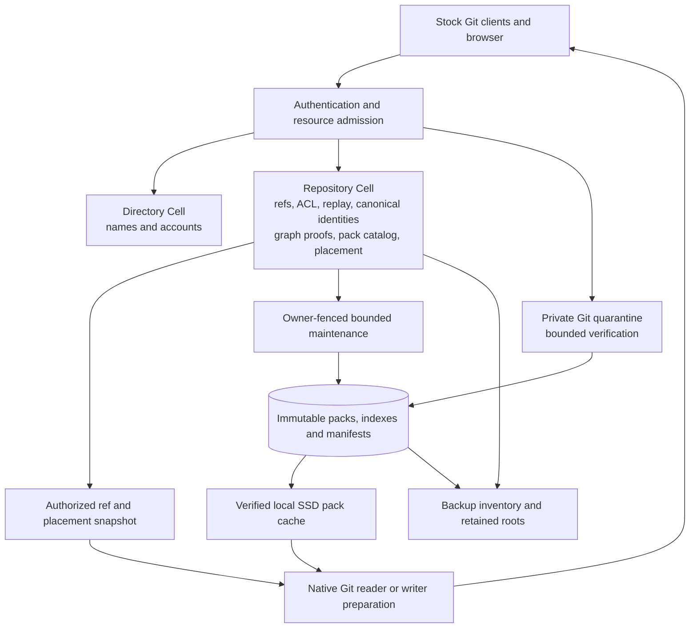

# Large repository research and implementation scope

Canopy should retain compressed Git packs in immutable object storage, keep repository authority in the Repository Cell, and serve Git from verified local SSD caches. The selected implementation now packs **all Git object kinds** and uses a hard cutover to fresh storage. It reuses canonical object, graph, ref, push and collaboration structures while removing legacy Git-body representations.

**Status:** Research inspected on 2026-09-30 against Canopy revision `9c5f1d1bf837fdc2e38ee229aa409712b9579f69` and Cellule `a3fbfb0115a1ae2519ee8f8e0cf6b8e72fdaa303`. Code observations below describe the initial inspection; concurrent working-tree cache and timeout changes are distinguished in the design. No new large-repository benchmark is claimed.

The [technical design](large-repository-storage-design.md) and [executable implementation plan](large-repository-implementation-plan.md) supersede this report's original blobs-first rollout and migration proposal. They specify the all-object verification boundary, schema, commands, cache synchronization, compaction, drained collection and fresh-format cutover. This report supplies host comparisons and architectural rationale. Historical engineering reports establish techniques, not a complete account of a vendor's current production architecture.

## What large repository support means

Repository size has several independent dimensions. A compressed pack size alone cannot predict the cost of hosting it.

| Dimension | Representative pressure | Canopy requirement |
| --- | --- | --- |
| Historical body volume | Many versions of similar source files | Preserve delta compression across versions |
| Object and edge count | Millions of blobs and trees; deep commit history | Bounded ingestion, graph certification, indexes and metadata recovery |
| Working tree width | Many tracked paths at one revision | Fast tree browsing; support client sparse checkout without claiming it solves server storage |
| Reference count | Branches, tags and review refs | Snapshot pagination and bounded advertisements |
| Read traffic | CI jobs cloning the same revision | Pack output reuse, coalescing, cache affinity and eventually multiple read hosts |
| Write traffic | Concurrent developers or agents | A short authoritative publication transaction; verification outside it |
| Fork population | Many repositories sharing history | Eventually share immutable artifacts with explicit retention across repositories |
| Recovery volume | A large Cell and many packs after disk loss | Metadata restoration plus bounded parallel pack downloads and hot-repository prewarming |

Qualify Kubernetes full history and selected release refs first, Linux mainline and stable histories separately next, then `chromium/src`. A Chromium development checkout is an additional multi-repository workload: its official instructions use `depot_tools` to obtain code and dependencies, offer `--no-history`, and describe a shared snapshot cache. Their build disk requirement is not the compressed size of `chromium/src`. [Chromium checkout instructions](https://chromium.googlesource.com/chromium/src/+/HEAD/docs/linux/build_instructions.md).

Use Chromium as the reproducible public proxy for the Chrome-sized case. No claim about private Chrome repositories or Google's private storage implementation follows from that corpus.

## Findings at the initial inspection

The following are implementation observations, rather than predictions of the proposed design's speed.

| Initially observed behavior | Evidence | Consequence |
| --- | --- | --- |
| `GitObjects` walks revisions and reads expanded bodies through a persistent `cat-file --batch` process | [git_objects.rs](../src/git_objects.rs), [gateway ingestion](../src/git_gateway.rs) | Ingestion already avoids a Git process per object, but still expands the body of every new object |
| Blobs up to 768 KiB are inline; larger blobs are external; oversized structural objects use SQLite chunks | [ObjectStorage](../src/lib.rs), [schema](../src/schema.sql) | Similar historical source versions lose pack delta compression when stored separately |
| Object writes admit at most 128 records, a 4 MiB command input and smaller body budgets | [object_batch.rs](../src/object_batch.rs) | Millions of objects mean many durable commands even after body bytes are removed |
| Hydration pages through new object headers and writes missing individual bodies; presence checks use loose paths | [hydration.rs](../src/git_gateway/hydration.rs), [git_cache.rs](../src/git_cache.rs) | An insertion cursor improves warm refresh, but cold recovery still reconstructs loose objects |
| SQL graph certificates and object edges protect ref publication | [graph preparation](../src/graph/preparation.rs), [graph.rs](../src/graph.rs) | Moving structural bodies immediately would change the existing verification contract |
| Native HTTP workers receive a 120-second operation deadline | [git_http.rs](../src/git_http.rs) | A legitimate large indexing or pack-generation job can fail before completion |
| Ancestry traversal stops beyond 100,000 discovered commits or 250,000 edges | [ancestry.rs](../src/ancestry.rs) | Hosting storage and large-history pull-request operations need separate qualification |
| Backup inventories understand external Git blobs and LFS bodies | [backup body inventory](../src/deployment/backup/bodies.rs) | Adding packs without extending that inventory would produce incomplete backups |

The existing [Kubernetes evaluation](kubernetes-qualification.md) reports a clean full-history corpus with 1,663,509 reachable objects, 141,666 commits and about 1.22 GiB of source packed storage. Its push failed with a native HTTP timeout before durable ingestion. A separate tree fixture pushed successfully but failed its clone; the precise clone failure cause remains unconfirmed. There is no passing large-repository recovery result.

A different local all-ref fixture inspected during the original storage investigation had about 1.8 million objects, 1.3 GiB packed, and 32 GiB of expanded bodies, of which about 31 GiB were blobs. It includes local test changes. The roughly 25-fold pack-to-logical difference is evidence that representation matters, not a measured 25-fold reduction in Canopy's database. SQLite, graph indexes, LTX history, backups and retired packs must be measured independently.

**Sizing inference:** importing 1,663,509 new objects with a 128-record maximum needs at least 12,997 object publication batches if all are represented individually. Byte limits, graph certification and other commands add work. At an illustrative sequential 10–30 ms per durable batch, object commands alone would consume roughly 130–390 seconds. Those latencies are assumptions, not measurements of Cellule or the provider. Measure actual publication cost before choosing batching changes.

## What other hosts teach us

### GitHub

GitHub's published Spokes design replicates at the Git application level, acknowledges updates through a quorum, and routes reads to synchronized replicas. That demonstrates the value of keeping Git computation near repository data and explicitly tracking replica freshness. [Stretching Spokes](https://github.blog/engineering/infrastructure/stretching-spokes/).

Its maintenance work combines multi-pack indexes, reverse indexes, multi-pack reachability bitmaps and geometric repacking to avoid continually rewriting the entire repository. These are upstream Git techniques Canopy can reuse. [Scaling monorepo maintenance](https://github.blog/open-source/git/scaling-monorepo-maintenance/).

**Recommendation:** borrow pack organization and indexes. Keep Cellule as Canopy's authority rather than adding a second quorum protocol around local Git refs. Durable SQL publication and local ref updates must not become competing commit points.

### GitLab

Gitaly provides a dedicated Git execution service; Praefect adds repository replication. GitLab's storage guidance makes local SSD requirements explicit. [Gitaly architecture and disk requirements](https://docs.gitlab.com/administration/gitaly/).

Gitaly's output cache deduplicates identical concurrent fetch computations across HTTP/SSH and clone/fetch variants. Unique requests gain little, and cached output can increase disk writes. This is a different cache from the repository's installed object packs. [Pack-objects cache](https://docs.gitlab.com/administration/gitaly/configure_gitaly/#pack-objects-cache).

GitLab also supports bundles on object storage/CDNs for bootstrap. [Bundle URIs](https://docs.gitlab.com/administration/gitaly/bundle_uris/). Its fork pools use Git alternates and require care when pruning shared objects. [Hashed object pools](https://docs.gitlab.com/administration/repository_storage_paths/#hashed-object-pools).

**Recommendation:** separate worker admission, installed-pack caching and generated-output caching. Defer fork pools until shared retention is proven. A filesystem alternates file alone cannot express Cellule recovery or access rights.

### Cursor Continuity and Origin

Cursor's August 2026 report describes packs recorded in an object-store WAL, publication through an atomic index update, and local NVMe Git repositories as caches. Read hosts check freshness before serving. Compaction is performed once and its packs are distributed to readers. These are vendor-reported mechanisms and results, without an independent benchmark here. [Git at any scale](https://cursor.com/blog/git-at-any-scale).

**Recommendation:** this is the closest architectural precedent for Canopy. Use immutable artifacts plus one authoritative publication path, and avoid recomputing the same repack on every read host. Cellule already supplies ownership, fencing, request outcomes and root publication; Canopy should use those instead of introducing an independent Git WAL authority. This comparison does not imply that Canopy currently has Continuity's performance or read scaling.

### Gerrit and JGit

Gerrit exposes bounded pack-window caching and separate repository-cache expiration. JGit's DFS configuration distinguishes block caching from delta-base caching. These controls illustrate that large packs need not all reside in application heap. [Gerrit core cache settings](https://gerrit-review.googlesource.com/Documentation/config-gerrit.html#core), [JGit configuration](https://github.com/eclipse-jgit/jgit/blob/master/Documentation/config-options.md).

**Recommendation:** distinguish disk cache, OS page cache, pack indexes and decoded-object memory. Retain native Git initially. These public interfaces do not establish the private production backend of Google's hosted Git service, and they do not justify writing a Rust remote delta engine now.

### Microsoft and Azure Repos

Microsoft's published scale work combines demand-driven object transfer, sparse working trees, nearby caches, commit graphs and incremental pack maintenance. The historical GVFS protocol is distinct from standard Git partial clone. [Scalar scale lessons](https://devblogs.microsoft.com/devops/introducing-scalar/), [GVFS architecture](https://learn.microsoft.com/en-us/previous-versions/azure/devops/all/git/gvfs-architecture?view=azure-devops-2020).

**Recommendation:** preserve stock Git partial clone, sparse checkout and protocol v2. Sparse indexes and filesystem monitoring primarily improve client work; they cannot compensate for expanding durable history on Canopy's server. A new required client or virtual filesystem would broaden this project unnecessarily.

### Bitbucket

Atlassian's 2021 Cloud engineering account describes caching generated packfiles to reduce repeated filesystem work for clones and fetches. It establishes a useful workload-specific optimization, not the complete current Bitbucket storage architecture. [Bitbucket performance account](https://www.atlassian.com/blog/bitbucket/extinguishing-our-performance-fires-and-rebuilding-for-the-future).

**Recommendation:** prioritize reusable output for CI bursts after installed packs and authority snapshots work correctly. Cache protocol pack output, not an entire response containing another client's negotiation, progress or ref advertisement.

### Kernel hosting and Chromium checkout

Linux's documentation bootstraps full history from a downloadable `clone.bundle`, then fetches current updates from the Git remote. This is a concrete example of moving bulk bootstrap away from repeated live pack generation. [Linux full-clone workflow](https://docs.kernel.org/admin-guide/quickly-build-trimmed-linux.html#downloading-the-sources-using-a-full-git-clone).

**Recommendation:** offer generated bundles for popular public repositories later. Keep the baseline stock smart HTTP/SSH path working, including clients that do not use bundles. Private bundle access requires its own authenticated delivery and revocation policy.

## Architecture options and the recommended choice

| Option | Storage and performance | Architectural cost | Decision |
| --- | --- | --- | --- |
| Current individual SQLite bodies | Simple transactional verification; loses cross-version delta compression | Large body traffic through SQLite/LTX and costly loose-object reconstruction | Baseline only |
| Per-object compression in SQLite | Reduces individual bodies; misses history deltas | Smaller change, but still replicates body pages | Diagnostic comparator |
| Pack chunks in SQLite | Preserves deltas | Pack maintenance still rewrites SQLite/LTX; native Git needs local materialization | Benchmark alternative if unified recovery proves substantially cheaper |
| Bare repositories authoritative on durable local volumes | Direct native Git access | Adds repository replica authority and recovery coordination beside Cellule | Poor fit for current ownership model |
| External immutable packs with SQL identity and placement | Preserves deltas and enables native file reuse | Requires verified manifests, placement versions and complete backup/retention | Recommended first architecture |
| All object kinds in packs, with smaller SQL metadata | Further reduces structural-body duplication and materialization | Requires trusted streaming structural verification; graph schema remains substantial | Selected for the fresh-format hard cutover |
| Individual Git objects in remote KV | Natural content addressing | Remote graph and delta dependencies can create many serial network reads | Reject as the default execution path |

The recommendation preserves one Repository Cell per UUID and one fenced writer. Scaling a busy repository's reads does not require sharding its authoritative refs or collaboration across Cells. Large uploads and verification can run outside the writer; their final publication remains serialized. Read computation can eventually scale across hosts with verified authority snapshots and reusable immutable packs.



Local refs are generated views of Cell refs. Incoming pack presence, object-store listings and Git's ability to find an OID establish neither publication nor permission. Packs can physically contain unpublished entries or hidden candidate objects; Canopy must continue to constrain exposure to its authorized reachability rules.

## Canopy implementation responsibilities

### Separate canonical identity from byte placement

Keep canonical identity immutable: repository hash format, OID, kind, logical length and independent body digest. Add a versioned packed location with artifact identity, preferred location version and a repository placement epoch. Maintain insertion sequence during compaction; the new format starts from fresh data. Ref generation changes only when refs change.

The existing batch treats representation as part of duplicate-object consistency. Introduce a new command/codec that distinguishes a conflicting canonical object from another valid copy of the same object. Replace old codecs in the new format; no compatibility decoder is retained.

Use the proposed pack catalog and operation journal in the [storage design](large-repository-storage-design.md#data-model). Inventory and location reads must be paginated and receipt-bound; no command or RPC should return millions of descriptors in one result. Compact binary metadata can avoid carrying blob bytes or large JSON maps through publication.

### Publish artifacts before refs

The proposed durable sequence is:

1. Admit and spool a request; authenticate; run native Git in an isolated quarantine.
2. Identify accepted ref changes and the quarantine's new objects. Capture packs or pack loose objects generated by small receives, merge and rebase.
3. Normalize thin packs against verified bases. A persisted pack must contain all of its delta bases, although its commits and trees may refer to objects in other published packs. Git supports thin-pack repair through `index-pack --stdin --fix-thin`. [Git index-pack](https://git-scm.com/docs/git-index-pack).
4. Verify artifacts, canonical objects, object format and structural closure under bounded CPU, disk and memory admission. Stream independent blob digests; do not materialize the whole pack's expanded contents in RAM.
5. Upload immutable parts and a complete manifest binding digests, lengths, format and index-to-pack identity. Bind trusted verification to the repository, operation and owner generation.
6. Stage identity/location records in bounded Cell commands and prepare graph certificates. Mixed packs are allowed; every object uses a packed location, and the trusted streaming verifier supplies structural edges for Cell closure checks.
7. Recheck ACL, branch policy and expected ref versions in the final Cell command. Publish the accepted refs and exact retry outcome through Cellule's durable root path.
8. Return success after authoritative publication. Warm-cache installation can follow and cannot turn a committed success into a rejection.

Preserve ordinary versus atomic push behavior. A failed or interrupted push may leave staged artifacts, but must not expose uncommitted refs. Retry reconciliation uses retained operation outcomes, rather than guessing from native Git's local success. SHA-1 and SHA-256 repositories both require the same lifecycle proof.

Stream every object kind through the same verifier. Generated objects produce small native packs too; there is no durable individual-body fallback. Git LFS retains its separate protocol identity and reuses the authenticated artifact transport.

### Reuse packs through one storage resolver

Introduce a Canopy-owned resolver for authorized object streams and native cache preparation. Browsing, patch preview, merge/rebase, HTTP and SSH must use it consistently. Cell queries return bounded descriptors; external reads happen outside the SQL command transaction.

Install complete verified pack/index pairs by atomic local publication and retain request pins through the lifetime of native descendants. Replace loose-path presence tests with a validated index inventory or persistent native batch checks. Coalesce concurrent downloads of the same artifact. Keep generated ref snapshots private while sharing immutable object files safely.

A warm fetch should refresh new inventory and reuse existing packs. It must not rehydrate every old blob, inspect every object row on every request, or recompress historical bodies. Keep local automatic GC disabled; managed maintenance constructs a new inventory rather than modifying files under live readers.

Cold individual file reads initially download the selected pack. That is acceptable as a documented prototype limitation, but can be very expensive for a small preview in a large pack. Measure it. Mitigations in order are prewarming hot repositories, a bounded decoded-object cache, smaller incremental packs, and pack-layout changes during maintenance. A custom remote range/delta reader is a later project requiring independently authenticated chunks and limits on delta-chain request amplification.

For exact `blob:none`, prepare structural pack coverage and retrieve explicitly requested blobs on demand. Incoming mixed packs can still amplify server-side cold transfer; partitioning structural objects and blobs during compaction mitigates that. Other supported filters need separate tests. Partial clone reduces client transfer; it does not automatically reduce server verification or cold pack-download work. [Git partial clone design](https://git-scm.com/docs/partial-clone).

### Maintain packs and indexes in the background

Use append-only packs on the foreground path and bounded geometric compaction afterward. Keep the largest old packs out of routine small-push maintenance. Pack-count and duplicate-byte triggers should come from measurements; the selected design starts with a 1 GiB output target and explicit physical-artifact/admission limits. [Git repack](https://git-scm.com/docs/git-repack).

Build native multi-pack indexes, reverse indexes, reachability bitmaps and split commit graphs against a complete declared local inventory. These are rebuildable accelerators and never ACL or closure authority. Their benefit and construction cost need benchmarking. A split commit graph accelerates native Git; it does not remove Canopy's SQL ancestry limits. [Git multi-pack index](https://git-scm.com/docs/git-multi-pack-index), [Git commit graph](https://git-scm.com/docs/git-commit-graph).

The qualified Git baseline is 2.50.1. Current online manuals include newer features, such as MIDX compaction formats requiring Git 2.54. Pin and test the actual command/version combinations; do not copy the latest manual's options into that baseline. [MIDX format compatibility](https://git-scm.com/docs/git-multi-pack-index).

Compaction selects a fixed inventory, creates and verifies replacement packs, then switches preferred locations with version checks in bounded batches. Concurrent pushes remain outside that inventory. One owner produces durable replacements; future read hosts install those outputs rather than repeating compression. Ref generation and canonical identities remain stable through representation changes.

Local process pins alone cannot protect remotely read artifacts or backups. Conservative retention is sufficient for a prototype. A sustained storage-efficiency release also needs a deletion proof covering active locations, ongoing operations, candidates, readers, retained recovery roots, backups and retained recovery roots. The selected first-release deletion mechanism is a proven deployment maintenance drain, not an online grace-period collector. Git cruft packs can inspire local unreachable-object handling but do not supply that cross-system proof. [GitHub garbage collection work](https://github.blog/engineering/architecture-optimization/scaling-gits-garbage-collection/).

### Treat CI output reuse as a separate optimization

After correct installed-pack reuse, cache generated pack output for repeated equivalent fetches. A proposed cache identity includes repository UUID, authorized advertised-ref snapshot, normalized wants/haves, shallow boundaries, filter, relevant pack options and Git version. Authorization is checked on every request; use no cross-repository sharing initially. Protocol-specific framing remains per request.

Coalesce equivalent active computations as well as completed cache hits. Limit output bytes, lifetime and producer concurrency. A cache that writes every unique multi-gigabyte response can increase I/O and disk pressure; measure hit ratio and generated bytes before making it default. Public bundle/CDN bootstrap is a subsequent option, with explicit opt-in or negotiated capability and a normal fetch fallback.

### Scope fork sharing after repository isolation works

For heavily forked projects, repeated baseline history can eventually outweigh per-repository pack improvements. A later design can share immutable baseline packs within an authorized fork family while keeping each repository's refs, ACLs and additional packs in its own Cell. Treat the shared inventory as a separately retained durable resource, with explicit dependencies from member Cells and backups. Git alternates can be a local cache mechanism, but cannot be the durable sharing contract.

This extension needs recovery after upstream deletion, fork detachment, visibility changes, independent backups and concurrent collection. Do not use one mutable reference counter updated independently across several Cells as the sole deletion proof. Compare retained bytes across an entire fork family before adopting sharing; it adds coordination that is unnecessary for the first standalone Kubernetes or Linux storage proof.

## Cellule implementation responsibilities

Inspection used the pinned source in Cargo's checkout, rather than assuming the earlier [composed primitives proposal](repository-cell-primitives.md) reflects the current dependency. That proposal cites `a28de7b`; Canopy currently pins `a3fbfb0`. The relevant exclusive-role restriction still exists in the inspected revision.

| Area in pinned Cellule | Observed contract | Scope for this work |
| --- | --- | --- |
| `cellule-ltx/docs/publication.md` and runtime `publication/mod.rs` | Immutable root dependencies are prepared; runtime control CAS establishes authority; pending outcomes are confirmed afterward | Reuse this commit point; do not add a Canopy WAL head as independent authority |
| Runtime `cell/catalog/mod.rs` | A catalog entry declares one `CatalogRole` | Repository SQL plus same-Cell Blob/Queue/Workflow is not a configuration toggle |
| Runtime `primitives/blob/api/mod.rs` | Blob client requires Blob role and routes by key shard | Existing namespace clients do not automatically bind artifacts to the repository Cell |
| Runtime `primitives/blob/mod.rs` | Blob upload parts are at most 256 KiB; reads are bounded | Stream and batch pack-sized artifacts through an appropriate API; avoid enormous command payloads |
| Runtime `primitives/maintenance.rs` | Primitive work inspection is conditional on exclusive role | Composed capabilities need complete inspection during transfer, recovery and code retirement |

**Selected sequencing:** the implementation keeps SQL Repository Cells and store immutable artifacts through Canopy's existing external-body pattern. It does not need to wait for full same-Cell primitive composition. Canopy's SQL inventory and backup extension must then explicitly account for those external artifacts, as they already do for Git/LFS bodies.

Cellule's required changes remain Git-agnostic: expose the runtime-admitted owner fence to command handlers, and provide complete paginated retained-root inventory for the drained collector. Reuse existing control, pin, receipt and root types. The detailed API and acceptance tests are in implementation packages B and J.

Measure publication/restore cost and admission fairness using larger bounded metadata commands first. General same-Cell capability composition, queues and workflows remain independent work; they are not prerequisites for this storage release. Canopy's supervised worker and durable pack-operation records handle restart/takeover discovery.

**Part-count inference:** a 1 GiB pack divided into 256 KiB parts needs 4,096 parts; at Canopy's current external-body 8 MiB granularity it needs 128. This is 32 times as many parts, not necessarily 32 times the total request cost. Benchmark upload batching, metadata, concurrency and provider requests before adopting the current generic Blob primitive unchanged.

Cellule should own fencing, transactions, receipts, root publication, scheduling foundations and generic resource admission. Canopy should own pack verification, Git graph policy, native caches, ref exposure, maintenance selection and protocol behavior. Keep Git commands and OIDs out of the generic runtime API.

## Recovery and consistency requirements

A read host must obtain a valid Cellule serving capability and a selected ref snapshot, satisfy any minimum receipt, then install the required placement inventory. A pack cache hit cannot substitute for authority freshness. If the snapshot requires an unavailable or corrupt artifact, fail explicitly or recover it; never silently serve an older successful branch state.

Restore metadata first, then obtain packs from its committed catalog. Metadata readiness and full Git readiness should be observable separately. Bound concurrent restore/download work and give hot repositories preference so a cold storm cannot consume all foreground slots.

Extend pinned backup enumeration to include complete pack/index manifests and every required part, alongside canonical/graph metadata, LFS and collaboration. Verify restoration in an isolated prefix with access to the original artifacts revoked. A backup that restores refs but cannot clone their objects fails this gate.

The selected release uses a fresh format/prefix, application identity and local data directory. It has no populated legacy migration or dual-read phase. Optional ordinary Git/LFS import preserves repository content, not old hosting metadata. Format checks reject incompatible service, backup and restore roots before writes.

## Delivery scope and acceptance gates

The [implementation plan](large-repository-implementation-plan.md) is the authoritative breakdown: format/metrics, Cellule fence, artifact transport, metadata/closure commands, streaming verifier, all producers, all readers, product/ancestry, compaction, backup/retained roots, drained collection, and corpus/provider qualification. Each package names files, interfaces, tests and review deliverables.

A small fresh-format vertical slice proves storage plumbing, not Kubernetes/Linux support. Those claims require their full-history workloads, owner-loss and source-independent backup recovery, plus measured retention. Chromium additionally requires `chromium/src` qualification; packing every object kind does not eliminate graph-index, SQL/LTX or native-worker scaling limits.

Measure canonical metadata and graph bytes before considering compact graph projections or repository sharding. One Repository Cell remains the selected authority. Sharding adds distributed coordination for refs, policy and reachability and is not part of the chosen solution.

## Measurements and proposed performance gates

Run the existing [large repository benchmark](../scripts/benchmark_large_repository.py) and extend its reports. Do not automatically download the entire Chromium development checkout to assess `src` hosting. Record source refs/OIDs, clean versus synthetic fixture status, object-format and count by kind, logical bodies, pack inventory, Git version, provider and host limits.

Measure independent components:

```text
live durable bytes = current packs/indexes/manifests
                   + SQL canonical/graph metadata and indexes
                   + necessary Cell recovery artifacts + legacy bodies

total retained bytes = live durable bytes + staging + retired generations
                     + backup generations + orphaned artifacts

peak local disk = SQLite/WAL + pinned pack caches + input spool/quarantine
                + verification/download scratch + compaction outputs
                + generated output cache + concurrent requests

operation time = admission/queue + network spool + native Git
               + verification + metadata/graph commands
               + durable publication + cache/pack output
```

Report provider PUT/GET/range/CAS calls, bytes and retry rates alongside CPU, process-tree/cgroup memory, page cache, descriptors and peak filesystem use. Separate foreground and maintenance work. Log repository/operation IDs for diagnosis; avoid unbounded repository/OID metric labels.

| Proposed gate | Measurement and interpretation |
| --- | --- |
| Correct large hosting | Initial import, v0/v2 full clone, filtered/shallow clone, incremental push, strict full `fsck`, exact refs and independent body checks |
| Packed body efficiency | After compaction, pack/index body artifacts at most 2 times a native packed baseline for identical object inventory and resource policy; report SQLite and retained bytes separately |
| No durable raw Git-body growth | Count representation bytes and detect producer paths falling back to inline bodies |
| Incremental work | A one-file commit neither reconstructs historical blobs nor rewrites the full repository; account for thin-pack bases and graph work explicitly |
| Warm service parity | Selected initial threshold: warm incremental fetch p95 within 25% of matched bare Git at equal concurrency; clone times and Canopy overhead reported separately |
| Small operation isolation | Proposed initial threshold: metadata/tree p95 within 2 times unloaded baseline during an admitted large import or compaction, with explicit queue/rejection rates |
| Recovery | Published objects recover after process death, owner takeover, fresh disk and isolated backup restore; measure metadata and clone readiness separately |
| Retention | Repeated incremental pushes and compactions reach a stated bounded retained-byte envelope after proven drained collection and the declared backup/root retention policy |
| Density alongside large repositories | Repeat small-repository density tests while one hot large repository receives bounded traffic; include cold activation and fairness |

All numeric gates are proposed comparisons. Select absolute import, preview, incremental-push and recovery objectives after the baseline package on the intended bounded Linux/provider profile. The current large baseline fails, so use stage comparisons and native Git as references instead of calculating speedups from nonexistent successful Canopy runs. No expected kernel/Chromium capacity number is asserted here.

Test failures at artifact upload, manifest publication, metadata staging, final ref publication, cache installation and compaction switches. Include client disconnects, disk exhaustion, corrupt parts/indexes, missing bases, provider outage, stale owners, ACL revocation, hidden candidate objects, backup overlap and old readers. An acknowledged push must survive every later cache failure.

## Recommended next implementation

Execute packages A–F of the [implementation plan](large-repository-implementation-plan.md) to establish the fresh-format authority boundary and first packed publication path. Then complete all readers/product semantics, compaction, source-independent recovery and drained collection before the large-corpus release gate.

The [executable schema and native Git checks](large-repository-storage-design.md#validation-delivered-with-this-design) validate the chosen building blocks. Bulk metadata publication, graph processing, cold transfer and SQLite/LTX overhead remain measured engineering risks; compression alone is not a claim of Linux or Chromium performance.
