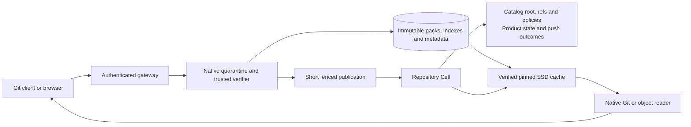

# Canopy packed repository technical design

**Status: implementation specification, not implemented or capacity-qualified.** This is the selected design for a hard cutover to a fresh deployment format. It supersedes the earlier hybrid blob-pack proposal. The companion [implementation plan](large-repository-implementation-plan.md) defines deliverables and release gates; the [research report](large-repository-research-and-scope.md) supplies host comparisons and primary sources.

**Large-team amendment:** [Large-team scalability requirements](large-team-scalability.md) takes precedence for the >10,000-engineer workload. It replaces per-object mutable Cell metadata and placement with certified immutable metadata segments/catalogs, requires concurrent preparation and independent read workers, and replaces globally drained normal deletion with fenced generation retention. The DDL below remains an earlier design fixture and is not the release schema for that workload.

Store **every Git object in immutable native packs** and bulk canonical metadata/typed graph facts in certified immutable segments. The Repository Cell stores the selected catalog root, refs, authorization, collaboration and push outcomes. Serve native Git and browser reads through verified disposable local caches. Reuse Git's pack/index formats, Canopy's canonical fields, graph meanings and product tables, its hashed-part artifact transport, and Cellule's SQL publication and fencing. There is one Git object representation in the new format.

There is no legacy reader, online migration, dual write, binary downgrade or transitional `ObjectStorage` enum. A deployment starts in a fresh prefix with a new application identity and empty local data directory. Existing deployments are not modified by this design document. Importing a Git mirror is supported as a new repository import; preserving old collaboration state is outside this cutover.

## Decisions and boundaries

| Concern | Selected implementation |
| --- | --- |
| Durable Git bytes | Self-contained `.pack` and v2 `.idx`, immutable object-store artifacts; both SHA-1 and SHA-256 repositories |
| Canonical metadata | Reuse canonical `objects` fields and typed edges in immutable SQLite shards; mutable Cell stores catalog roots/certificates |
| Physical placement | Leveled immutable OID directory selects a certified metadata/pack descriptor; native indexes retain offsets |
| Graph authority | Reuse typed edge, ordered parent, closure and ancestry meanings; trusted verifier certifies canonical facts against pinned catalog generations |
| Publication | Concurrent private preparation, short fenced catalog/ref CAS, existing policy checks, `pushes` and durable responses |
| Transport | Generalize the existing `CANOPY02` hashed-part manifest and upload helper for packs, indexes and LFS |
| Native execution | Stock Git in private request workspaces with pinned immutable object-cache generations |
| Maintenance | Geometric compaction and repository-generation retention; fenced online deletion after all recovery/backup/reader roots release it |
| Cellule work | Expose admitted owner fence to commands; expose complete retained recovery-root inventory for collection |
| Excluded | Cross-repository deduplication, custom delta decoder, remote pack range execution, required custom client and logical unreachable-object pruning |

Mixed packs are valid. During compaction, partition selected objects into structural objects and blobs before packing; this uses the same pack format and tables, improves structural-history cache locality, and avoids a separate structural-body representation. Incoming mixed packs need not be rewritten on every push.

Kubernetes and Linux exercise history and graph scale. Qualify `chromium/src` as the public Chrome-sized repository corpus; a complete Chromium checkout adds dependency repositories and is a separate workload. Existing local measurements do not establish current upstream sizes or Canopy capacity.

## Architecture and trust



The Cell remains the authority for publication, but **structural byte verification moves out of the synchronous SQL command**. Native Git verifies pack decoding and object hashes; a trusted Canopy verifier independently streams canonical hashes, BLAKE3 body digests and typed edges. Cell commands accept the resulting metadata only through the enrolled internal node boundary. The existing signed `/internal/cell` transport and release identity are reused. These are server attestations, not cryptographic proofs that a SQL command can validate against remote bytes.

Public APIs must not accept a caller-supplied “verified” inventory, artifact path or graph certificate. The pack worker receives repository-scoped authorization from Canopy, never an object-store prefix from client JSON. Generic internal SQL remains privileged; HTTP, SSH and product API handlers may not expose it. A compromised enrolled node is already inside this trust boundary. The new boundary must be recorded in the persisted contract and covered by forgery tests.

Native pack presence never authorizes an object read. Preserve the existing ref-snapshot, reachability and hidden-ref checks, including explicit `want` validation and partial-clone requests. Extra physical entries from thin-pack completion or compaction remain inaccessible unless the request is authorized to retrieve them.

### Code baseline

This design was prepared against Canopy HEAD `9c5f1d1bf837fdc2e38ee229aa409712b9579f69`, pinned Cellule `a3fbfb0115a1ae2519ee8f8e0cf6b8e72fdaa303`, and the current working tree. The working tree already contains native cache pack retention, background cache repacking and an HTTP worker deadline of 3,600 seconds. An `object_pending` queue also appeared during the concurrent evaluation work; the supplied DDL defines the required queue whether or not that optimization remains in the checkout. Preserve and adapt that work. It does not yet make packs durable. The historical Kubernetes result used a 120-second deadline; do not confuse that result with current code.

## Earlier per-object data model fixture

The model and per-object command protocols below predate the large-team amendment. They preserve detailed canonical, graph, ref and artifact invariants for review, but their mutable per-object Cell tables, placement-switch commands and drained normal collection are superseded. Implement the amendment's catalog/segment architecture directly in the fresh deployment format.

The executable [proposed DDL](design/packed-repository-schema.sql) replaces only Git storage, graph queue, refs and generation definitions. The [schema checker](design/check_packed_repository_schema.py) composes it with the unchanged product tables in `crates/canopy-server/src/schema.sql`. It is a design artifact, not a runtime migration. SQL constraints enforce local shape and selected invariants; typed commands enforce the cross-record invariants below.

| Structure | Reuse or change |
| --- | --- |
| `objects` | Preserve stable `sequence`, unique `oid`, `kind`, logical `size`, BLAKE3 `digest`. Add preferred `pack_id`, monotonic `location_version`, `edge_count`, `edge_digest`. Remove `storage`, `body`, `external_sha256`, `chunk_id` |
| `object_uploads`, `object_chunks` | Remove. Push-response and certificate chunks are unrelated and remain |
| `packs` | New artifact descriptor, owning operation, native checksum, pack/index lengths and digests, staged inventory cursor, state, immutable `sealed_generation` |
| `pack_operations` | New resumable ingest/compaction identity, owner fence, attempt counter, state and timestamps |
| `pack_operation_inputs` | New fixed pack-ID set for a compaction; prevents selecting a moving input inventory |
| `object_edges` | Preserve `(parent, child)` identity; add expected child kind and retry-safe `waiting` flag |
| `object_pending` | Reuse the evaluated queue shape, adding edge-stream cursor/digest, remaining-child count and completion flag |
| `object_closure`, `commit_parents`, `commit_ancestry` | Reuse meanings and identifiers. Closure remains an immutable canonical-object fact |
| `ref_generation` | Reuse singleton; add `pack_generation` for sealed artifacts/location changes. Ref generation still changes only for ref/product semantics |
| Refs, pushes, ACLs, issues, checks, pulls, LFS | Reuse existing structures; no parallel product schema |

A pack is self-contained for **delta bases**, not necessarily for commit/tree dependencies. An object may refer to a parent commit or subtree in another pack. Normalize thin packs before publication. No preferred location can depend on loose cache files or a disposable alternate for delta reconstruction.

Canonical identity is `(object format, OID, kind, size, body BLAKE3, edge count, edge digest)`. Matching duplicate OIDs keep their existing preferred location during ingestion. Any mismatch rejects the entire metadata batch. Compaction changes only `pack_id` and `location_version`; sequence, canonical identity and closure survive unchanged. Native indexes contain offsets, CRCs and delta lookup information; do not duplicate them in SQL.

### Artifact layout and integrity

Use repository-scoped paths derived exclusively from validated IDs:

```text
repos/<repository-uuid>/git-packs/<creating-operation-uuid>/<pack-blake3-hex>/pack
repos/<repository-uuid>/git-packs/<creating-operation-uuid>/<pack-blake3-hex>/index/<index-blake3-hex>
repos/<repository-uuid>/git-packs/<creating-operation-uuid>/<pack-blake3-hex>/metadata/<metadata-blake3-hex>
<artifact-path>.parts/<16-digit-hex-part-number>
```

The creating operation UUID is immutable even when its owner/attempt changes. Including this existing ID in the path prevents a delayed delete from an old collector from deleting a later identical upload: after retirement, a path can never become a new preferred location again. A new upload after deletion uses a new operation UUID and pack ID. Both `pack` and `index/<digest>` are manifests, not raw file bodies. Reuse the existing `CANOPY02` encoding: 8-byte magic, little-endian u64 total length, then one 32-byte BLAKE3 digest per 8 MiB part. Count is `max(1, ceil(size / 8 MiB))`; reject any extra/truncated manifest bytes. Bound count to 65,536: one physical artifact is at most 512 GiB and its manifest at most 2,097,168 bytes. This is an explicit artifact limit, not an advertised repository capacity. Larger inputs must be normalized into admitted packs or rejected with a resource-limit error before publication. Normal pack target is 1 GiB; Git can exceed its target for a single large object.

Generalize `publish_lfs` into `publish_hashed` and share `ArtifactDescriptor { size, digest, manifest_digest }`. LFS keeps its SHA-256 protocol identity and hashed manifests. Remove `CANOPY01` Git-body code in the cutover; retaining the LFS encoding is reuse, not a legacy Git reader.

The SQL descriptor pins complete-file BLAKE3, manifest BLAKE3, length and native pack checksum. The index descriptor independently pins index bytes and its associated pack checksum. Verify each part, the concatenated file and Git's native checksums. A native SHA-1 trailer alone is insufficient as the artifact integrity boundary. Conditional-create collisions require reading and verifying the existing content; the current helper's `AlreadyExists` success shortcut must be tightened. A complete manifest is published last, after all parts are confirmed. Incomplete uploads confer no publication rights.

The pack header count is bounded by Git's u32 format. All size arithmetic uses checked conversions; SQLite integers are signed. No SQL part table is needed because the authenticated manifest already inventories parts.

### Inventory encoding

Use fixed canonical encodings for the verifier and command implementation. The following is normative; implement golden vectors for SHA-1 and SHA-256.

- Kind codes: blob=1, tree=2, commit=3, tag=4. Integers below are unsigned little-endian u64. OID width comes from the repository format; do not pad a SHA-1 OID.
- Edge record: `child_oid || expected_kind:u8`. Deduplicate by child OID; a conflicting required kind rejects the object. Sort by raw OID bytes. Gitlinks are excluded, matching existing graph semantics.
- Edge seed: `BLAKE3("canopy.edges.v1\0" || oid_width:u8 || parent_oid)`.
- Fold each edge as `BLAKE3(previous_digest || ordinal:u64 || edge_record)`, with ordinal starting at zero. Final count plus digest bind the complete edge stream.
- Header record: `oid || kind:u8 || size:u64 || body_digest:32 || edge_count:u64 || edge_digest:32`.
- Pack seed: `BLAKE3("canopy.inventory.v1\0" || oid_width:u8 || pack_digest:32)`.
- Fold headers with the same ordinal rule, ordered strictly by raw OID bytes. The final digest and count must match the registered descriptor. Include every physical pack entry, including canonical duplicates.

`body_digest` is BLAKE3 of the decoded body; OID is Git's repository hash of `kind + " " + decimal_size + NUL + body`. Hash chains bind completeness and order within a trusted attestation. They do not independently prove that the verifier interpreted bytes correctly.

## Interfaces and command boundaries

Replace `StoredObject` body transport with the shared metadata types below. Reuse `ObjectId`, `ObjectFormat`, `ObjectKind`, request IDs and the existing bounded codec.

```rust
struct ArtifactDescriptor { size: u64, digest: [u8; 32], manifest_digest: [u8; 32] }
struct ObjectHeader {
    oid: ObjectId, kind: ObjectKind, size: u64, digest: [u8; 32],
    edge_count: u64, edge_digest: [u8; 32],
}
struct PackLocation { pack_id: i64, creating_operation: RequestId, location_version: u64,
                      pack: ArtifactDescriptor,
                      index: ArtifactDescriptor, git_checksum: ObjectId }
struct OperationToken { id: RequestId, fence: OwnerFence, attempt: u64 }
// Service-layer interface, outside SQL handlers; exact Rust ownership/lifetimes follow project conventions.
trait GitObjectReader {
    async fn resolve(&self, oid: ObjectId) -> Result<(ObjectHeader, PackLocation)>;
    async fn open_verified(&self, oid: ObjectId) -> Result<ObjectStream>;
    async fn prepare_native(&self, snapshot: RefSnapshot) -> Result<PinnedGitCache>;
}
```

The source tree has no `OwnerFence` accessor on `CommandContext` today. Add a small Cellule API returning the runtime-admitted `(incarnation, epoch)` from its existing control authority. Thread that value through command execution and any replay context; never derive it from caller input or logical time. `BeginOperation` returns it. Every worker mutation compares its token with both the current admitted fence and stored operation token. Claiming an interrupted operation increments `attempt` and binds the current fence. Old attempts cannot continue staging or switch locations even when their commands are routed to the replacement owner.

Keep existing command IDs where responsibilities remain. New-format codec registration supports only the selected codec; no adapters are retained.

| ID | Command and codec | Contract |
| --- | --- | --- |
| 5 | `PutObjects`, codec 5 | Metadata headers only. Token, pack ID, expected ordinal/digest, up to 2,048 sorted headers. Verify identities, insert new objects/pending rows, advance pack cursor atomically |
| 6 | `CertifyObjects`, codec 4 | Tagged actions `StageEdges`, `CloseEdges`, `AdvanceClosure`; bounded as described below |
| 7 | Existing `CertifyAncestry`, codec 2 | Reuse validated parent-path certificates; change service-side traversal, not proof meaning |
| 20 | `PackOperation`, codec 1 | Tagged `Begin`, `Claim`, `Register`, `Seal`, `Ready`, `Complete`, `Retire`; each has the same token rules |
| 21 | `SwitchPackLocations`, codec 1 | Up to 512 `(oid, expected_pack, expected_version, output_pack)` CAS entries; canonical output inventory must have been verified |
| 22 | `CollectPack`, codec 1 | Maintenance-only mark/delete-receipt actions bound to a verified drained collection session |
| 3, 4, 8–10 | Existing ref/push/policy/candidate commands | Retain current responsibilities; update only dependencies on object body/storage checks, bump codec only if wire input changes |

`Register` accepts two artifact descriptors, checksum, format, object count and inventory digest after upload/readback verification. It creates a staging pack with seed digest. Duplicate live-artifact registration succeeds only for an identical descriptor, and returns the existing operation identity; a caller must finish or claim that operation rather than silently replacing ownership. `Seal` requires all headers, matching inventory chain and count; it atomically increments `pack_generation`, records `sealed_generation` and transitions the pack to sealed. `Ready` requires every output pack of the operation sealed. After that, no output packs may be added. `Complete` requires no unresolved new graph work for ingest, or finished location switches for compaction. A compact `Begin` includes its entire at-most-32-pack input set in the same transaction; require each input sealed and reject another unfinished compaction for the repository. The set is immutable afterward, so there is no separate input-selection cursor. A deleted pack is an audit tombstone excluded from live-digest uniqueness; a later identical upload receives a new pack ID and seal generation, never revives an old ID.

Use a 1 MiB input limit for new metadata commands and small receipt outputs. Every command is one Cell transaction, but internally uses multi-row SQL in blocks of at most 256 inserted rows and reads at most 512 rows per `context.sql` call. The pinned Cellule SQL API limits a batch to 128 statements, results to 1,000 rows and a statement to 32,766 parameters. It does not require one durable invocation per object. Do not request 2,048 result rows in one generic SQL call. Reject over-limit input before mutation.

Each state-changing command uses the existing durable request-ID outcome mechanism. A transport retry reuses the identical request ID and bytes. New request IDs with stale expected cursor/digest return `CursorConflict` and the caller queries progress. Commands either commit the whole batch or reject it. After takeover, the new attempt re-verifies artifacts and resumes at committed cursors, issuing new request IDs.

Errors are typed: `FenceMismatch`, `CursorConflict`, `IdentityConflict`, `InvalidArtifact`, `MissingDependency`, `WrongObjectKind`, `UncertifiedGraph`, `ResourceExhausted`, `UnsupportedFormat`. Uncertain transport outcomes are replayed, not translated into definitive push rejection. Map new internal errors into existing Git/HTTP error handling without exposing storage credentials or paths.

## Ingestion and verification

1. Authenticate, capture existing policy/ref state and admit CPU, disk and transfer work. Begin the ingest operation to capture its fence/attempt and immutable artifact namespace, then create a private native request repository using the existing isolated environment. Keep published cache generations pinned for base lookup.
2. Run receive-pack and preserve its accepted ref plan, hooks and atomic-push semantics. Inspect only files created in this request's private object directory. Do not scan a shared mutable pack directory to infer the incoming pack.
3. Retain valid incoming packs when self-contained. Complete thin packs with native `index-pack --stdin --fix-thin`; materialize loose outputs using `pack-objects`. Normalize over-size artifacts within admission limits. Validate the resulting pack/index pair in an isolated object directory with no alternates to prove delta independence.
4. Stream every physical object using persistent native batch processes. Independently hash its canonical OID and body BLAKE3. Stream-parse tree entries and commit/tag headers using existing parsing rules; do not allocate the full tree, blob or commit message. Spool headers and typed edges into a temporary on-disk SQLite database for sorting/deduplication. Index that scratch database by `(pack, oid)` and `(parent, child)`. Bound its cache and account for its disk bytes.
5. For a known OID, still verify physical bytes and compare canonical identity. A cache hit or duplicate pack OID does not bypass corruption/collision detection. Reject duplicate physical OIDs within one pack if inventory enumeration is ambiguous.
6. Upload and verify pack/index artifacts under that operation namespace. Register the descriptors and stage all headers for all its output packs before staging any edges. A graph dependency may resolve to another new object in this operation or an already certified existing object. A dependency on an unrelated unfinished operation returns a retryable dependency error; resume that operation instead of stealing its objects.
7. Seal all output packs, mark operation ready, stream edges, then run bounded closure propagation. Publish no requested ref until its tip is certified. Finish ingest metadata even if final ref CAS or policy rejects the push, so a failed push cannot permanently strand an OID in an incomplete representation.
8. Call existing completion logic. In its transaction, recheck current authorization, branch policy, expected OIDs/versions, closure and required candidate/check certificates. Commit refs, ref generation and durable wire response together. Artifact upload or local receive-pack success is not the commit point.
9. Return the committed response. Cache installation is best effort after commitment; a cache failure must not turn an acknowledged push into rejection.

Operations interrupted after header publication are recovered by re-reading their authenticated artifacts and completing metadata/closure. The source pack contains the information required to rebuild a lost verifier spool. A terminal invalid pack discovered on recovery is an integrity incident and blocks affected publication; do not skip it. Before any headers were committed, an unused upload can be removed during drained orphan collection. Orphans do not become roots just because they appear in object-store listing.

All producers use this pipeline: network pushes, mirror imports, web-created files, merge commits, squash and rebase candidates. For small generated objects, accumulate a bounded private batch and produce a small native pack; do not reintroduce a durable inline fallback.

### Bounded graph closure

Graph preparation must handle a single very wide tree and a blob referenced by millions of trees without a large transaction or in-memory reverse-edge list.

1. Inserting a new header creates `object_pending` with zero counters and the edge seed. For a zero-edge object, `CloseEdges` still validates the seed/count before marking complete.
2. `StageEdges` accepts one parent's next at-most-2,048 sorted edges, expected received count and digest. Validate each child exists, has the required kind, and belongs to this operation or is already certified. Reject repeated/conflicting children. Insert each edge with `waiting=1` exactly when the child is not yet in `object_closure`. Increment `received_edges`, fold the chain, update `last_child`, and increase `remaining_children` only for newly inserted waiting edges.
3. `CloseEdges` compares received count and chain with the immutable header. Mark complete only on equality. For a commit-to-commit edge, populate the existing `commit_parents` projection. This projection is unordered; never use it as proof of parent order.
4. `AdvanceClosure` certifies at most 512 ready objects whose edge stream is complete, remaining-child count is zero and preferred pack is sealed. Insert closure idempotently. Keep the pending row while reverse propagation is unfinished.
5. For certified children still pending, process at most 2,048 waiting reverse edges per command using `object_edges_by_child`. Conditional `waiting=1 -> 0` updates and matching parent-counter decrements occur in the same transaction. Retry cannot decrement twice. Delete a child's pending row only after no waiting reverse edges remain.
6. An edge inserted after its child was certified starts with `waiting=0`; it never relies on an already-finished reverse-edge cursor. This closes the late-parent race. Missing or cyclic graphs cannot reach closure and cannot publish refs. Report unresolved graph work when no progress remains after all streams close.

Command handlers verify pending `(sequence, oid)` matches the same object, edge count never exceeds the header, counters never underflow, and only the creating/claimed operation stages that object's edges. Pack and object metadata cannot be changed by graph processing. These semantic checks supplement the executable DDL.

## Reads and caches

`GitObjectReader` is the common service-layer path for Git, browsing, raw files, diffs, archive generation and merge preparation. Cell commands do not perform object-store or native-process I/O. `crates/canopy-server/src/git_read/mod.rs` receives the resolver instead of reading SQL bodies; keep API response-size and tree-pagination limits as explicit product limits, independent of streaming storage limits.

Resolve an object only after authorization and canonical publication checks. Fetch its descriptor from the Cell, install both pack and index under disk admission, verify them, then use a persistent `cat-file` reader. Streaming callers avoid a body-sized allocation. Callers asking for a bounded preview retain that explicit limit. Missing/corrupt artifacts fail closed; a different local object of the same OID is not an unverified repair source.

The current pack-aware cache uses a heap `HashSet` of every indexed OID. Replace that inventory with native `.idx`/MIDX lookup or a persistent batched native presence process. A million-object repository must not acquire an additional Rust heap copy of its full OID set on every node/request. OS page cache, mmap/index residency and native process memory still count in resource metrics.

### Cache synchronization without a new authority

A ref snapshot captures existing ref versions, a maximum object sequence `S`, and pack generation `G` in one Cell read. Every referenced tip must already have closure. Object insertion is allowed only into staging packs; all headers precede seal.

For a cold full cache, keyset-page `objects` through sequence `S`, resolving preferred descriptors of sealed packs (including a location captured before retirement). Deduplicate pack IDs in bounded disk-backed scratch, not a whole-repository heap set. Ignore staging placements: they cannot be needed by the captured refs. Concurrent location moves are safe because each returned pack remains physically available until drained collection. Mixed old/new locations are acceptable; this is an availability inventory, not an authority snapshot.

For warm refresh from generation `G`, install sealed packs with `sealed_generation > G` up to the new snapshot generation, in pages of 512. This covers newly publishable objects even when their headers were inserted long before certification. Do not use object sequence alone as the warm cursor: an older pending object can become certified later. Compaction location changes do not invalidate previously installed canonical bytes. A cold cache may already include a newer location; repeated installation is idempotent.

A generation records its coverage and ref snapshot separately. Only mark coverage complete after all required transfers succeed. Native refs in each private request workspace reflect the captured authorized snapshot, not a concurrently mutable shared ref directory. MIDX and commit-graph files belong to that immutable generation. Installation builds a private directory and atomically exposes the complete pack/index inventory. Cache generation `Arc` pins live until all child processes exit. Eviction cannot unlink an in-use generation.

For a filtered cold cache, enumerate all required structural objects through the same sequence boundary. Its coverage is explicitly structural-only; never mark it as full. Physical mixed packs may bring extra blob bytes into server cache even for `blob:none`. Before later unrestricted use, install missing blob-bearing packs or perform a full cold inventory. Native commit-graph, MIDX, bitmaps, sparse checkout and filter support are accelerators or protocol facilities; none replaces authorization.

Initial cold reads download whole selected packs. This deliberately avoids a new remote delta engine. Measure cold one-file read amplification. Structural/blob partitioning during compaction and smaller incremental packs mitigate it, but a tiny requested blob in a large blob pack can still incur a large download. This limitation is part of the first release contract.

### Product and ancestry changes

`crates/canopy-server/src/pulls/candidates/mod.rs` currently compares an expected generated commit with its SQL body. Compute the same canonical expected bytes, OID and BLAKE3 and compare against certified metadata instead. This preserves exact tree, parent order, author and message semantics. Rebase validation must inspect ordered parent headers through the resolver or compare each expected canonical body digest; the unordered `commit_parents` table is insufficient.

Remove the service traversal's fixed 100,000-commit/250,000-edge ceiling. Reuse native history enumeration with a disk-backed temporary predecessor/path table and existing `CertifyAncestry` proof batches. A concrete implementation streams `rev-list --parents <descendant>` from a fully prepared authorized cache, validates OID syntax, records actual parent links and a predecessor chain in scratch SQLite, finds the requested ancestor, then submits the path from ancestor toward descendant in 128-step batches. Each proof step is still checked against authoritative `commit_parents` in the Cell. False/malformed native output cannot manufacture a successful ancestry certificate. Negative results require complete traversal; budget exhaustion is an explicit resource error, never “not ancestor.” Temp state may be rebuilt after worker loss; committed certificates are reusable.

Generate native commit graphs with changed-path Bloom filters on prepared generations for merge-base/history work. Keep request resource budgets. Removing arbitrary graph-count rejection does not grant unlimited execution time, and large-history PR operations have their own release tests.

## Online compaction and offline collection

Select at most 32 input packs or 8 GiB of compressed preferred data per compaction job initially. Freeze their IDs in `pack_operation_inputs` and pin verified input artifacts. New pushes append packs outside that set. Stream objects whose current preferred pack belongs to the selection into two OID spools: structural and blob. Include all such objects, even unreachable ones. Emit self-contained output packs with a 1 GiB target, native delta depth 50, two threads and 64 MiB window memory; these are starting admission settings, not proven throughput optima.

Verify output canonical identity and inventory with the same verifier. Seal outputs before switching. `SwitchPackLocations` re-reads each OID's identity and performs CAS against its expected input pack/version; it verifies the output belongs to this operation's attested inventory. Since inventory rows are not duplicated durably, the trusted worker supplies membership attestations bound to the registered output digest and current operation token. The Cell validates canonical identity and operation provenance, not native index membership. A conflicting location is skipped and counted; it is never overwritten. Increase `pack_generation` for committed placement batches. Repeat until no preferred locations reference selected inputs.

This avoids an unbounded final transaction. Crash recovery re-verifies outputs, scans remaining input locations and resumes. A pack retires only when no object prefers it and no other unfinished operation uses it as an input. Retirement is irreversible; handlers enforce forward-only pack states. If a later receive contains only already-certified canonical objects, verify them and use their current placements without registering another durable copy. Closed operations retain audit identity; input rows can be removed when complete. Do not mutate bytes under a digest path or edit a sealed inventory.

Retired packs stay readable while the service is running. A local cache pin alone cannot protect a reader on another node. The first release therefore implements durable collection only through the existing deployment maintenance workflow:

1. Begin maintenance using the existing authority CAS; drain all enrolled nodes and native processes. A heartbeat timeout alone is not proof. Use recovery/drain of actual Cells for unavailable owners, as existing maintenance requires.
2. Establish a stable retention inventory: current Cell roots, every supported retained recovery root, backup pins, unfinished copy/restore roots and pack operations. Prevent new user/backup roots, pins and source reads during the collection session. Only the collector may publish metadata roots; its allowed changes are retirement/deletion receipts and cannot add artifact references. Those descendants therefore cannot expand the fixed live-artifact set.
3. Enumerate pack/index manifests reachable from those snapshots, not just current `objects` rows. A retained historical SQL root can still name a retired pack. If the runtime cannot prove this inventory complete, refuse deletion.
4. Mark eligible retired packs `deleting` in a maintenance-bound command, persist a collector manifest under the existing maintenance operation ID, then idempotently delete unrooted artifact manifests/parts. Delete manifests before parts to fail closed on unexpected access; retries use the collector manifest. Mark `deleted` after provider confirmation. Recheck the maintenance fence before each delete batch. Fence checks alone cannot cancel an already-issued provider DELETE: irreversible retirement and never-reused operation paths ensure any delayed delete still targets an obsolete artifact, even after serving resumes.
5. Reconcile unregistered upload staging prefixes against current operations and the fixed root set. Preserve the entire upload namespace of every unfinished operation, including parts not yet registered; a completed operation cannot reopen that namespace. Delete only proven unreferenced entries; list results are candidate discovery, not proof. Verify remaining artifacts, finish maintenance, and resume service.

The Cellule retention-inventory API must cover every recovery path the runtime can select, not merely the newest control pointer. Do not implement deletion by guessing LTX filename ages. Complete independent backups can release their source pins according to the existing backup contract; their copied artifacts then live in another root. Backup roots cannot be collected as though they were disposable service caches.

Logical pruning of unreachable canonical objects is outside this release. Storage can grow with retained Git history, failed-push objects and backup policy. The design bounds representation/compaction amplification only after measuring those roots; it does not promise bounded lifetime bytes for an ever-growing canonical inventory. Monitor staged/retired bytes and require an operational collection schedule before claiming storage efficiency.

## Recovery, backup and failure behavior

Extend `crates/canopy-server/src/deployment/backup/bodies.rs` to inventory distinct packs/indexes referenced by **all `objects.pack_id` values and the inputs/outputs of unfinished pack operations** in the pinned SQL snapshot, plus existing LFS artifacts. Apply that same root rule to each retained historical snapshot. Retired/deleted catalog rows and completed operation records alone do not retain artifact bytes; otherwise collection would never reclaim a pack. An old root that still has an object location in an old pack does retain it. Stream part verification and copy with bounded concurrency; set backup completion only after every required artifact and metadata root is verified. Preserve original SQL pack IDs inside the copied snapshot; paths derive from repository IDs, creating-operation IDs and content digests, not deployment-local absolute paths.

Restore into a fresh reserved destination. Rehydrate solely from destination roots/artifacts. The release drill removes access to the source prefix and local caches, then performs full clone/fsck, selected file reads, LFS checks, collaboration checks and durable push replay. A missing pack is a failed backup/restore, never a skipped optional cache.

| Failure point | Required result |
| --- | --- |
| Interrupted multipart upload or lost create response | Retry/verify existing immutable destination; no pack seal until complete artifacts exist |
| Crash after upload, before SQL registration | Unreferenced artifact; recover by verified re-registration or drained orphan collection |
| Crash during headers/edges | Resume persisted ordinal/hash; rebuild verifier scratch from pack |
| Ownership change | Stale fence/attempt rejected; replacement claims and re-verifies before continuing |
| Crash after seal, before ref completion | Objects may remain unreferenced; existing refs/outcome unchanged |
| Lost response after ref commit | Existing durable request/outcome replay returns exact committed result |
| Cache loss after acknowledgment | Rebuild from SQL descriptors and durable artifacts, preserving ref state |
| Corrupt part/index or descriptor mismatch | Quarantine local file, stop affected read/publication; surface integrity error |
| Crash halfway through compaction switches | Both input and output remain valid; resume remaining CAS rows |
| Concurrent backup and compaction | Pinned old root retains old packs; collection cannot remove them |
| Crash during drained deletion | Remain in maintenance; replay collector manifest under recovered fence |

## Resource policy and observability

Proposed initial defaults, configurable per deployment: two native threads per foreground worker, one compaction job per node, one write preparation per repository, 64 MiB pack window, 32 MiB scratch SQLite cache, 64 KiB parsing/hash buffers, four concurrent artifact transfers per worker, 8 MiB parts. Two simultaneous one-object streams must not imply two body-sized allocations. Native indexing has additional object-count-dependent memory and must be measured and admitted; these settings are not a hard RSS guarantee. Enforce process/container memory and disk quotas in deployment qualification.

Separate 120-second network/provider idle deadlines from total work budgets: one hour for interactive native work and four hours for explicitly admitted bulk import. Progressing CPU-only indexing is not a network timeout. Every native process must have cancellation, bounded stderr capture and reaping. In-process reservations account for input, normalized output, index, verifier spool, compaction output and pinned old cache generations; OS quotas handle estimate errors. Reject admission before exhausting disk. Backpressure the sender while spooling, rather than buffering a full request body.

Record compressed input, logical decoded bytes, durable pack/index/manifest bytes, SQL snapshot bytes, retained LTX/recovery bytes, backup bytes, retired/staged bytes and cache/scratch peak separately. Measure durable command count, metadata rows per second, graph edges per second, provider requests, cache hit rate, transfer coalescing, verification CPU, time to first fetch byte, clone/fetch p50/p95, ownership takeover time and cold recovery time. Counters must distinguish physical pack objects from unique canonical objects.

Use these accounting equations:

```text
live durable bytes = preferred-pack union + its indexes/manifests + current SQL
retained durable bytes = live + retired/staged artifacts + recovery roots/LTX + backup copies
peak local bytes = installed pinned generations + input + normalization/output + index + verifier spool
```

Gate target: after compaction and drained collection, pack/index bytes are at most 2x a native Git baseline packing the same complete canonical inventory with the same kind partition and settings. Report SQL/retention overhead independently and also report total storage versus an unconstrained native baseline; do not hide it in the ratio. Warm incremental fetch p95 target is at most 1.25x the equivalent locally cached native Git baseline on the same machine and request corpus. These are proposed acceptance targets, not measured results. Publish absolute times, provider costs and memory peaks even if relative targets pass.

## Hard cutover

Keep the existing root marker key `canopy-root-v1.json`, but require a new envelope:

```json
{"format":"canopy-pack-v1","purpose":{"kind":"service"}}
```

Reuse `RootPurpose` inside the envelope for service, backup and restore. New code rejects a missing/unknown format before loading Cells; old code's required top-level `kind` and unknown-field rejection reject the new envelope. Apply the check to service startup, maintenance, backup and restore, and version local cache directories by the same format. Do not add a legacy parsing branch. Test both directions explicitly.

Use a fresh provider prefix, application identity and local data directory. Keep the bootstrap schema version at 1 within this new incompatible deployment format; update module source/release digests and new command codecs. Existing repository/table/type names are reused, not migrated. Do not connect new binaries to an old prefix through a schema edit.

Cutover procedure: qualify the new build/provider; reserve the new format root; enroll compatible nodes; create/import repositories; verify clone, product state, backup/restore and owner-loss behavior; direct traffic to the new deployment. If old repository content is wanted, export/import through ordinary Git and LFS while the old deployment is separately available. Old refs, ACL/product history and replay identities are not automatically transferred. Retain the old deployment under its own identity until its owner decides its archival policy.

Rollback before new writes can return traffic to the old deployment if it still exists. After new writes, rollback means restoring a verified new-format backup or rebuilding the new-format release; there is no downgrade that preserves new writes in the old format.

## Validation delivered with this design

Run from the repository root:

```sh
python3 docs/design/check_packed_repository_schema.py
python3 docs/design/check_native_pack_contract.py
```

The first composes the proposed DDL with existing collaboration tables and checks seven storage/graph invariant cases. The second checks SHA-1/SHA-256 native packing, thin completion, isolated pack decoding, MIDX and commit-graph commands in disposable repositories. Both passed locally with Python 3 and Git 2.50.1 (Apple Git-155). They validate schema/command building blocks, not runtime integration, owner-fencing behavior, provider durability or large-repository performance. Those remain explicit deliverables in the implementation plan.
