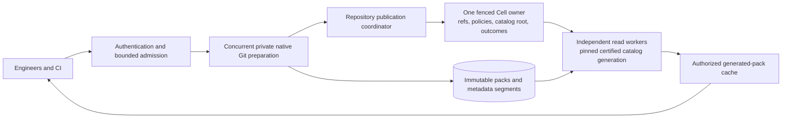

# Large-team scalability requirements

**Status: required design amendment; implementation and capacity qualification remain open.** Native packs solve durable byte storage, but the initial packed-repository specification is insufficient for a single repository used by more than 10,000 engineers. This amendment takes precedence over that specification and its proposed SQL schema wherever they conflict. A 10,000-repository density test is a different workload.

The selected direction remains immutable native Git packs, verified local caches, stock Git clients, and one fenced Repository Cell for authoritative ref and product publication. Keep the hard cutover. Reuse Git indexes, commit graphs, existing OID types, canonical metadata fields, typed graph semantics, ref expectations, push identities, policy checks and durable outcomes. Reusing these structures does not require keeping every historical object and edge in the Cell's mutable SQLite database.

## Capacity assessment

**The amended architecture is a plausible target for this workload; the current implementation is not qualified for it.** Large-history storage and hot-repository write concurrency require separate evidence. Keep one Repository Cell as authority only if its complete mixed-load durable service fits the measured budget; bulk verification, artifact transfer and fetch generation must scale outside that serial lane.

| Boundary | Implemented evidence | Remaining release condition |
| --- | --- | --- |
| Historical bytes and canonical metadata | Immutable native artifacts, bounded directory/source indexes and admitted metadata files | All producers/readers converted; multi-year lookup and compaction growth measured |
| Atomic publication correctness | Trusted ref-plan proof and catalog/ref/exact-response transaction; signed-input binding, rollback and owner-replay tests | Production HTTP/SSH invocation, reviewed merges and whole-operation qualification |
| Hot-repository progress | Exact catalog CAS, retained floors, bounded incoming/anchor reconciliation and bounded account-fair command dispatch | Frontier orchestration, production integration and measured progress under continuous publication |
| Durable write capacity | Runtime owner fencing and receipt replay tests | Complete provider durability gate fits mixed-load service budget, with qualified grouping if needed |
| Fetch capacity | File-backed indexes and admitted shared catalog-file loader | Independent read workers, native accelerators, authorized pack reuse and measured egress |
| Sustained storage efficiency | Bounded catalog/operation/pin primitives | Online compaction, complete retained-root inventory, fenced readers and safe reclamation |

The typed publisher is a correctness milestone, not a throughput result. Its current exact-base requirement is deliberately fail-closed. At the target publication rate, routing all stale work through Claim and full preparation would multiply durable commands and can starve independent branch pushes. The reconciliation/coordinator deliverable is therefore a prerequisite for the capacity claim.

## Workload and assumptions

Use the single hot repository as the restrictive case, alongside a fleet of smaller repositories. Engineer count alone does not determine capacity. Distinguish locally created commits, pushed commits, receive-pack requests, main-branch landings and CI fetches. For initial sizing, conservatively assume one pushed commit per request; later substitute measured batching and payload distributions.

| Input or derived quantity | Initial value | Interpretation |
| --- | --- | --- |
| Engineers | 10,000 | Minimum sizing population; expose as a variable |
| Commits per engineer per workday | 10 | User workload |
| Workday | 8 hours | Sizing assumption, not a fixed product constraint |
| Pushed commits per workday | 100,000 | Engineers × commits |
| Average pushed commits/s during workday | 3.472 | 100,000 / 28,800 |
| Provisional peak multiplier | 10 | Replace with arrival measurements; it is not evidence |
| Qualification peak | 35 pushes/s | Rounded up from 34.722 |
| Provisional CI fetches per pushed commit | 20 | Illustrative fanout, including retries and repeated jobs |
| Average CI fetches/s during workday | 69.444 | Excludes interactive reads and clones |
| Qualification fetch peak | 700 fetches/s | Rounded up from 694.444 |
| Workdays per year | 250 | Sizing assumption |
| Annual commits | 25 million | Does not include historical imports |

At 100 genuinely new Git objects per commit, the illustrative annual addition is 2.5 billion objects. At 256 bytes of mutable metadata per object, that alone is 640 GB decimal, before edges, indexes, WAL/LTX history, replication and backups. These are sizing inputs, not measured Git object counts or SQLite row sizes. Measure the imported corpus and a representative sequence of real changes, including the new trees created along changed paths.

For a 700 fetch/s peak and a 10 MiB average response, output bandwidth is 7,000 MiB/s, approximately 58.7 Gb/s of payload, before protocol overhead and redundancy. Generated-pack caching saves computation; it does not remove network bytes. Filtered and incremental fetches materially change this figure. Do not provision from a full-clone average or assume every CI request has an identical negotiation transcript.

### Sizing populations above 10000 engineers

The following projections retain the provisional burst and CI assumptions. They are arithmetic budgets, not measured capacity. Rates scale with population; a single repository's authoritative lane does not gain capacity by adding gateways.

| Engineers | Commits per workday | Average commits/s | Provisional pushes/s peak | CI fetches/s peak | Mean durable service budget per command with two commands/push |
| --- | --- | --- | --- | --- | --- |
| 10,000 | 100,000 | 3.47 | 35 | 700 | 8.57 ms |
| 20,000 | 200,000 | 6.94 | 70 | 1,400 | 4.29 ms |
| 50,000 | 500,000 | 17.36 | 175 | 3,500 | 1.71 ms |

These service budgets allocate 60% of the serial lane to pushes and exclude other product/maintenance work. Measure Begin and completion separately and sum their costs; the equal-cost per-command figure is only a shorthand. If the complete durable mixed-load budget cannot fit, qualified runtime publication grouping or a qualified follower-log mode is required before keeping the one-Cell architecture for that population. Additional read workers address read throughput independently.

## What the current evidence establishes

The [complete-corpus report](performance/2026-09-30-full-corpus.md) verifies 10,000 repository identities. Its populated sample consists of small two-commit fixtures. Its unique-branch push window offered 1 request/s across a 100-repository population and completed 29 of 30 scheduled arrivals; p99 was about 4.72 seconds. Those measurements neither establish a single repository's write ceiling nor satisfy the new workload. They are from a stated earlier revision and must not be presented as current capacity measurements.

The current gateway holds a per-repository mutex through decode, native receive-pack, ingestion and completion in `crates/canopy-server/src/git_gateway/mod.rs`. Concurrent upload spooling avoids slow-client interference but does not parallelize preparation. Ingestion still creates durable per-object SQL metadata, structural SQL bodies and graph projections. Pack-backed blobs are partial implementation, not the specified all-object cutover.

Current changes replace the serving cache's full OID HashSet with checked, file-backed native indexes. They also introduce operation-scoped authenticated artifact transport. Unit and cache tests validate those boundaries. They do not prove memory bounds for the whole native Git pipeline, concurrent publication throughput, online collection safety or large-team capacity. Index lookup still scans the installed index handles, and ingest still has transient object-count-dependent collections; these must be replaced or bounded before qualification.

## Required architecture

### 1. Concurrent preparation, short authoritative publication

Spooling, decompression, thin-pack completion, indexing, canonical verification, graph extraction and artifact uploads run concurrently in private request workspaces. Node and account admission already exist and must cover all child processes, temporary files and uploads until they finish. Add separate foreground write, read and maintenance budgets; avoid an unbounded queue inside a gateway. Preparation acquires a repository snapshot and operation token, rather than a repository-wide mutex for its lifetime.

Keep one fenced publisher per repository. Its final command rechecks authorization, branch rules, expected ref OIDs and versions, candidate/check bindings, verified closure and the expected catalog generation. It atomically publishes refs, catalog dependencies and the exact response. Preserve the existing request identity and outcome mechanism. Native success and completed uploads remain insufficient for acknowledgement.

Simply removing the current mutex is unsafe. Concurrent publishers can share OIDs, overlap native inventories and interleave object sequences. Current ingestion compares storage representation as well as canonical identity; a matching object in another pack can be rejected. Its cache high-water advancement also assumes that the interval since ingestion began contains only covered objects. Replace these assumptions with identity comparison and explicit certified catalog coverage before admitting concurrent preparation.

Model serialized utilization as `rho = sum(arrival_rate_i × durable_commands_i × mean_serialized_service_seconds_i)`. Include ACL, policy, checks, issue/PR and maintenance writes. The service time includes Cellule's acknowledgement durability gate, not merely SQLite execution. At 35 pushes/s and a 60% push-only utilization budget, one serial command per push allows approximately 17.1 ms mean service time. Six commands per push would allow only 2.86 ms per command. Neither is a promised latency; other traffic further reduces that budget.

Measure the selected Cellule durability mode. If per-request object-store publication cannot meet the envelope, implement runtime publication grouping or use a qualified existing follower-log durability mode. Do not weaken acknowledgement to local WAL or independently acknowledge commands within an unproven group. Grouped publication retains each request's transaction, outcome, order and recoverable receipt under the same owner fence. Failover must recover every acknowledged member and correctly resolve ambiguous outcomes.

The implemented preparation protocol adds a durable Begin command before final publication. Its minimum successful push therefore requires two serial durable commands; renewal, claim, aborted attempts, command rejections and runtime handling of replay add measured work. At 35 pushes/s, two equally costly commands and a 60% push-only utilization budget allow approximately 8.57 ms mean durable service per command. If every preparation renews once, the three-command budget becomes 5.71 ms. Include product and maintenance traffic explicitly and measure the distribution, rather than assuming either mean guarantees p99. A fresh lease check is a query, but still consumes SQL-worker, routing and admission capacity.

Conditional certificate issuance now runs through the privately constructed `PreparedCatalog`, fresh lease/ACL checks and the existing trusted application SQL capability. It reuses the repository secret with a separate BLAKE3 key-derivation domain and binds tenant/application, repository, owner fence, attempt, actor, base, prepared catalog and canonical/input inventories. Its encoded size is at most 1 KiB. The ordinary path must carry this certificate inline into final publication. Durable registration on the existing operation row and independent retention pin is an optional checkpoint; making it mandatory adds a third serialized command and reduces the illustrative budget to 5.71 ms. Final publication must authenticate the certificate and recheck current authority; a recorded checkpoint success is not permission to publish. The issuer, optional checkpoint and typed catalog/ref publisher are implemented primitives. `PreparedCatalog::ref_proof` additionally binds exact PushPlan wire bytes and catalog-verified ancestry evidence. The publisher authenticates that binding and writes catalog, refs and logical outcome atomically while rechecking current policy. CompleteCatalogPush now persists the exact native response, options and optional signed bytes with the catalog/refs in this same transaction, including durable final-policy refusals and native-error outcomes. Its service wrapper, completed-request preflight and receipt-bound exact-response reader exist. Begin does not allocate another namespace for a completed ID, and a restarted gateway can replay through fresh read authority without rebuilding native preparation. Actual HTTP/SSH production wiring remains open. No response/plan/certificate staging commands are required on this inline path. The current typed input envelope is 4 MiB, so very large ref plans still require an immutable plan-root interface.

Final-generation reconciliation needs its own scheduling contract. Under an illustrative Poisson arrival model, the probability that a base remains current after preparation lasting `t` seconds is `exp(-publication_rate × t)`. At 35 publications/s this is about 3% after 100 ms and 6.3×10⁻¹⁶ after one second. The model is illustrative, but exposes why retrying the entire physical/closure pipeline on catalog CAS failure cannot be the normal path.

Physical verification is reusable; reconcile only the incoming inventory and affected dependencies against changes since its pinned base. A bounded, fair per-repository coordinator orders ready operations and maintenance, combines compatible deltas where qualified, and binds the final certificate to the selected actual generation. Do not hold that coordinator during uploads or full-history verification. Reconciliation must make progress while publication continues; measure retries and ready-queue residence, and reject overload through bounded admission rather than repeatedly starving the same operation. Changing a token through Claim adds a durable command, so it cannot be an uncounted mechanism on every ordinary push. The executable publisher must define how it binds the reconciled generation without rerunning Begin/Claim per intervening publication.

#### Retaining a frontier without another durable Claim

The fresh schema now interprets an independent attempt pin's existing `generation` field as an immutable retention floor. Until that pin is reaped, every generation at or above its floor remains protected, including intervening publications and compactions. Claim and Abort preserve the detached pin. Expiration alone does not make its facts removable. An indexed minimum over the existing generation-pin index bounds eligible facts below the oldest remaining floor; the reaper still deletes at most 512 facts per command and always preserves generation zero and the current root. A schema DELETE guard prevents bypassing this range through another SQL writer. None of these SQL decisions authorizes remote artifact deletion.

`CheckPreparationFrontier` (query 21) reuses the exact LeaseCheck and returns `PreparationFrontier { lease, current }`. It checks current Write access, repository identity, actor/request/attempt/namespace, exact independent pin binding and expiry, then reads the original floor and current immutable fact in one committed SQL snapshot. It allocates no namespace, does not renew the lease and requires no new durable mutation. The bounded codec rejects a current generation below the floor, foreign repository/format and changed facts at an identical generation. A caller-supplied DTO remains insufficient to construct PreparedCatalog or a publication certificate; final owner fencing and canonical verification remain mandatory.

`PreparedCatalog::reconcile` now retains the verified incoming directory/source descriptors and the existing admitted closure scratch privately. It checks incoming canonical headers and previously certified external dependency anchors against the queried current catalog in indexed pages of at most 512. An incoming object absent from the new base is supplied by the retained incoming run; an external-only anchor must remain present with its exact canonical body and graph digest. This preserves the verified incoming DAG without decoding packs or walking historical edges again. The output combines selected current roots with the exact incoming delta. The private certificate binds original retention floor/certification and actual selected base separately; final publication checks the unchanged attempt/pin floor and CASes the selected current fact. Optional checkpoints retain their original bytes while comparing exact verified input facts. Root changes still require a fresh certificate, current policy and final ref expectations.

The primitive currently checks all incoming OIDs and remembered external anchors against the selected catalog. Changed-run-only skipping and its canonical coverage proof still need qualification. The bounded ready-command dispatcher described below now exists. Maintenance scheduling, frontier orchestration, pipelined/grouped root work, production invocation and measured retry/queue residence remain open. Reconciliation alone does not guarantee progress while other writers continually advance the catalog, and a cold root upload cannot become an unmeasured exclusive lane. The existing fixed catalog-file/node caches are reused; no full-history heap inventory is created. Reconciled selections share their original lease deadline and renewal fence rather than gaining another independent lease. Cancellation of one reconciliation preserves the reusable inventory; queued readers retain its file/admission until they drain.

#### Ready-command admission and outcome ownership

`PreparedCatalog::ready_push` constructs a private command-19 output using the existing completion factory and Cellule `PreparedCommand`. `PreparedCompaction::ready_compaction` now constructs the corresponding private maintenance command-22 output. Factories retain original verified inputs, mutation identity, wire bytes and owner incarnation. `ReadyPublication`, `PublicationOutcome` and `PublicationError` preserve their types through one coordinator; a maintenance result cannot be read as an HTTP push response. Push inputs remain capped at 4 MiB and maintenance inputs at 4 KiB; larger push plans still need immutable roots.

The implemented coordinator reserves four of 32 operation slots for maintenance and the remaining 28 for foreground. Encoded-command credits reserve 8 MiB per push and 8 KiB per compaction inside a 256 MiB budget. Per-actor counts are separate by class, and account FIFO rotation runs within each class. Defaults admit eight concurrent durability waits, cap maintenance at two, and start at most three foreground commands before eligible maintenance when a wait slot and maintenance capacity are available. Uncertain work remains charged to its class, preventing maintenance from filling foreground admission. At its concurrency cap, maintenance remains queued while ready foreground progresses. The [shared dispatch contract](design/shared-publication-dispatch.md) defines checked profiles and the new typed APIs. Transaction/network order and overlapping catalog success remain separate from fair starts; uploads and historical verification stay outside dispatch.

Dropping a ticket/waiter does not cancel admitted execution. A pending outcome, malformed published result or panicking command task stays retained and charged in the service-owned coordinator. `pending` retrieves its ticket internally; `recover` resolves its original Cellule evidence through the fair queue. An authoritative absent result permits execution of the exact retained command, without rebuilding its certificate/response. A committed result is decoded with its original receipt and never reruns the handler. Unknown, expired or unreachable resolution retains the reservation; changed incarnation requires logical outcome recovery before a new attempt and must not be treated as absence. Current ACL/policy/ref/catalog CAS still runs in the authoritative completion transaction.

A terminal outcome drops the retained wire payload and original prepared inventory before releasing admission. Small resolved push tickets can read their exact HTTP response at that receipt without keeping scratch alive; compaction tickets retain their typed committed/rejected result. Callers that need reconciliation after a durable catalog conflict must keep their own admitted `Arc<PreparedCatalog>`, select a current base, create a new final-command mutation identity and reenter the ready queue. Never reuse a rejected final-command identity with changed proof bytes. `stats` exposes admitted/account/queued/in-flight/uncertain counts and reserved command bytes; dispatch/result trace events record queue wait and total admitted residence.

For graceful shutdown, `close_and_drain` refuses new submissions, waits without canceling dispatched commands, and returns all still-charged unresolved tickets. Recovery remains possible after closing. Keep those tickets until a resolved outcome or an explicit recovery handoff. This dispatcher is not a durable local outbox: process/owner-loss reconstruction, complete retained-root inventory and isolated recovery remain mandatory release work. Its local ownership does not authorize remote deletion.

This implements fair bounded final-command dispatch and exact uncertainty handling, not fair publication success against a continually moving root. Pipelined/grouped root construction, continuous maintenance preparation, CPU/I/O shares, classified bounded reconciliation retries and end-to-end producer integration remain required. The eight-command default is a starting admission configuration, not a measured throughput claim. Provider durability grouping and every acknowledged member's failover recovery still need qualification.

Range retention has a measurable cost: at 35 publications/s, a 60-second oldest floor retains about 2,101 generation facts before compaction publications and cleanup lag. An 8,192-fact cap fills in about 234 seconds if the oldest floor never advances; at 70/s it fills in about 117 seconds. Therefore this primitive is a bounded foreground reconciliation mechanism. A four-hour import deadline cannot become a four-hour generation floor or be handled by indefinitely renewing the original floor under traffic. Bulk producer integration must separate long-lived authenticated input retention from short-lived catalog reconciliation leases, reuse the existing attempt/input ownership structures, and advance reconciliation floors only after old readers drain. The stored phase separation now exists: commands 24–26/28 and query 27 reuse operation/pin rows with an unbound NULL generation; a one-way Bind selects the current floor after physical verification without another namespace or pin. The normalized generated binding retains exact composite-FK validation. Bind preserves input expiry rather than invalidating borrowed upload deadlines. A five-minute input renewal can consequently leave a five-minute bound floor; configure and qualify this remaining floor explicitly. Native fixtures reuse pre-bind verified inputs through the existing assembler, and a retention fixture survives 10,240 intervening facts with bounded reaping. The service-owned StagingCoordinator now retains input tasks/results and exact Begin/Renew/Bind commands, automatically renews through fresh queries, drains before binding and preserves uncertainty across observer cancellation. Defaults bound 32 operations/eight per actor and 64 worker/result slots/eight per actor with 8 KiB command reservations. This is process-local ownership, not durable takeover reconstruction; see the [service contract](design/staging-service-lifecycle.md). Production integration, authenticated takeover adoption, larger input limits and admission configuration remain required before selecting the schema; see the [staged input contract](design/staged-input-retention.md). Hitting the cap must fail admission/publication safely; it must never release retained roots to make room.

Measure coordinator occupancy independently of Cell SQL service: a 100 ms catalog-upload step held exclusively for each ready push caps that lane at 10 pushes/s even if SQL is fast. At 35 pushes/s and a 60% coordinator utilization budget, average exclusive work must fit roughly 17.1 ms per push. Pipeline or group catalog work under a defined generation frontier while preserving each operation's policy decision, ordering and exact durable outcome; adding a second exclusive root-upload lane without measuring it does not solve contention.

The fresh schema candidate and preparation commands are in `crates/canopy-server/src/packs/publication/`. Begin/claim stamp the runtime's admitted incarnation, epoch and execution sequence. Independent attempt pins retain superseded bases; renewal requires the current owner fence, never shortens an existing pin, and cannot resurrect an expired attempt. The schema enforces exact operation/pin generation and expiry with a deferred composite foreign key and immutable catalog-generation facts. Initial per-repository caps are 1,024 operation rows, 4,096 attempt pins and 8,192 retained generation facts, including generation zero; expired rows count until reaped. These are admission limits, not demonstrated concurrency capacity. Reaping removes at most 512 rows from each class per command using indexed selection. It removes SQL facts only and provides no authority for remote artifact deletion.

Size these caps against residence time. At 35 new attempts/s, a 60-second retained pin contributes about 2,100 live pins before claims, abandoned attempts and cleanup lag; five-minute pins contribute 10,500 and exceed the initial pin cap. The 1,024-operation cap allows only 29.3 seconds of mean operation residence at that arrival rate before any safety margin. Claim churn consumes additional pin slots. The maintenance scheduler must continuously clear expired rows and expose residence, live/expired counts and quota rejection metrics. At 70 attempts/s, even 60-second pins exceed 4,096. The headroom campaign must report this saturation; population growth requires a qualified cap/lease/admission configuration rather than assuming the 10,000-engineer settings scale unchanged. A worker may release a pin early only after the implementation proves that every associated active or detached read has drained.

`PreparationBaseResolver` obtains its base through a fresh authorized Cell query, then reuses the admitted catalog loader for batches of at most 512 requested OIDs. It computes its local monotonic deadline from before the query; queue/transport time cannot extend the reported remaining lease. Renewal performs another fresh query after the durable command, including exact command replay, so an old successful reply cannot restart a lease. Failed renewal fences the session. This is the conditional base adapter. The new typed publisher now creates genuine immutable generation facts consumed by this adapter in tests; production orchestration and HTTP/SSH invocation remain missing. Cross-node clock bounds, suspended-reader drain, renewable serving/backup pins and the complete recovery-root inventory must be qualified before remote reclamation. The fresh schema and commands are not yet selected by the production RepositoryModule.

`CatalogPreparation` now supplies the next local verification boundary. It obtains roots from that adapter, consumes complete isolated physical witnesses, copies exact metadata partitions into closure/directory scratch, uploads those files and derives every new source leaf internally. The incoming directory inventory must match the unique closure inventory; preserved base roots come from the queried generation, rather than caller-provided descriptors. Physical witnesses also bind the actual in-process artifact-store capability, preventing verification in one backend from authorizing references to absent bytes in another. Assembly phases obey the live local deadline, and admitted files retain their private workspace through queued cancellation. The private `PreparedCatalog` result remains conditional on the base and does not acknowledge a push or insert a generation fact. The bounded conditional certificate factory, optional durable checkpoint, target-ref membership/ancestry proof and atomic typed publisher now exist. Current checks/reporters and branch rules are evaluated in the final transaction; ordinary pushes cannot bypass a required-PR rule. The bounded reconciliation and ready-command dispatcher primitives now exist; frontier/maintenance scheduling, reviewed merges and production HTTP/SSH invocation remain required. Assembly verifies its incoming union in one admitted spool, then streams bounded output files into one indexed ingress root. Output partitioning and geometric selection are implemented; full-history input profiles, continuous maintenance scheduling and production integration still need qualification.

After assembly, PreparedCatalog retains one admitted closure scratch for reconciliation until all selections are released. Metadata, directory and closure builders now start with a 64 KiB main-file cap and 192 KiB charge, then double under the shared disk budget before raising SQLite's cap. They can still reach three times MetadataLimits.max_file_bytes (768 MiB at the 256 MiB default). Sealed metadata/directory files shrink to exact lengths; retained closure keeps its admitted cap until all users and queued workers drain. Release prepared inventory after a resolved outcome and worker drain; uncertain publication still retains inputs. This is local scratch ownership, not a serving or backup pin. See the [admitted growth contract](design/admitted-sqlite-growth.md).

Local resource bounds need a workload-qualified configuration. Two default construction databases initially charge 384 KiB, and can grow to a combined 1.5 GiB at their 256 MiB main-file ceilings. Physical verification now shares one admitted dependency file per at-most-512-object page, using private exact witness ranges; its dependency file count falls from as many as 512 to one. Full file credit remains held until the last witness/worker drains. See the [edge-spool contract](design/verified-edge-spool.md). Native descendants, pack/index files, SQLite connections and uploaded-file cache costs remain independently admitted; global file/process quotas still require implementation. Growth retries only rolled-back SQLite capacity errors; denied disk credit cannot raise the old page cap. Producers must choose measured class/operation limits and count queued canceled jobs, reservations and actual disk usage. Nontrivial ref ancestry now initially admits 192 KiB and grows before raising the SQLite cap; a 256 MiB main-file limit can still require up to 768 MiB per active walker. Every write reuses the same admitted transaction helper. Exact-catalog pair reuse is exclusive to one walker; error/cancellation fences it and retains queued worker ownership until drain. Its indexed disk queue bounds Rust heap growth but can still traverse substantial history. Native commit-graph acceleration, CPU/file/process admission and end-to-end resource/latency qualification remain open. Current tests cover native 1,200-commit histories and a separate synthetic 100,001-entry scratch queue, not native 100k-history performance.

### 2. Immutable bulk metadata and graph segments

Remove historical per-object insertion, per-edge closure work and per-object placement updates from the Repository Cell's hot command stream. Store canonical headers and typed edges in immutable metadata segments alongside the native pack/index artifacts. Reuse the existing `objects`, `object_edges` and ordered structural parsing semantics in read-only SQLite sidecars; retain native `.idx`/MIDX and commit-graph formats for Git lookup and traversal. This avoids inventing a delta decoder or a second mutable distributed database.

Each segment contains repository/format identity, schema version, pack binding, `(oid, kind, size, body_digest)` headers, typed edges and verification/dependency certificates. Seal an exact length, BLAKE3 digest and hashed-part manifest for the sidecar just as for pack/index bytes. A segment is opened read-only and immutable only after whole-artifact verification. Its SQLite page cache is bounded; no serving worker opens every sidecar connection indefinitely. Canonical OIDs remain logical identities; catalog and segment cursors replace a globally growing object sequence for inventory paging.

The Cell stores the current immutable catalog root and generation, bounded operation records, root-level certificates, refs, policies and durable outcomes. Product tables and identifiers are reused. A catalog uses a bounded-fanout immutable tree of segment descriptors, with incremental path updates; publishing one segment must not rewrite a list of every historical pack. Catalog nodes use the same authenticated artifact transport. Keep the existing proposed per-object SQL DDL as an earlier design validation fixture only; it is not the scale architecture's release schema.

#### Bounded OID lookup is a separate requirement

A descriptor tree alone does not satisfy the lookup contract. Git OIDs are distributed across the hash space, so incoming packs have heavily overlapping OID ranges. Looking through every pack or every metadata sidecar remains linear in push history, even when inserting a descriptor costs only a tree path update. The serving cache's current index-handle loop must not become the durable catalog lookup algorithm.

Use two indexes under the published catalog root: an immutable artifact-descriptor tree and a leveled immutable object directory. Directory runs reuse SQLite `objects` canonical fields and add a preferred metadata/pack descriptor key. Typed edges remain in the source metadata shard; native `.idx` files retain offsets. Compaction may change the descriptor key while preserving the canonical header, edge count and edge digest. No historical object location is updated in the mutable Cell.

The initial directory contract is:

- Level 0 has at most 32 overlapping run-set roots. Each root indexes disjoint raw-OID ranges using the same persistent range index as higher levels. A partitioned push consumes one root slot regardless of its file count. Higher levels use a size ratio of 10 and at most 16 levels. A point lookup selects at most one run per root or level, preserving the 48-candidate bound; it never opens every physical pack or downloads a complete descriptor array.
- A normal directory run targets at most 64 MiB. Its records contain fixed-size canonical identity fields and a descriptor key, not object bodies or inline edge lists. Run construction and merging use pages of at most 512 records and admitted disk-backed scratch. The assembler now streams disjoint output runs from its verified incoming spool, indexing and uploading one file at a time. Small spools reuse their original sealed file. Larger spools retain one input page and one output builder, retry bounded prefixes after SQLite page-limit rollback, and check the complete output count/range/canonical inventory before preparation succeeds. Output size classes are independent of the admitted verification-spool class. Wide trees page their source edges separately. This does not remove the verification spool's size limit or implement long-lived bulk input ownership.
- Compare every matching canonical header across the selected runs. Identical overlap is allowed; disagreement in kind, size, body digest or graph inventory is an integrity failure. The highest `location_version` wins physical placement, with a stable source-key tie break. Choosing the newest location cannot hide an identity conflict. An optional Bloom filter accelerates negative lookup but is never a membership, closure or authorization proof.
- Preparation queries incoming OIDs in bounded batches against its pinned directory root. Publication revalidation considers changed runs/ranges since that snapshot and binds the resulting attestation to the actual CAS generation. It does not rescan all historical headers.
- Merge small runs and perform geometric range compaction under separate maintenance admission. If level 0 reaches its bound or maintenance falls behind, reject/defer new preparation through the bounded admission queue. Do not extend the run count or silently accumulate unlimited staged operations.
- A selected root resolves its complete current directory without following a linked list of prior generations. A previous root is an expected CAS/audit value, not an unconditional retained-artifact edge. Compaction carries forward certified canonical and closure facts; it must not make every historic catalog generation a permanent dependency.

These values are executable initial limits, not measured optimal settings. Qualification must report selected-run count, index-node reads, open SQLite connections, bytes read/written per object, compaction debt and admission rejections over at least 100,000 incremental commits on an imported full history. An empty-history lookup microbenchmark cannot establish the contract. Directory/index/snapshot primitives now exist; complete catalog integration, reader admission/caching and compaction scheduling remain required work.

The level-0 cap is an active throughput constraint. If every push adds one root, 35 pushes/s fills 32 slots in 0.91 seconds starting from empty; grouping, flush and compaction must free capacity continuously. Partitioning prevents one large push from consuming many root slots, but does not relieve sustained root-arrival pressure. A steady-state test must show compaction service exceeds the measured root/file/byte arrival rate under foreground load. The 48-candidate lookup bound is a complexity bound, not a latency bound: whole-file verification of 48 cold 64 MiB runs could transfer roughly 3 GiB before source metadata. Admit cold hydration separately, keep qualified warm coverage and measure the actual selected files and bytes. Increasing the candidate cap to avoid admission failures defeats the lookup contract.

The persisted range-index implementation caps directory node fanout at 128, encoded bytes at 64 KiB and height at seven, so one level's cold point lookup traverses at most eight nodes. It caches at most 64 nodes, writes only changed paths, and does not link a new root to every previous generation. Snapshot selection is capped at 48 run candidates. Bounds on descriptor work do not establish cold-read performance: opening a directory run currently verifies its entire file. Preparation workers need qualified warm metadata coverage or a certified native-index/negative-lookup accelerator. A provider download per incoming OID is unacceptable at the target workload. Native MIDX absence can skip canonical lookup only when its complete coverage of the pinned directory generation has been verified; raw index entry counts and structural-only coverage cannot establish that condition.

Directory runs reuse canonical header folding with seed `BLAKE3("canopy.directory.v1\0" || oid_width:u8)`. Source keys and placement versions are excluded from that canonical inventory, but are bound by the complete file digest. New source records start at placement version one. A compaction's private spool compares the exact expected header/source/version, verifies the replacement metadata header, and increments the version with checked signed-SQL bounds. This local CAS is not the authoritative publish fence: the final Cell command still compares the input catalog generation and admitted operation fence.

Lookup checks all overlapping canonical headers before selecting the highest placement version; older runs cannot restore an old source merely by being merged later. Source-descriptor lookup and retention must follow the effective selected placement. A collector must distinguish shadowed source fields in old directory runs from effective current source dependencies, and independently retain the complete sources of every pinned older root. Do not implement reclamation by counting raw directory rows or by assuming that a new location immediately releases all old roots.

Range nodes and directory snapshots use the existing Cellule bounded codec (big-endian integer/length fields) with distinct `canopy.range-index.v1` and `canopy.directory-root.v2` NUL-terminated domains. They use authenticated artifacts under `repos/<repository>/git-catalogs/<creating-operation>/nodes/<digest>`; directory SQLite files use the same family with `directory/<digest>`. Operation-scoped paths preserve incarnation identity across delayed deletion. The source-descriptor tree now shares this bounded path-copy engine with typed 48-byte operation/digest keys, fanout 128 and domain `canopy.source-index.v1` followed by NUL. Source leaves bind metadata and native pack/index descriptors, including authenticated manifests, checksum and physical pack count. Descriptor insertion does not establish artifact existence, canonical body identity or closure. The whole-catalog publication contract, certified verification and production reader orchestration remain unfinished, so these artifacts are not the completed release format.

The combined catalog root now binds the directory snapshot and source-tree root using the same codec and authenticated catalog-node namespace, with domain `canopy.catalog-root.v1` followed by NUL and a 1 KiB encoding cap. It contains no predecessor-root edge; the authoritative generation and verification facts belong to the final Cell transaction. `CatalogReader` validates root context and resolves a directory entry through its exact source metadata. Read-worker-owned index clients share their bounded caches across immutable snapshots. Root opening verifies at most 48 directory root nodes and one source root node; it does not walk every descendant or replace the trusted publication verifier. SHA-1/SHA-256 golden wire vectors are recorded under `docs/design/catalog-root-v1-*.hex`.

The local file loader now shares authenticated directory/metadata files across catalog generations. `CatalogFiles` defaults to 32 open/reserved slots and 16 cached files, with a hard maximum of 128 slots; the bound includes borrowed files and detached canceled jobs. Each slot pins the loader's private directory and retains disk admission through cleanup. Fixed 16-way miss locks coalesce equal loads, cache hits compare every descriptor field, and a saturated all-borrowed pool rejects admission. Default SQLite page caches are 8 MiB per file; this is a configured local cache bound, not a whole-process/native RSS guarantee. Batch header reads retain at most 512 input IDs and their at-most-48 directory candidates per ID, group indexed SQL reads by file, compare all overlaps, and verify exact preferred-source headers. They return headers without pinning one source file per result, allowing even a one-slot pool to process a batch. These files and caches do not replace authoritative generation certification, renewable remote reader pins or access checks, and are not yet wired into the server serving/publication path.

#### Metadata shard implementation boundary

The current `packs::metadata` implementation reuses canonical object fields and typed edges in sealed, read-only SQLite files. Each file covers an exact contiguous ordinal interval of one checked native pack index. Its descriptor binds repository, creating operation, object format, pack BLAKE3, native checksum, ordinal interval, canonical inventory, exact file length and BLAKE3. Covering a physical pack requires a complete nonoverlapping partition of its index ordinals; equal row counts alone do not suffice.

The shard inventory seed is `BLAKE3("canopy.segment.v1\0" || oid_width:u8 || pack_digest:32 || first_ordinal:u64le || object_count:u64le)`, followed by the original canonical header folding rule in native raw-OID order with shard-local ordinals starting at zero. The seed's domain string ends in one NUL byte. Edge hashing retains `canopy.edges.v1` and the original typed/deduplicated child ordering. This seed is deliberately distinct from the earlier whole-pack fixture's inventory seed.

Build batches and read pages are capped at 512 records; the default SQLite cache is 8 MiB, mmap is disabled, and the default main-file limit is 256 MiB with 3× scratch admission for rollback journals. An oversized structural object requires explicitly admitted larger scratch/shard limits; splitting only native object ordinals cannot split that object's edge inventory. None of these defaults is a maximum repository size.

Upload/download uses the authenticated artifact transport at `.../<pack_digest>/metadata/<metadata_digest>`. A downloader validates repository and descriptor bindings, reserves disk before provider reads, checks authenticated parts and complete file bytes, and only then opens SQLite read-only. Queued blocking file jobs retain admission and file ownership through cancellation. Shard membership/shape checks are not canonical body verification or closure attestation: the trusted streaming verifier and directory/publication integration remain required.

Decoded witnesses now spool dependency occurrences to admitted disk with at most 512 edges per write/read page; blobs require no edge file. Only successful complete canonical inspection constructs a witness. Each growth reserves bytes first, canceled queued blocking jobs retain the file and reservation, and the per-object edge-byte cap is enforced before writing. Metadata import groups at most 512 witnesses in one SQLite transaction, rechecks scratch byte integrity and rejects canonical/typed conflicts. Failed imports roll back and poison the builder against sealing. These bounds cover Rust buffers and admitted scratch, not native Git memory or publication throughput. The service must run metadata assembly on a blocking worker that retains ownership through cancellation, finish the native actor, isolate verified physical pack bytes and certify global typed closure before publication.

The source-binding implementation validates shard bounds and exact descriptor relationships before catalog insertion. Its constant-space partition checker requires shard intervals in native ordinal order with no gaps, overlaps or duplicates; failure poisons the checker. Verification streams each physical pack once to check whole BLAKE3 and the native header/checksum, checks the exact index BLAKE3/native format, and reuses the checked index for shard endpoint validation. The directory resolver additionally compares the preferred source key, exact metadata descriptor and canonical header in the verified file. None of these checks decodes object bodies or establishes typed closure; the trusted verifier must still perform those checks before publishing a catalog. Production loading must retain admitted immutable files and generation leases, and run blocking verification under bounded worker admission.

The decoded-object inspector now performs Git OID and body BLAKE3 hashing in 64 KiB chunks alongside a constant-state structural parser. It sends at most 512 typed edge occurrences per sink call, ignores message/signature bytes for graph extraction while hashing them, and retains no whole tree/name/message in Rust. File-backed native index iteration drives the persistent batch reader without a heap OID inventory. Cancellation during a confirmed sink write, malformed frames and sink errors poison the native actor. Sink output is private preparation until inspection completes; the service must discard failed preparations. The disk-backed sink and isolated physical stage below now compose these decoded witnesses; global closure and producer/publication integration remain required. Native Git may allocate independently, so child-process memory admission and qualification remain mandatory.

The isolated physical verifier now composes these primitives before publication: it admits and downloads the exact authenticated native pair into a fresh fenced cache, verifies complete bytes/checksums and native index relationships, decodes every native ordinal in batches of at most 512, and builds sealed contiguous metadata shards on blocking workers. The workspace contains neither loose objects nor alternates and receives no second pack copy. A successful whole-pack witness binds the exact ordered shard descriptors; failed or canceled assembly cannot finish. The runtime-only `NativePackDescriptor` reuses the pack/index fields already persisted in source records, without changing their wire layout. Tests distinguish delta independence from graph closure: a normalized thin pack includes its appended bases; an unresolved thin pack fails even when an ambient cache has the requested object; a commit-only pack may legitimately reference a tree in another pack. Global typed closure, incremental collision revalidation, producer wiring and authoritative publication remain required. Native index/decode RSS, worst-case hash-order delta locality and whole-operation admission/deadlines still require implementation/qualification; bounded Rust batches alone do not establish those costs.

The operation-local `packs::closure` stage now reuses the sealed canonical headers, typed edges and directory inventory encoding. It accepts a complete isolated physical witness and checks its exact metadata partition while copying shards one at a time. Only incoming vertices/edges and requested base headers enter an admitted SQLite scratch graph; it neither copies historical graph edges nor retains a repository-wide heap inventory. All incoming OIDs are queried against the bound base, including locally complete overlaps, so a new pack cannot hide a canonical conflict with history. Base lookup batches are ordered and capped at 512, and must name the exact catalog descriptor and generation. A raw catalog lookup cannot establish the required certification status.

An indexed disk-backed topological queue rejects missing/wrong-kind dependencies and cycles, including cycles in incoming overlaps that also have base headers. Processing batches at most 512 vertex/edge updates per scratch transaction and pages reverse fanout independently; a wide parent set and a deep chain do not require a heap graph. SQLite progress hooks and 64 KiB file-hash checkpoints interrupt canceled blocking work; queued jobs retain file ownership and disk admission. Scratch uses the same bounded cache/main-file limits and 3× journal admission. Its `synchronous=OFF` setting applies only to private disposable scratch, which is never reopened as a recovery root or acknowledged as durable state. Authenticated inputs rebuild it after a crash. Published artifacts and the Cell acknowledgement gate keep their separate durability requirements.

`ClosureWitness` binds the unique incoming canonical inventory, physical-input digest set and exact base context. Its inventory can be checked directly against a directory run or a bounded sorted header stream without introducing a second canonical encoding. This remains a conditional in-process witness: a trusted production base adapter, renewable base-generation lease, catalog source coverage, changed-generation overlap revalidation and admitted owner-fenced publication are still missing. Caller-supplied certification flags must never cross the service boundary as authority. The new stage is not evidence that the publication path or workload gates pass.

The trusted verifier independently checks canonical identity and graph semantics, including typed children, ordered commit parents, gitlinks and missing dependencies. Closure attestation names the exact input catalog root, operation attempt and output artifact digests. Every new non-leaf dependency must be in the verified operation or in a certified dependency generation. Pack membership and native index cardinality never establish closure or read authorization.

Before publication against generation G, the coordinator compares incoming OIDs with G's canonical metadata. Identical canonical headers may overlap packs; conflicting kind, size or body digest is an integrity failure. If G changes, check intersections with the intervening segments and rebuild the attestation for the new generation before retrying CAS. This includes races involving different bytes with the same Git OID; do not rely on a SHA-1 collision being unlikely. Bind the final command to the revalidated root and operation fence. Grouping compatible prepared operations can amortize catalog publication, but each push retains an independent policy decision and outcome.

Physical placement is resolved by the catalog and native indexes, rather than updated on each historical object row. Compaction preserves canonical header and graph inventory digests, atomically replaces selected catalog segments, and leaves pinned old roots readable. Permanent commit ancestry and closure facts can be stored in certified segments; small SQL caches may accelerate product checks but cannot become the only proof or grow without a retention policy.

### 3. Independent read workers and authorized fetch reuse

A Repository Cell's single writer is not the execution location for all Git reads. Read workers consume a certified catalog/ref snapshot, hydrate packs into pinned local cache generations, and perform negotiation and packing locally. Native MIDX, bitmaps and commit graphs accelerate complete inventories. Keep separate full and structural-only coverage certificates for partial clones. Cold-reader routing should prefer an already warm worker while independent readers remain horizontally expandable.

Generated-pack caching must key repository identity, object format, canonicalized native negotiation inputs (including wants/haves, shallow boundaries and filters), pack-affecting options, certified inventory and a protocol/implementation version. Reuse pack bytes, not an entire HTTP response with session-specific negotiation or sideband framing. Recheck current read access and want reachability on every request before serving a hit. Revocation and hidden refs cannot be bypassed by a cache key. Duplicate misses share bounded generation work; canceled waiters do not release the producer's cache/process pin.

Bind cached bytes to the certified requested object inventory/closure, rather than unconditionally keying them by the whole repository's newest catalog generation. At 35 pushes/s, unrelated branch publications would otherwise invalidate reuse continuously. Cross-generation reuse requires checking the cached canonical bindings against the current certified state and using the actual negotiated common objects; neither a stale generation nor raw client-supplied haves establish that condition. Physical repacking may change source descriptors while leaving these canonical bindings unchanged.

Do not add a distributed object-store round trip per small object or spawn `cat-file` per blob. Use native batch processes with bounded queues and supervised process lifetimes. Serve pack artifacts through bounded parallel transfers and account for OS page cache, native process memory, pinned old generations, scratch, output-cache bytes and egress. A process RSS chart excluding Git descendants is insufficient.

GitLab documents a [pack-objects cache](https://docs.gitlab.com/administration/gitaly/configure_gitaly/) to reduce repeated pack generation. GitHub documents [geometric repacking](https://github.blog/open-source/git/scaling-monorepo-maintenance/) to reduce monorepo maintenance work. Canopy adopts these mechanisms with its own publication and authorization boundaries; those services' results are not Canopy capacity evidence. SQLite permits [one writer per database](https://www.sqlite.org/isolation.html), so read replicas alone do not remove the publication limit.

### 4. Maintenance and retention without global downtime

The implemented selected-ingress compactor can merge 2–32 authoritative roots into one, freeing up to 31 level-zero slots. Its defaults bound input to 128 runs/256 MiB and use a 256 MiB merge-spool ceiling with 192 KiB initial charge and up to 768 MiB reservation, with output files capped at 64 MiB. It reuses the existing canonical directory and range-index structures, preserves refs and sources, and verifies the complete unique inventory before issuing a purpose-bound v2 certificate. The admin-only catalog publisher atomically records the outcome. Reconciliation keeps concurrent ingress but rejects a selection already replaced by another compactor. Native fixtures verify both object formats and old-reader access; they do not establish continuous service at 35 pushes/s. Higher-level geometric range compaction, physical pack rewriting, fair maintenance dispatch and retained-root collection remain necessary.

Adjacent-level range maintenance now supports bounded windows over a source run spanning more target files than one job can admit. StoredRun retains complete authenticated physical facts plus a logical coverage with the existing canonical inventory fold. A bounded consecutive target prefix merges with a verified source prefix; the exact verified suffix reuses the original physical file. The cache shares that file across projections and physical byte admission deduplicates it. Every window scans and folds its complete parent projection before publication; this preserves exact proof meanings but requires amplification measurement and geometric scheduling. Disjoint promotion reuses the original artifact, and exact path replacements retain unrelated files and reject changed overlapping inputs. Source and first overlapping target files still must fit the job's physical budget. The native two-input-window fixture checks repeated progress and complete inventory preservation; it does not establish a stable backlog at the target workload.

Geometric advisory selection is now implemented with bounded per-level count targets and fixed-size pressure diagnostics. Defaults use a 262,144-object first-level target and ratio four, with urgent ingress at eight roots and at most three urgent jobs before a rotated higher-level turn. Urgent ingress preserves the higher-level rotation position, preventing a continuously pressured first level from starving deeper eligible levels. Per-level indexed cursors revisit retained suffixes and wrap after exhaustion. Native fixtures drain both ingress and geometric debt with exact inventory/ref preservation; these are small correctness checks. A production service must still qualify maintenance/foreground resource shares, uncertain-outcome recovery, owner-loss reconstruction, repeated-parent scan amplification and stable backlog under arrivals.

Use geometric/incremental compaction under separate resource admission. Do not repack all historical packs after every push. Measure write amplification, live pack count, lookup work and the backlog over at least 100,000 incremental commits. Catalog compaction and cache repacking are different operations; a cache rewrite does not reclaim durable bytes.

Replace the initial globally drained deletion gate with retention accounting scoped to repository/catalog generations. Roots include the live catalog, active operation inputs/outputs, backups, retained Cellule recovery roots, replica snapshots and reader pins. Persist the retention decision with an owner fence. A reader registers a renewable generation pin before acquiring artifact access, stays within its lease, and stops/reacquires before expiration; publishers retain old generations throughout that window. A collector cannot infer safety from object-store listing or a guessed delay.

After proving no retained root or valid pin refers to an artifact incarnation, mark it deleting and perform idempotent deletion. The preparation implementation now allocates creating artifact identities from a persistent per-repository watermark: the existing 16-byte descriptor operation field contains eight bytes `CANOPY01` followed by a positive big-endian 64-bit allocation number, bounded by SQLite’s signed integer range. Begin/Claim advance the watermark in the existing admitted transaction; duplicate admission and exact outcome replay do not allocate. Allocation cannot reset when operations/pins are pruned or the owner changes, and exhaustion fails without replacing a live attempt. The logical push ID remains the durable outcome key. Independent pins retain the logical ID, owner fence, creating namespace, base generation and optional bounded certificate after Claim/Abort. Schema constraints bind the active operation to that exact pin; pin identities and registered certificates are immutable. Assembly uses the granted namespace for all incoming artifacts. This closes the namespace-reuse boundary within the authoritative deployment lineage; an isolated rollback restore must use a fresh provider namespace. Remote collection and complete recovery/reader retention remain unimplemented. Test delayed deletes after the same logical push ID is retried, reader pause beyond lease expiry, owner takeover, collector crash and concurrent backup. An offline drain remains a recovery tool, not the normal high-scale maintenance strategy.

### 5. Shared branch landings

Independent branch pushes can prepare concurrently. Updates to the same branch still require ordered CAS decisions. Add a merge queue for protected mainline landings that binds candidate inputs, parent order, policy/check versions and the expected base generation. Use CI batching where the team's workflow supports it; a stale tested candidate must be rebuilt or retested before landing.

100,000 feature-branch commits/day does not imply 100,000 main-branch landing operations/day. Record both distributions and actual CI duration. Storage throughput cannot remove the need to validate overlapping changes. Queue throughput, stale candidate rates and time to land have their own workload gates.

## Implementation deliverables and dependencies

These requirements amend packages A–L in the [implementation plan](large-repository-implementation-plan.md). They are mandatory for the large-team claim, not post-release optimizations.

| Order | Deliverable | Dependency and concrete acceptance |
| --- | --- | --- |
| 1 | Authenticated artifacts and file-backed native indexes | SHA-1/SHA-256, corruption, bounded buffers, immutable namespaces; integrated with all producers/consumers |
| 2 | Sealed metadata segments and incremental catalog | Reuse metadata/edge schema and parser; deterministic inventory; conflicting OID rejection; no repository-wide heap set or Cell SQL insert per historical object |
| 3 | Fenced concurrent preparation and publication | Requires catalog CAS and explicit coverage; independent pushes progress while another is paused; duplicate ID replay, overlapping objects, ref ABA and policy races pass |
| 4 | Cellule publication qualification/grouping if needed | Measure complete durability gate on selected provider; crash/takeover recovers every acknowledged request; queue stays bounded at mixed target rate |
| 5 | Read workers, native batch pool and fetch cache | Requires certified generations; authorized hits, bounded duplicate misses, cold eviction, SHA-256 and partial-clone coverage pass |
| 6 | Online compaction, retention and isolated restore | Requires complete retained-root inventory and reader fencing; no referenced artifact deleted; byte amplification and backlog remain bounded |
| 7 | Protected branch merge queue | Tested candidate bindings survive contention, cancellation and policy changes |
| 8 | Full-history and large-team qualification | Target workload and faults below; retain source/provider/hardware/driver provenance and every failure |

Do not implement the superseded per-object preferred-location schema and then design a second migration. The fresh-format marker, dependency pin, executable release DDL and persisted contract must describe the selected catalog/segment architecture together. Intermediate development commits may be unreleasable; no legacy reader or durable inline fallback is added.

## Qualification gates

Provisional latency gates below apply to ordinary incremental pushes up to 1 MiB of newly transferred pack bytes and fetches up to 10 MiB, measured on a declared low-latency network. Full clones and large imports are evaluated by throughput and time to first byte separately. Publish payload distributions alongside percentiles; never discard larger requests to make a claim about the full workload.

| Campaign | Offered load and duration | Required result |
| --- | --- | --- |
| Working-day soak | 4 pushes/s plus 70 fetches/s for 8 hours, background compaction and product traffic | Stable queues/resources and no growing maintenance backlog |
| Peak | 35 pushes/s plus 700 fetches/s for 30 minutes | Proposed p99: push ≤5s, warm fetch first byte ≤1s; infrastructure error rate <0.1%; count admission rejection and driver drops |
| Headroom | 70 pushes/s plus 1,400 fetches/s, staged ramp | Identify saturation; bounded rejection/recovery; no corruption or acknowledgement loss |
| Single hot repository | At least 90% of peak traffic targets one imported full-history repository | Meets same applicable gates; no substitution with a many-repository aggregate |
| Correctness/failure | Owner and read-worker loss, lost replies, corrupted parts/indexes, exhausted disk, reader/collector races during load | Zero lost acknowledged updates, false success, unauthorized reads or unsafe deletion |
| Persistence | Isolated restore into fresh nodes after deleting all local caches | Every acknowledged ref/object and required product state verifies independently |

Use pinned full-history Kubernetes, Linux mainline (stable histories separately) and `chromium/src`, plus adversarial SHA-1/SHA-256 synthetic histories. Record whether the corpus is full, shallow or filtered. A Chrome-sized checkout includes dependencies and is a separate multi-repository campaign.

Reuse `scripts/benchmark_repositories.py` for scheduled independent-branch `push_commit` traffic and its digest-bound acknowledged-write verifier. Select `--active-repositories 1` for the hot repository and run against a manifest whose tip actually names the imported full-history corpus. Its tiny seed fixture is insufficient. Concurrent push/fetch drivers, multiple bounded client hosts and a synchronized mixed-load campaign are still required; the current 256-client driver limit can itself saturate. Report driver saturation rather than counting unsent arrivals as successes.

Add server phase metrics for admission, native decode/index/verification, upload, catalog revalidation, Cell queue/SQL/durable publication, response replay, fetch negotiation/generation, cache hits and retention/compaction. Capture mean and p99 serialized service time, completions inside the offered window, queue depth, retry amplification, object-store operations/bytes, CPU, RSS including descendants, disk and network. Verify writes after each owner-loss event using the saved original outcomes, not a blind retry with new identities.

No capacity statement is approved until these campaigns pass for an identified revision, provider, durability mode and resource envelope. The architecture is intended to reach the workload; current code and measurements do not establish that it does.
