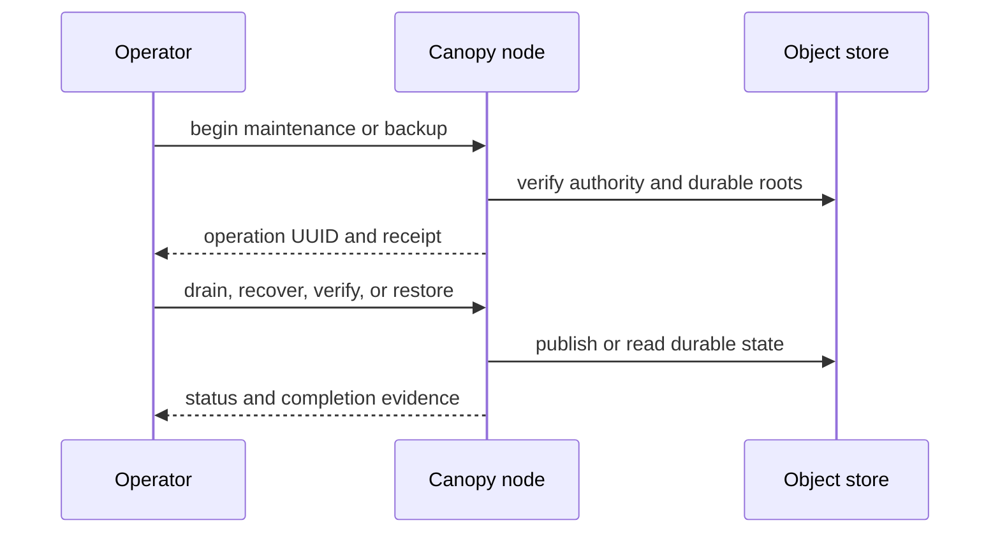

# Operate a Canopy deployment

This runbook preserves the complete deployment, maintenance, backup, restore, and push-replay procedures from the project README. Use the [bounded Linux deployment](../deploy/README.md) for the container resource profile.

> **Document type:** How-to and operations reference. **Goal:** operate nodes, perform maintenance, recover durable state, and retry uncertain writes safely.

## Operational lifecycle



## Deployment procedures

For an installation with resource ceilings, start with the
[bounded Linux profile](../deploy/README.md). Save operation UUIDs and backup
receipts outside the shell session. The commands below use an installed `canopy`
binary and the `deploy/config.json` file from the local setup; substitute your
deployment's binary and configuration paths.

| Operational task | Start with |
| --- | --- |
| Route requests across nodes | [Multiple nodes](#multiple-nodes) |
| Drain or recover a deployment | [Deployment maintenance](#deployment-maintenance) |
| Copy or restore durable state | [Backup and restore](#backup-and-restore) |
| Recover an uncertain push result | [Recover a lost push reply](#recover-a-lost-push-reply) |

Each operational flow names the identity, precondition, command, and recovery behavior it requires. Keep the UUIDs and receipts it tells you to save.

### Multiple nodes

Use the same storage prefix, tenant/application IDs, fleet/image digests, owner,
active bootstrap credential and application build on all nodes. Give each node a
distinct `node_id`, signing key, data directory and reachable `peer_endpoint`.
That endpoint must be an HTTPS origin whose TLS ingress forwards
`POST /internal/cell` unchanged to the node's HTTP listener. Public Git/API URLs
may point to a load balancer; requests do not require a sticky session.

Peer clients verify TLS certificates and hostnames using public trust roots.
For a private CA, set the optional `peer_ca_certificate` configuration field to
its PEM file path. There is no insecure TLS mode. Requests are separately signed
with the sending node's enrolled key and checked against its live advertisement.
Keep signing keys and object-store write access restricted to trusted fleet nodes:
the peer capability permits internal Cell operations, including Directory SQL.
TLS termination is trusted infrastructure; this transport does not claim mTLS.

Unknown owners and in-progress movement can return 503. After an owner stops,
the surviving gateway restores the Directory on demand; Repository Cells are
reacquired on the next request. An unclean exit requires lease expiry before
takeover. Cross-node placement races and larger hot sets still need qualification.

### Deployment maintenance

Each storage prefix has one durable tenant/application identity and a selected
compiled release. First startup initializes an empty deployment; later nodes
must match its release and configured image identity. A nonempty catalog without
release metadata is rejected. Existing preview prefixes require explicit future
migration; do not point this build at them as an upgrade.

To close admission and drain the fleet, choose a fresh operation UUID and use
the same binary and configuration as the deployment:

```bash
CANOPY_OPERATION_UUID="$(python3 -c 'import uuid; print(uuid.uuid4())')"
canopy maintenance deploy/config.json begin "$CANOPY_OPERATION_UUID"
canopy maintenance deploy/config.json status
```

`begin` records the operation before returning. Nodes observe the closed release
during lease renewal, stop ingress, drain accepted work, close SQLite and withdraw
their advertisements. The binary exits after supervised shutdown. `status` emits
JSON with the release, advertised session count, unsettled Cell count and
`drained`. Offline work must wait for `drained: true`. Expired advertisements and
owned/unpublished Cells do not count as drained. `end` requires that proof and
the matching operation UUID, then permits the same compiled release to start.
Retries use the same UUID while it remains the current operation. Replaying its
completed begin does not start a new drain. Once another operation starts, do not
replay older UUIDs; completed operation history is not retained. Save the UUID
outside the shell session if recovery might run later.

After `status` reports `drained: true` and offline work is complete, reopen admission:

```bash
canopy maintenance deploy/config.json end "$CANOPY_OPERATION_UUID"
```

The begin/status/end commands need object-store credentials, but no Git token or
node signing key. If a node dies during drain, wait for its lease to expire and
run the recovery worker with the same operation UUID:

```bash
canopy maintenance deploy/config.json recover "$CANOPY_OPERATION_UUID"
canopy maintenance deploy/config.json status
```

When recovery finishes and `status` reports `drained: true`, run `end` with the
same operation UUID as above.

Recovery needs `CANOPY_NODE_SIGNING_KEY_HEX` and an exclusively available local
`data_dir`. It enrolls a temporary node, fences expired owners, restores their
Cells one at a time and releases them. It opens no HTTP listener and needs no Git
token. Live owners, conflicting recovery claims, unresolved follower logs and
failed root verification return an error. Retry the same operation after the
reported condition is resolved; recovery never resumes serving automatically.
Do not remove authority records or force `drained` to bypass an error.

Upgrade/migration and object collection remain pending. Maintenance and owner
recovery do not provide a separate backup copy.

### Backup and restore

Use a fresh pin UUID and disjoint prefixes in the same configured bucket/provider:

```bash
CANOPY_BACKUP_UUID="$(python3 -c 'import uuid; print(uuid.uuid4())')"
canopy backup deploy/config.json create "$CANOPY_BACKUP_UUID" backups/snapshot-1
canopy backup deploy/config.json verify "$CANOPY_BACKUP_UUID" backups/snapshot-1
```

Record `CANOPY_BACKUP_UUID` with the backup receipt. Later verify and restore
commands must use that same pin UUID and the same backup prefix.

To restore into an unused destination prefix:

```bash
canopy backup deploy/config.json restore "$CANOPY_BACKUP_UUID" backups/snapshot-1 restored/service-1
```

Prefixes are full object keys within the configured bucket, not URLs or paths
relative to `storage_url`. Each command needs provider credentials, the node
signing key and an exclusively available `data_dir`; no Git token or HTTP listener
is required. Successful commands emit a JSON receipt with Cell/body counts.
For S3, Canopy uses conditional multipart copy; the store and credentials must
support that operation.

Capture requires the selected release to remain Ready. It reads every catalog
head and Cell control twice and rejects concurrent changes. On busy deployments,
stop nodes cleanly without entering Maintenance, then capture. Retry an uncertain
operation with the same UUID and destination; a new snapshot needs a new UUID.

The copy includes runtime roots, SQLite state, external Git blobs and LFS bodies.
Verification reads only the backup prefix, so the original prefix may be lost.
Restore preserves the pinned identity and release and needs matching configuration
and binary. Point a fresh node's `storage_url` at the completed destination.
An atomic prefix reservation prevents serving backups or incomplete restores.
Occupied destinations and different operations are rejected; retry the same
failed operation after repairing its reported cause. Replaying a completed restore
does not reset subsequently published service state.

This is a same-provider copy, not protection from losing the entire bucket or
provider. Cross-provider export, old-release migration, automated retention and
the complete interruption fault matrix remain pending. Do not use older binaries
that lack prefix reservations with these backup/restore destinations.

### Recover a lost push reply

For a receive-pack POST, a client or proxy can supply `Idempotency-Key` as one
canonical lowercase, hyphenated UUID. Use one ID per logical operation. Canopy
binds it to the repository, authenticated account and request digest. Repeating
the same request returns the recorded status, headers and per-ref report without
applying the refs again, including after owner takeover. Reusing an ID with
different request bytes or another account returns HTTP 409. Current token
scope and repository access are checked on every replay.

Replay requires the same body, content type and Git protocol setting. A new
`git push` invocation may generate different pack bytes; reusing its header does
not guarantee replay. An HTTP client or proxy must retain the original request.
Recorded replies include `X-Canopy-Push-Id`. If no ID was supplied, the server
generates one; a client that loses that reply cannot discover the generated ID.
Advertisements and fetches ignore this header.

The Repository Cell stages the reply in SQLite chunks, then publishes its
pointer and accepted ref updates in one transaction. Git rejection and no-op
reports are recorded too. Once a complete command list is decoded, cache
preparation and native execution failures produce durable per-ref rejections.
Retry with a new ID after recovery; the original ID replays its refusal.
Incomplete uploads, decode failures and unavailable or uncertain response
publication can still return transport errors. Response bodies are limited to
64 MiB and serialized response headers to 64 KiB. Completed records and abandoned
staging chunks currently have no expiry or collector and consume repository storage.
