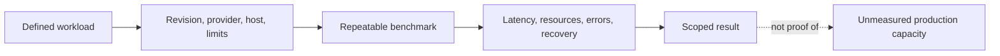

# Measure repository density and latency

Use this plan to design capacity work and interpret Canopy benchmark results.
It separates demonstrated behavior from proposed targets. The current Cellule
dependency pin is `0dc04a658bd99668936f7ec58032d054f6fbc141`, verified against
upstream main on October 1. Its [qualification checkpoint](performance/2026-10-01-cellule-main-qualification.md)
records 239 release Rust tests, 84 Python tests, lints and all eight fresh RustFS
gates, with separately retained artifacts. Retained-store upgrade and reference
performance remain open. The preceding `c51dd121` build is historical evidence.
Unlike the earlier `a4500add` documentation
advance, this changes routing and resource-permit implementation. Locked
metadata resolves all six packages; the lockfile changes only their sources.
The original rebuilt artifact passed its locked release build and 227 release
tests with 9 ignored gates; all eight real-RustFS compatibility gates subsequently
passed, as did the production binary's initial 17-step check through three nodes
and a proxy. The 84 Python harness tests cover accounting and guards. Full-corpus
recovery, scheduled load and every-ACK verification remain separate gates; none
of these functional checks establishes reference capacity.
Upstream subsequently advanced to `0dc04a6` with atomic API and test changes.
The new candidate is independently qualified; the original corpus experiment
and its frozen source remain on `c51dd121`.
The [combined authentication and residency candidate](performance/2026-10-01-bounded-authentication-and-residency.md)
is now in PR #18: 231 release tests and all eight RustFS gates passed, as did
20 unchanged cold-activation repetitions and all 15 residency tests. It has not
been deployed on the existing corpus. Descriptor compatibility passed, but
actual old-binary restore and the diagnostic fleet's terminal lease-fencing
failure remain open. The [catalog admission follow-up](performance/2026-10-01-retained-catalog-admission.md)
reproduces and fixes immutable-identity reprovisioning and late rejection of
unsupported Control metadata. Its combined candidate passed 239 release tests,
all eight RustFS gates, 20 cold-activation repetitions and 20 three-case retained
startup repetitions, plus all 15 residency tests. Retained startup uses an owned
in-memory fixture; actual old-binary RustFS upgrade remains open.
Neither checkpoint replaces the original complete performance schedule.
The [three-node proxy campaign](performance/2026-09-30-three-node-proxy.md)
retains the earlier fixture race and its regression, plus the candidate's failed
seed and successful recovery of every recorded ACK.

| Current gate | Evidence / status |
| --- | --- |
| Current Cellule revision | `0dc04a6`: independently rebuilt release correctness, lints, Python harness and eight fresh RustFS gates passed. See the latest checkpoint for repeated regressions and exact bindings. Not retained-store upgrade, live deployment or measured performance |
| Original rebuilt Cellule artifact | `c51dd121` build, 227 Rust tests, eight RustFS gates and initial 17-step proxy check passed; full 10K/100 seed closed, but remote verification failed HTTP 503. A separate 10K metadata diagnostic returned 9,999 matching identities and one 503; downstream fault/load gates stopped without owner signals. Cause unresolved |
| Combined authentication and residency candidate | First publication passed 231 release tests, eight RustFS gates, 20 cold-activation repetitions and 15 residency tests. Exact predecessor descriptor is retained; see the separately qualified catalog follow-up |
| Retained catalog admission follow-up | 239 release tests, eight RustFS gates, 20 cold-activation and 20 three-case retained-startup repetitions, 15 residency tests, lints and 84 Python tests passed. Existing supported identities restore without reprovisioning; unsupported Controls stay unchanged on refusal. Owned in-memory retained fixture, not old-binary RustFS upgrade, live deployment or performance qualification |
| Candidate Git behavior | Bound `e07670e` production artifact passed all 17 critical stock-Git steps through three nodes/proxy against RustFS |
| Mac-backed candidate seed | Failed: 3,561/10,000 identities and 39 Git/LFS fixtures; incomplete manifest retained |
| Every candidate seed ACK | All 3,561 identities and 39 populated fixtures passed fresh-owner recovery; independent ledger/binding and 78-clone audit passed |
| Native-volume comparison | Same runtime/provider limits; all 10,000 identities and 100 Git/LFS fixtures seeded in 3,179.240 s and passed initial three-owner-loss recovery; independent 200-clone audit passed |
| Native scheduled load | First attempt failed before any window. Independent-session V2 passed full preflight, then RustFS was cgroup-OOM killed: six closed windows, one interrupted prefix and 101 unstarted windows retained |
| Post-OOM diagnostic | Three old owners killed as a verified batch; 32.033-s absence wait recorded. Same provider/data restarted with memory raised from 2 to 4 GiB; full 10K/100 and critical-2 recovery passed, with independent 200-clone/four-mirror audits |
| Complete 4-GiB load attempt | All 108 windows finished: 60,197 OK and 54,763 failed arrivals. The original attempt remains failed; local raw evidence is now unavailable |
| Post-load ACK recovery | Recorded three-owner loss and 32.249-s wait; critical fixtures passed. Fresh fleet then recorded ENOSPC and shut down; full corpus and every-ACK verification are incomplete |
| Concurrent critical Git workflows | [Separate driver](../scripts/benchmark_critical_git.py) retains the 17-step suite. The versioned gate separates failed performance from mandatory correctness recovery; no live critical-load/fault result is established |
| Evidence availability | Old benchmark directories and executable disappeared; old receipts remain unavailable. New closed artifacts, all build bindings and the completed seed have verified backups on a separate filesystem outside Cargo targets; changing outputs are excluded |
| Performance qualification | Latest full-corpus recovery, scheduled load, every post-load ACK, critical-operation load/fault coverage, higher admission profiles and matched comparisons remain open |

The [native-filesystem trial](performance/2026-10-01-native-filesystem.md)
records the storage hypothesis, graceful diagnostic drain and new bindings.
The [evidence-loss checkpoint](performance/2026-10-01-evidence-loss-and-c51dd121.md)
supersedes its earlier running/retained-artifact status. Historical observations
are not currently replayable; a new run cannot certify the old ACKs.
The separate diagnostic build passed 230 release workspace tests with 9 ignored
after isolating a concurrent-fork cleanup test and adding fence-safety coverage.
All 20 subsequent full-library repetitions passed at four test threads.
That local test finding does not explain the Directory 503, change production
cleanup or qualify its original frozen artifact. The cleanup-test correction is
included in the combined candidate; temporary diagnostic logging stays outside
the PR.
No Cellule bottleneck or matched performance improvement is proven. The 4-GiB
diagnostic is a new resource envelope, not a passing 2-GiB result. Offline plans
for 500/1,000-entry admission retain the full matrix but have not been executed.
The [workspace/RustFS verification](performance/2026-09-30-workspace-rustfs.md)
and the retained three-node baseline use `70bd25f142f1976fdd63ffe60e46e15ae276ffdc`.
That baseline stopped after 20 fully bound windows and one interrupted creation
window when all three owners fenced. All 136 acknowledged creations and both
critical Git fixtures passed fresh-state recovery. The full original corpus
recheck failed with a 30-second identity-read timeout; separate successful read
probes do not turn that attempt into a pass. Failed results stay in the record.
Earlier results do not establish the new candidate's density or latency.

The [chunk-count follow-up](performance/2026-09-30-chunk-count.md) removes
quadratic upload scans from command verification and records its verification
state separately. This transaction optimization is not a 10,000-repository
throughput qualification.

The [earlier `30671d5` complete-corpus diagnostics](performance/2026-09-30-full-corpus.md)
record all 10,000 identities and 100 seeded Git/LFS fixtures passing verification.
The single-gateway matrix dropped eight scheduled arrivals, and matched warm
metadata windows missed latency targets. All 29 acknowledged generated Git refs
and 60 acknowledged LFS uploads survived owner kill and fresh-state recovery.
A separate full seeded-corpus recovery attempt through fresh gateways failed
with a cold-transition HTTP 503. The two-ingress matrix also failed five arrivals;
it is diagnostic while that gate remains open. These shared-Mac results do not
qualify the Linux reference target.

The [cold-owner race follow-up](performance/2026-09-30-cold-owner-race.md)
adds a synchronized regression and live-owner routing fix. Its debug and release
suites passed, and 59 acknowledged refs plus 120 LFS uploads survived fresh-state
recovery after both old gateways were killed. Its separate complete-corpus
replay still failed on a cold transition at index 4,757; the peer subsequently
restored the exact UUID. Its own matrix also failed: 2,104 of 3,880 arrivals
succeeded on the heavily loaded shared host. After another two-owner kill,
all 73 acknowledged refs and 149 LFS uploads across three matrices survived
fresh-state recovery. Neither passing suites nor acknowledged-write recovery
close the full-recovery, load or latency gates.

> **Document type:** How-to and evidence reference. **Goal:** design a repeatable workload, record its resource envelope, and avoid turning one measurement into a general capacity claim.



## Read the result before the target

| Question | Current answer | Where to verify it |
| --- | --- | --- |
| Can large Git and LFS bodies survive fresh-disk recovery? | Yes, in a release-mode local RustFS run on an earlier Cellule pin with a Git blob and LFS object above 5 GiB | [Recorded large-transfer qualification](#recorded-large-transfer-qualification) |
| Can a bounded Linux node recover 1,000 repository identities? | Yes, in a mostly empty SQL-only corpus; 997 repositories were empty | [Bounded Linux density qualification](#bounded-linux-density-qualification) |
| Did that run meet every warm metadata latency target? | No; some p95 and p99 targets were missed | [Bounded Linux density qualification](#bounded-linux-density-qualification) |
| Is 10,000 repositories per node a measured capacity? | No; the earlier `30671d5` reconciled corpus passed full verification, but its single-gateway load matrix had dropped arrivals. Current-pin capacity and the reference Linux workload remain unqualified | [Earlier corpus and load](performance/2026-09-30-full-corpus.md), [latest verification](performance/2026-09-30-workspace-rustfs.md) and [qualification rules](#performance-qualification-rules) |
| Is idle ownership proven at 1,000 active Cells? | An earlier `a3fbfb0` pin passed local SQL-only RustFS renewal-coverage windows. Repetition on the current final artifact, the reference Linux node and foreground load remains unqualified | [Historical merged-pin real-store idle qualification](#merged-pin-real-store-idle-qualification) and [latest artifact's open gates](performance/2026-09-30-workspace-rustfs.md#verification-gates) |

The [implementation order](#implementation-order-and-acceptance) defines work still needed. The [measurement history](#measurement-history) records the revision, hardware, provider and workload for individual runs. Compare those four inputs before combining numbers from different sections.

The current Cellule pin dispatches due owner renewals oldest-first and refills
the bounded 32-task renewal window when I/O completes. A 100-ms scan rebuilds
pending candidates, removing stale generations and departed Cells. This removes
the earlier 320-starts/s *scheduler* ceiling; it does not lower the one-control-
update-per-active-Cell cost or prove that a provider can sustain the required
update rate. Historical local SQL-only RustFS proof covers 1,000 active Cells
on `a3fbfb0`, not this final artifact. Repeat it on the current artifact and
the reference Linux node under foreground load before raising the
active Cell limit or claiming 1,000- or 10,000-Cell production residency. This
dependency and lockfile change also changes Canopy's compiled release digest;
test against a fresh store prefix or use the documented maintenance upgrade
path for an existing deployment.

## Recorded large-transfer qualification

The release-mode `scripts/qualify_size.py --docker-volume --release` gate passed
against a local RustFS S3-compatible provider with Cellule revision
`cfcc00a7144414e0437d490ad94b5beb9152f6a3`. A
595,260,810-byte Git pack produced a 591,101,952-byte Repository Cell database.
The same run uploaded a 5,377,097,728-byte LFS object, restarted with fresh
local storage, cloned the repository, passed `git fsck --strict --full`, and
downloaded the LFS body with matching size and SHA-256. The restored large Git
blob also matched its independent SHA-256 reference.
The six additional real-provider tests passed SHA-256, native merge candidates,
signed push options, signed SSH, bulk refs, and filtered clones. Cold fetch
preparation hydrated 901 reachable blobs (5,966,921,728 bytes) in about 109
seconds. This is functional size and recovery proof on the local provider; it
does not establish production-provider latency or repository density.

The GitHub-hosted size gate has not repeated that pass. RustFS returned a
write-quorum HTTP 500 while staging the large Git blob, and the runner then
reported `No space left on device`. Ordinary CI now runs the smaller
`--provider-only` compatibility suite. The separate manual
`Qualify large Git and LFS transfers` workflow requires a runner labeled
`canopy-large-transfer`; provision at least 40 GiB free on both scratch and
Docker's data volume, plus Rust 1.97 or newer and Docker daemon access. Its
preflight checks both before uploading, and it still
requires the full non-sparse Git and LFS round trip before a release claim.
If no such runner is connected, this gate remains unqualified rather than
silently passing on an undersized GitHub-hosted runner.

## Required outcome

A node must serve thousands of repository identities, each with its own
Repository Cell, while keeping resource usage bounded and common requests fast.
Ordinary Git objects remain authoritative in SQLite. Large Git blobs and LFS
bodies remain immutable objects in the configured object store. Git smart HTTP
continues to work with stock clients.

The expanded objective also requires KV, queue, workflow, Blob, Cron, Timer,
durable effects and projections in each same repository Cell. The current
SQL-only benchmark is a baseline; complete capability integration and mixed
primitive workloads are required before density qualification is complete.
See [the repository Cell capability proposal](repository-cell-primitives.md).

Repository count, open Cell count and simultaneous Git work are separate
capacity dimensions. Report all three in every capacity claim. The initial
qualification target is 10,000 repositories on one 8-vCPU, 32-GiB Linux node
with local NVMe and same-region object storage. It is a proposed target, not
measured capacity. Uniform access and concentrated traffic require separate
results; a small active set cannot establish uniform-access performance.

## Blobless fetch preparation

`--filter=blob:none` now prepares ref/tag targets and non-blob history reachable
from the requested wants through certified object edges. Full push preparation
retains its sequence cursor. A fresh-disk integration test proves that two large
blobs start absent, lazy reading one hydrates only that blob, and deleted-ref
objects remain unavailable even after full hydration. A separate cold-branch
test checks that unrelated live commit/tree history stays absent until fetched.
SQL work-bound tests exercise 10,000 stored objects. These are local correctness
and query-work gates, not latency or real-provider throughput measurements.
Full fetches and other filters now enumerate missing blobs reachable from the
requested tips using native `rev-list --objects --missing=print`. HTTP and SSH
share this path; IDs stream through batches of at most 128, using the existing
bounded Cell object reads and verified cache writes. The regression fixture has
three independent 2 MiB blobs. A cold single-branch clone loads its 2 MiB blob
while the other live branch and deleted branch remain absent; fetching the other
branch adds its blob and leaves the deleted branch absent. This runs for v0/v2
over both transports, and establishes reduced preparation, not a latency target.

Preparation logs report newly hydrated blob counts/bytes and elapsed time.
Concurrent fetches of one repository now share the immutable object cache
without holding its gateway mutex for the entire preparation. Verified loose
objects publish atomically; writers for the same object ID converge while
different IDs may hydrate in parallel. Writer locks allocate only when an object
cache first hydrates an object, not for each disposable ref snapshot. A cold
concurrent stock-Git clone test
checks complete packs and `git fsck`. This removes one serialization point;
it does not establish hot-repository throughput or a 10,000-repository result.
Push upload spooling uses private, budgeted scratch files and can now proceed
concurrently for one repository. The push transaction—from idempotency check
and gzip decoding through native Git execution and durable publication—remains
serialized per repository. A stalled upload regression test checks that a
second push can finish receiving before the first upload completes; it does
not establish parallel publication capacity.
The native walk still traverses requested history on warm requests; native Git's
own traversal memory is not bounded by the Rust batch size. Structural hydration
pages certified edges and retains a visited set proportional to the requested
graph. Filters other than exact `blob:none` can still hydrate blobs that the
resulting pack omits. Narrowing those costs and measuring cold/warm latency
remain open.

## Node design and resource model

Use three residency states independently of repository identity. Only cold and active behavior are implemented today; retained, verified database files without an open Cell are a proposed runtime capability.

```text
Cold ── request + fenced restore ──► Active
  ▲                                  │   │
  │ release ownership;               │   │ proposed close with
  │ discard local files              │   │ verified retained files
  └──────────────────────────────────┘   ▼
                                Cached (not implemented)
                                         │ validate root + reopen
                                         └──────────────────────► Active
```

The states have different retained resources and request paths:

| State | Retained resources | Request path |
| --- | --- | --- |
| Cold | Durable Cell identity, roots and external bodies | Acquire fenced ownership, restore and activate |
| Cached | Verified local database/object files under a disk budget; no open SQL handle or per-repository worker | Validate authority and cache generation, then reopen through the runtime |
| Active | Cell handle, bounded SQL state and request/background pins | Route to the owning worker; enqueue within its admission budget |

Closing a SQL handle, releasing Cell ownership and deleting cached files are
separate decisions. Every transition must account for foreground streams and
primitive obligations. A waiting workflow is durable state; runnable work and
active leases require lifecycle checks before the Cell can sleep.

Share SQL workers, native Git workers, object-store connections and scheduler
runners across repositories. Do not allocate a thread, connection pool, polling
loop or independent timer task for every repository. Use indexed durable due
work and a bounded scheduler that activates only due Cells. Queue and workflow
state stays inside the repository's Cell; the node scheduling index must be
reconstructible and reconcile missed updates after crashes.

Derive active admission from measured resource consumption:

```text
node memory = fixed runtime + active Cell state + Git workers
            + transfer buffers + pending work + filesystem/cache charges

active limit <= min(memory allowance / measured Cell allowance,
                    descriptor allowance / measured Cell descriptor count,
                    runtime active-Cell limit minus lifecycle headroom)
```

This is a sizing model, not an enforcement mechanism: allocations still need
reservations and the deployment needs aggregate memory/process/disk ceilings.
Use representative high-water measurements with all primitive schemas installed;
SQL page-cache settings alone do not measure a Cell. Reserve separate capacity
for Directory requests, lease renewal, durable publication and shutdown.
Bound disk cache and restore scratch independently. Per-account admission limits
one account to at most half the global cold transition and transfer capacity. Further
scheduling fairness needs mixed-account load evidence.

Warm request latency should consist of authentication, routing, a short SQL
operation and response delivery. Measure each term before introducing caches.
Durable writes must include the runtime's publication work before success;
object-store round trips therefore need a separate write-latency target.
For bulk Git and LFS, report first-byte latency and throughput separately from
metadata latency. Reuse immutable Git objects and pack data across ref changes;
serve ref discovery without a full object hydration where the wire protocol
permits it.

## Current evidence and constraints

- The required `max_active_repositories` setting admits 1–9,999 repository
  entries plus one reserved Directory SQL slot. The example uses 100; the initial
  density run and fault fixtures use three. The runtime uses its CPU-sized SQL
  worker pool, capped at sixteen.
  Thirty-two supervised cold/remote transitions may execute or wait, with a
  sixteen-transition ceiling per authenticated account and a shared anonymous
  bucket of sixteen; excess admission receives 503. Ready local routes bypass
  that queue. These are qualification limits, not measured production capacity.
- Ready local routes pin under a short registry lock. Ownership transitions
  serialize per repository; unrelated cold admissions may execute concurrently.
  Slots cover in-flight activation as well as loaded entries, and eviction
  transfers a slot only after confirmed owner release and local cleanup.
- Ready repository activation verifies its immutable owner using a read-only
  query; only pending repositories publish owner initialization. This avoids a
  redundant durable command on restore or remote binding. The initial density
  measurements below predate this optimization.
- Remote routes still verify authoritative ownership. Authentication and name
  lookup still execute in the Directory Cell; local residency does not bypass
  those authorization boundaries.
- All releases still require Cellule's generation check, settled-work preflight,
  worker close and authoritative owner release before local cleanup. Candidates
  are advisory. Request pins and runtime preflight protect different lifetimes.
- The pinned runtime accepts a bounded shared SQL pool and has a CPU-derived
  `SqlWorkerPool::for_system` constructor. Its 10,000-active-Cell upper bound
  includes the Directory Cell; it is an API limit, not a capacity result.
- The managed SQLite connection requests a 64-KiB page cache. That is not the
  total Cell footprint or a hard process-memory limit.
- Eviction deletes local SQLite state. Git snapshot refresh seeks through new
  object metadata using an insertion cursor and reuses verified immutable bodies from a repository-scoped
  cache. Each native push/merge has a private writable generation; successful
  publication precedes hydration of its new objects into the shared cache.
- Demand-driven `release_idle_cell` now has a separate 32-in-flight,
  32-completions-per-second budget; automatic pressure shedding retains its
  two-in-flight, two-completions-per-second budget. A successful release also
  deletes the local SQLite state. At 100 active slots, a first-pass scan of
  10,000 distinct locally owned repositories requires at least 9,900 releases:
  even a saturated requested-release budget needs about 310 one-second
  windows, before restore, Git work or network time. This is a code-derived
  rate bound, not a measured scan. Bursts can still receive a capacity error
  after Canopy's single one-second retry. Do not interpret the 10,000 identity
  target as a uniform-access pass until this path is qualified.
- Eight shared heavy-request slots and four active and four pending slots per
  account prevent one account from filling every transfer wait position. The
  bounded Linux profile establishes containment, not latency, throughput or
  thousands of active repositories. Its tmpfs charges cache bytes to memory;
  density qualification needs a separate bounded NVMe-backed profile and
  mixed-account latency measurements.
- The Linux profile sets both process descriptor limits to 16,384. Its checker
  requires eight per admitted Repository/Directory Cell plus 1,024 headroom;
  this is a reservation check, not measured aggregate process capacity.

These facts come from `crates/canopy-server/src/server/mod.rs` and its residency
module, the server crate's Git gateway, Git cache and repository HTTP modules,
`deploy/compose.yaml`, and the pinned Cellule runtime/worker and LTX/db sources.

## Idle ownership cost

The pinned runtime also has a density cost independent of user traffic.
`cellule-runtime/src/publication.rs` schedules each idle active publisher for
renewal three seconds after its previous successful renewal or publication.
`CellPublisher::renew` advances Cell control progress through
`CellAuthority::transition`, which performs a conditional object-store update.
`actor.rs::start_due_renewals` bounds concurrent renewals at 32; it still scans
and renews individual active Cells. Coordination pauses new SQL for that Cell
while renewal is in progress.

For 1,000 otherwise idle active Cells with short provider latency, this implies
approximately 333 control updates per second; 10,000 would imply approximately
3,333. These are scheduling estimates, not measured provider request counts.
Runtime scheduling, provider latency, writes, compaction and retries change the
actual rate. The Directory and node advertisement add their own work. Shared
SQL workers therefore do not, by themselves, establish cheap idle residency.

Add a no-traffic interval at 100, 500 and 1,000 active Cells. Measure conditional
updates, reads, bytes, CPU and renewals in flight, then compare with released
Cells retaining only validated disk cache. Count failures and retries separately.
Before optimizing, audit whether existing node-session fencing can safely replace
redundant per-Cell liveness writes while preserving Cell epochs and root CAS.
Canopy's takeover already requires an expired-session takeover proof, but every
runtime recovery, routing, maintenance and standalone caller must satisfy the
same contract before changing renewal policy. This is dependency design work,
requires approval, and cannot be implemented by simply increasing a timeout.

## Implementation order and acceptance

### 1. Baseline and request isolation

Deliver a repeatable black-box capacity driver with a fixed seed and a corpus
manifest. Create repositories through the public API, populate them with stock
Git, and exercise metadata, browsing, ref discovery, incremental fetch, clone,
push and LFS. Include empty, small, large-history and large-blob repositories.
Keep fixtures on the dedicated qualification volume and use a disposable store
prefix. Load generation runs off-node. Record the binary and dependency revisions,
Git/provider versions, hardware, network placement and cgroup settings.

Measure cold transition queue time, ownership lookup, restore, initialization,
SQL queue/execution, object hydration, pack generation and durable publication.
Collect RSS/cgroup peak memory, CPU, descriptors, scratch/cache/WAL bytes,
object-store request counts and bytes, errors, queue depths, evictions, hits and
misses. Histograms must distinguish warm and cold paths and operation classes.
Avoid per-repository metric labels; use sampled traces for repository detail.

Acceptance: paused ownership lookup and release do not block an unrelated warm
repository's metadata or stock Git discovery. Concurrent requests for the same
cold repository converge on one serving entry. All pins, denied/lost release,
cleanup failure, cancellation and shutdown tests continue to pass. The lock
isolation part is implemented. The automated bounded-container run still measures
metadata and Git v2 discovery, with stock Git sampling and full identity recovery
checks. The standalone driver can schedule clone, cold/incremental fetch, pull,
unique-ref push and direct-basic LFS transfers, but those workloads have not
been qualified at target scale.
Transition queue/service timings are logged. Comprehensive resource metrics and
independent load-generator deployment remain open.

### 2. Measured active-Cell admission

The CPU-sized bounded SQL worker pool and explicit node residency limit are
implemented. Set `max_active_repositories` to 100, 500 or 1,000 for each qualification
run; use a separate node workspace for each. Select the active-Cell allowance from
measured memory, descriptor and disk budgets, retaining Directory and lifecycle
headroom. The setting enables those measurements; a larger configured count alone
is not evidence of sustainable capacity. Do not simply replace three with ten thousand. Account for native Git
and outgoing streams separately from SQL connection caches.

Per-repository activation guards and atomic slot reservations are implemented.
Successful same-repository activation is reused by waiting callers; failures
remain retryable through the existing lifecycle states. The node admits at most
32 supervised transitions, including queued waiters. Canceled clients cannot
abandon acquired ownership. Eviction claims a candidate guard without waiting
and makes it unavailable under the request-pin lock. An account can hold at most
sixteen of the thirty-two transition slots;
anonymous traffic shares its own sixteen-slot bucket. The task retains both
charges through client cancellation. Ready local routes bypass this admission.
This bounds one account's share. Transfers also apply a half-node account
ceiling; combined-account scheduling fairness and resource-derived restore
concurrency still need qualification.

Acceptance: runs with 100, 500 and 1,000 active repositories within the same
10,000-repository corpus publish their measured limits. A cold storm and a hot
repository cannot exhaust lifecycle capacity or violate other repositories'
latency budget. Full residency produces bounded backpressure with no overshoot.

### 3. Warm disk state independent of open Cells

Add a runtime-supported close/reopen or validated cache-restore contract.
A retained file is never serving authority. Cache manifests must bind exact Cell
identity, incarnation, schema/release and authoritative root, and reject stale or
corrupt data before serving. Keep ownership fencing and durable publication in
the runtime. Dependency changes need their own review and approval before pinning.

Account for cache bytes and use measured value/size and recent reuse for eviction.
Keep hard safety ceilings and headroom for an admitted push or restore. A scan
across cold repositories must not continually evict the useful working set.

Acceptance: repeated access avoids redundant downloads where cached roots are
valid; changed roots, takeover, corruption, disk pressure and interrupted cleanup
still restore exact Git/LFS contents and reject stale writers.

### 4. Incremental Git object and pack caches

Separate immutable object caching from versioned ref snapshots. A successful
push adds missing objects; a ref update does not rewrite all prior objects.
Keep snapshot/cache generations pinned through native worker completion and
stream consumption. Retain verified objects across derived pack generations;
use native Git pack/index and bitmap reuse where benchmark evidence supports it.
All derived data remains disposable and resource-accounted.

Immutable body reuse is now wired through shared Git alternates and private
snapshot directories. Old fetches retain their snapshot and object owner; native
write failures cannot contaminate the reusable objects. An indexed insertion
cursor now limits refresh to newly published headers, with a captured upper bound
and progress committed only after a complete page verifies. Derived pack/bitmap
reuse and representative large-history throughput measurements remain open.

Metadata and ref discovery must not require hydrating every stored object.
Git v2's initial capability GET now uses native Git with a temporary empty
repository after authorization and a bounded default-branch read. It avoids
both ref enumeration and object hydration. The subsequent `ls-refs` and fetch
POSTs still prepare the repository snapshot; this change alone does not remove
hydration from the complete clone or `ls-remote` operation.
Fetch/push preparation must preserve connectivity, object availability and
request-consistent refs. Hidden or unauthorized repository data cannot be exposed
through a cache hit. Preserve branch rules, CAS updates, atomic/mixed outcomes
and exact push-reply replay.

Acceptance: a small commit added to a large warm repository incurs incremental
hydration/write work. Concurrent old/new snapshot fetches, force pushes, deletes,
owner recovery and cache eviction reproduce exact results with strict fsck.

### 5. Routing, bulk traffic and production envelope

Use Cell owner affinity and generation-validated route caching. Never use a
location cache as ownership authority. Measure the Directory separately;
isolate its execution capacity before deciding whether sharding is warranted.
Authorization caches require an explicit invalidation/version-check contract
that preserves token revocation and privacy changes.

Separate metadata, cold restore, Git compute, LFS transfer and maintenance
admission within an aggregate node budget. Evaluate signed object-store LFS
transfers after upload verification/publication is defined for that path.
Any write batching must retain the runtime's durable acknowledgement boundary.

Acceptance: run same-region stock clients through an extended mixed-workload
soak, cold storm, noisy neighbor, SIGKILL/takeover and resource pressure. Restore
acknowledged refs, collaboration and LFS bytes exactly. Record operator-visible
backpressure and recovery time, not only successful throughput.

## Performance qualification rules

Proposed warm metadata targets on the reference node are p95 below 20 ms and p99
below 50 ms, measured by the external client with authentication and response
consumption included. Establish sustainable offered request rate experimentally
and publish it alongside latency and error rate. Use scheduled arrival times to
include queue delay and avoid coordinated omission. Maintain a bounded driver;
count dropped arrivals and timeouts as failures, never omit them from results.

Run skewed and uniform distributions across 10,000 identities, each with 100,
500 and 1,000 active repositories. Vary simultaneous pack workers independently.
For uniform access, report successful releases per second, movement-budget
rejections, retry outcomes and cold-admission failures. The new demand-driven
release budget retains generation checks, settled-work preflight and
authoritative release while keeping automatic pressure shedding paced; measure
whether its configured rate is sustainable for memory, disk and the object
store. A higher admission limit alone is not a capacity result.
Report cold activation latency by database size, local cache state and restore
bytes. Report clone/fetch first-byte latency, throughput, CPU per transferred GiB
and object-store cost. Write latency includes durable acknowledgement.

Publish the failing envelope as well as the passing envelope. No throughput
claim follows from a compile, an in-memory test, or the runtime's maximum Cell
count. The delivery gates in `delivery-plan.md` remain authoritative for the
full hosting service.

## Dependency references

- [SQLite cache size](https://www.sqlite.org/pragma.html#pragma_cache_size):
  suggested page-cache budget; not an aggregate RSS ceiling.
- [Git pack-objects](https://git-scm.com/docs/git-pack-objects): packed-object,
  delta and bitmap reuse.


## Running the initial density driver

`scripts/benchmark_repositories.py` authenticates using the existing
`CANOPY_GIT_TOKEN` environment variable. Point it at a dedicated Canopy instance
and disposable storage prefix. It creates private repositories; it does not
remove them. Keep generated client checkouts on the mounted qualification volume.
The provider fixture owns storage cleanup, separately from the benchmark.

Choose the operation by the work you intend to measure:

| Operation | Actual work | Validation / eligible corpus |
| --- | --- | --- |
| `metadata` | Authenticated repository API read | Exact UUID; all identities |
| `refs` | Git v2 capability-only HTTP discovery; legacy operation name | Version-2 advertisement; all identities, **not** a ref-listing measurement |
| `ls_remote` | Stock Git v2 `ls-refs`, with client-side `main` output filtering | Exact advertised `main` tip; populated repositories |
| `clone`, `cold_fetch` | Stock Git full clone or empty-client fetch | Seeded tip; populated repositories |
| `incremental_fetch`, `incremental_pull` | Stock Git transfer from a prepared base-only client | Incremental tip/content; two-commit repositories |
| `push_branch` | Stock Git durable push to a unique ref | Native success; all identities |
| `lfs_download`, `lfs_upload` | Direct-basic verified LFS body transfer | Size/hash for downloads; unique IDs for uploads |

New reports distinguish the two discovery operations with `git_discovery_kind`.
Historical `refs` rows below retain their recorded numbers but describe
capability-only discovery, even where their old label says "Git v2 refs".
`ls_remote` verifies a real reference advertisement. Its output pattern does
not promise a server-side prefix filter; the observed Git client requests the
ref advertisement and filters its output locally.

```sh
python3 -B scripts/benchmark_repositories.py --base-url http://127.0.0.1:8080 \
  --manifest "$HOME/Workspace/crabbuild-target/canopy-density/corpus.json" \
  seed --repositories 1000 --populated 3 \
  --work-dir "$HOME/Workspace/crabbuild-target/canopy-density/seed"
python3 -B scripts/benchmark_repositories.py --base-url http://127.0.0.1:8080 \
  --manifest "$HOME/Workspace/crabbuild-target/canopy-density/corpus.json" \
  run --active-repositories 1000 --distribution uniform --operation metadata \
  --rate 10 --duration 30 --concurrency 32 \
  --output "$HOME/Workspace/crabbuild-target/canopy-density/uniform.json"
python3 -B scripts/benchmark_repositories.py --base-url http://127.0.0.1:8081 \
  --manifest "$HOME/Workspace/crabbuild-target/canopy-density/corpus.json" \
  verify --work-dir "$HOME/Workspace/crabbuild-target/canopy-density/restored"
```

Create the report parent directory first; seed/verify require fresh work
directories, and measurement refuses existing output files. For another
checkout/run, use a different qualification directory. `verify` may target a
new node URL after owner takeover. It checks every identity and clones each
populated sample with Git v0/v2, exact commit/file hashes and strict fsck.
It runs serially by default; `verify --concurrency 4` checks a bounded batch of
four identities at a time. Record that setting because concurrent restores
change the offered load and may expose capacity failures.

The default sample contains three one-commit repositories; the remainder are
empty. This is a density smoke corpus, not realistic large-history qualification.
An interrupted seed leaves an explicitly incomplete manifest and cannot be used
as a complete corpus. Names have a unique prefix; the manifest records them.
The default seed remains a version-1, one-commit corpus. Use
`seed --incremental-fixture` with a new manifest and storage prefix to create
version 2: each populated repository has a `benchmark-base` ref at its first
commit and `main` one commit ahead. `verify` accepts both versions.

For a multi-gateway read run, seed the documented 10,000-repository corpus,
start two nodes against the same deployment, and pass each ingress to `run`:

`serve_two_gateways.py` can start those nodes from an existing deployment
configuration and complete manifest. It creates distinct node identities and
signing keys, fronts each node with a trusted local HTTPS peer endpoint, and
prints both HTTP ingress URLs as JSON. Set the same object-store credentials and
Git token used by the seed, choose a new local work directory, and keep the
process running while benchmarking:

```bash
CANOPY_GIT_TOKEN=... python3 -B scripts/serve_two_gateways.py \
  --binary target/debug/canopy \
  --config-template /path/to/deployment-config.json \
  --manifest /path/to/canopy-corpus.json \
  --work-dir /path/to/new-two-gateway-workspace \
  --max-active-repositories 500
```

The launcher preserves node logs and local state after Ctrl-C and never deletes
objects from the configured store. Its active-Cell override is per node; choose
it within the node's memory, descriptor, and local-disk budget. A successful
startup proves neither throughput nor correctness of a mixed workload.

```bash
python3 -B scripts/benchmark_repositories.py \
  --base-url http://127.0.0.1:8080 \
  --manifest /path/to/canopy-corpus.json \
  seed --repositories 10000 --populated 100 \
  --work-dir /path/to/canopy-seed
python3 -B scripts/benchmark_repositories.py \
  --base-url http://127.0.0.1:8080 \
  --additional-base-url http://127.0.0.1:8081 \
  --manifest /path/to/canopy-corpus.json \
  run --active-repositories 1000 --distribution uniform \
  --operation refs --rate 20 --duration 120 --concurrency 32 \
  --output /path/to/canopy-two-gateway-refs.json
python3 -B scripts/benchmark_repositories.py \
  --base-url http://127.0.0.1:8080 \
  --additional-base-url http://127.0.0.1:8081 \
  --manifest /path/to/canopy-corpus.json \
  run --active-repositories 100 --distribution skewed \
  --operation clone --rate 2 --duration 120 --concurrency 8 \
  --work-dir /path/to/new-client-clone-scratch \
  --output /path/to/canopy-two-gateway-clones.json
python3 -B scripts/benchmark_repositories.py \
  --base-url http://127.0.0.1:8080 \
  --additional-base-url http://127.0.0.1:8081 \
  --manifest /path/to/canopy-corpus.json \
  run --active-repositories 1000 --distribution uniform \
  --operation push_branch --rate 5 --duration 120 --concurrency 8 \
  --work-dir /path/to/new-client-push-source \
  --output /path/to/canopy-two-gateway-pushes.json
```

The run assigns scheduled requests to ingresses by sequence number and records
each ingress's outcomes and latency percentiles. Compare the same workload with
one and two ingresses and collect node, object-store, and client resource metrics
separately. `clone` measures a stock-Git full clone and verifies the seeded commit
and README hash. `cold_fetch` initializes an empty bare client and fetches
`refs/heads/main`; substitute it for `clone` with a separate fresh client work
directory and report. Both select only populated repositories, so the sample
above exercises 100 of the 10,000 identities. Disposable client checkouts are
removed after each attempt; the caller-supplied work directory itself remains.
Client Git and disk work is included in latency. `push_branch` creates one local
commit and pushes it to a unique `refs/heads/canopy-benchmark/<run-id>/<sequence>`
ref for each arrival. The report records the run ID and commit; pushed refs
remain in the disposable corpus for inspection and must be included in its
eventual cleanup. The first push to a repository transfers objects, while later
pushes of the same commit mainly measure ref publication. Source commit setup is
outside the scheduled interval. Interpret those as different workloads. The
version-1 runs above do not measure incremental fetch, pull, LFS, or
large-history throughput.

For an incremental fetch and pull run, use a separate version-2 corpus. The
driver first fetches each selected base ref into a local bare template, outside
the arrival clock, then gives every arrival a fresh client that shares that
base object store. `incremental_fetch` fetches `main` into a bare client;
`incremental_pull` fast-forwards a checked-out client and verifies the new
file. Use distinct fresh work directories and output paths:

```bash
python3 -B scripts/benchmark_repositories.py \
  --base-url http://127.0.0.1:8080 \
  --manifest /path/to/canopy-incremental-corpus.json \
  seed --repositories 10000 --populated 100 --incremental-fixture \
  --work-dir /path/to/canopy-incremental-seed
python3 -B scripts/benchmark_repositories.py \
  --base-url http://127.0.0.1:8080 \
  --additional-base-url http://127.0.0.1:8081 \
  --manifest /path/to/canopy-incremental-corpus.json \
  run --active-repositories 100 --operation incremental_fetch \
  --rate 2 --duration 120 --concurrency 8 \
  --work-dir /path/to/new-incremental-fetch-clients \
  --output /path/to/canopy-incremental-fetch.json
python3 -B scripts/benchmark_repositories.py \
  --base-url http://127.0.0.1:8080 \
  --additional-base-url http://127.0.0.1:8081 \
  --manifest /path/to/canopy-incremental-corpus.json \
  run --active-repositories 100 --operation incremental_pull \
  --rate 2 --duration 120 --concurrency 8 \
  --work-dir /path/to/new-incremental-pull-clients \
  --output /path/to/canopy-incremental-pull.json
```

Template preparation is real server traffic and can warm both gateways; its
elapsed time is recorded separately. These runs measure one-commit incremental
transfers, not large histories or cold-cache startup. Client-side shared clone
setup is included in each attempt's latency. Report node and generator resource
usage alongside the latency distribution.

For LFS basic-transfer load, seed a separate disposable corpus with a declared
body size, then run both read and write workloads through the two ingresses:

```bash
python3 -B scripts/benchmark_repositories.py \
  --base-url http://127.0.0.1:8080 \
  --manifest /path/to/canopy-lfs-corpus.json \
  seed --repositories 10000 --populated 100 --lfs-fixture-bytes 4194304 \
  --work-dir /path/to/canopy-lfs-seed
python3 -B scripts/benchmark_repositories.py \
  --base-url http://127.0.0.1:8080 \
  --additional-base-url http://127.0.0.1:8081 \
  --manifest /path/to/canopy-lfs-corpus.json \
  run --active-repositories 100 --operation lfs_download \
  --rate 2 --duration 120 --concurrency 8 \
  --output /path/to/canopy-lfs-download.json
python3 -B scripts/benchmark_repositories.py \
  --base-url http://127.0.0.1:8080 \
  --additional-base-url http://127.0.0.1:8081 \
  --manifest /path/to/canopy-lfs-corpus.json \
  run --active-repositories 1000 --operation lfs_upload \
  --lfs-bytes 1048576 --rate 2 --duration 120 --concurrency 8 \
  --output /path/to/canopy-lfs-upload.json
```

Seed stores one LFS object per populated repository and `verify` checks its
size and SHA-256. Download attempts stream and hash the full response. Upload
attempts use unique object IDs; their IDs are in the sample file and the
objects remain in the disposable corpus. The driver uses Canopy's direct basic
PUT/GET endpoints, not a stock `git-lfs` batch/checkout flow. It limits fixture
and per-upload bodies to 16 MiB and nominal concurrent payload bytes to
256 MiB; that is not a process-memory ceiling. The separate large-transfer
qualification covers multi-GiB objects. As with
Git, client CPU/disk and network placement must be reported to attribute
throughput.

Run `--operation refs` for Git v2 discovery or `--distribution skewed` for 90%
of requests to the selected working set's first tenth. A fixed seed determines
working-set selection and offered arrivals. The driver never calls a working set
warm automatically: its count is not the server's resident count. Prewarm a set
that fits the node before claiming warm latency, or label the run as cold/mixed.

For actual stock-Git ref listing through both gateways, use a populated working
set and a fresh client directory. This example uses all 100 populated fixtures
in the declared 10,000-identity corpus; it does not visit every identity:

```sh
python3 -B scripts/benchmark_repositories.py \
  --base-url http://127.0.0.1:8080 \
  --additional-base-url http://127.0.0.1:8081 \
  --manifest /path/to/canopy-corpus.json \
  run --active-repositories 100 --operation ls_remote \
  --distribution uniform --rate 5 --duration 60 --concurrency 8 \
  --work-dir /path/to/new-ls-remote-clients \
  --output /path/to/canopy-two-gateway-ls-remote.json
```

Each HTTP worker reuses a connection; stock-Git attempts use fresh client
repositories. Arrivals follow a fixed clock schedule;
end-to-end latency starts at the scheduled instant and includes driver dispatch
delay and complete response consumption. A bounded semaphore limits outstanding
requests. Saturation records `driver_busy` instead of accumulating an unbounded
client queue. HTTP and Git failures are recorded without retries. `--timeout`
bounds individual HTTP socket operations; `--git-timeout` bounds each Git process.
All outcomes go to a sibling `.samples.jsonl`; the JSON summary includes counts,
error totals, scheduled/service/dispatch latency percentiles and the manifest
and sample-file SHA-256. `started_at_utc` anchors the run to server logs; each sample's
scheduled offset is `sequence / offered_rps`, while latency continues to use the
monotonic clock. Dropped arrivals have no fabricated zero latency. Any failure yields
exit status 1 after reports are written. Latency percentiles include completed
errors; always read them alongside error/drop counts.

The driver tests run a real HTTP server that deliberately rejects requests and
stock Git against a disposable local bare repository:

```sh
python3 -B -m unittest discover -s scripts -p test_benchmark_repositories.py -v
```

They verify concurrency bounds, complete scheduled-outcome accounting, absence
of retries, queue-delay inclusion, version-1/version-2 corpus and Git
tip/content checks, and credential exclusion from the report.
The ref-listing fixture also runs unmodified Git against an HTTP v2 server,
asserts an actual `ls-refs` POST and request correlation, rejects a wrong tip,
and distinguishes that exchange from capability-only GET discovery.

### Verify writes acknowledged during load

Checking only the seed after a crash can miss lost load-test writes. Keep the
write reports and their sibling sample files, establish the owner restart or
takeover separately, then run this read-only check against the recovered node:

```sh
python3 -B scripts/benchmark_repositories.py \
  --base-url http://127.0.0.1:8081 \
  --manifest /path/to/canopy-corpus.json \
  verify-writes \
  --report /path/to/canopy-two-gateway-pushes.json \
  --report /path/to/canopy-lfs-upload.json \
  --work-dir /path/to/new-acknowledged-write-checks \
  --output /path/to/canopy-acknowledged-write-checks.json
```

| Evidence | Required check |
| --- | --- |
| Corpus and write samples | Matching SHA-256 digests, complete sequence/outcome accounting and unique run IDs |
| Acknowledged push | Every generated ref has the exact commit; Git v0/v2 fetches reproduce the exact README object ID and pass strict fsck |
| Acknowledged LFS upload | Streamed body matches its declared size and SHA-256 |
| Failed, dropped or timed-out arrival | Counted separately; neither success nor rollback is inferred |

All reports are validated before creating scratch or issuing requests. The
check refuses old reports without `samples_sha256`, an empty acknowledgement
set, existing output/scratch paths and more than one million total arrivals.
Its output binds the source report digests and counts only verified
acknowledgements. It does not kill a server or establish that an owner restarted:
record old/new node identities, process exit and fresh local-state evidence
alongside it. Run the separate corpus `verify` for seeded identities and data.

Regression fixtures cover SHA-1/SHA-256 pushes, wrong tips, exact-body
differences, corrupt LFS, lost acknowledgements, tampered samples and inconsistent
accounting. These driver checks do not themselves qualify production recovery
or the 10,000-repository target.

### Audit closed three-node campaign ledgers

After the campaign process has exited, independently reconcile its reports:

```sh
python3 -B scripts/audit_three_node_campaign.py \
  --directory /path/to/closed-campaign \
  --manifest /path/to/canopy-corpus.json \
  --plan docs/performance/three-node-baseline.json \
  --fleet-dir /path/to/original-fleet \
  --output /path/to/new-ledger-audit.json \
  --require-complete
```

The auditor sends no Git or provider traffic. It checks input/artifact digests,
full-corpus preflight counts, deterministic repository selection, declared
rates/concurrency/deadlines, exact arrival sequences and outcomes, nearest-rank
percentiles and both in-window and drained throughput. Completed errors remain
in the main latency population; success-only latency is reported separately.
Busy arrivals have no fabricated latency. Interrupted reports without resource
bindings remain unqualified; sample ledgers without closed reports stop the
audit and must be preserved for separate reconciliation.

Resource summaries cover observed node self CPU/RSS and proxy protocol bytes,
including setup/drain, not all live Git children or payload-only throughput.
`--require-complete` writes the integrity result before rejecting an incomplete
declared schedule. Integrity can pass while arrivals failed: read completion,
errors and resource coverage separately. Neither this audit nor a complete
schedule establishes owner-loss recovery. Run the full seeded-corpus,
critical-fixture and every-ACK checks after the separately recorded owner loss.

The retained failed baseline passed this audit for all 21 closed ledgers,
20 resource-bound windows and 136 acknowledged creations. Its 108-window
schedule is still incomplete; none of the failed recovery evidence changes.

## Measurement history

Each section below records one implementation or measurement slice. A passing local or mostly empty workload is evidence only for that revision and fixture. The current status table at the top of this page summarizes what the results establish.

| Follow this investigation | Start here |
| --- | --- |
| Baseline read and cold-routing latency | [Initial 1,000-repository reads](#initial-1000-repository-read-measurements), [Directory stall](#traced-directory-stall-with-1000-active-cells) |
| Linux containment and recovery | [Bounded Linux density](#bounded-linux-density-qualification) |
| Object and ref cache behavior | [Incremental body reuse](#incremental-object-body-reuse), [indexed refresh](#indexed-object-refresh), [warm ref validation](#warm-git-ref-generation-validation) |
| Ownership and renewal safety | [Startup lease freshness](#startup-lease-freshness-during-recovery-investigation), [renewal response bounds](#renewal-response-latency-and-authority-bounds), [idle renewal ceiling](#observed-idle-renewal-ceiling) |
| Admission and fairness | [Concurrent activation](#concurrent-repository-activation), [account transfer isolation](#account-transfer-isolation-with-bounded-burst-admission) |

### Initial 1,000-repository read measurements

The `34aa904` production code was exercised against RustFS
`1.0.0-beta.8-glibc` on the shared Darwin arm64 development host, with client,
server and provider colocated. Artifact ID: `canopy-density-8003fccfc019`.
The corpus contains 1,000 private repository identities: 997 empty repositories
and three one-commit Git samples. The server admits three repository Cells plus
Directory. These results qualify this small SQL-only read workload; they do not
establish the proposed Linux production envelope or full primitive capacity.

| Workload | Offered rate / duration | Outcomes | Scheduled latency p95 / p99 |
| --- | --- | --- | --- |
| Metadata, three prewarmed repositories | 20 requests/s / 15 s | 300 successful, no failures | 11.076 / 11.334 ms |
| Git v2 discovery, same resident set | 10 requests/s / 10 s | 100 successful, no failures | 342.510 / 681.942 ms |
| Metadata, uniform choices across 1,000 identities | 10 requests/s / 15 s | 4 successful, 86 HTTP 503, 41 transport errors, 19 driver drops | 5011.409 / 5012.561 ms |

The Git row starts with warm Cells, but Git caches were not explicitly prewarmed.
It cannot be described as a pure warm Git-cache measurement. Percentiles include
completed errors; the uniform row's low median must not be read as successful
service latency. Read socket timeouts were five seconds and driver concurrency
was eight for the first two rows and thirty-two for uniform pressure. No measured
request was retried. A uniform choice distribution over the corpus does not mean
every identity was visited during this short 150-arrival run.

Sequential seeding took 1,233.833 seconds including the three sample pushes.
Repository creation p50/p95/p99/max was 856.472 / 3345.383 / 4587.310 / 9441.362 ms.
Setup used a thirty-second socket timeout. Slow creation is measured behavior,
not evidence of an optimized write path.

Conclusion: warm metadata is fast at the tested modest rate, while broad cold
access fails the service target under the tested three-Cell limit and serialized
transitions. Prioritize measured active admission, bounded concurrent activation
and retained validated local state. Larger realistic corpora, sustained load,
independent clients, resource accounting and all-primitive workloads remain
required.

The same run subsequently passed owner SIGKILL, lease expiry and fresh-workspace
recovery of all 1,000 identities. All three populated samples reproduced exact
commit/file hashes under stock Git v0/v2 and passed strict fsck. Graceful shutdown
and fixture cleanup succeeded. This proves recovery of the SQL-only identity
corpus with three resident repository slots; it does not prove 1,000 simultaneously
active Cells or all-primitive recovery. `binary-source.json` binds the measured
binary to `34aa904`; the fixture's end-of-run Git HEAD includes later work and is
not the binary source revision.


### Configured 100-Cell process qualification

A development build of `d03f3cb` ran with `max_active_repositories: 100` against
RustFS `1.0.0-beta.8-glibc`; artifact ID `canopy-active100-4a68afc585f3`.
The corpus contained 100 identities, with three one-commit Git samples. The
client/provider/server were colocated on the same shared 12-logical-CPU macOS
arm64 development host. This run verifies configuration and recovery, rather
than qualifying the reference Linux performance target.

| Read workload | Rate / duration | Outcomes | Scheduled p95 / p99 |
| --- | --- | --- | --- |
| Three prewarmed repositories, metadata | 20 requests/s / 15 s | 300 successful | 14.074 / 14.479 ms |
| Same resident set, Git v2 discovery | 10 requests/s / 10 s | 100 successful | 108.097 / 147.904 ms |
| Uniform choices over all 100 resident repositories, metadata | 10 requests/s / 15 s | 150 successful | 14.149 / 14.314 ms |

No measured request failed or was retried. Git caches were not prewarmed before
the discovery row. Seeding took 29.330 seconds. After owner SIGKILL and lease
expiry, a fresh local workspace verified all 100 identities and cloned all three
populated samples using Git v0/v2, exact hashes and strict fsck. Shutdown and
fixture cleanup succeeded. Sampled parent-server RSS peaked at 108,544,000 bytes;
child Git processes, provider/client memory and kernel cache charges are excluded.

An earlier attempt of the same development build stopped after 30 creations
with HTTP 503 and pending Directory command evidence at approximately five
seconds. Its underlying delay remains unresolved. The successful repeat's
recorded LTX publication lag peaked at 547 ms during seeding/reads. Those timings
do not explain the earlier failure, whose runtime publication tracing was off.
The small corpus, short schedules, different build profile and active-set sizes
prevent a controlled performance comparison with the initial 1,000-identity run.

### Local 10,000-identity churn diagnostic

Canopy `52279e9` with Cellule `21bed5e` (identical source tree to merged
`a3fbfb0`) completed a sequential seed of 10,000 repository identities on a
shared macOS arm64 host. This was a **debug build with
an in-process `memory:///` store**, `max_active_repositories: 100`, and an 8-GiB
local disk-admission setting. One hundred repositories had two commits, an
incremental base ref, and a 128-byte LFS object. The manifest completed in
1,731.784 seconds; no seed request failed. Creation medians were 125.65 ms for
the first 100 and 159.18 ms for the last 100. These are observed client times,
not a sustained throughput or reference-node result.
After the scheduled workloads, same-process `verify` matched all 10,000
identities against the manifest. All 100 populated samples passed stock-Git
v0/v2 clones, exact commit and file hashes, and strict `git fsck`.

The preceding build stopped at identity 3,125 with HTTP 503 after an idle Cell
began draining between inventory and release preflight. The current build
rescans up to eight other idle candidates on that exact transient error, leaving
other release failures on their recovery path. Passing this one rerun supports
the fix for sequential churn; it does not prove the race absent under concurrency.

| Follow-up operation | Active set; schedule | Outcomes | Scheduled p95 / p99 |
| --- | --- | --- | --- |
| Metadata, uniform | 1,000; 10/s for 60 s | 600/600 OK | 193.626 / 244.862 ms |
| Git v2 refs, skewed | 100; 5/s for 60 s | 300/300 OK | 150.051 / 206.867 ms |
| Stock-Git full clone, uniform | 100 populated; 1/s for 30 s | 30/30 OK | 602.675 / 672.942 ms |
| Incremental stock-Git fetch, uniform | 20 populated; 1/s for 20 s | 20/20 OK | 635.725 / 760.475 ms |
| LFS download, uniform | 100 populated; 3/s for 30 s | 90/90 OK on rerun | 66.137 / 86.393 ms |
| LFS upload, uniform | 100; 2/s for 30 s | 60/60 OK | 94.869 / 147.461 ms |
| Unique-branch stock-Git push, uniform | 100; 1/s for 30 s | 30/30 OK on rerun | 533.859 / 559.576 ms |

The first LFS download window returned 401 for all 90 requests, and the first
push window recorded Git errors for all 30 requests. Both same-workload reruns
passed; a five-request push check and a manual stock-Git push also passed.
The original failures remain unexplained and are **not** counted as successful
qualification. The driver keeps per-arrival outcome records, but its Git-error
category does not retain the underlying process response. Repeat with correlated
server diagnostics before making an availability claim.

The run did not exercise a real object store, Linux resource containment,
500/1,000 resident slots, two gateways, large bodies, recovery after restart,
or sustained mixed-client load. None of the measured percentiles is a production
SLO result or evidence that the 10,000-repository reference target is met.

### Local real-store 10,000-identity diagnostic

Canopy `ca87eb7` with merged Cellule `a3fbfb0` seeded a separate, complete
version-2 corpus on local RustFS `1.0.0-beta.8-glibc`: 10,000 repository
identities, 100 with two commits, an incremental base ref and a 128-byte LFS
fixture. The debug server limited itself to 100 active repositories and an
8-GiB local disk admission budget. The shared macOS arm64 host was not resource
isolated; the RustFS container was capped at two CPUs and 4 GiB. The seed took
3,763.348 seconds with no failed create request. Manifest SHA-256:
`d1469c0ca41e415d9ccca1076a0d1e9622a0f640f416b56c0ba9ca79394e3643`.

| Follow-up operation | Active set; schedule | First-window outcomes | Scheduled p95 / p99 |
| --- | --- | --- | --- |
| Metadata, uniform | 1,000; 10/s for 60 s | 530 OK, 70 `driver_busy` | 2,945.822 / 3,721.676 ms |
| Git v2 refs, skewed | 100; 5/s for 60 s | 300/300 OK | 744.842 / 1,188.397 ms |
| Stock-Git full clone, uniform | 100 populated; 1/s for 30 s | 30/30 OK | 1,102.619 / 1,166.806 ms |
| Incremental stock-Git fetch, uniform | 20 populated; 1/s for 20 s | 20/20 OK | 680.442 / 709.351 ms |
| LFS download, uniform | 100 populated; 3/s for 30 s | 90/90 OK | 476.676 / 606.772 ms |
| LFS upload, uniform | 100; 2/s for 30 s | 60/60 OK | 817.552 / 944.236 ms |
| Unique-branch stock-Git push, uniform | 100; 1/s for 30 s | 30/30 OK | 1,779.782 / 1,955.811 ms |

The metadata driver had 16 workers; `driver_busy` means a scheduled arrival
could not enter that bounded client window, not an HTTP error from Canopy. Those
70 failures occurred in seconds 20–47 while completed requests slowed, and are
**not** counted as success. Percentiles exclude unsent arrivals because no
request latency exists for them. A direct signed provider PUT after the window
took 48 ms, and point-in-time process/container CPU checks did not show sustained
saturation. Neither observation identifies the cause of the temporary slowdown.
An identical same-server repeat completed 596/600 requests with four
`driver_busy` arrivals and 1,354.381-ms scheduled p95. A signed provider PUT
during that window took 115 ms. The metadata capacity failure therefore recurred,
although its magnitude varied.

After graceful shutdown, the same node identity, key, deployment and provider
started with an empty local data directory. Its identical metadata window
completed 600/600 requests with 857.929-ms scheduled p95; a concurrent signed
provider PUT took 30 ms. Targeted debug logs for that fresh-workspace window
showed 600 Directory lookups at 13.22-ms p95, 552 repository transitions at
781.95-ms p95, and 551 Cell acquisitions at 594.66-ms p95. The transition
measure includes release, acquisition and initialization, so these percentiles
are not additive. This implicates cold residency churn rather than Directory
lookup in the observed latency, but does not isolate the slow provider operation
or establish that the 10/s schedule is robust across repeated windows.

Both the original server and the fresh-local-workspace server matched all
10,000 identities. On each sweep, all 100 populated repositories passed LFS
hashes, stock-Git protocol v0/v2 clones, exact commit/file hashes and strict
`git fsck`. Verification used four bounded workers and thus also exercised
concurrent cold restores. The second pass establishes clean-shutdown recovery
on this local provider, not unclean takeover or multiple-node routing.

The successful Git/LFS windows are short and use small fixtures; they do not
establish the 8-vCPU Linux reference target, larger transfers, multiple
gateways, or availability under a mixed workload.

#### Two-gateway diagnostic on the same corpus

Two local Canopy nodes, each with its own signed session and HTTPS peer
endpoint, reused the complete 10,000-identity RustFS corpus. Requests alternated
between their HTTP ingresses. These were debug builds on a shared macOS arm64
host, not the reference Linux node. A bounded 16-client driver scheduled the
uniform metadata workload at 10 requests/s for 60 seconds against 1,000
identities; `driver_busy` is an unsent arrival, not a successful request.

| Per-node active limit; RustFS CPU cap | Metadata outcomes / 600 | Scheduled p95 |
| --- | --- | ---: |
| 100; 2 CPUs, first window | 489 OK, 110 `driver_busy`, 1 HTTP 503 | 3,580 ms |
| 100; 2 CPUs, separate repeat | 257 OK, 343 `driver_busy` | 7,730 ms |
| 100; 4 CPUs | 191 OK, 408 `driver_busy`, 1 HTTP 503 | 17,060 ms |
| 500; 4 CPUs, first window | 439 OK, 161 `driver_busy` | 5,840 ms |
| 500; 4 CPUs, same-node repeat | 497 OK, 102 `driver_busy`, 1 HTTP 503 | 5,288 ms |

Increasing only the provider CPU allowance from two to four did not restore
capacity. The runs were not otherwise isolated, so the table is diagnostic,
not a controlled A/B performance comparison. In the 500-slot repeat, the
Directory-owning node had 31-ms median completed-request latency versus 540 ms
on the other node. Stage logs showed remote Directory authentication and lookup
p95 near 1.5–1.6 seconds while those stages were much shorter on the owner.
Cold Cell acquisition and transition tails were also several seconds.
Repeated canonical reads during live-owner resolution are one identifiable
piece of remote routing cost; removing one read alone is not expected to solve
cold activation or the shared Directory Cell bottleneck.

The two-gateway Git/LFS diagnostic also failed the offered-load gate at a
100-slot limit and two provider CPUs: Git v2 refs completed 243/300,
full clones 22/30, incremental fetches 14/20, and unique-branch pushes 15/30;
the remaining scheduled arrivals were predominantly `driver_busy`. These small
fixtures and short windows do not measure sustained mixed Git/LFS capacity.
The 10,000-repository two-gateway target remains **unqualified**.

### Diagnosing metadata latency

Enable `RUST_LOG=warn,canopy_server::server=debug,cellule_runtime::actor=debug`
for an isolated qualification run. Canopy emits `repository request stage completed`
with `stage`, `elapsed_seconds` and `succeeded` for Directory authentication,
Directory repository lookup and repository metadata. The metadata stage includes
route acquisition plus role/default-branch/visibility reads; it is not solely SQL
execution. Authentication success here means the operation completed, not that a
credential was authorized. No token or token digest is included.

The node HTTP boundary now emits a debug `http_request` span containing a
canonical UUID and the matched route pattern. The benchmark sends `X-Request-ID`
and records the same `request_id` with each attempted arrival. Invalid or absent
correlation values receive a generated UUID; they never affect authorization.
Raw headers, URLs and query strings are not recorded. No trace UUID is allocated
when debug tracing for this boundary is disabled.

`HTTP handler started` and `HTTP handler completed` bracket routing middleware
through response creation; completion records status and elapsed seconds. This
includes awaited authentication and repository operations but excludes response
body streaming and time before the middleware is polled. Compare per-request
handler duration, nested stage duration and client service duration to distinguish
those gaps. Synchronous logging can itself add delay; instrumentation is diagnostic
and its overhead must not be treated as application execution time.

Join the benchmark's UTC start and scheduled sample offsets with those events
and the runtime's publication/compaction timing events. If a latency spike is
confined to client dispatch, it is a driver issue; if authentication stalls across
otherwise unrelated repositories, investigate the shared Directory path and its
worker/storage waits. Timing correlation alone does not establish the cause of
a runtime fence. Preserve errors and publication evidence before changing
scheduling, deadlines or cache policy.


### Initial 1,000-active-Cell read results

The optimized `58eb0b5` run, artifact `canopy-active1000-119a2ac48d4f`, configured
1,000 repository slots and 4 GiB of local disk admission. It seeded 1,000
identities (997 empty and three one-commit samples) against RustFS on the same
shared macOS host. Runtime publication/compaction timing traces were enabled.
All 550 scheduled read requests succeeded without retries or driver drops:

| Workload | Rate / duration | Scheduled p50 / p95 / p99 |
| --- | --- | --- |
| Metadata, three prewarmed repositories | 20 requests/s / 15 s | 6.471 / 11.550 / 25.857 ms |
| Git v2 discovery, same resident set | 10 requests/s / 10 s | 50.386 / 104.543 / 235.143 ms |
| Metadata, uniform choices over the 1,000 resident identities | 10 requests/s / 15 s | 11.070 / 782.653 / 1382.356 ms |

Uniform arrivals 18–31 waited 174–1,469 ms in HTTP service while dispatch delay
remained near 10 ms. Their completion pattern points to a shared wait, but the
specific stage is unproven. The p95/p99 target is not met across this working set.
Git discovery again started without explicit Git-cache prewarming. The read
schedule sampled the corpus; it did not visit every identity.

A parent-process sample during uniform reads observed 8,052 numeric file
descriptors and `vmmap` physical footprint of `457.4M` (reported peak `457.6M`).
These are macOS process observations, not aggregate node budgets: child Git,
provider/client memory and kernel charges are excluded. They demonstrate why
SQL's page-cache reservation alone cannot size the node.

Pinned runtime inspection identifies a candidate for further diagnosis:
`coordination.rs` marks a Cell busy during quiet compaction, blocking new SQL;
`actor.rs` considers compaction after 250 ms of quiet. A long compaction can
therefore add query queue time. The current log events do not identify the Cell,
and timing correlation has not proved this caused the measured spike. Worker
queue/page-I/O contention is another candidate. The new Canopy request-stage
traces and UTC benchmark anchor must be exercised before choosing a fix. This
run predates those traces.

All 1,000 identities and three Git samples subsequently passed recovery checks,
but graceful shutdown returned `Runtime(Fenced)`. The process run therefore failed
its full acceptance gate. Logs report unconfirmed Cell drain and retained workspace
exclusion; the isolated fixture then cleaned up its processes/container/volume.
Source inspection found that Canopy put lease renewal in Cellule's task group,
which is cancelled before runtime drain. With a ten-second node lease, a long
drain can lose the authority it still needs. The next run must verify the corrected
renewal lifetime as well as request-stage latency.


### Traced Directory stall with 1,000 active Cells

The optimized `fccf1de` rerun, artifact `canopy-active1000-fixed-1a6092e5a8ba`,
seeded all 1,000 identities in 156.768 seconds. Its first read gate failed:
253 of 300 warm metadata arrivals completed successfully; 47 were dropped by
the bounded eight-slot driver. No request was retried. Scheduled completed-attempt
p95/p99 was 32.541/2638.993 ms. The test stopped before Git discovery, uniform
reads, recovery or graceful shutdown, so this run does not verify the drain fix.
Its process and provider fixture were cleaned up; failure provenance and logs
were retained.

The trace narrows the stall to Directory lookup. Eight lookups took
1,901–1,903 ms and completed at 03:41:54.990–54.992 UTC on 2026-09-27, immediately
after a quiet compaction reported completion at 03:41:54.989849 UTC with a
2,085 ms duration. Directory authentication stayed below 8 ms and recorded
repository metadata stages below 9 ms. These are stage timings, not whole-request
latency: the slow HTTP attempts took 2,388–2,728 ms, so the traced lookup does not
account for the entire wait. Logging, scheduling and other uninstrumented time
remain possible contributors.

The runtime pinned for this measurement marks a Cell busy while quiet compaction owns the publisher,
and its scheduler blocks queries as well as commands while busy. The existing
upstream actor test explicitly proves commands wait during compaction. This
contract plus the trace supports investigating read admission during compaction;
the event lacks a Cell identifier, so timing alone does not prove which Cell
compacted or fully explain the stall. A dependency fix needs a controlled paused-
compaction query test, fencing/snapshot/publication proof and approval before
changing the pin. Caching authorization or weakening publication deadlines is
not justified by this evidence.

Recovery and lifecycle checks should run independently of latency pass/fail.
The next fixture retains every read failure in its overall result while still
executing SIGKILL recovery and the final graceful drain. This separates verification
of the lease-lifetime fix from the unresolved read-latency gate.


### Independent read and lifecycle gates

The next optimized `fccf1de` run, `canopy-active1000-evidence-1f3d0e0b5a45`,
keeps read failures in the process outcome while continuing independent recovery
and drain checks. It uses the same 1,000-identity corpus shape, 1,000 active slots,
4 GiB local disk allowance, colocated RustFS and shared macOS host. The uniform
read schedule is extended to sixty seconds; this is not a controlled comparison
with earlier fifteen-second runs.

| Workload | Rate / duration | Outcomes | Scheduled p50 / p95 / p99 |
| --- | --- | --- | --- |
| Three prewarmed repositories, metadata | 20 requests/s / 15 s | 300 successful | 8.563 / 11.595 / 11.737 ms |
| Same resident set, Git v2 discovery | 10 requests/s / 10 s | 100 successful | 40.008 / 46.478 / 49.684 ms |
| Uniform choices across 1,000 identities, metadata | 10 requests/s / 60 s | 600 successful | 11.139 / 11.477 / 677.364 ms |

All 1,000 scheduled reads succeeded with no retries or driver drops. Uniform p99
still misses the proposed 50 ms target; its maximum was 1,276.822 ms. During
uniform reads, thirteen HTTP attempts waited 70–1,274 ms in service. Twelve
Directory authentication stages finished together after approximately 106 ms,
immediately following a 105 ms quiet compaction. Directory lookups and repository
metadata remained below 6 ms. Most of the longest HTTP wait is therefore outside
the measured stages. Request ingress/scheduling and synchronous trace output
need separate timing or profiling before claiming compaction explains the full
stall. This repeat does not erase the preceding warm-read failure.

A sample during uniform reads observed 8,052 numeric file descriptors and a
`vmmap` physical footprint of `461.8M`. Both are parent-process observations,
excluding child Git processes, provider/client resource use and kernel caches.
The benchmark is SQL-only and mostly empty, not full primitive capacity proof.

After SIGKILL and lease expiry, a fresh workspace recovered every one of the
1,000 identities. All three populated samples passed stock Git v0/v2 clone,
exact commit/file hashes and strict fsck. Graceful shutdown completed in
10.316 seconds with exit status zero. Neither server log contains warnings
or errors, and fixture process/container/volume cleanup completed. Sampled
parent RSS peaked at 608,337,920 bytes across 754 samples; this is not an
aggregate memory ceiling.

The frozen source revision and optimized binary SHA-256 are retained with the
outcome. The fixture's successful overall status means its functional read,
recovery and shutdown assertions passed; it does not enforce a latency SLO.
Uniform p99 remains a failed performance target, and the earlier traced warm
read failure remains relevant. The twelve-second paused-release regression
and this process run together qualify the corrected renewal lifetime for the
tested SQL-only workload.


### Synchronous logging stall confirmed

The correlated `2a96b43` run (`canopy-request-trace-9b929b9401af`) completed
seeding 1,000 identities in 742.122 seconds. Warm metadata had 273 successes
and 27 driver drops; Git discovery had 100 successes. The two-minute uniform
schedule had 1,162 successes, 20 driver drops, 11 HTTP 503 responses and seven
transport failures. Graceful shutdown and fixture cleanup passed; the overall
read qualification failed. All failed outcomes remain in the reports.

A warm metadata request took 845.281 ms in the HTTP handler while its three
data stages totaled 3.886 ms. Correlated timestamps place the remaining time
between successive log events. A thirty-second macOS stack sample during uniform
reads shows HTTP task stacks in tracing's synchronous `Stderr::write_all`, both
waiting for its mutex and writing to the destination. This confirms that the
diagnostic sink can block service execution. It does not establish logging as
the only source of Directory stalls or explain every 503. Sampling perturbed
part of the uniform schedule; the shared host and longer setup also prevent a
controlled throughput comparison with prior runs.

The implementation moves diagnostic writes off HTTP/runtime threads through
`tracing-appender`'s bounded lossy writer, retaining its drain guard until the
application exits. The queue has 256 records; it is not a byte-memory ceiling.
Logs may be dropped under pressure, so trace-join coverage and the available
drop counter must accompany subsequent analysis. Durable audit data stays in
SQLite. The existing Cellule pin, ownership checks and request deadlines remain
unchanged.

The real-process paused-pipe proof passed (`canopy-logging-pressure-12a0c96e3dc7`,
optimized `ef7c968`). Consumption stopped for 12.053 seconds, exceeding the
ten-second node lease. All 600 HTTP requests succeeded: readiness checks with
every tenth request verifying repository metadata. Git v2 discovery and graceful
shutdown also passed. The logger reported 806 dropped records, proving saturation.
Combined service p50/p95/p99/max was 0.224/1.085/3.131/3.744 ms. This controlled
one-Cell test proves isolation from the blocked pipe; it is not a thousand-Cell
latency result or a metadata-only percentile.

Repeat against a caller-owned disposable provider prefix with the existing test
credentials in the environment and a fresh directory on the qualification volume:

```sh
python3 -B scripts/smoke_s3_logging.py \
  --binary "$CARGO_TARGET_DIR/release/canopy" \
  --storage-url s3://qualification-bucket/logging-proof \
  --work-dir "$CARGO_TARGET_DIR/logging-pressure-run1"
```

The script owns and cleans up its server process. The caller owns provider-prefix
cleanup. Reports and server logs remain in the chosen work directory.


### Thousand-Cell repeat with nonblocking diagnostics

The optimized `78fef9d` run, `canopy-buffered-logging-bc264a7287ff`, seeded
1,000 identities in 77.247 seconds with 1,000 resident slots and a 4 GiB local
disk allowance. The same mostly-empty SQL corpus shape and colocated RustFS
provider were used on the shared macOS host. No sampler ran during this repeat.

| Workload | Rate / duration | Outcomes | Scheduled p50 / p95 / p99 |
| --- | --- | --- | --- |
| Three prewarmed repositories, metadata | 20 requests/s / 15 s | 300 successful | 6.695 / 11.312 / 11.461 ms |
| Same resident set, Git v2 discovery | 10 requests/s / 10 s | 100 successful | 43.224 / 61.301 / 67.875 ms |
| Uniform choices across 1,000 identities, metadata | 10 requests/s / 120 s | 1,200 successful | 2.576 / 10.303 / 11.608 ms |

All 1,600 arrivals succeeded without retries or driver drops. Every attempted
request matched a completed handler trace. Uniform handler p99 was 4.879 ms;
client service time minus handler time had p99 1.248 ms. Uniform scheduled max
was 22.569 ms, including dispatch delay. The earlier hundreds-of-milliseconds
logging gaps did not recur. Server logs contain no warnings or errors; graceful
shutdown and fixture cleanup passed. Sampled parent RSS peaked at 470,302,720
bytes across 225 samples, excluding other processes and kernel charges.

The stalled-sink regression, blocking negative control, real paused-pipe test
and stack profile establish the logging fix independently of this noisy-host
comparison. This repeat meets the proposed warm metadata percentile values at
the tested rates, but it does not qualify the reference Linux node, sustainable
maximum throughput, realistic Git histories or the full primitive set. The last
recorded compaction completed before the read schedules; read admission during
compaction remains an unqualified runtime contract. Crash recovery was not
repeated in this focused diagnosis run; its prior proof remains separately
recorded. Idle ownership cost, broader resource enforcement and mixed-workload
qualification remain open.

### Bounded Linux density qualification

The repeatable `scripts/benchmark_container.py` harness materializes the checked-in
deployment profile, verifies actual cgroup/mount/descriptor limits, and keeps
read, crash-recovery and graceful-shutdown outcomes separate. See the
[invocation and report contract](../deploy/README.md#measure-repository-density-under-these-limits).
It retains reports and incomplete corpora on failure; measured requests are
never retried. The default run still uses mostly empty SQL-only repositories.

The first Linux attempt (`canopy-linux-density-faa843f4e0cf`, optimized source
`c0a5be4`) stopped after creating 124 identities. The next creation returned 503;
the server reported SQLite I/O failure `Too many open files`. The engine's default
soft/hard descriptor limits were 1,024/524,288. Before failure the sampler observed
716 aggregate descriptors and a cgroup memory peak of 84,590,592 bytes; its
five-second interval did not capture the descriptor peak. No read schedule,
recovery or explicit graceful-shutdown assertion ran. Fixture cleanup passed.

The deployment now declares soft/hard limits of 16,384 and validates the actual
process limits plus active-Cell headroom. The repeat uses the identical production
binary and declared workload, changing the deployment descriptor contract.
No dependency pin, runtime ownership rule or request timeout was changed.

The repeated read workload (`canopy-linux-density-a46bc3c8bb61`) seeded all
1,000 repositories in 37.487 seconds. It ran on Linux aarch64 in an 8-CPU,
16,732,602,368-byte Docker VM. Canopy had two CPUs, 4 GiB memory, no swap,
256 tasks, 16,384 descriptors per process and 2 GiB tmpfs. RustFS
`1.0.0-beta.8-glibc` ran in the same VM with its own two-CPU/4-GiB cap; the client
ran on the macOS host. The image ID is
`sha256:310b66ded54aa36a5f759795152a6d3e1daefbec7372a2c1acb9f4c3d23036cd`;
the report binds its `c0a5be4` source label to the executable SHA-256.

| Workload | Rate / duration | Outcomes | Scheduled p50 / p95 / p99 |
| --- | --- | --- | --- |
| Three prewarmed repositories, metadata | 20 requests/s / 15 s | 300 successful | 14.075 / 28.914 / 65.727 ms |
| Same resident set, Git v2 discovery | 10 requests/s / 10 s | 100 successful | 34.740 / 55.681 / 74.012 ms |
| Uniform choices across 1,000 identities, metadata | 10 requests/s / 120 s | 1,200 successful | 10.907 / 25.439 / 45.214 ms |

Every scheduled read succeeded without retry or dropped arrival. The warm
metadata row misses the proposed p95/p99 values; uniform metadata meets the
proposed p99 value but misses p95. Uniform service p99 was 35.163 ms; scheduled
latency also includes host-client dispatch delay. This smaller tmpfs profile
does not establish the proposed reference node's SLO or maximum throughput.

After SIGKILL, lease expiry and recreation with fresh tmpfs, all 1,000 identities
were verified. All three populated samples passed stock Git v0/v2 clone, exact
commit/file hashes and strict fsck. The recovered node drained with exit status
zero in 1.198 seconds. Both server logs contain no warnings/errors; container,
provider and fixture cleanup passed.

Forty-one resource samples recorded a kernel memory high-water mark of
902,483,968 bytes (about 861 MiB), including descendants and tmpfs, a sampled
maximum of 8,072 descriptors, 16 processes/threads and 336,891,904 scratch bytes.
There were no sampler errors, OOM events or CPU-throttled periods in these
observations. Sampling runs through reads, then takes a post-recovery snapshot;
it does not establish descriptor/CPU peaks during recovery or drain. Sampled
CPU usage during the short idle interval averaged approximately 0.065 cores;
provider CPU and object-store operations are not included.

This is evidence for 1,000 admitted repository Cells plus Directory under the
declared small SQL-only workload. It is not full primitive, realistic-history,
large-transfer, 5,000/10,000-Cell or production-provider qualification. Descriptor
capacity was a concrete deployment failure, fixed independently of the remaining
latency work. Retain the failed seed and the passing repeat together.

### Incremental object-body reuse

The optimized process run `canopy-incremental-cache-f9c6c39fb933` exercises the
shared object cache against colocated RustFS `1.0.0-beta.8-glibc` on the macOS
development host. The report records base revision `60261b0`, the archived source
patch and binary SHA-256
`cc9c4fdcbc681470a59581e97a3b10bffdcae7c286f43cce2568fa8d555977a5`.

The initial stock Git push contains a 2 MiB incompressible external blob, a small
README, tree and commit. A clone warms those four verified object files. A second
push adds one file and changes the tree/commit. Stock Git v0/v2 clones then verify
the exact commit and both files with strict fsck. The original four compressed
files keep their paths, lengths and modification times; only three files are
added. Retained compressed bytes total 2,097,772. Hydration diagnostics independently
report `scanned=4, reused=4, objects=0, bytes=0` before receive, followed by
`scanned=7, reused=4, objects=3, bytes=376` for the new published snapshot.

The owner is then killed, its lease expires, and a fresh local workspace restores
the repository. Both Git protocol versions reproduce the same objects and pass
strict fsck. Cold restoration hydrates all seven objects. Graceful shutdown and
fixture cleanup pass; neither server log contains warnings/errors.

This proves body reuse and exact recovery for the small corpus, not a throughput
or large-history latency target. At that revision the metadata scan remained
proportional to total object count. The indexed refresh below removes that scan;
reusable pack/bitmap acceleration remains open. Existing stock
Git tests also cover coherent ref generations under concurrent changes, pressure
and retry, LFS, and native pack semantics; merge-candidate/rebase callers use the
same private-generation path.

The final focused checks passed: eight cache tests (including corrupt final-range
rejection, retry and fenced dependency retention), the Repository Cell suite,
the stock Git suite with teardown accounting and 32 consistent concurrent
advertisements, three native-candidate tests and the rebase test. All-target
Clippy with warnings denied, formatting and the optimized binary build passed.

Repeat with fixture credentials, a caller-owned disposable S3 prefix and a new
directory on the qualification volume:

```sh
python3 -B scripts/smoke_s3_cache.py \
  --binary "$CARGO_TARGET_DIR/release/canopy" \
  --storage-url s3://qualification-bucket/cache-proof \
  --work-dir "$CARGO_TARGET_DIR/cache-proof-run1"
```

The script retains reports/configuration/logs, cleans its Canopy processes, and
leaves object-store-prefix cleanup to the caller. Enable gateway debug logging to
collect scanned/reused/body counts. The immutable object cache remains disposable;
SQLite and verified external bodies are the recovery source.


### Indexed object refresh

`objects.sequence` is now the insertion-ordered SQLite primary key, with a unique
OID index. AUTOINCREMENT prevents reuse of a committed sequence; failed/ignored
inserts may leave gaps. The gateway captures the maximum stored sequence after
selecting its refs, reads bounded indexed ranges through that maximum, and advances
its cache cursor only after all bodies in a selected page verify and finish writing.
Concurrent later publications belong to the next refresh. Completed pages survive
failed hydration; a failed page retries against the retained verified files.
Discarding the shared cache also discards its cursor. Cold recovery still reads
all objects, and OID-ordered `object_page` enumeration remains available.

SQLite tests exercise descending OIDs, concurrent-later insertion, duplicate and
rolled-back insertion, deletion/non-reuse, byte-limited prefixes and a three-object
increment after 10,000 objects. Actual query counters show no full-table scan or
sort for the bounded sequence range. The real Repository Cell suite covers atomic
batch publication and body integrity; the stock Git suite covers failed hydration
under disk pressure, retry, coherent snapshots and cache teardown.

This changes the unreleased schema and selected release digest. Use a fresh
preview prefix; an upgrade migration is not provided. No Cellule dependency,
Git wire contract or durable acknowledgement boundary changes.

The optimized real-process proof `canopy-incremental-cache-49657f0b912d`
(base `0f57a5e` plus the archived source patch) used macOS arm64 and colocated
RustFS `1.0.0-beta.8-glibc`. Executable SHA-256:
`88bf55505c6703bf1a8b883e597caf09454627d2274d1e64f43fc736cc6f85a7`.
The corpus contains 256 small history files, a README and a 2 MiB incompressible
external blob, giving 260 initial objects. A small push adds a blob, tree and commit.

| Refresh | Headers scanned | Bodies hydrated | Raw bytes | Cursor |
| --- | ---: | ---: | ---: | --- |
| Initial clone | 260 | 260 | 2,113,453 | 0 → 260 |
| Before incremental receive | 0 | 0 | 0 | 260 → 260 |
| Published incremental snapshot | 3 | 3 | 11,384 | 260 → 263 |
| Fresh-state recovery | 263 | 263 | 2,124,837 | 0 → 263 |

All 260 original object files retained their path, size and modification time;
2,113,000 compressed bytes were reused. Stock Git v0/v2 clones and strict fsck
passed before and after SIGKILL, lease expiry and restoration into an empty local
workspace. Graceful shutdown and provider cleanup passed; logs contain no warnings
or errors. The incremental push took 0.321 seconds in this functional probe; it is
not a sustained-throughput or latency qualification.

Four focused cursor/SQL tests, the Repository Cell suite, stock Git suite including
32 coherent concurrent advertisements and disk-pressure retries, and three native
merge-candidate tests passed. All-target Clippy with warnings denied, formatting
and the optimized build passed. `scripts/smoke_s3_cache.py` now asserts the three
scanned headers as well as body reuse; enable `canopy_server::git_gateway=debug`
for the required diagnostic evidence. Broader capacity and pack reuse remain open.


### Concurrent repository activation

Cold activation and eviction now coordinate per repository. A semaphore reserves
capacity before ownership/storage I/O; its permit stays with the loaded gateway
or in-flight activation. Eviction transfers the permit only after confirmed
runtime release and local cleanup. Candidate guards are acquired without waiting
while the requesting repository holds its own guard, avoiding lock cycles.
Successful same-repository activation is reused. The existing 32-operation
admission remains held by supervised work through HTTP cancellation.

The paused-cold-lookup test fails with the former global transition lock and
passes with independent repository guards. The cancellation regression pins two
resident slots, pauses restoration into the third, disconnects that request and
proves another cold admission returns 503. All 13 residency tests, two peer tests
and eight lifecycle tests passed; residency was rerun after moving gateway/cache
destruction outside the registry lock. All-target Clippy with warnings denied,
formatting and the optimized build passed. No dependency or durability boundary
changed. Production Rust grew by 57 lines to make capacity reservations and
candidate transition ownership explicit.

The real-process proof `canopy-parallel-activation-0f1f8583e3a6` uses macOS arm64
and colocated RustFS `1.0.0-beta.8-glibc`, with provider limits of two CPUs and
4 GiB. The Canopy process is not resource-contained in this probe. Base revision
is `abd1a29` plus the archived source patch; executable SHA-256:
`9db2d202c85134554307a007bfd7eaf47e30c3fb39ab81c8173bd616f8421ee5`.
The corpus contains 64 SQL-only repository Cells, three with one-commit Git
samples. After SIGKILL and lease expiry, a new local workspace receives one
identity read per repository through eight concurrent clients, without retries.

| Cold recovery observation | Result |
| --- | ---: |
| Correct identities | 64 / 64 |
| Elapsed workload time | 45.915 s |
| Request p50 | 5,134.735 ms |
| Request p95 | 9,798.317 ms |
| Request p99 / maximum | 10,588.930 ms |

All identities were independently rechecked afterward. Stock Git v0/v2 clones,
exact commit/file hashes and strict fsck passed for all three populated samples.
Graceful shutdown exited zero; provider cleanup passed. Both server logs contain
zero warnings/errors. The report retains every request outcome and latency.

This is a closed-loop functional recovery probe, not a scheduled-arrival SLO or
maximum-throughput qualification. Cold latency remains high. Correlated server
records place median transition time at 4.986 s and median Cell acquisition at
4.926 s; median transition-guard wait was approximately 0.005 ms, maximum
473.153 ms. This localizes most observed transition time to acquisition but does
not identify its underlying bottleneck or prove a latency improvement against a
matched baseline. Resource-derived restoration concurrency, account fairness,
retained SQLite caches and realistic mixed primitive workloads remain open.

Repeat with fixture credentials, a disposable S3 prefix and a new directory on
the qualification volume:

```sh
python3 -B scripts/smoke_s3_activation.py \
  --binary "$CARGO_TARGET_DIR/release/canopy" \
  --storage-url s3://qualification-bucket/activation-proof \
  --work-dir "$CARGO_TARGET_DIR/activation-proof-run1"
```

Set `CANOPY_GIT_TOKEN=local-test-token`, the node signing key and provider
credentials through the environment, as for the other S3 process fixtures.
Enable `canopy_server::server::residency=debug` to capture transition timings.
The script cleans its Canopy processes; the caller owns provider-prefix cleanup.


### Startup lease freshness during recovery investigation

Two profiling repeats of the 64-repository recovery probe did not reach the
cold-read phase. Both used the `b14cc3b` implementation and binary SHA-256
`9db2d202c85134554307a007bfd7eaf47e30c3fb39ab81c8173bd616f8421ee5`.
`canopy-profile-activation-ae393de01f45` seeded in 146.747 seconds but exceeded
the existing 30-second recovery-readiness deadline. The one-client attempt,
`canopy-profile-single-957f289c39e6`, seeded in 189.983 seconds and exited during
recovery startup with `advertisement is not currently valid`. Neither supplies
a one-versus-eight-client cold-latency comparison. Both failed reports and
provider cleanup results are retained.

The workspace volume was a USB-connected APFS SSD. A ten-second seed-phase stack
sample showed SQLite synchronization and LTX compaction/spool synchronization;
this is evidence of local I/O cost during creation, not proof of the cold-restore
bottleneck. The startup sample did not capture successful repository restoration.
These noisy-host observations do not justify changing the SQL worker count,
durability, lease duration or readiness deadline.

Source inspection found an independent lifecycle defect: `RunningServer::start`
reused the timestamp taken before storage probing and deployment initialization
when constructing the initial signed node advertisement and monotonic guard.
Long preflight could therefore publish an already-expired advertisement. Server
startup now takes a fresh timestamp after preflight and runtime setup, immediately
before enrollment. Backup and maintenance enrollment already take their initial
timestamps after preflight. Publication itself still consumes the lease lifetime.

The regression pauses the deployment release read for eleven seconds, then
checks the initial advertisement's issue time against completed preflight. It
also creates a repository through HTTP and drains the server. Checking startup
success alone was insufficient: a fresh deployment can bootstrap without reading
its own advertisement, and later renewal can mask stale initial issuance. The
persisted-advertisement assertion fails on the old source and passes with the
fresh timestamp.

`scripts/smoke_s3_activation.py` accepts `--concurrency 1..32` (default eight),
retains its last phase even on failure, and reports successful initial/recovery
startup durations separately from cold-read latency. No retry or timeout was
added. A matched cold-recovery performance comparison remains required.


All nine lifecycle tests passed after the fix, including cancellation, failed
cleanup, backup/control changes and renewal through a drain longer than one
lease. All-target Clippy with warnings denied, formatting and the optimized
build passed. The production change adds two net lines; no runtime dependency,
schema, lease duration or acknowledgement boundary changed.

The optimized process proof `canopy-startup-lease-c091cc69d024` (base `b14cc3b`
plus archived source) passed all 64 cold identity reads without retries and all
three stock Git v0/v2 clone/hash/strict-fsck samples. Initial startup took
0.322 seconds; recovery startup took 0.786 seconds. Eight-client cold reads took
5.678 seconds overall, with p50/p95/p99 of 685.150/1,041.294/1,084.918 ms.
Executable SHA-256:
`2780232a151911cea978a48d82a4e40a3125c43cfca48421cfee68af7dc88343`.
Graceful shutdown and provider cleanup passed; both server logs contain zero
warnings/errors. The seeded corpus and colocated RustFS provider match the prior
functional workload; Canopy remains uncontained on the shared macOS host.

The much shorter 9.271-second seed confirms materially different host conditions
from the failed profiling attempts. Do not attribute the latency difference to
this timestamp fix: the deterministic advertisement regression is its causal
proof. The original cold-acquisition bottleneck and production mixed-workload
SLO remain unqualified. This investigation identified a further lease audit:
at `0bca8bf`, server, backup and maintenance renewal passed the issuance timestamp
to `NodeLeaseGuard::renew` after awaiting storage, while that API converts remaining
wall-clock lifetime into a deadline at call time. The renewal work below addresses
that separate defect.


### Renewal response latency and authority bounds

All three Canopy enrollment paths now call `renew_node_lease` only after their
conditional advertisement refresh succeeds. That function samples response-time
wall clock and passes the confirmed advertisement's signed expiry to Cellule's
monotonic guard. The old paths reused request issuance time after the await,
adding storage response latency to the guard's lifetime. The new function keeps
that conversion at one boundary across serving, backup and maintenance workers.
No dependency, schema, lease duration or renewal interval changed.

The integration regression lets the first renewal persist, delays its reply by
four seconds, and blocks the following renewal before publication. After the
confirmed advertisement expires, HTTP readiness must return 503 or the listener
must be closed. The old implementation returned HTTP 200 in two negative runs;
the corrected implementation closes readiness. This exercises the real server,
runtime watchdog and HTTP endpoint through a fault-injecting storage wrapper.
Existing startup and long-drain lease tests were moved into the same lease test
module without changing their behavior.

The runtime contract examined for this test is explicit: `NodeLeaseGuard::renew` computes
`Instant::now() + (expires_at_ms - now_ms)` and rejects already-fenced guards.
Canopy must supply time measured after storage confirmation. Initial enrollment
still starts its guard before publication, so request latency is already consumed
there. Server, backup and maintenance callers preserve their existing cancellation,
drain and withdrawal ownership. These correctness checks do not establish
cold-recovery latency or thousand-Cell mixed-workload capacity.


All ten lifecycle tests, the independent backup/restore integration test and the
two-node maintenance integration test passed. All-target Clippy with warnings
denied, formatting and the optimized build passed. The delayed-reply fault is
exercised through serving; backup and maintenance use the same function and their
normal lifecycle paths are integration-tested. Separate delayed-reply injection
in each administrative worker was not performed.

The optimized real-provider run `canopy-renewal-backup-ec78c6f21252` used the
existing `scripts/smoke_s3_backup.py` qualification against isolated colocated
RustFS `1.0.0-beta.8-glibc`, limited to two CPUs and 4 GiB. Canopy runs on the
shared macOS host. Base revision is `0bca8bf` plus the archived patch; binary
SHA-256 is `a007926531e3d24fe5689ff083cb69d6a7e08f8c533be0cf0b0ddacf85161a63`.
The archived driver invokes the existing qualification function unchanged.

Stock Git and LFS pushed an 80 MiB ordinary Git blob, an 80 MiB LFS object and an
empty LFS object. Backup CLI create/repeat, deliberate destination-corruption
rejection, verification after deleting the entire disposable original prefix,
isolated restore, exact clone/LFS bytes and issue recovery all passed. The two
Cells and three external objects were preserved. Both server processes stopped
cleanly; provider cleanup passed and retained server logs contain no warnings or
errors. CLI success output is asserted by the qualification; expected corruption
errors are distinct from unexpected failures. Push took 4.49 seconds and restored
clone/verification 5.82 seconds; these functional timings are not throughput SLOs.

The shared conversion adds ten net production lines to prevent three enrollment
paths from drifting on the time/expiry contract. No temporary production probes
or dependency changes were introduced. Full repository primitives, bounded
mixed-workload density and the remaining cold-restore investigation stay open.


### Git v2 capability discovery without object hydration

The gateway now treats the initial `GET info/refs?service=git-upload-pack`
with `Git-Protocol: version=2` as native capability discovery. It reads the
published default branch and creates a temporary empty bare cache using the
same native Git configuration as other transport requests. The native worker
pins that cache through completion. No additional retained per-repository
cache, synthetic capability list, schema change or dependency change is added.
Decoded service parameters use the same URL semantics as route admission.

The source contract is Git's capability-only v2 initial exchange, followed by
separate command requests:
[protocol v2](https://git-scm.com/docs/gitprotocol-v2) and
[Git 2.50.1 capability advertisement](https://github.com/git/git/blob/v2.50.1/serve.c).
Authorization and existing request/native-worker admission still precede work.
Protocol v0 discovery, receive-pack discovery and all POSTs keep the full
snapshot path. In particular, `ls-refs` still hydrates the repository; complete
clone latency and pack throughput are not qualified by this optimization.

The regression pushes a populated repository, leaves only 512 bytes of cache
capacity, and requests both ordinary and URL-encoded v2 discovery. The old
implementation at `de9e2cb` fails with HTTP 507; the new path returns the same
native capabilities for both requests and restores the original disk accounting
after response EOF. The adjacent v0 request still fails admission, then recovers
when pressure is removed. Existing stock Git push/clone, coherent ref snapshots,
LFS and native pack checks remain in the same integration test.

An early uninstrumented run passed capability discovery but failed the existing
immediate post-Axum-shutdown assertion with 344,446 bytes still charged. An
unchanged rerun passed. One diagnostic run and five bounded repeats passed with
no native-fence or cache-removal errors; the final uninstrumented run also passed.
Axum 0.8.9 signals connection completion before dropping its connection/service
locals, so that signal alone is not a destructor-completion contract. This is a
possible cause, not a reproduced causal proof. The initial failure remains an
unresolved teardown timing observation; no assertion was weakened, no cleanup
policy changed, and all temporary diagnostic code was removed.


Final focused validation passed: stock Git/LFS smart HTTP, native CGI,
default-branch discovery/clone after fresh-owner restore, and public/private
revocation after recovery. All-target Clippy with warnings denied, formatting,
Python syntax and changed-document links/fences passed. The optimized build
passed. The production change adds 22 net lines; its separate branch avoids
history preparation only for the protocol exchange that does not need history.

Real-provider qualification `canopy-capability-discovery-67e4f51ecec2` ran
`scripts/smoke_s3_cache.py` against isolated RustFS `1.0.0-beta.8-glibc` with two
CPUs and 4 GiB; Canopy ran on the shared macOS arm64 host with Git 2.50.1
(Apple Git-155). Base revision is `de9e2cb` plus the archived source patch.
The optimized binary SHA-256 is
`c6d9e05c26945547e2a2df01bc9bccdedeb426ad3ba55b7dd96fdccdf35866ba`.

After SIGKILL and lease expiry, a fresh local workspace served capability
discovery with zero cached Git objects and no hydration event. Subsequent
protocol v0/v2 clones restored all 263 objects, reproduced the exact commit and
file bytes, and passed strict fsck. Capability bytes matched after hydration.
The discovery request took 0.691 seconds including cold repository activation;
this single colocated-provider observation is not a latency SLO or a benchmark
comparison. Repeated metadata and pack throughput still require qualification.

Before the crash, incremental refresh scanned and hydrated only three new
objects (11,384 raw bytes), preserving all 260 existing object files and their
2,112,999 compressed bytes. Both server logs contain no warnings/errors.
Graceful shutdown and provider cleanup passed. Source/script hashes, command
logs and the original failed teardown observation are retained in the dedicated
qualification target. Full primitive composition and mixed-workload repository
density remain open.

### Account admission for cold repository transitions

One authenticated account can now hold at most 16 of the node's 32 pending
repository transitions. All of its tokens and repository endpoints share that
ceiling. Anonymous readers share a separate 16-slot bucket. Creation charges
the site owner; metadata, candidate checks, collaboration, membership and Git/LFS
routing carry the caller's identity into the existing residency boundary.
Ready local routes bypass transition admission. Supervised tasks retain both
permits through HTTP cancellation and ownership cleanup. Weak account entries
are pruned on admission, so historical accounts do not accumulate semaphores.
The locked Tokio 1.53.1 owned-permit contract retains the semaphore until drop;
account ownership is dropped before global admission is returned.

The HTTP regression pauses one cold Cell's storage read and admits sixteen
requests for the owner. The seventeenth request returns 503, as do issue and Git
routes for that cold repository. A second account activates another cold Cell
through its issue route. Canceled clients retain their charges, and the saturated
account can still use a ready local Git route. Unpausing storage permits exact
Git clone verification and graceful shutdown. On base revision `8b497a8`, the
regression times out awaiting the seventeenth request instead of receiving a
bounded rejection. The old implementation does not isolate account admission.

All four residency unit tests, fourteen residency integration tests, two peer
routing tests and the visibility recovery test passed. All-target Clippy with
warnings denied, formatting and the optimized build passed. Production code
grows by 54 net lines to own account admission at the shared residency boundary;
no dependency, schema or configuration changes were required.

Real-provider run `canopy-account-activation-f58216cd9bb4` used the unchanged
`scripts/smoke_s3_activation.py` against isolated RustFS `1.0.0-beta.8-glibc`
limited to two CPUs and 4 GiB. Canopy ran on the shared macOS arm64 host.
Base revision is `8b497a8` plus the archived patch; optimized binary SHA-256 is
`891631e28a85455eef1e363fba24b636915282f8a59c447c273e1f32ef1cbe7f`.
After SIGKILL and lease expiry, all 64 identities restored with eight clients
and no retries. Three populated repositories passed native Git v0/v2 clone and
strict fsck; shutdown and provider cleanup passed. Both server logs contain no
warnings or errors. Source patch, driver and script hashes accompany the report.

Cold reads took 8.506 seconds overall, with p50/p95/p99 of
818.195/2019.652/2950.220 milliseconds. This functional run stays below the
per-account ceiling; saturation isolation is proved by the injected-storage
HTTP test, not this provider run. These shared-host observations do not establish
a latency improvement or SLO. Two accounts can still saturate all 32 slots;
transfer admission, Directory admission, resource-derived restore concurrency,
full primitive composition and thousand-repository mixed workloads remain open.

### Ref discovery without full history hydration

Native v0 upload-pack and receive-pack advertisements, and recognized v2
`ls-refs`, now prepare a coherent snapshot's ref targets and annotated-tag
chains. They do not traverse commit ancestry or tree children. A current full
cache is reused when available; otherwise the temporary discovery cache is
owned through native worker completion. The full history cursor is unchanged.
This extends the earlier capability-only optimization to actual ref listing.

The boundary follows Git 2.50.1's [ls-refs implementation](https://github.com/git/git/blob/v2.50.1/ls-refs.c),
[ref target validation](https://github.com/git/git/blob/v2.50.1/refs/files-backend.c)
and [upload-pack advertisements](https://github.com/git/git/blob/v2.50.1/upload-pack.c).
Git still generates every wire response, including peeled tags, symbolic HEAD,
unborn branches, capabilities and errors. The bounded v2 classifier reads decoded
packet headers only; native Git validates the full command. Unclassified
commands retain full preparation. No capability list or response encoder is added.

Object selection uses indexed OID reads with the existing 128-record/768-KiB
inline bound and receipt-bound body verification. The same materializer handles
inline, SQLite-chunked and streamed external objects for discovery and transfers.
Tag-edge decoding is shared with graph certification. The extra implementation
owns command classification and ref-target selection; it avoids duplicating
object verification, storage writes or native process lifecycle logic. Shared
hydration moved into its own module to keep the gateway below 700 lines.

The expanded smart-HTTP regression pushes nested tags and direct tree/blob refs.
With 64 KiB of free cache budget, v0 fetch/push advertisements and v2 peeled ref
listing succeed, while a full fetch fails admission and then succeeds when
pressure is removed. The old implementation at `8262942` fails the discovery
request with HTTP 507. Once the full cache is current, discovery succeeds with
only 512 bytes free. Existing incremental cache checks now verify that listing
does not hydrate new history and that the next clone materializes only the three
new objects while preserving all earlier files.

Limits remain: every ref target is prepared before Git applies `ref-prefix`;
large direct blob/tree refs require their own bodies; very large ref sets and
long tag chains need capacity qualification. SQLite Cell restore and actual pack
transfer still require their existing work. Full primitive composition and
thousand-repository mixed-workload latency remain open.


Focused smart-HTTP, native CGI, default-branch recovery, visibility recovery,
repository graph/certification and object-page checks passed. The smart-HTTP
suite includes gzip requests, concurrent ref snapshots, stock Git/LFS transfers,
admission/retry and incremental cache reuse. The classifier unit test covers
header ordering, no-argument requests, duplicate commands, truncated input,
wrong commands and argument/header separation.

One warm-cache validation run passed the protocol checks but failed the existing
immediate post-Axum-shutdown disk assertion with 332,526 bytes still charged.
This resembles the earlier teardown observation. One instrumented run, one run
with a temporary 10-ms cache-destructor delay and five delayed repeats all passed
with no worker-fence or cache-removal errors. The final uninstrumented run passed.
Axum 0.8.9 signals connection completion before dropping connection/service
locals, but these probes did not establish the cause of this failure. It remains
unresolved; the assertion and cleanup policy are unchanged, and all temporary
probes/delays were removed. No dependency changes were made.


Final optimized qualification `canopy-ref-discovery-b9048686d60e` ran the extended
`scripts/smoke_s3_cache.py` against isolated RustFS `1.0.0-beta.8-glibc` limited
to two CPUs and 4 GiB. Canopy ran on the shared macOS arm64 host with Git 2.50.1
(Apple Git-155). Base revision is `8262942` plus the archived source patch.
Binary SHA-256 is
`429305ef6e75550cf1be023cd56c09f53fbf99aba2c8753e703ac953c959b8c7`.
All-target Clippy with warnings denied, formatting and the release build passed.
The source patch, script and driver hashes are retained with the report.

After SIGKILL, lease expiry and fresh local state, capability discovery activated
the Cell in 0.301 seconds without caching objects. Subsequent native v0/v2
`ls-remote --symref` returned identical listings in 0.051/0.072 seconds with the
Cell already active and the Git history cache empty. Each request prepared one
243-byte commit; neither retained any object files or hydrated full history.
These single colocated-provider observations are not latency SLOs or a controlled
benchmark comparison. At that revision, concurrent full-cache preparation could
delay the warm-snapshot lookup; the following section addresses that dependency.

Both subsequent clones restored all 263 objects, reproduced exact commits and
file bytes, and passed strict fsck. Before the crash, incremental refresh read
only three new headers/bodies (11,384 raw bytes), preserving all 260 earlier
files and their 2,113,001 compressed bytes. Both logs contain no warnings/errors.
Graceful shutdown and provider cleanup passed. The full primitive and production
density gates remain open.

### Ref discovery during full-history restoration

Discovery's optional warm-cache lookup now uses Tokio's nonwaiting `try_lock`.
If another request owns the mutex while preparing history, discovery builds its
existing ref-target cache independently. No new cache mode, configuration,
protocol implementation or dependency is introduced. Fetches still share the
serialized full-history cache and verified incremental object materializer.
The pinned Tokio 1.53.1 mutex returns immediately when the permit is unavailable;
the cloned immutable snapshot remains pinned after the guard is dropped.

The regression uses the public HTTP server, one real repository Cell and native
Git. It pushes a 2 MiB ordinary Git blob, evicts the repository, starts a clone,
and pauses that blob's object-store read during full-history hydration. While
the first clone remains paused, metadata and v0 upload-pack/receive-pack
advertisements plus a v2 `ls-refs` response complete. Releasing the fault allows
the clone to reproduce the exact commit and body and pass strict fsck, followed
by server shutdown. The same test times out on `46c731c` before the mutex change.
The injected store wraps the in-memory provider; it exercises actual HTTP,
SQLite, Cell restoration and Git processes, not a mocked gateway result.

This removes the cache-mutex dependency on unrelated history reads. A ref that
itself targets a slow large object still needs that object's body, and global
transfer/SQL/disk admission may still reject work. Mixed-tenant throughput,
large-ref-set cost, full primitive composition and thousand-repository capacity
remain open. The earlier intermittent immediate teardown assertion is unchanged.


All fifteen residency tests and the smart-HTTP suite passed, along with
all-target Clippy with warnings denied, formatting and the optimized build.
The production diff is one net line and introduces no new retained state.
The real-store run `canopy-concurrent-discovery-4062d64342ef` uses the unchanged
`scripts/smoke_s3_cache.py` against isolated RustFS `1.0.0-beta.8-glibc` limited
to two CPUs and 4 GiB; Canopy runs on the shared macOS arm64 host. Base revision
is `46c731c` plus the archived patch. Binary SHA-256 is
`ff3400e29a9c9264fd880a7b72ebce71f7d1b6880fc57f2b5485dd0342572f3e`.

The provider run passes one-tip v0/v2 discovery, incremental refresh of three
objects, reuse of 260 existing files, SIGKILL/fresh-workspace recovery of all
263 objects, exact native clones and strict fsck. Both server logs contain no
warnings/errors; graceful shutdown and provider cleanup pass. Source, driver
and script hashes accompany the report. This run verifies ordinary recovery
with the final binary; it does not inject the paused read. The public-HTTP fault
test supplies the overlap evidence. Neither run establishes a production SLO or
full-primitive repository density.

### Account transfer isolation with bounded burst admission

The node shares eight heavy-request slots across repositories, with four per
account and a separate four-slot anonymous pool. All tokens for an account
share its limit. Git/LFS, browsing, comparisons, review-anchor creation and
merge preparation/publication use the same admission boundary. The paired
account/node permit follows existing response-frame and background-worker
owners. Authentication precedes admission; current Cell access checks remain.

Immediate rejection is insufficient for ordinary LFS bursts. With three held
uploads leaving one account slot, Git LFS 3.7.1 synchronized rejected work into
successive retry batches and exhausted its eight retries for some OIDs.
The [basic upload adapter](https://github.com/git-lfs/git-lfs/blob/v3.7.1/tq/basic_upload.go)
marks those errors retriable; the
[transfer queue](https://github.com/git-lfs/git-lfs/blob/v3.7.1/tq/transfer_queue.go)
limits each OID's retries and applies exponential delay. Increasing client
retries would hide the server scheduling problem.

Admission now allows at most eight pending transfer requests per node to wait
up to one second. Waiters acquire account capacity before node capacity, consume
no request body and hold no active node slot while waiting. The separate
activation policy remains nonwaiting at 32/16. Cancellation releases wait
positions and partial leases. Current HTTP tests retain the 4/8 ceilings,
Retry-After response, other-account progress and disconnect recovery; a unit
test saturates pending admission, exercises another account and cancels a waiter.
State is bounded by active/pending work, not repository or account history.

The current admission implementation also caps pending positions at four per
account, leaving shared wait positions for other accounts. This is a scheduling
bound, not a throughput result. Measure it under mixed-account Git and LFS
traffic before treating it as a fairness guarantee at the 10,000-repository
reference target.

Real-provider run `canopy-transfer-fairness-013e78122a08` used release binary
`7e5f0a173cebd77aa65cbbe646f2566b75f462875653381f72a3795ddab48b57`
(base `549f775` plus this patch), macOS arm64 and RustFS
`1.0.0-beta.8-glibc` limited to 2 CPUs/4 GiB. The Canopy/client host was shared,
not resource-isolated. With three uploads held throughout, stock Git LFS 3.7.1
used its default eight workers to upload and download sixteen distinct 1 MiB
files. Upload took 0.826 seconds; download took 0.924 seconds; neither needed a
503 retry. Every file hash, Git fsck, LFS fsck, completion/readback of the held
uploads and clean shutdown passed. Server logs contained no WARN/ERROR records;
the provider fixture was removed. Driver, binary hash, script hash, source
patch and report are retained with the external proof artifacts.

The failing immediate-rejection runs remain recorded: `07c370b61547` and
`2212385fe7fb` ended during LFS upload; the latter retains a sanitized trace
showing eight exhausted retries. Earlier `bae3f4de3e8a` transferred all object
bytes but failed working-tree checks because the isolated clone lacked local
LFS filters. Offline installation/checkout reproduced and repaired that fixture
error; the final script installs local filters and retains unchanged byte checks.
No dependency, lockfile or durable format change was needed.

This is a small saturation/correctness fixture, not a production throughput or
latency SLO. A lone account cannot use more than four active transfer slots;
combined-account fairness, large slow transfers, authentication capacity and
full-primitive thousand-repository density remain unqualified.

### Reproducing idle ownership measurements

`crates/canopy-server/examples/benchmark.rs` runs the actual `CanopyServer` with a measured
object-store client. It seeds empty SQL repository Cells through authenticated
HTTP, observes idle windows at increasing active counts, drains the node, then
starts a fresh local node with the same durable identities and measures them
released. Three sampled repository identities must restore correctly afterward.
This tool intentionally makes no Git-throughput or full-primitive capacity claim.

Use a caller-owned disposable S3 bucket/prefix and credentials already provided
through the normal provider environment. Each invocation adds a unique storage
prefix. The output directory must be new and use a local filesystem
representative of the intended deployment. Build artifacts may use a separate
volume; do not move live SQLite state there without checking synchronous-write
performance. For example:

```bash
CARGO_INCREMENTAL=0 \
CARGO_TARGET_DIR="$HOME/Workspace/crabbuild-target/canopy-ae0d6c9f" \
cargo run --release --locked --example benchmark -- \
  s3://disposable-bucket/idle-qualification \
  /tmp/canopy-idle-real-store-qualification \
  0,100,500,1000 30
```

For a scheduler-only diagnostic, use `memory:///` with a different new output
directory. The report labels this provider as in-memory; a passing result
cannot replace the S3-compatible gate or establish provider throughput.

```bash
cargo run --locked --example benchmark -- \
  memory:/// /tmp/canopy-idle-memory-diagnostic 100,500,1000 30
```

Each phase waits four seconds after foreground work, then measures without HTTP
requests for the requested interval (10–60 seconds). The report records successful
conditional Cell-control updates, unchanged-root updates, root changes, updated
Cell identities, PUT failures and payload bytes, GET/HEAD starts, and unfinished
PUT calls at the boundaries. A valid phase requires exactly the expected serving
Cells at both ends, renewals from every expected Cell, no failed PUT and no root
change. Active count includes one Directory Cell. Restarts and both graceful
drains must complete for the overall report to pass.

Counts are at the `object_store` API boundary: successful writes can be counted
while an earlier started call finishes in the window. Provider-internal HTTP
retries and billing are not measured. List/delete calls and multipart parts are
not counted; the conditional-control count is the primary metric. The example
binary links the same Canopy server code with a measurement wrapper and Cargo's
example/dev-dependency feature set. Process measurements include the wrapper and
in-process seed client. This is qualification instrumentation, not a production
metrics endpoint or an aggregate resource limit. Normal service configuration,
protocols, dependency revisions and stored formats are unchanged.

#### Observed idle renewal ceiling

Run `canopy-idle-density-116abedfec0f` used Cellule revision
`56b35ab376ff93ec85d502c70bb436c918463958`, Canopy base `542d377` plus
the measurement example, and example binary SHA-256
`943e0dae661e0759169af922dbbb476febbc24d129d23c95806f8736068c44fe`.
The host was shared macOS arm64; RustFS `1.0.0-beta.8-glibc` was limited
to 2 CPUs and 4 GiB. The table reports 30-second idle windows, not foreground
request capacity. Every repository was empty and SQL-only.

| Repository Cells | Serving Cells including Directory | Successful control updates/s | Distinct Cells updated | Window gate |
| --- | --- | --- | --- | --- |
| 0 | 1 | 0.300 | 1 | Passed |
| 100 | 101 | 32.763 | 101 | Passed |
| 500 | 501 | 160.748 | 501 | Passed |
| 1,000 | 1,001 | 319.966 | 992 | **Failed** |

All windows had zero failed PUT calls and zero root changes. In the last
window, nine Cells remained recorded as serving but emitted no successful
control update. This fails the renewal coverage gate even though the server
logged no warning or error. The failure stopped the released comparison;
the report does not establish complete shutdown/restart qualification.
The smaller run `canopy-idle-density-241de34da571` passed all gates with
three repositories: four active Cells produced about 1.200 updates/s,
and the fresh node with only Directory active produced about 0.300 updates/s.
That restart used a fresh local directory, not a retained database cache.

The runtime pinned for this run explains a likely mechanism. In `cellule-runtime/src/actor.rs`,
`start_due_renewals` runs only on a 100-ms tick and admits at most 32 renewals.
Renewal completion calls `continue_cell` but does not refill renewal capacity.
Selection iterates a HashMap without deadline ordering. Thus dispatch is capped
at roughly 320 starts/s even with fast storage; repeatedly selecting newly due
entries can leave other overdue entries waiting. The measured 9,600 updates in
30 seconds and 992 distinct updated Cells are consistent with that mechanism.
The dispatch ceiling is source-backed; exact starvation causality still needs
a controlled scheduler regression. The existing
`idle_owner_progress_is_renewed_without_a_per_cell_task` test covers one Cell.

#### Current pin: scheduler and provider observations

The Cellule pin at the time of this run was `47a302b`. A debug Canopy example on shared macOS
arm64 measured these SQL-only, otherwise idle windows; each active count also
includes the Directory Cell. The in-memory run passed its final graceful drain,
fresh-workspace restart, released-only window, and three identity restorations.
The beta.8 RustFS container was capped at 2 CPUs and 4 GiB.

| Store | Active repository Cells | Window | Control updates/s | Distinct Cells updated | Result |
| --- | ---: | ---: | ---: | ---: | --- |
| In-memory | 100 | 30 s | 32.629 | 101/101 | Passed |
| In-memory | 500 | 30 s | 161.616 | 501/501 | Passed |
| In-memory | 1,000 | 30 s | 326.830 | 1,001/1,001 | Passed |
| RustFS beta.8 | 100 | 10 s | 32.793 | 101/101 | Passed |
| RustFS beta.8 | 500 | 10 s | 163.759 | 501/501 | Passed |

All listed windows had zero failed PUTs and no root changes. The in-memory
1,000-Cell window exceeds the former 320-starts/s tick ceiling, isolating the
scheduler improvement. It does **not** qualify real-store density. During the
beta.8 run, repository creation stopped advancing at 812 after many Cell
renewals returned `Fenced`; the process did not complete the 1,000-Cell window
or its graceful shutdown and was terminated for diagnosis. A basic provider
bucket check still responded. This is a failed/incomplete real-store gate, not
proof of a single root cause; node-lease refresh, provider latency and shutdown
drain need investigation before increasing active density.

The merged Cellule pin addresses the dispatch-order and refill mechanism with
a sorted scan every 100 ms. To extend the idle SQL-only result below into a
capacity claim under foreground work, qualify the change further:

1. Measure scan and sort CPU at 1,000 through 10,000 active Cells. The current
   pending vector is rebuilt each tick and bounded by active count; use a
   deadline index only if measured scan cost warrants the extra invalidation
   and generation bookkeeping.
2. Verify coordination admission, publisher exclusivity, node lease checks,
   effect/generation fencing and shutdown behavior. Foreground publication,
   compaction, transfer and release share these invariants.
3. Prove progress above the old dispatch ceiling, including slow storage,
   concurrent foreground work, takeover and drain. Record worst renewal delay
   and missed deadlines, not only average update rate.
4. Repeat the real-store coverage gate on the reference Linux node under
   foreground Git/LFS work and provider latency variation. Separately audit
   whether node-session liveness can reduce per-Cell idle writes safely.
   Scheduling fairness fixes starvation; it does not remove the approximately
   linear storage traffic of active publishers.

These are dependency changes and remain approval-gated under the repository
instructions. Increasing the concurrency constant alone or relaxing the
coverage assertion does not establish fair progress. No dependency or
production server code was changed for this measurement.

#### Merged-pin real-store idle qualification

Canopy `ca87eb7` with Cellule `a3fbfb0` ran the unchanged `benchmark`
example against a fresh prefix on local RustFS `1.0.0-beta.8-glibc`. The shared
macOS arm64 client/server host was not isolated; the RustFS container was capped
at two CPUs and 4 GiB. The debug example binary SHA-256 was
`6ee5dea4246f0b66c40c09c8a7e06937047f26ed94c99ef76fa8c7cc399a3df9`.
All repositories were empty SQL-only Cells; each active count also includes the
Directory Cell. Both runs seeded 1,000 identities, completed graceful shutdown,
started a fresh local workspace, checked an idle released-only window, and
restored three sampled identities.

| Run and window | Serving Cells before/after | Control updates/s | Distinct Cells renewed | Failed PUTs | Gate |
| --- | ---: | ---: | ---: | ---: | --- |
| First run, 100 active, 10 s | 101/101 | 32.090 | 101/101 | 0 | Passed |
| First run, 500 active, 10 s | 501/501 | 167.652 | 501/501 | 0 | Passed |
| First run, 1,000 active, 10 s | 1,001/1,001 | 311.930 | 1,001/1,001 | 0 | Passed |
| First run, 1,000 released, 10 s | 1/1 | 0.300 | 1/1 | 0 | Passed |
| Repeat, 1,000 active, 30 s | 1,001/1,001 | 243.243 | 1,001/1,001 | 0 | Passed |
| Repeat, 1,000 released, 30 s | 1/1 | 0.333 | 1/1 | 0 | Passed |

No measured window changed a Cell root. The 1,000-active windows ended with 22
and 32 PUTs still in flight, respectively; the gate counts only completed
updates and requires renewal from every expected Cell. The lower rate in the
30-second repeat is an observation, not an established throughput limit or a
root-cause diagnosis. Container point samples during seeding showed substantial
CPU use; peak host/provider resource use and renewal deadline tails were not
measured. The earlier failed RustFS run on `47a302b` remains historical evidence,
but its fencing symptom did not recur in these two runs. This is not proof of
1,000 full Git/LFS repositories or the 8-vCPU Linux reference target.

### Warm Git ref-generation validation

Warm discovery and fetch previously called `cell_refs` before inspecting the
existing full Git cache. Every request scanned all 256-row ref pages even when
HEAD and every ref were unchanged. `GitGateway::current_cache` now clones a
ready cache owner without waiting on hydration and reads the existing singleton
HEAD/generation row. A match reuses the immutable snapshot. Cold requests and
changed generations retain coherent paginated acquisition; discovery-only
requests retain no new cache. Current repository authorization still runs before
this check, and response streams retain the selected cache owner.

Production ref writers were checked together: direct/HTTP pushes and merges use
`refs::apply_refs`; candidate publication calls `refs::advance_generation` in
its transaction; default-branch and visibility updates increment the singleton
generation in their authorized SQL statement. Ref deletion/recreation and HEAD
ABA therefore invalidate a previous cache even when names or OIDs return.
The pinned `SqlCell::query` continues to dispatch a bounded read-only Cell query;
this change adds no dependency API, persistence format, configuration or TTL.

`scripts/smoke_s3_cache.py` now publishes 300 lightweight tags in bounded pushes,
warms the resulting 301-ref cache, then performs six stock `ls-remote` commands
and two stock clones across Git v0/v2. Debug events must show ten or more cache
hits and zero complete ref scans. Every clone passes `git fsck`; deletion and
recreation of a tag at another OID must appear in subsequent native listings.

The diagnostic-only baseline `canopy-warm-ref-baseline-8495f644de07` used base
`c542b78` with the snapshot-scan event but without the optimization. It failed
the unchanged probe with ten complete 301-ref scans and zero hits. Final run
`canopy-warm-ref-generation-066d51a1e2a4`, base `c542b78` plus this change, used
release binary SHA-256
`6c38af3ea9d4527ca93fb4a44f62adc871687d40aa02c1f89367cf0ec4566839`
and passed with zero scans and ten hits. Both used RustFS
`1.0.0-beta.8-glibc` limited to 2 CPUs/4 GiB and a shared macOS arm64
Canopy/client host. These runs prove reduced SQL work, not comparative latency:
host load differed and the final run overlapped an independent integration test.

The final process run also passed incremental object reuse (260 existing files,
three new objects), SIGKILL and fresh-local-state recovery, cold discovery with
no retained history cache, Git v0/v2 clones and graceful shutdown. Both server
logs had zero WARN/ERROR records; the provider fixture was removed. Source patch,
binary/script hashes and JSON results are retained with the external run.
Focused smart-HTTP, default-branch recovery, visibility/revocation, paused-history
discovery and fetchable merge-candidate tests passed, along with all-target
Clippy, formatting and the release build. Full-primitive density, renewal
fairness and production latency gates remain open.
