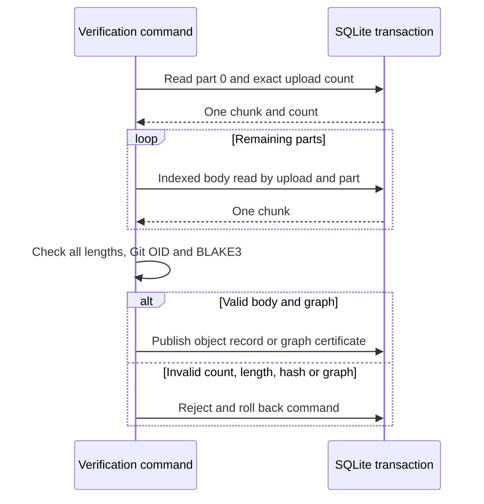

# Count object chunks once per verification transaction

This change removes repeated upload scans from large non-blob Git object
verification. It addresses a reproducible SQL deadline failure after the
[Cellule main update](2026-09-30-cellule-main.md), without raising the deadline
or reducing the object fixture.

> Final-source debug integrations, release multi-server tests and all eight
> real-provider compatibility checks passed. Parallel library attempts retained
> intermittent workspace-lock failures. Performance qualification is still in
> progress; the 10,000-repository reference target is unqualified.

The final-source labels in this report refer to the chunk-count artifact
identified below. The subsequent [cold-owner race candidate](2026-09-30-cold-owner-race.md)
changes gateway code and executable digests; its verification and load results
are recorded separately, including another failed full-corpus recovery attempt.

## What changes

An object with `n` SQLite chunks previously ran `COUNT(*)` over its entire
upload for every part read. Command verification now counts once, then reads
the remaining parts by their primary key. That removes quadratic count work
while keeping the body reads bounded to one 512-KiB chunk per SQL result.

| Caller | Count checks | Reason |
| --- | --- | --- |
| Object publication command | Once per object | All parts are read in the same command transaction |
| Graph certification command | Once per object | The same snapshot binds body verification and closure publication |
| Separate asynchronous object reads | Every part, unchanged | Their queries do not share a transaction snapshot |

The first count rejects extra chunks. Reading each expected part and checking
its length rejects missing or malformed chunks. Canonical Git OID and BLAKE3
checks still cover the complete assembled bytes. The wire codec and persisted
schema are unchanged. The source change does change Canopy's compiled release
digest; use a fresh store prefix for follow-up qualification.

## Measurements

Both runs used Cellule `30671d5f8a729dd9ccd3a0c2d0e36c7abb89a988`, a shared
12-logical-CPU, 32-GiB macOS arm64 host, debug builds, internal temporary local
state and an in-memory object store. The source baseline was Canopy `06367a3`.
Only the command's count-query behavior changed between the targeted timing
runs. Temporary boundary timing probes were then removed.
The final-source production optimization is Canopy `bedc169` on top of the
dependency update; the following cache-harness repairs do not change its
compiled server artifact.

The existing fixture pushes a 68,157,581-byte commit body, a 1,100,119-byte tag
and a 32,000-entry tree. It restarts the owner into fresh local state, compares
all raw bodies and ref OIDs, and runs `git fsck --strict --full`.

| Commit verification phase | Before | After |
| --- | --- | --- |
| Count and read 131 parts during publication | 3.658 s | 0.179 s |
| Canonical OID and BLAKE3 verification | 2.235 s | 1.734 s |
| Count and read during graph certification | Not reached | 0.182 s |
| Hash during graph certification | Not reached | 1.829 s |
| End-to-end fixture | Failed with HTTP 503 | Passed in 49.18 s |

The baseline spent about 5.893 seconds in the publication verification phases
against the unchanged five-second SQL command wall deadline. The candidate
spent about 1.913 seconds in those phases. These are single-run phase timings
on a shared host, not a controlled throughput benchmark. A failed early exit
must not be compared with a successful full round trip as an end-to-end speedup.

## Verification gates

| Gate | State |
| --- | --- |
| Unchanged isolated debug fixture before optimization | Failed with HTTP 503 in 27.89 s |
| Count-work regression before optimization | Failed: later reads still requested `COUNT(*)` |
| Unchanged debug fixture with targeted count optimization | Passed, including fresh-owner byte and Git integrity checks |
| Initial instrumentation-free debug suite, four test threads | Stopped at the library: 112 passed, two new test fixtures were below the chunked-object size floor |
| Corrected debug library suite, four test threads | First run: 113 passed, one existing workspace cleanup test failed with `WouldBlock`; isolated test passed, then all 114 passed on parallel rerun in 44.65 s |
| Corruption, missing/extra chunks and SHA-1/SHA-256 digest regression checks | All three new tests passed |
| Intermediate instrumentation-free multi-server candidate, four test threads | 93 passed, 9 ignored, in 482.20 s; includes the unchanged large-object fixture |
| Final-source full debug attempt, four test threads | Stopped at the library: 113 passed, the existing symlink/reopen test failed with `WouldBlock`; integration targets are being run separately |
| Final-source library, serial | All 114 passed in 59.35 s; does not erase the parallel failure |
| Final-source formatter, Clippy and Python harness | Passed; Clippy checked all targets with warnings denied, Python ran 15 tests after cache-fixture repairs, 16 with actual Git ref-listing coverage and 18 with acknowledged-write verification |
| Final-source debug integration targets, four test threads | All six passed: Directory Cell 10, Git round trip 1, multi-server 93, owner restart 1, Repository Cell 1, smart HTTP 1; nine explicit multi-server ignores |
| Final-source release multi-server suite, four test threads | 93 passed, 9 ignored in 490.94 s; unchanged large-object fixture passed |
| Remaining final-source release targets, serial | All passed: library 114, binary 1 and the other five integration targets (14 tests) |
| Final-source release server and idle driver | Built successfully with locked dependencies |
| Final-source real-store crash recovery | Passed: 64 identities, eight cold-read clients, three populated Git fixtures checked with both protocol versions, strict fsck and graceful shutdown |
| Final-source real-provider compatibility | All eight passed sequentially on host-backed RustFS using separate random prefixes |
| Final-source binary and doc tests | Passed: one binary test, zero doc tests |
| Final-source cache smoke after fixture repairs | Passed: incremental file reuse, bounded cursor reads, cold discovery, 301 live refs, fresh-owner integrity and shutdown |
| Final-source real-store two-owner process smoke | Passed: eight Git/LFS repositories through opposite HTTPS owners, survivor takeover, public-read revocation and interrupted maintenance recovery |
| Final-source in-memory idle scheduler diagnostic | Passed: 100, 500 and 1,000 active repositories, released state and fresh-workspace identity samples |
| Original final-release 10,000-identity seed | Failed after 8,374 recorded identities with a 30-second creation-response timeout; the next identity was later found readable |
| First reconciliation | Failed at 9,830 recorded identities with another 30-second creation-response timeout; its incomplete manifest is retained |
| Diagnostic-owner reconciled corpus | Passed full verification: 10,000 UUIDs and all 100 populated fixtures, Git v0/v2, exact refs/files, strict fsck and LFS size/hash; same release and 100-slot limit |
| Single-ingress workload windows | Completed with eight dropped arrivals; see [full-corpus diagnostics](2026-09-30-full-corpus.md) |
| Acknowledged single-ingress writes after owner kill and fresh-state recovery | Passed: 29 Git refs through v0/v2 and 60 one-MiB LFS uploads; one unacknowledged push excluded |
| Full seeded corpus through fresh two-node deployment | Failed after the 7,000-identity checkpoint with one cold-transition HTTP 503; peer and subsequent forwarded reads matched its UUID |
| Two-ingress throughput and final-artifact real-store idle density | Matrix completed with five failed arrivals; fresh-state recovery and final-artifact idle density remain unqualified |

The intermediate integration binary was built after the production count
optimization and timing-probe removal, but before correcting two new unit-test
fixtures and moving those tests out of the production source file. Its SHA-256
is `2d7e6cc2e982426ce3225fe32d276f8de2395d594a48abcc54e75852b9a07b1e`.
The production query behavior is the same, but the compiled release descriptor
differs. Retain this result as candidate evidence, not final-artifact proof.
The subsequent final-source debug multi-server binary's SHA-256 is
`3f674f466e4a7d05766a744f052852665ec6494058fff5b3de44d99cb3f0d83b`;
its 93-test run passed in 538.61 s. The final release multi-server binary's
SHA-256 is `e7b927428fd84fe48b60f544dc2a8e0d34b43e6fb26f05c0e71ec8f01db178c8`.

The cleanup failure also occurred on the dependency-only revision. The isolated
test and repeated parallel library suite passed without changing lock behavior
or test deadlines. A later final-source parallel attempt failed another
workspace-reopen test with the same `WouldBlock` error, while the serial library
run passed. That does not establish the precise cause of the intermittent
failures; both failed runs remain part of this record.

A later focused run of all five workspace tests passed with four test threads.
A disposable standalone probe reproduced one possible mechanism three times:
a paused forked child retained the parent's file-lock description even though
its descriptor was close-on-exec. Dropping the parent's handle then reopening
returned `WouldBlock`; reopening succeeded after the child exited. The no-fork
drop/reopen control succeeded. Close-on-exec does not close descriptors during
the interval before exec. This explains a possible transient overlap with
concurrent process spawning, not the precise cause of the original failures:
their failing lock boundary and child lifetime were not captured. No production
unlock, retry, deadline or workspace-fencing behavior was changed. The probe
source is explicitly marked debug material outside the repository.

## Final-source real-store fixture

The release server's SHA-256 is
`30cfbb21670566691e292e2ed80c3e78aad6abfbdc41b3c1fa3f97faa198afb2`;
the idle driver's is
`8fcd4a55ce22bba1939e5690bcddef51879bd7d55758bcfb78329149d6d48956`.
The activation fixture used a unique prefix in bucket `canopy-latest-host`,
internal scratch and the host-backed RustFS provider described below. It
killed its first owner and waited for the production node lease before starting
the fresh-workspace owner. All 64 cold identity reads succeeded without retries
in 8.187 s. Seeding took 67.660 s. Parallel debug/release correctness suites
shared the host during this check, so these timings are recovery diagnostics,
not a controlled comparison with the dependency-only run.

The compatibility checks invoked that release test binary directly with
`--ignored --exact --nocapture`, one test at a time. They used the eight names
in `scripts/qualify_size.py`, but reused the host-backed provider instead of
creating an inode-constrained Docker volume. This is a pass for those tests,
not a successful run of the provider-creation wrapper or the multi-GiB gate.
Coverage includes SHA-256 HTTP/SSH, native merge candidates, signed pushes,
stock SSH Git/LFS, bulk mirror refs and filtered clones.

## Keep the cache fixture aligned with reachable fetches

The original cache smoke failed after its first incremental push: it expected
three scanned headers but saw 260. The logs showed reachable clone preparation
hydrating all 260 files while leaving the independent full-history receive
cursor at zero. A ref-only receive probe then scanned exactly 260 headers and
reused every file; the next receive scanned none. This is a fixture setup
mismatch with the existing reachable-fetch implementation, not evidence of a
Cellule regression or a delayed setup log.

A wrapper regression failed before repair. The fixture now warms the receive
cursor with a temporary ref, deletes that ref, and waits for its diagnostic
before choosing the measurement boundary. After the incremental clones it
checks that receive preparation enumerates only the three newly published
headers, reusing their already-hydrated bodies. No server deadline, payload,
history size or scan-count assertion was relaxed.

| Phase | Header enumeration | Shared body cache |
| --- | --- | --- |
| Initial reachable clone | Separate reachable traversal | 260 verified files |
| Explicit receive setup, outside the measured increment | 260 existing headers once | Same 260 files and metadata |
| Incremental clones and receive probe | Only 3 new full-history headers | 3 new files; the original 260 unchanged |
| Warm ref listings | Zero new snapshot scans, 10 cache hits | 301 live refs |

The first repaired run passed object reuse and recovery but failed the warm-ref
diagnostic boundary: deleting the probe correctly retained one SQL tombstone.
That made the snapshot contain 302 rows while native Git still advertised 301
live refs. A second regression failed before the fixture distinguished these
counts. The final smoke passed with exact checks for both; deletion/recreation
of an existing warm ref remained visible. Both failed logs are retained.

The successful incremental push took 0.440 s. This is a functional diagnostic,
not a throughput or p95 claim. The final cache report's SHA-256 is
`13d9936995cf217aecb835b59eb74eede033ac0ac7962f460f0aa7b9cf5b159b`.

## Repeat scheduler and peer-recovery checks

The final release idle driver passed all four 30-second windows. Every expected
live Cell was covered, no PUT failed and no published root changed. Counts are
at the `object_store` API boundary, not provider HTTP attempts.

| SQL-only diagnostic window | Serving Cells before / after | Control updates/s |
| --- | --- | --- |
| 100 active repositories | 101 / 101 | 32.929 |
| 500 active repositories | 501 / 501 | 163.282 |
| 1,000 active repositories | 1,001 / 1,001 | 324.157 |
| All 1,000 repositories released | 1 / 1 | 0.333 |

Fresh local state matched the first, middle and last repository identities and
shutdown succeeded. The real-store peer smoke overlapped part of this run, and
other projects shared the host. This private in-memory fixture demonstrates
scheduler coverage and release behavior, not real-store residency capacity or
a controlled before/after speedup. Report SHA-256:
`422a71b259025bde058ea23abf9f207d78c283a6029e1985373a7ba377450744`.

The separate real-store peer smoke passed all four stages with the final server:
opposite-owner HTTPS Git/LFS beyond resident capacity; anonymous public reads
and privatization revocation; graceful maintenance drain/resume; and SIGKILL
during maintenance followed by enrolled recovery, owner fencing, fresh Git/LFS
verification and release. Its retained workspace is
`/tmp/canopy-chunk-count-30671d5-v6uDrfLl/canopy-process-col8wzjw`.

A new corpus targets 10,000 identities, 100 populated two-commit repositories,
128-byte LFS fixtures, a fresh store prefix and a 100-repository residency limit.
Live state and client scratch are internal at
`/tmp/canopy-chunk-count-30671d5-v6uDrfLl`. Neither a partial manifest nor the
small recovery/idle fixtures above close the 10,000-repository gate.

### Preserve the interrupted seed and resolve its ambiguous create

The original run stopped after 4,094.5 s with 8,374 recorded identities and
85 populated fixtures. Its next creation waited 30 seconds for an HTTP response
then timed out. The queued verifier exited without using the incomplete
manifest or restarting the seed. The original manifest remains unchanged:
SHA-256 `a2f0df946280387783f5fe1a9780f6d0198d93c61acb9aa0d521af546e586302`.

| Observation | What it establishes |
| --- | --- |
| Authenticated lookup of timed-out name returned UUID `4dbf65de-9173-4223-8b9a-10733a7b4fa0`; stock Git listed no refs | The name already resolves to an empty repository; do not issue another create for it |
| Last 374 acknowledged creates: p95 3.144 s, p99 11.056 s, max 23.878 s | The accepted-request tail grew before the timeout; these exclude the failed request |
| Nearby node lease refreshes took 3.0–3.6 s | Other publication work was slow too; no precise cause is established |
| Provider had 23 GiB free and about 231 million free inodes | This failure was not the earlier Docker-volume inode exhaustion |
| Post-failure provider HEAD/PUT probes succeeded; three unique creates took 246–340 ms | The timeout did not reproduce in these probes; the provider CLI timings include startup |
| Shared host had about 18.2 GiB swap used and load averages 34/44/38 on 12 logical CPUs | The environment was heavily shared, not a controlled reference runner |

A one-shot reconciliation wrote **a separate manifest**, not a successful
replacement for the failed run. It carries the original manifest digest,
records the existing UUID instead of retrying its POST, and requires every
remaining name to be absent before creation. Unexpected existing names or any
new failure stop it. Original refs and fixture bytes are left unchanged. The
same 30-second timeout remains; the resolved create has no fabricated success
latency. Three diagnostic repositories exist outside the measured corpus.

That reconciliation also stopped: after 689.508 s, it had 9,830 recorded
identities and 99 populated fixtures. Another create timed out after 30 seconds.
Its name later resolved to UUID `a12d0362-e932-4dd3-a9f4-9909a0229498`.
The second incomplete manifest is retained with SHA-256
`ce7ba45a697b696f9e9a989c024070f802f9df0ae573bf82bd6334e447a77d6c`.
Nearby node refreshes took up to 5.148 s. RustFS had no cgroup OOM events or
CPU-quota throttling; these counters do not exclude provider or host stalls.

The original server then exited gracefully with status zero. A distinct node
started the exact same binary into fresh local state, preserving the old files,
with existing request/transition debug timings enabled. The second timed-out
UUID remained readable through that fresh owner. A diagnostic-owner
reconciliation adopted that known empty identity and created only the final
169 absent names. It completed in 157.329 s without changing the timeout or
original refs. Its separate manifest binds both earlier failed manifests:
SHA-256 `4ac5370e0c014163caf1e08fde3260152dc24ebfd1b87d1a4e833d939e04089b`.
Full verification then passed with concurrency four: all 10,000 identities,
all 100 populated repositories through Git v0/v2 with exact seeded refs and
file hashes, strict fsck, and every declared LFS fixture's size/SHA-256. The
verifier exited with status zero. This closes the reconciled-corpus identity
and fixture-integrity check, not the uninterrupted seeding or throughput gates.

This is setup recovery, not a timeout fix, uninterrupted seed pass or capacity
result. The restart, local-state reset and logging change prevent a controlled
speed comparison; the precise timeout cause remains unproven. Only a complete,
separately verified manifest may enter workload windows. A fresh fetch still
confirmed the pinned Cellule revision as `origin/main` after these failures.

## Measure ref listing separately from capabilities

While the new corpus seeds, driver inspection found another coverage gap:
`--operation refs` issues only Git v2 capability discovery, not `ls-refs`.
Its old rows remain capability-only measurements, not evidence of ref-listing
latency. A new `ls_remote` operation uses unmodified Git with protocol v2 and
verifies the advertised `main` tip for populated fixtures. Reports label the
two discovery kinds explicitly. The server binary and corpus release are
unchanged by this driver addition.

The HTTP regression failed before implementation, then confirmed actual
`ls-refs` POSTs, correlation IDs, exact tip validation and rejection of wrong
tips. It also confirms that the legacy capability operation issues no such
POST. Git performs the output-pattern filtering client-side; the test does
not require a wire prefix filter. SHA-1 and SHA-256 fixtures both validate the
correct advertised tip; the SHA-256 case also checks negotiated object format.
All 16 Python harness tests passed after the addition, and again after adding
the SHA-256 fixture in 17.664 s. A direct call against one populated live Canopy fixture matched
its tip; that is a driver smoke, not a partial-corpus capacity measurement.

## Check acknowledged load-test writes after recovery

The corpus verifier checks seed data, not writes made by workload windows.
The new `verify-writes` command consumes digest-bound `push_branch` and
`lfs_upload` reports, checks every acknowledged generated ref with Git v0/v2,
verifies exact commit/README object IDs and strict fsck, and streams each
acknowledged LFS object for size/hash comparison. Unacknowledged arrivals remain
separate; a timeout is not interpreted as rollback.

Two regressions failed before implementation. The expanded 18-test Python suite
then passed, including SHA-1/SHA-256 pushes, wrong refs and exact-body mismatches,
corrupt LFS, omitted acknowledgements and inconsistent or tampered evidence.
This suite is verification-driver coverage, not itself a recovered-Canopy result.
The caller must establish and record the owner restart before running the
[acknowledged-write check](../performance-plan.md#verify-writes-acknowledged-during-load).
No server artifact or in-progress corpus release changed.

The later [complete-corpus run](2026-09-30-full-corpus.md#recover-acknowledged-writes-through-fresh-gateways)
used the verifier after a recorded owner kill, production lease-expiry wait
and fresh two-node startup. All acknowledged single-gateway writes survived;
the dropped push remains separate.

The old Docker data filesystem exhausted its inodes. A later read-only check
found about 9,700 free inodes, enough to start a small probe container. A
task-owned RustFS provider now mounts a dedicated host-home directory rather
than adding corpus files to the exhausted Docker volume. A read probe confirmed
the mount, bucket creation succeeded, and the provider sees about 268 million
free inodes and 26 GiB free blocks. This enables smaller real-store checks; it
does not meet the large-transfer gate's 40-GiB free-space requirement.

Local logs are retained under experiment
`canopy-latest-U6wUjSnB/qualification-iPz0ULZ6`:

- `large-objects-baseline-continuation.log`
- `large-objects-chunk-timing.log`
- `chunk-count-regression-red.log`
- `large-objects-single-count-timing.log`
- `cargo-test-single-count-debug.log`
- `cargo-test-single-count-lib-corrected.log`
- `workspace-cleanup-direct-isolated.log`
- `lib-single-count-parallel-repeat.log`
- `multi-server-single-count-candidate.log`
- `python-single-count.log`
- `test-single-count-final-debug.log`
- `lib-single-count-final-serial.log`
- `build-single-count-release.log`
- `clippy-single-count-final.log`
- `activation-single-count-final.log`
- `integration-single-count-final-debug.log`
- `multi-server-single-count-final-release.log`
- `provider-eight-single-count-final-release.log`
- `bin-single-count-final.log`
- `doc-single-count-final.log`
- `remaining-single-count-final-release.log`
- `cache-single-count-final.log` (original failed fixture)
- `cache-cursor-harness-regression-red.log`
- `cache-cursor-probe.log`
- `cache-single-count-repaired.log` (tombstone diagnostic mismatch)
- `cache-tombstone-harness-regression-red.log`
- `python-single-count-cache-final.log`
- `cache-single-count-final-repaired.log`
- `peers-single-count-final.log`
- `idle-memory-single-count-final.log`
- `corpus-single-count-final-server.log`
- `corpus-single-count-final-seed.log`
- `ls-remote-regression-red.log`
- `ls-remote-regression-green.log` (initial wire-prefix expectation was incorrect)
- `python-ls-remote-final.log`
- `ls-remote-live-driver-smoke.log`
- `python-ls-remote-formats.log`
- `workspace-focused-parallel.log`
- `workspace-fork-mechanism.log` (standalone possible-mechanism probe)
- `write-ack-verifier-regression-red.log`
- `write-ack-verifier-first-green.log`
- `write-ack-verifier-final.log`
- `write-ack-verifier-sha256.log`
- `write-ack-verifier-published.log`
- `corpus-initial-verification.log` (refused the original incomplete seed)
- `create-timeout-diagnostic.jsonl`
- `corpus-seed-reconciliation.log`
- `corpus-trace-server.log`
- `corpus-trace-reconciliation.log`
- `corpus-trace-verification.log`

Use the [performance plan](../performance-plan.md#performance-qualification-rules)
for the remaining capacity gates. This fix reduces transaction work; it does
not establish sustainable request rate, provider latency, mixed primitive
capacity, or horizontal scale by itself.
