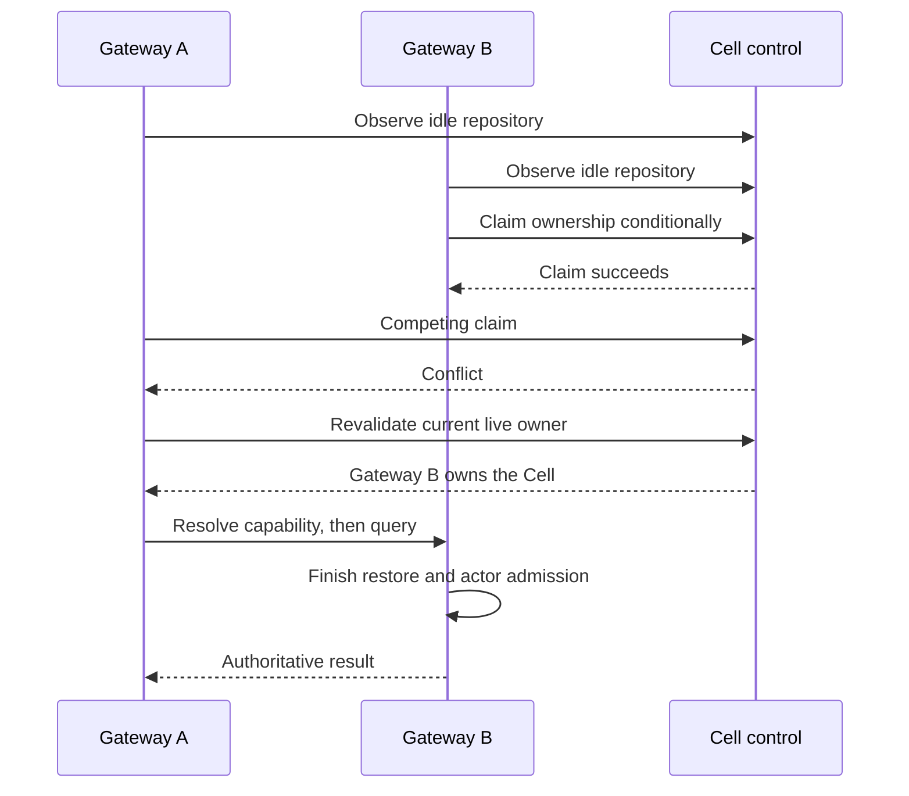

# Follow a winning owner after concurrent cold requests

Two overlapping cold requests through different gateways could produce one
successful response and one HTTP 503, even though a live peer had acquired the
repository. A synchronized regression reproduced that result before the fix.
The candidate follows freshly validated remote authority and waits, within a
fixed bound, for the winning node's local capability. It does not retry the
ownership claim or replay an accepted repository mutation.

This addresses a routing race found in the
[two-gateway diagnostic matrix](2026-09-30-full-corpus.md#two-gateway-diagnostic-load-windows).
It does **not** establish the cause of the separate full-recovery failure at
manifest index 7,018, meet latency targets, or qualify the Linux reference node.
A fresh candidate full-corpus replay also failed, at index 4,757. This candidate
is not fully qualified.

## Identify the candidate

| Input | Value |
| --- | --- |
| Canopy source | `78483a929d7fac0f7cdb257f48a10346778d60f5` |
| Cellule revision | `30671d5f8a729dd9ccd3a0c2d0e36c7abb89a988` |
| Candidate release server SHA-256 | `a9b09449bc5d1abbd855d0141fbe7f6921866ca0778e2e5afca096f8811e9acf` |
| Candidate release idle-driver SHA-256 | `0854d28cb0e192cf6dd41ee9cf985978947d0fec98953104a6738bd2dc58e100` |
| Previous measured server SHA-256 | `30cfbb21670566691e292e2ed80c3e78aad6abfbdc41b3c1fa3f97faa198afb2` |
| Host and provider | Same shared macOS host and host-backed RustFS fixture as the full-corpus report |
| Corpus manifest SHA-256 | `4ac5370e0c014163caf1e08fde3260152dc24ebfd1b87d1a4e833d939e04089b` |

The previous artifact's latency windows remain previous-artifact evidence.
The candidate has a different executable digest. Fresh candidate nodes admitted
the existing deployment and restored acknowledged writes; no maintenance gate
or persisted contract was bypassed. The change is in gateway routing and peer
resolution, not SQL commands, schemas or dependency versions.

## Preserve the failure and fix its boundary

Both gateways can observe an idle Cell before either claims it. Only one
conditional control update wins. Previously, the loser surfaced the acquisition
error instead of following the new live owner. The ref-listing failure also
captured the related window where acquisition saw the new owner's live session
and correctly refused takeover, but routing then stopped with HTTP 503.



| Boundary | Candidate behavior |
| --- | --- |
| Local acquisition fails | Read current authority again; bind a remote route only if a different live owner validates |
| No validated live peer | Return the original acquisition failure |
| Winner has authority but no dispatchable handle yet | Peer resolver waits for its own runtime capability, checking node-lease validity through runtime lookups |
| Missing capability | Wait is bounded to five seconds; the caller's signed RPC deadline still applies |
| Warm dispatchable handle | Existing fast path; no additional wait |
| User mutation | Still dispatched only after route acquisition; no automatic claim retry or accepted-command replay |

The fix does not delete failed local files, force takeover of a live session,
relax SQL deadlines, or change authorization. The earlier failed activation's
local files remain retained, with a separate snapshot under
`qualification-iPz0ULZ6/failed-cold-7018.usYrz7FF`.

## Verification

The regression synchronizes the actual idle-owner conditional updates, not
just HTTP arrival. Both requests must return the exact repository UUID, only
one node may activate local SQL, and the published root must remain unchanged.
A second case delays the successful claim reply by one second, proving remote
resolution occurs before the winner can activate its capability.

| Check | Result |
| --- | --- |
| Original synchronized cold-claim test | Failed in 1.43 s: HTTP statuses `[503, 200]` |
| Candidate, same test | Passed in 1.18 s |
| Normal and delayed-winner regressions together | Both passed in 2.37 s |
| Five additional repetitions | All ten test executions passed |
| Full debug multi-server suite, four threads | 95 passed, 9 explicit ignores, 475.84 s |
| Full release multi-server suite, four threads | 95 passed, 9 explicit ignores, 430.45 s |
| Remaining debug targets, serial | Library 114, binary 1, Directory Cell 10 and four one-test integration targets passed |
| Remaining release targets, serial | Library 114, binary 1, Directory Cell 10 and four one-test integration targets passed |
| Formatter and all-target Clippy, warnings denied | Passed |
| Python harness suite | 20 passed, including precise verification failure diagnostics |
| Fresh-state acknowledgement recovery after both old gateways were killed | Passed: 59 generated Git refs on 27 repositories, v0/v2, exact commit/README IDs and strict fsck; 120 one-MiB LFS objects matched size/hash |
| Initial recovery's unacknowledged writes | One earlier push remains excluded; no rollback assertion |
| Full seeded-corpus replay through fresh candidate gateways | Failed with concurrency four at index 4,757: HTTP 503 during cold activation |
| Candidate two-ingress load windows | Failed: 2,104 of 3,880 arrivals succeeded; all 1,776 failures retained |
| Post-matrix acknowledgement recovery after killing both candidate owners | Passed: all 73 generated refs on 27 repositories and 149 one-MiB LFS objects across three matrices; 48 unacknowledged arrivals excluded |
| Candidate real-store idle-density windows | Not yet run |

Both old task-owned gateways were stopped with `SIGKILL`. After a 32-second
production lease-expiry wait, two candidate gateways became ready in new local
directories. A read-only check through the second ingress validated all
acknowledgements from both preceding load matrices. Its report SHA-256 is
`e10607cac1965e8b1b911d5d95f86e43f541a914aee0b1bc631b65eece09128d`.
The old node directories, store data and failed runs were retained.

### Keep the remaining recovery failure separate

The full replay exited with status 1 on `density-ba4cafedcba3-04757`, expected
UUID `6e8d3da5-4716-4fd8-805a-9213cc1cfbb3`, request
`74a18505-a140-45f1-9148-ea20b31ce87a`. Authentication and Directory lookup
succeeded. The repository transition failed in 244.794 ms; the complete handler
returned HTTP 503 in 246.454 ms. The generic runtime error did not expose its
underlying cause. The last progress checkpoint was 4,700, not a verified count
of the entire final batch.

| Subsequent one-shot read | HTTP status | Elapsed | Result |
| --- | --- | --- | --- |
| Original gateway | 503 | 929.750 ms | Still unable to activate locally |
| Peer gateway | 200 | 384.285 ms | Restored the exact expected UUID |
| Original gateway after peer activation | 200 | 543.845 ms | Exact UUID through forwarding |

The durable snapshot was recoverable through the peer. That observation does
not establish the original local failure's cause or turn the full replay into
a pass. The index-4,757 failure occurred without a competing request for that
repository in the verifier; it is not evidence that the synchronized owner-claim
regression failed again. Failed local files were retained and copied to
`qualification-iPz0ULZ6/failed-cold-4757.IKy0BLjf`. No files were deleted and no
deadline or fencing rule was weakened.

| Retained artifact | SHA-256 |
| --- | --- |
| Candidate failed full-corpus verification log | `7b5ade43291e14fa93b801854e0bba2a6ef409d13097d5290a18d21f36edd262` |
| Failed request and subsequent node-log probes | `11b24fc4ec2ec5c901ab9482c2162cbbd4bab22600827ff7483b7a934c4fea7f` |
| Snapshot of failed local `repository.sqlite` | `3ae4184f969c0ae66a675a0ff3ae9f166f940c6706a32681b0610a6bac1bedec` |
| Snapshot of local LTX checksum sidecar | `557fac68abcda7476decd689eac22ea4df2fb6bdf9d61019e72932db4466b14c` |

This is correctness/recovery evidence, not a performance improvement claim.
Neither test time nor the number of passing requests establishes sustainable
throughput, production resource ceilings or scaling efficiency. TLS-fixture
overhead, the earlier activation failure, the current artifact's real-store
idle gate and reference-node/mixed-load qualification remain open.

## Candidate two-ingress load results

The same 13 windows ran round-robin through two candidate ingress nodes, each
with 100 residency slots. The complete manifest, RNG seed `20260930`, offered
rates, durations and client limits match the
[earlier matrix](2026-09-30-full-corpus.md#two-gateway-diagnostic-load-windows).
The collector computes this executable's digest rather than reusing the earlier
artifact label. Prior acknowledged benchmark refs and LFS bodies remained in
the store; this is not an identical-state, controlled before/after experiment.
No other Canopy verification or benchmark ran concurrently with the matrix.

All 3,880 arrivals are accounted for: 2,104 succeeded, 1,747 were `driver_busy`,
seven returned HTTP 503, sixteen had transport errors and six had Git errors.
The matrix exited with status 1. Unsent arrivals have no fabricated latency;
percentiles include all completed attempts, including errors and validation.

| Window | Successful / scheduled | p95 / p99 ms | Failed arrivals |
| --- | --- | --- | --- |
| Metadata, prewarmed uniform | 534 / 600 | 3,058.653 / 8,034.719 | 66 unsent |
| Metadata, prewarmed skewed | 819 / 1,200 | 3,713.879 / 6,600.016 | 381 unsent |
| Metadata, 1,000-entry working set | 237 / 600 | 27,742.694 / 30,021.228 | 353 unsent, one 503, nine transport |
| Metadata, 10,000-entry working set | 96 / 600 | 30,003.487 / 30,014.413 | 497 unsent, seven transport |
| Git v2 capabilities only | 61 / 300 | 29,055.558 / 29,994.318 | 233 unsent, six 503 |
| Stock Git v2 `ls-remote` | 126 / 300 | 10,689.066 / 12,939.177 | 168 unsent, six Git |
| Clone | 28 / 30 | 6,162.489 / 8,061.948 | Two unsent |
| Empty-client fetch | 30 / 30 | 5,556.584 / 5,787.030 | None |
| Incremental fetch | 20 / 20 | 2,389.702 / 3,133.500 | None |
| Incremental pull | 20 / 20 | 3,139.065 / 3,418.529 | None |
| LFS download | 90 / 90 | 2,003.716 / 3,232.306 | None |
| LFS upload | 29 / 60 | 19,822.681 / 20,789.736 | 31 unsent |
| Unique-branch push | 14 / 30 | 20,448.659 / 20,448.659 | 16 unsent |

Across 649 one-second snapshots, maximum combined server-parent and
server/descendant RSS sums were both 204,304 KiB (199.5 MiB), with at most nine
processes observed. Parent-only descriptor endpoints ranged from 568 to 845;
there were no sampler errors. These samples exclude proxy/launcher/provider
memory, kernel cache and missed short-lived child peaks; they are not a hard
resource ceiling or an aggregate deployment memory measurement.

Other projects' tests ran on the shared host. One-minute load was 36.09 at the
start and 27.67 at the end, and exceeded 40 during the run. Swap use rose from
18,327.56 to 19,232.44 MiB. The TLS proxy also logged broken-pipe errors after
clients disconnected. Host pressure and proxy overhead were not isolated, and
the routing change's contribution to the slower results is unproven. Do not
attribute this result to Cellule alone, dismiss its failed arrivals, or treat
the synchronized correctness regression as performance qualification.

The summary SHA-256 is
`a6e77435c3609ecbad81a4c77eacfed0452d21b85fda59dda592fe1ec64f8b8b`.
Reports, digest-bound arrival samples and resource observations remain in
`/tmp/canopy-cold-race-30671d5-V2vwtD6h/two-gateway-windows`;
`cold-race-two-gateway-windows.log` records the sequential window results.

### Verify every acknowledged write after the matrix

Both candidate gateway processes were killed with `SIGKILL` after the matrix
finished. After a 32-second lease-expiry wait, the same candidate binary started
two new nodes in `post-matrix-recovery`, without old local SQLite or Git cache
files. The complete manifest and durable deployment identity were unchanged.

Through the second fresh ingress, the read-only verifier checked six digest-bound
write reports from all three matrices. It passed all 73 generated refs on 27
repositories with Git v0/v2, exact commit and README object IDs, and strict fsck.
All 149 one-MiB LFS objects matched streamed size and SHA-256. This includes
every newly acknowledged candidate write: fourteen pushes and 29 LFS uploads.
The 48 unacknowledged write arrivals remain excluded, without an assertion that
their effects were rolled back.

The process kill, fresh node directories and lease wait establish the recovery
boundary separately from the verifier. The report is
`post-matrix-recovered-acks.json`, SHA-256
`665fb788942ec0c60339cd088e5cdb75a22cfe5875b86902b117e936b55c07ef`.
This pass does not erase the index-4,757 full-corpus recovery failure or qualify
the failed load windows. No data or failed node directories were removed.

## Repeat and inspect

```sh
cargo test --locked --test multi_server peers::cold_activation -- --nocapture
cargo test --release --locked --test multi_server -- --test-threads=4
python3 -B -m unittest discover -s scripts -p 'test_*.py'
```

For the load windows, use the [complete-corpus driver recipe](2026-09-30-full-corpus.md#repeat-the-checks)
with this candidate's binary and record its digest. Keep the same manifest,
seed, rates, durations and concurrency; do not reuse an earlier executable's
digest in a new report. New output/client directories are required. The
10,000-entry working set is a selection range, not a claim that every identity
was exercised in a short load window. Count every dropped or failed arrival.

Logs remain under experiment `canopy-latest-U6wUjSnB/qualification-iPz0ULZ6`:
`cold-race-regression-red-compiled.log`, `cold-race-regression-first-green.log`,
`cold-race-regression-delayed-green.log`, `cold-race-five-repeats.log`,
`cold-race-full-debug-multi-server.log`, `cold-race-full-release-multi-server.log`,
`cold-race-remaining-debug.log`, `cold-race-remaining-release.log`,
`cold-race-clippy.log`, `cold-race-release-build.log`,
`cold-race-two-owner-recovery-launch.log`, `cold-race-recovered-acks.log` and
`cold-race-full-corpus-verification.log`. Candidate local state and acknowledgement
report remain under `/tmp/canopy-cold-race-30671d5-V2vwtD6h`.
The targeted node-log excerpt is `failed-cold-4757-probes.txt`.
Post-matrix logs are `cold-race-post-matrix-recovery-launch.log` and
`cold-race-post-matrix-recovered-acks.log`.
