# Test the current Cellule pin against a complete corpus

The reconciled corpus passed all 10,000 identity checks and all 100 seeded
Git/LFS fixture checks. After killing its owner and starting fresh local state,
all acknowledged load-test writes also survived. The single-gateway load
matrix **failed eight scheduled arrivals**; warm metadata latency targets were
not consistently met. These are local diagnostics, not production capacity.

This follows the [dependency update](2026-09-30-cellule-main.md) and
[chunk-count optimization](2026-09-30-chunk-count.md). Their failed runs remain
recorded; later passes do not replace them.

## Scope and provenance

| Input | Value |
| --- | --- |
| Cellule revision | `30671d5f8a729dd9ccd3a0c2d0e36c7abb89a988`; confirmed as remote `main` again before recovery checks |
| Production Canopy source | `bedc169`; subsequent commits change tests, drivers and documentation only |
| Release server SHA-256 | `30cfbb21670566691e292e2ed80c3e78aad6abfbdc41b3c1fa3f97faa198afb2` |
| Corpus | 10,000 repository identities; 100 populated with two Git commits and a 128-byte LFS fixture each |
| Manifest SHA-256 | `4ac5370e0c014163caf1e08fde3260152dc24ebfd1b87d1a4e833d939e04089b` |
| Runtime residency limit | 100 active repositories per node; distinct from the driver's working-set size |
| Host | Shared macOS arm64, 12 logical CPUs, 32 GiB RAM; server and driver on the same host |
| Object store | Host-backed RustFS `1.0.0-beta.8-glibc`, local Docker VM, 4-CPU/4-GiB container |
| Provider image ID | `sha256:040304b66e029a5cde4bed140b41513e925909839a9b912a40a98340610d1f66` |
| Git client | `2.50.1 (Apple Git-155)` |
| Client deadlines | HTTP 30 seconds, Git 120 seconds; no workload retries |
| Logging | Existing owner/metadata timing logs enabled; no temporary production instrumentation |

The original seed failed at 8,374 recorded identities. Its first reconciliation
failed at 9,830. Read-only lookups resolved the two timed-out creates to existing
UUIDs; neither name was blindly recreated. A separate reconciliation completed
the manifest without rewriting seeded refs. Its provenance binds both failed
manifests. See the [setup failure record](2026-09-30-chunk-count.md) for details.

```mermaid
flowchart LR
    seed[Seed: timeout at 8,374] --> first[Reconcile: timeout at 9,830]
    first --> complete[Separate complete manifest]
    complete --> verify[Verify 10,000 identities<br/>and 100 Git/LFS fixtures]
    verify --> load[Scheduled load windows]
    load --> kill[Kill owner; wait for lease expiry]
    kill --> fresh[Fresh two-gateway local state]
    fresh --> ack[Verify every acknowledged write]
```



## Single-gateway load windows

The driver schedules arrivals at a fixed offered rate. An unsent `driver_busy`
arrival is a failure, not an omitted latency sample or successful server work.
All 3,872 attempted requests passed their operation-specific checks; **eight of
3,880 scheduled arrivals were dropped by the driver**. The matrix exited with
status 1. No other request failures were recorded.

Each window used a fresh client work directory and random seed `20260930`.
The first 100 selected identities were read before the arrival clock began;
that prewarm does not guarantee continued runtime residency. Larger metadata
working sets include warm and cold reads, not a cold-only experiment.

| Operation | Working set / distribution | Rate/s × seconds; clients | Successful / scheduled | p95 / p99 ms | Successful unique IDs |
| --- | --- | --- | --- | --- | --- |
| Metadata, prewarmed | 100 / uniform | 10 × 60; 16 | 600 / 600 | 13.993 / 22.136 | 100 |
| Metadata, prewarmed | 100 / skewed | 20 × 60; 16 | 1,200 / 1,200 | 38.204 / 131.145 | 73 |
| Metadata, mixed residency | 1,000 / uniform | 10 × 60; 16 | 593 / 600 | 1,538.512 / 2,311.580 | 445 |
| Metadata, mixed residency | 10,000 / uniform | 10 × 60; 16 | 600 / 600 | 908.068 / 1,216.566 | 582 |
| Git v2 capabilities only | 100 / skewed | 5 × 60; 8 | 300 / 300 | 264.388 / 389.707 | 29 |
| Stock Git v2 `ls-remote` | 100 / uniform | 5 × 60; 8 | 300 / 300 | 730.903 / 1,188.832 | 95 |
| Clone | 100 / uniform | 1 × 30; 4 | 30 / 30 | 472.154 / 473.386 | 22 |
| Cold fetch | 100 / uniform | 1 × 30; 4 | 30 / 30 | 489.010 / 530.378 | 22 |
| Incremental fetch | 20 / uniform | 1 × 20; 4 | 20 / 20 | 565.715 / 693.086 | 15 |
| Incremental pull | 20 / uniform | 1 × 20; 4 | 20 / 20 | 640.044 / 671.491 | 15 |
| LFS download, 128 bytes | 100 / uniform | 3 × 30; 8 | 90 / 90 | 91.204 / 125.144 | 57 |
| LFS upload, 1 MiB | 100 / uniform | 2 × 30; 8 | 60 / 60 | 1,485.251 / 1,840.701 | 43 |
| Unique-branch push | 100 / uniform | 1 × 30; 4 | 29 / 30 | 4,534.082 / 4,716.509 | 26 |

The 10,000-entry working set reached 582 distinct identities in its 60-second
window; it did **not** load-test every repository. Complete identity verification
and load-window coverage are separate facts. Capabilities do not perform
`ls-refs`; the stock-Git row measures actual ref listing. `cold_fetch` starts
with an empty client, not a forcibly cold server or cache. Git rows use small
fixtures, so their elapsed times cannot establish large-pack throughput.

### Resource observations

Across 549 one-second process snapshots, the largest server-parent RSS was
127,296 KiB (124.3 MiB), and the largest summed server/descendant RSS was
134,336 KiB (131.2 MiB). The largest sampled process tree had five processes.
Parent numeric file-descriptor counts at window endpoints ranged from 732 to
833. The sampler recorded no errors.

These snapshots can miss short-lived children. They exclude kernel cache,
Docker/provider memory and aggregate hard-limit proof; the descriptor counts
are endpoints, not peaks. Host swap use was approximately 17.8–18.0 GiB, with
substantial competing load. Do not infer a production memory ceiling or
controlled performance improvement from this run.

## Match rate and distribution before diagnosing latency

A separate series kept the same 100-identity set, prewarm, 16 clients and
60-second windows, varying offered rate and distribution. All 3,600 scheduled
arrivals completed successfully.

| Distribution | Rate/s | Successful arrivals | p50 ms | p95 ms | p99 ms |
| --- | --- | --- | --- | --- | --- |
| Uniform | 10 | 600 | 8.429 | 20.399 | 63.413 |
| Skewed | 10 | 600 | 8.990 | 36.609 | 138.683 |
| Uniform | 20 | 1,200 | 9.068 | 23.191 | 48.336 |
| Skewed | 20 | 1,200 | 10.268 | 66.339 | 247.959 |

The proposed warm targets are p95 below 20 ms and p99 below 50 ms. No matched
window met both. Skewed traffic had worse tails at each matched rate, but the
uniform p99 did not worsen monotonically with rate. This sequential shared-host
series does not establish the cause. Existing request timings showed slow
requests in both Directory authorization and repository metadata stages, not
one proven hot-repository SQL bottleneck. No speculative production fix or
deadline increase was made.

## Recover acknowledged writes through fresh gateways

After the load windows, the single owner was stopped with `SIGKILL`. Its local
data was retained but was not reused by the new nodes. A premature two-node
startup failed while attempting the old owner's advertised placeholder endpoint;
that failure is retained. The retry began only after an additional 32-second
wait for production lease expiry. Both fresh gateways then became ready, using
the same server artifact and object-store prefix.

The read-only `verify-writes` command ran through the second fresh ingress:

| Recovery assertion | Result |
| --- | --- |
| Acknowledged generated push refs | All 29 matched, across 26 repositories |
| Git protocol checks | v0 and v2; exact commit/README object IDs and strict fsck |
| Acknowledged LFS uploads | All 60 one-MiB objects matched size and SHA-256 |
| Unacknowledged arrivals | One push remains excluded; no rollback assertion |
| Complete seeded corpus through fresh two-node deployment | Running; not yet a recorded pass |
| Two-ingress load matrix | Pending; run after correctness checks finish |

The verifier checks data, not the fact of a restart. The process kill, fresh
node directories, lease wait and launcher readiness establish that boundary
separately. This is owner-recovery correctness, not a throughput scaling claim.

## Repeat the checks

Use a complete manifest with the same release descriptor. These commands
assume `CANOPY_GIT_TOKEN`, `BASE_URL`, `MANIFEST` and new output paths are set;
the examples do not create a new corpus or restart nodes themselves.

```sh
python3 -B scripts/benchmark_repositories.py \
  --base-url "$BASE_URL" --manifest "$MANIFEST" --timeout 30 \
  verify --work-dir "$VERIFY_DIR" --concurrency 4

python3 -B scripts/benchmark_repositories.py \
  --base-url "$BASE_URL" --manifest "$MANIFEST" --timeout 30 --seed 20260930 \
  run --operation metadata --active-repositories 10000 \
  --distribution uniform --rate 10 --duration 60 --concurrency 16 \
  --work-dir "$CLIENT_DIR" --output "$REPORT" --git-timeout 120

# After separately establishing owner recovery:
python3 -B scripts/benchmark_repositories.py \
  --base-url "$RECOVERED_URL" --manifest "$MANIFEST" --timeout 30 \
  verify-writes --report "$PUSH_REPORT" --report "$LFS_REPORT" \
  --work-dir "$ACK_VERIFY_DIR" --output "$ACK_VERIFY_REPORT" --git-timeout 120
```

For round-robin load through two nodes, add `--additional-base-url "$PEER_URL"`
before `run`. Repeat the operation, working-set, rate, duration and client count
from the table; preserve every failed arrival. See the
[driver instructions](../performance-plan.md#running-the-initial-density-driver)
for seeding and fixture requirements.

## Retained evidence and open gates

Reports remain under `/tmp/canopy-chunk-count-30671d5-v6uDrfLl`; logs are archived
under experiment `canopy-latest-U6wUjSnB/qualification-iPz0ULZ6`.

| Artifact | SHA-256 |
| --- | --- |
| Full single-owner corpus verification log | `f88011b5fd4cb6b6c6654ab2a002d7dfe396e56810267d74cde370c3ff83ac18` |
| `single-gateway-windows/summary.json` | `d22f387e47235f5c3594d7cc72bb72bab93f712cbb8c867e6e8676e8aee9aeca` |
| `matched-metadata-windows/summary.json` | `34fa3facea22af2c121ede0bcc93c2b7e4310ab7ea1898c7c27b277752a06504` |
| `single-acks-restored-two-node.json` | `4865de9207e3a93985bbe7734fa0cad66381c24aae7eae5c862d7b1732442d55` |

Each workload report binds its per-arrival sample file and corpus by SHA-256.
Keep those files, resource observations, failed setup/startup logs and fresh-node
logs together. The local paths are retained evidence, not portable download links.

Remaining gates include two-ingress load and write recovery, real-store
100/500/1,000-active-Cell renewal coverage on this final artifact, independent
Git concurrency sweeps, long mixed-load/noisy-neighbor tests, and off-node
clients on the documented 8-vCPU/32-GiB Linux/NVMe/same-region reference setup.
Pack first-byte latency, CPU per GiB and provider request/byte cost were not
captured. Same-Cell mixed primitives and retained disk-cache residency remain
proposed capabilities, not implemented results. The multi-GiB gate needs at
least 40 GiB free on both scratch and provider; this provider has about 23 GiB.
