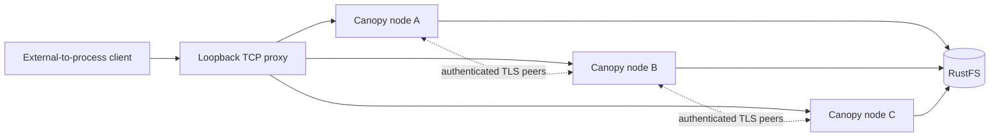
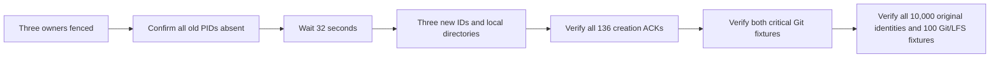

# Qualify three Canopy nodes behind a proxy

**Status: baseline and post-load full-corpus recovery failed; qualification in progress.** This campaign preserves the documented 10,000-repository
reference target. A ready fleet, small socket tests or an incomplete seed does
not qualify throughput, latency, recovery or production capacity.

## Establish the topology



Three distinct server processes have separate node IDs, signing keys and local
directories. The ingress balances TCP connections, not HTTP requests: keep-alive
retains its selected backend. Every node advertises the ingress public URL so
Git/LFS URLs cannot silently bypass it. Private peer transport uses verified TLS;
the local ingress uses HTTP. This is a shared-host diagnostic topology, not
three isolated Linux reference machines or an HTTPS-ingress qualification.

The stream proxy forwards bytes without parsing HTTP, buffering complete Git
packs, or retrying a possible mutation. It limits admitted streams to 256 and
reads at most 64 KiB per relay chunk. Metrics include per-backend connections,
bytes, errors, current/peak streams and explicit admission rejections. TLS
handshake overhead and transport buffers are separate from the chunk size.

## Bind measurements to artifacts

| Input | Current campaign |
| --- | --- |
| Canopy base | `origin/main` at `615a48d`, merged PR #14 |
| Baseline source equivalence | The retained artifact's production manifests, lockfile and crates match the previously tested `a62180e` tree; the new dependency candidate below is separate |
| Release server SHA-256 | `dac1ff8f0300c60e26f1b44a02479218379a68467ac740472314561183eb47b6` |
| Cellule | `70bd25f142f1976fdd63ffe60e46e15ae276ffdc` |
| RustFS release | `1.0.0-glibc`, registry index `sha256:bffcab0c9d647aab0055d1c69d340b202d0909966b385932d4ead1aeb7602858` |
| Pinned ARM64 platform manifest | `sha256:0c3c7030ffb93afde8d359fb1db957b85033ede05115518bd0dede51f4353f6a` |
| Image config digest | `sha256:dc3a547b5adb60236a9df37dcc9966b67553fda636df21bc5ef9a09ae8f3690e` |
| Provider | Dedicated `canopy-three-rustfs-q3fo2z`, fixed loopback port 32910, two CPU quota / 2 GiB memory |
| Node admission | Initially 100 active repository entries and a 1.5 GiB configured local disk limit per node |
| Client/server scratch | Separate qualification volume; no node CPU or memory cgroup isolation |
| Requested corpus | 10,000 identities, 100 populated two-commit Git fixtures, 1 MiB LFS body per populated fixture |

The ARM64 manifest and image config are different digests from the
multi-architecture index. A private anonymous Docker configuration avoids a
stalled Desktop credential helper for public-image downloads; global Docker
credentials were not changed. No authority check or TLS verification was disabled.

## Prepare the next upstream candidate

Cellule `origin/main` advanced during the running baseline. Canopy's manifests
and six Cellule lockfile entries now select
`e07670e2348231ed401cc7280a47e3ab97596ffe`. Dependency resolution and locked
metadata validation passed without updating unrelated packages or creating a
local Cargo target directory. [Workflow 36789746786](https://github.com/crabbuild/canopy/actions/runs/36789746786)
passed formatting, clippy, workspace tests, isolated RustFS compatibility and
server build. Its [sibling workflow](https://github.com/crabbuild/canopy/actions/runs/36789752428)
failed `lifecycle::lease::startup_preflight_does_not_consume_the_node_lease`
with `AddrInUse`; provider qualification and build were skipped in that job.
Both used source `a2c59a3`; neither is a local three-node performance comparison.
The candidate's local release build and 17-step critical Git check now passed.
Its 10,000-repository seed is in progress; full-corpus recovery and matched load
remain open. The baseline measurements below use the retained `70bd25f` binary,
not the new source pin.

The intervening commits add [fenced route reuse and coalesced owner discovery](https://github.com/crabbuild/cellule/pull/32)
and [single-enrollment-read follower append authorization](https://github.com/crabbuild/cellule/pull/31).
Their relevance to the observed directory/latency failures is a hypothesis,
not a measured fix. The baseline's scripts, binary and provider configuration
were unchanged during load. CI verification can run independently; local compilation,
fresh-state recovery and matched performance comparisons must follow the
recorded baseline and produce their own artifact bindings.

### Bind the local candidate separately

The locked production release built with one Cargo job in 578.311 seconds.
Its production source binding is `5165e075`, equivalent to merged `d8a6e114`
for the bound manifests, lockfile and production files. Build time is setup
evidence, not server throughput. Cargo integration tests can overwrite
`target/release/canopy` with a test-feature variant, so the fleet uses a retained
immutable copy of the original production executable, not that mutable path.

| Candidate input or gate | Evidence / status |
| --- | --- |
| Cellule revision | `e07670e2348231ed401cc7280a47e3ab97596ffe` |
| Production executable SHA-256 | `e90728c60cbb941cc8caa1c698bc24bcf6edda1935d98853f0c0319933668f16` |
| RustFS | New container `canopy-candidate-rustfs-w0sfigmz`, same pinned ARM64 manifest as the baseline, two CPU quota / 2 GiB memory; fresh bucket and prefix |
| Fleet | Three new node identities/directories behind one proxy; unchanged 100-entry admission and 1.5 GiB configured local disk limit per node |
| Critical Git behavior | All 17 steps passed: atomic publication/refusal, mixed refusal, correct/stale force-with-lease, shallow/deepen/unshallow, filtered lazy fetch v0/v2, new-object push, fast-forward pull, deletion/pruning, mirror push, credential refusal and exact mirror inventories with strict full fsck |
| Corpus setup | New 10,000 identities with 100 two-commit Git and 1 MiB LFS fixtures requested; seed in progress, not yet complete |
| Recovery and performance | Candidate owner-loss, full-corpus recovery, scheduled load and matched comparisons remain unqualified |

Artifacts are retained under `canopy-e07670e-candidate-W0SFiGMz` on the
qualification volume:

| Artifact | SHA-256 |
| --- | --- |
| `build.json` | `f4a8b63fede3fc0556f9d956513bbe9fc85ad3db9ec8b9f3421aba7aae4f6e9b` |
| `candidate-binding.json` | `9f4be2686d6f74fe1c8f45ae6b2afa6b6e9d108d7a3b4ddde5839e0d0e9ec517` |
| `fleet-candidate-matched/ready.json` | `975088199e3d1b2ba1aa6ce234253915dca0dd885566843bcc88f29413232822` |
| `critical-candidate.json` | `48fc4f70c291aa3770d4cf093c3945603ddcaf3ef393a7ded3f66e10139fb9dd` |

The candidate's two critical repositories are separate from its density corpus:
`910d4eae-ca4a-4495-bb10-06a8cd9e9d23` and
`092a2349-8cf8-44ed-8b31-43ccae05d7d5`. The receipt binds the executable and
driver digests. Compound functional-step durations are not scheduled operation
latency or throughput. A separate observer retains provider gauges and node
RSS/cumulative CPU during seeding; it excludes native Git child CPU and does not
measure S3 API cost.

Failed setup remains visible. `fleet-candidate-seed` failed its storage probe
with `NotFound` before readiness; the cause is not isolated. After explicit
bucket readiness, `fleet-candidate-ready` started a test-feature executable,
then all three nodes shut down gracefully with exit 0 before any corpus was
seeded. Neither setup is qualification evidence. The current fleet uses the
immutable production artifact and its own binding. Successful setup does not
erase the earlier baseline's failed full-corpus recovery.

## Retain failed setup and incomplete work

| Check | Evidence / status |
| --- | --- |
| Proxy socket regressions | Binary body larger than relay chunks, half-close, keep-alive, unchanged authorization, dead backend with no retry, connection-limit rejection |
| Creation driver regressions | Unique names/UUID validation, every arrival counted, HTTP errors and invalid identities rejected, exact recovery receipts, corrupted evidence rejected before requests |
| Python harness and fixture checks | 44 passed on Python 3.12 and 3.14, including real-TCP repeated-window connection cleanup; `python312-connection-lifecycle.log` and `python314-connection-lifecycle.log` |
| Hosted CI | Both `501c207` workflows passed the 44-test Linux harness and Rust format, clippy, tests, isolated RustFS compatibility and build. The earlier `94d135f` harness failure remains recorded: a global randomness mock broke UUID construction on Python 3.12 |
| Initial fleet startup | Failed: an old ephemeral RustFS port no longer accepted connections |
| Initial 10,000 seed | Failed at the first create with HTTP 503; zero identities recorded, `complete: false` |
| Cause of that seed's storage failure | Node logs show connection refusal and fencing; the old provider disappeared during concurrent Docker maintenance |
| Replacement fleet | Three live nodes behind one proxy; matching UUID read through each node |
| Fresh 10,000 seed | Completed with exit 0: 10,000 distinct canonical repository UUIDs, 100 two-commit Git fixtures and 100 exact 1 MiB LFS fixtures; 8,567.224 seconds |
| Critical stock-Git probe through ingress | Passed 17 functional steps against the live RustFS fixture; exact nine-ref inventories in two repositories, v0/v2 mirror clones and strict full fsck |
| Scheduled load matrix | Failed: 20 fully bound windows and one interrupted creation window; all 21 complete arrival ledgers retained. Git/LFS load phases had not started |
| Initial three-owner loss | All three verified seeding-node PIDs killed; process absence recorded, followed by 32.006 seconds of unchanged lease-expiry wait; no data deleted |
| Critical-fixture fresh-state recovery | Passed: both original identities, four exact nine-ref inventories across v0/v2, payload, Git notes and strict full fsck |
| Full-corpus recovery / preflight | Passed: all 10,000 original identities and all 100 populated fixtures through three fresh node directories and the new ingress; v0/v2 clones, exact Git/incremental/LFS bytes and strict full fsck; four verification workers, no retries |
| Post-load acknowledged-write recovery | All 136 acknowledged creations passed after observed three-owner failure and fresh-state startup. No Git/LFS load writes existed because those phases had not started; full original-corpus recheck failed with an identity-read timeout |

The old seed is not resumed or merged into a passing manifest. The replacement
uses an independent provider, bucket and deployment prefix. The original 30-second
seed client timeout, production leases and fencing remain unchanged. Setup and
provider interruptions do not establish a Canopy or Cellule throughput bottleneck.

The first live seeding fixture started before the final launcher teardown guards
and source-hash fields were added. It is setup evidence, not a matched performance
candidate. Scheduled load runs must use a committed harness, record its script
digests and distinguish the corresponding fresh fleet from this seeding phase.

The matched fleet uses the same durable deployment and release binary, with new
node IDs and local directories. The initial fault is deliberate, not a setup
failure: the seeding launcher's retained outcome records all three exits as `-9`.
RustFS retained container identity and start time, with zero restarts across this
boundary. Recovery of the two critical fixtures and the complete original corpus
passed separately. Neither proves post-load recovery of newly acknowledged writes;
that gate remains open until the load ledgers and a second owner-loss boundary are
verified.

| Evidence file in `canopy-three-proxy-q3FO2z` | SHA-256 |
| --- | --- |
| `corpus-stable-10000.json` | `a0ffd0ca727a99e067fb71b419ffe0cd6ac4750ea18db25fd0f19291ac3275c1` |
| `initial-owner-loss.json` | `b7ec448090f971688bcab265dfe331f689322d23f708acdd1663d605c4644179` |
| `fleet-node100-matched/ready.json` | `fb3e9373c7b04f19742d9098d006f55bf22273a6f0aa9a918149f43fa8827531` |
| `critical-initial-owner-loss-verification.json` | `2aac52dcca5973fbe9ed8badebd5eda2c97563e091d94816df5735f76f9c0c5d` |
| `campaign-node100-baseline/preflight.json` | `f9db3b852a941e85ec491ae3bce662bf08c506f679fad6428a0d86b7e45084cd` |
| `initial-six-metadata-audit.json` | `c1edcb29c40ed53aeca1b6b868b3d8655c334df5af0a1167d83117498c526628` |
| `plan-node100-baseline.json` | `3b91a98e56d13c20985e6ca2d3063035011cb6da47f1a770499d3aa8b95a9e1b` |

The [declared first admission profile](three-node-baseline.json) expands 50
configurations into 108 windows:
114,960 offered arrivals over 8,640 offered seconds, excluding preflight,
preparation and drain. It covers metadata with 100/500/1,000-identity uniform and
skewed sets, creation, discovery, stock Git reads and incremental pull/fetch,
ref-only pushes, fresh 256 KiB/1 MiB child-commit pushes and 1 MiB LFS transfers.
Git concurrency and offered rate vary independently. Load clocks started
after complete-corpus preflight; the fleet later fenced during creation and the
matrix is not complete. Higher admission
profiles, rate envelopes, further
skewed Git tests and complete acknowledged-write recovery remain required.

During preflight, a pause in the 100-identity progress checkpoints prompted a
one-second native process sample. The main thread was waiting for its batch and
workers were waiting for HTTP responses; progress resumed without restart or
retry. Node logs retained successful but slow lease refreshes (up to 5.900 seconds
in the inspected interval). RustFS retained its container identity and zero
restarts. The process sample and cumulative cgroup snapshots are diagnostic
artifacts, not proof of a Cellule defect or scheduled-load latency. No timeout,
lease or fencing rule was weakened.

The campaign runner rejects old or changed fixture bindings, stale proxy metrics,
missing processes, an incomplete corpus and an active set larger than the eligible
population. It verifies all corpus identities and populated v0/v2 Git/LFS bodies
before starting the arrival clocks. Repeated windows are declared explicitly;
failed windows stay in the campaign rather than being retried or discarded.
Each load report and resource log has a SHA-256 binding in the campaign index.
Preflight and each window have separately owned HTTP clients. The real-TCP
regression reproduced an artificial admission failure when old thread-local
keep-alive connections survived into later windows; it now passes with the same
two-connection proxy cap and no backend/admission errors. The real fleet cap and
production timeouts were not raised to accommodate the driver.

## Initial scheduled metadata results

These are the first six completed windows, not the completed campaign. Each
offers 2,400 arrivals over 120 seconds at 20 requests/s, with 32 driver slots and
100 selected identities from the complete 10,000-identity corpus. Node residency
remains capped at 100 entries per node. Repetitions use the same selected set;
there is no explicit prewarming or per-request proof of a warm serving path.

| Distribution | Repeat | Successful | Driver drops | HTTP 503 | Successful req/s in window | Attempt p95 / p99 (ms) |
| --- | --- | --- | --- | --- | --- | --- |
| Uniform | 1 | 1,936 | 464 | 0 | 16.133 | 3,622.677 / 11,840.058 |
| Uniform | 2 | 2,384 | 12 | 4 | 19.867 | 364.444 / 2,142.484 |
| Uniform | 3 | 2,400 | 0 | 0 | 20.000 | 142.316 / 235.788 |
| Skewed | 1 | 2,167 | 233 | 0 | 18.042 | 1,425.805 / 7,259.360 |
| Skewed | 2 | 2,358 | 25 | 17 | 19.642 | 746.147 / 2,766.292 |
| Skewed | 3 | 2,381 | 14 | 5 | 19.842 | 1,074.443 / 2,012.889 |

The independent audit recomputes every arrival count, sequence coverage,
nearest-rank percentile and in-window success count. It verifies report, sample
and resource digests against the campaign index. Percentiles include completed
errors; dropped arrivals remain failures without fabricated latency. They are
not averaged across repetitions. None meets the numerical warm-reference
p95/p99 bounds of 20/50 ms; this shared-host diagnostic is not the reference
Linux environment or a pure warm-path qualification.

There were no front-proxy errors or admission rejections in these six windows.
In uniform repeat 2, four client HTTP 503 completion timestamps match four
node-0 authentication-directory error logs within about one millisecond. The
handler performs Directory Cell authentication before repository inspection.
The generic invocation error does not identify the underlying runtime failure;
this is a correlated failure path, not a proven Cellule bottleneck. Same-set
repetition improves the uniform measurements, but the skewed repeats still fail.
No runtime optimization, retry, timeout or admission increase was applied.

## Retain the failed baseline and recover acknowledged writes

At approximately `2026-09-30T23:28:18Z`, all three baseline nodes exited with
code 1. Node logs record Cell fencing and
`Runtime(Node("node lease bounds are invalid"))`; the launcher records
`node-1 exited with 1`. The proxy closed, and the campaign terminated with
`resource observation failed` rather than restarting or retrying a window.
RustFS still had the same container identity and start time, without a restart
or OOM kill. No provider or node data was deleted.

The terminal audit verifies all 21 report/sample digests, complete unique
arrival sequence coverage, outcome totals, in-window successes and nearest-rank
latency quantiles. The first 20 windows also retain bound resource boundaries.
The interrupted third creation window has a complete report and sample ledger,
but no valid after-boundary: it is **not resource-qualified** and is absent from
the completed-report list. Its acknowledgement ledger must still be included in
recovery checks.

### Metadata with larger selected sets

Each window offered 2,400 arrivals at 20 requests/s with 32 driver slots and
the same 100-entry admission limit per node. The larger selected sets do not
raise that limit. Attempt percentiles include completed errors; driver drops
have no fabricated latency. In-window rates exclude successful drain completions.

| Selected identities | Access | Repeat | OK / drops / HTTP 503 / transport errors | Successful req/s in window | Attempt p95 / p99 (ms) |
| --- | --- | --- | --- | --- | --- |
| 500 | Uniform | 1 | 1,982 / 401 / 17 / 0 | 16.483 | 3,708.603 / 4,579.120 |
| 500 | Uniform | 2 | 2,028 / 362 / 10 / 0 | 16.875 | 3,857.033 / 6,677.808 |
| 500 | Uniform | 3 | 1,977 / 391 / 32 / 0 | 16.225 | 3,832.183 / 6,385.354 |
| 500 | Skewed | 1 | 1,896 / 493 / 11 / 0 | 15.800 | 2,903.415 / 19,529.582 |
| 500 | Skewed | 2 | 2,186 / 210 / 4 / 0 | 17.975 | 2,567.978 / 6,886.433 |
| 500 | Skewed | 3 | 1,770 / 586 / 44 / 0 | 14.550 | 5,200.413 / 8,219.480 |
| 1,000 | Uniform | 1 | 280 / 2,096 / 6 / 18 | 2.075 | 30,004.694 / 30,015.112 |
| 1,000 | Uniform | 2 | 531 / 1,855 / 9 / 5 | 4.167 | 20,763.359 / 29,897.866 |
| 1,000 | Uniform | 3 | 881 / 1,497 / 22 / 0 | 7.083 | 9,454.380 / 20,007.887 |
| 1,000 | Skewed | 1 | 2,064 / 336 / 0 / 0 | 17.192 | 3,862.827 / 6,904.098 |
| 1,000 | Skewed | 2 | 2,368 / 32 / 0 / 0 | 19.725 | 519.354 / 2,599.916 |
| 1,000 | Skewed | 3 | 2,302 / 40 / 58 / 0 | 19.183 | 1,586.558 / 4,136.254 |

A user-requested UI preview began during the final metadata windows and used
its own RustFS instance and deployment, without touching benchmark storage.
It still consumed the shared Mac/Colima host. The audit conservatively flags
the last two metadata windows and all creation windows as possible overlaps;
those are not uncontended capacity measurements. The earlier broad-set failures
predate the preview. Preview activity is retained in `ui-preview-intervention.json`.

### Creation before owner failure

All three windows offered 120 unique new names at 1 repository/s and concurrency
16. Creation acknowledges a canonical repository UUID, not just an accepted
HTTP request. A lost or refused response is not an acknowledgement, even if
storage might contain an unacknowledged reservation.

| Repeat | Acknowledged | Driver drops | HTTP 503 | Transport errors | Successful repos/s in window | Attempt p95 / p99 (ms) |
| --- | --- | --- | --- | --- | --- | --- |
| 1 | 85 | 14 | 5 | 16 | 0.708 | 30,006.512 / 30,006.951 |
| 2 | 51 | 27 | 11 | 31 | 0.425 | 30,071.556 / 30,163.645 |
| 3, interrupted | 0 | 0 | 1 | 119 | 0.000 | 9.802 / 22.701 |

The interrupted window's short error latencies are failed connection attempts,
**not an improvement**. None establishes a stable creation envelope. The audit
retains 136 distinct acknowledged name/UUID pairs across the complete creation
ledgers; the 224 failed arrivals are not asserted to have been committed.

### Fresh-state recovery gate



`failed-owner-exit.json` records all four old process IDs absent followed by
32.076 seconds of conservative lease-expiry wait. This boundary is an observed
failure, not a deliberate SIGKILL. `fleet-node100-after-failure` starts the same
retained release binary and durable deployment with three new node IDs, signing
keys and empty local directories, still capped at 100 active entries per node.
Its proxy is separate from the user's UI preview.

The recovery run passed all 136 creation ACKs and both critical Git fixtures:
four exact ref inventories across v0/v2 mirror clones, exact payload/notes and
strict full fsck. Its full original-corpus check then failed with four bounded
workers and no retries. The last complete progress checkpoint was 300/10,000;
the identity request for `density-ea9283d2648c-00355`
(`ed794e34-158b-4cc1-9e71-d21d7405ab2b`, request ID
`b8333796-0a12-47a9-b37a-0f4ffa56fbd0`) timed out at the unchanged 30-second
deadline. The verifier process exited with code 1 and its result records
`completed: false`, `error: RuntimeError`; this is not a complete recovery pass.
The critical receipt's digest matches the earlier
recovery result because its expected fixture content did not change; the new
owner boundary and fleet binding are recorded separately, not inferred from
that content hash. Successful creation/critical recovery does not close the
full-corpus gate or qualify any
unstarted Git/LFS load phase. The new dependency candidate must subsequently
produce its own release artifact, end-to-end and matched performance evidence;
it cannot replace verification of writes made by this failed baseline.

| Artifact under `canopy-three-proxy-q3FO2z` | SHA-256 |
| --- | --- |
| `failed-baseline-audit.json` | `398fb729e1017ddd956a6fdc6e1c5dc528f1efc86dbbeeec4035fd4e7ecd6b62` |
| `fleet-node100-matched/outcome.json` | `153174bf051cd8795039f43c6b38a6fad4416645244c58aeb71a853bba5f136f` |
| `failed-owner-exit.json` | `16b300d2724ec52a73f6dab656c682c70567a6669a6612bd0fb8baa920a5d889` |
| `fleet-node100-after-failure/ready.json` | `47bd95391d667be68403dd55d02f0349d3dc874f908b64ced3ab112611056062` |
| `creation-after-failure-verification.json` | `45127974487f1b0e272a1d7603886b84b2afe5c3255a8a04653e380c5a41db14` |
| `critical-after-failure-verification.json` | `2aac52dcca5973fbe9ed8badebd5eda2c97563e091d94816df5735f76f9c0c5d` |
| `recovery-after-failure.json`, terminal failed attempt | `5113e16b0fee7c59a5165c98d48810e47090a16df6a44425b53e97150d791430` |
| `verify-failed-baseline.log` | `af6ac6a69c47acc935aa7aa0b8d4ce3926111b043bb438d5394ec6cd26ec36e5` |
| `failed-recovery-read-probes.json`, separate diagnostic | `596888de9b9db6184b7fd5fe4cc72b13ea08941a3fa10bf1f8406eb19d2a1844` |

After the failed verifier exited, all three recovery nodes remained live and
readiness succeeded. Separate, explicitly diagnostic requests each checked
Directory authentication and the failed repository identity, with new request
IDs and no hidden retries. All six returned 200; identity checks matched exactly.
Directory reads took 1,303.672, 6.145 and 399.635 ms; repository reads took
789.856, 1,572.026 and 841.882 ms. The earlier timed-out read may have left the
repository resident. These measurements occurred while the separate candidate
build ran on the shared host: they are neither a cold recovery retry nor a warm
reference-capacity result. The failed full-corpus record remains unchanged.

The new dependency build used a separate artifact-volume target directory and
one Cargo build job; it does not replace any running server or recreate a
workspace `target` directory. Release admission binds the Cargo lockfile and
compiled release. The new binary therefore requires its own fresh prefix;
old-release migration is unsupported and admission must not be bypassed to
reuse the baseline's store. The original 10,000 identities and creation ACKs
remain retained for baseline recovery diagnosis, not reseeded as a passing
replacement.

After preserving the failed recovery and diagnostic probes, all three baseline
recovery nodes drained gracefully with exit 0 and confirmed process absence.
`failed-recovery-drain.json` records the boundary. The dedicated baseline RustFS
container was then stopped, not deleted; its durable data and node artifacts
remain available for diagnosis. The independent user UI preview stays running.

### Diagnosis boundaries

The independent provider observer compares adjacent UTC and monotonic sample
clocks; their largest difference over the observation was 0.007746 seconds.
There is no sampled large wall-clock jump. RustFS CPU observations near fencing
include 214.24% and 141.15% under a two-core quota, followed by reduced activity.
Earlier node warnings record successful but slow lease refreshes. These narrow
the next investigation toward provider/publication pressure and the lease
refresh path, but do not isolate its cause or prove a Cellule optimization.
The production 30-second authority interval, client deadlines, admission bounds
and fencing checks remain unchanged.

The mixed hosted CI result is a separate problem: the delayed-startup test
obtains and releases an ephemeral listener before its 31-second pause, then
binds that same address at startup. Holding a competing listener on the released
port reproduced `AddrInUse` in the exact test after the original 31-second
pause. The fixture now holds its initially selected port and requests port zero
for the server, then uses `server.local_addr()` and asserts that the server
bound a different port. This also avoids a released-port race in the regression
itself. The 31-second pause, advertisement issue-time assertion, real repository
creation and production authority/fencing behavior are unchanged.

The final exact test passed in 31.17 seconds; all four lease lifecycle tests
passed together in 35.24 seconds (100 other integration tests filtered out).
This is fixture verification, not a local full-workspace or performance pass.
Retained candidate-directory logs bind the failure and final results:

| Test log | SHA-256 |
| --- | --- |
| `startup-port-race-reproduction.log`, failed | `19a99536e5c7a119fd0a675b64e7b171c25fb5918e34560c2e8f933061c24c7f` |
| `startup-port-race-atomic-fixed.log`, passed | `585d00b55b4f4ceedf05a216df20635c347d330e86305efb47f20cea0475e04d` |
| `lease-suite-after-fixture-fix.log`, four passed | `27c4a6d42108bd57ac8c006d48f5b39b28ceb473454bc80d41eb40adced8bf28` |

### Reject expired successful replies

A new real-server/in-memory-store probe holds a successful conditional renewal
reply past the replacement advertisement's signed expiry. It then releases the
reply and waits for the server's own supervisor with **no caller stop signal**.
The supervisor must terminate with `Runtime(Fenced)` and ingress must remain
unavailable. Explicitly shutting down first could hide an unsafe revival.
Production lease durations, deadlines and fencing are unchanged.

The final supervised probe passed in 33.25 seconds. All five lease lifecycle
tests then passed together in 39.95 seconds, with 100 other integration tests
filtered out. This checks the expired-reply safety branch; it does not reproduce
the baseline's provider latency or prove a performance fix. The Cellule
`node/lease.rs` source at `70bd25f` and `e07670e` is byte-identical, SHA-256
`a903184abec46b149ab90c889699c9820a9023d9635f4d52b67ad6fdacdf9967`.

| Candidate-volume test log | SHA-256 |
| --- | --- |
| `expired-renewal-supervised.log` | `006f0cb3208e331372d7432d682b8ac2983dcda8262763e1d2f82b9fe4663d83` |
| `lease-suite-with-expired-reply.log` | `86250ccc3c174bebaf7b8fa3f8d20ffd04b9ca497f0b6e51d23caec3732e883e` |

### Advance only from a complete candidate seed

The retained one-off `finish_seed_recovery.py` transition is now running, bound
to seed PID 48549, the immutable candidate binary, current provider and original
three owner process identities. Its live read-only binding check passed before
execution. It waits for that exact seed to end and requires 10,000 distinct
canonical UUID/name pairs and the same 100 two-commit Git/1 MiB LFS fixtures
before any signals. Incomplete seed, changed source/processes, missing owners
or a provider restart stop it without a retry, reseed or replacement fixture.

After successful seeding, it records three verified-owner SIGKILLs and process
absence, waits at least 32 seconds, starts fresh directories on the same durable
deployment, and verifies both critical fixtures and the complete original
corpus. HTTP timeout stays 30 seconds, verification concurrency stays four,
and admission stays 100/node. It does not start scheduled load. At this
observation its phase is `wait_bound_seed`, not a recovery pass.

Four simulated control-flow tests passed: complete transition, incomplete seed,
provider restart and missing node. They send no real signals or provider/Git
requests and are not recovery evidence. The live transition retains
`seed-to-recovery.json`, fault boundaries and individual verification receipts.

| Candidate-volume control artifact | SHA-256 |
| --- | --- |
| `finish_seed_recovery.py` | `a53eef39b0357972204248460896ef6edc6332c9533156263e4bbfdc578ec3bf` |
| `test_finish_seed_recovery.py` | `60633e5411929d04670a7ea730d766241cb65d93317cc13e4aef79b3b216185f` |
| `seed-to-recovery-bound-control-tests.log` | `ac30ceeb7a4a6343e722a531212ec3211adc5351aa60b9138d212d97dfc1760a` |

Both full hosted workflows for `9c29627` and `f7fc26f` have now passed, including
Rust tests, isolated RustFS compatibility, server build and the 66-test harness:
[36799769344](https://github.com/crabbuild/canopy/actions/runs/36799769344),
[36799773408](https://github.com/crabbuild/canopy/actions/runs/36799773408),
[36799971965](https://github.com/crabbuild/canopy/actions/runs/36799971965) and
[36799975428](https://github.com/crabbuild/canopy/actions/runs/36799975428).
Those earlier commits did not contain the new expired-reply test.

## Measure the requested operations

Complete and verify the corpus before interpreting scheduled load results.
Use independent 100/500/1,000 active-set sweeps, uniform and skewed access,
separate Git concurrency sweeps and repeated windows. Count every scheduled
arrival, including `driver_busy`, transport errors, HTTP rejection, Git errors
and client timeouts. Keep failures in the report rather than hiding them in a retry.

| Operation | Required correctness / measurement boundary |
| --- | --- |
| `create` | Unique new names, canonical repository UUID, durable reply; later verify every acknowledged creation |
| `metadata` | Exact repository identity; authenticated response consumption |
| `refs`, `ls_remote` | Keep capability-only discovery separate from actual stock-Git ref listing |
| `clone`, `cold_fetch` | Stock Git with exact tip/content; distinguish a cold client from a cold server |
| `incremental_fetch`, `incremental_pull` | Prepared base-only client outside arrival clock, exact new tip and pull body |
| `push_branch` | Unique publication ref, stock receive-pack acknowledgement; later verify exact ref/body and strict fsck |
| `push_commit` | New deterministic incompressible payload and child commit per arrival, exact original parent and unique ref; verify every acknowledged commit/payload after recovery |
| `lfs_upload`, `lfs_download` | Unique upload bodies; exact size and SHA-256, including recovery |
| Other critical Git operations | Initial ingress probe passed atomic multi-ref updates/refusal, mixed refusal, tags/notes/Unicode refs, mirror push, correct/stale force-with-lease, delete/prune, shallow/deepen/unshallow, filtered lazy fetch and invalid-token refusal; repetition under load and after owner loss remains open |

Reports include scheduled p50/p95/p99, service and dispatch times, error fraction,
successful completions inside the offered-load window and successful throughput
including drain. The driver observes the complete offered window; a quick final
response must not inflate the rate by omitting the last inter-arrival interval.
Git timings include client setup/validation where declared. Pack first-byte,
bytes/s, CPU and provider cost still need independent live measurements.

### Separate pack waiting from transfer and validation

`scripts/measure_git_pack.py` adds a bounded, read-only v0 upload-pack probe.
It requests the critical receipt's exact main commit with no haves and
`side-band-64k`, using the [Git pack protocol](https://git-scm.com/docs/pack-protocol).
The measurement starts before a new HTTP connection/POST and records header
time, the first channel-1 pack byte, last pack byte and completion through final
flush/EOF. NAK and progress-channel bytes cannot count as pack data. First-byte
time is taken after reading one data byte, before waiting for the remainder of
that packet; it is a client-observed boundary, not kernel arrival or server CPU.

```mermaid
sequenceDiagram
    participant Probe
    participant Proxy
    participant Canopy
    participant Git as Local validation
    Note over Probe,Canopy: Identity and live fleet/artifact checks outside POST clock
    Probe->>Proxy: POST want exact commit, no haves
    Proxy->>Canopy: Forward unchanged
    Canopy-->>Probe: Headers, NAK, progress (not pack data)
    Canopy-->>Probe: First channel-1 pack byte
    Note over Probe: Record first-pack-byte time before reading remainder
    Canopy-->>Probe: Remaining pack, flush, EOF
    Note over Probe: End POST clock; record bytes and transfer rate
    Probe->>Git: index-pack --strict into empty object database
    Probe->>Git: Exact wanted commit + fsck --strict --full
    Note over Probe,Git: Validation timed separately; failure leaves incomplete receipt
```

Run only against the explicitly bound fleet, outside a scheduled load window:

```sh
export CANOPY_GIT_TOKEN='<disposable fixture token>'
python3 -B scripts/measure_git_pack.py \
  --fleet-dir /dedicated-volume/candidate-fleet \
  --receipt /dedicated-volume/critical-candidate.json \
  --output-dir /dedicated-volume/new-pack-measurement \
  --samples 3 --timeout 30 --max-pack-bytes 268435456
```

The output binds the fleet, production executable, critical receipt and source
digests. Each serial sample uses a new connection and retains its pack and
validation database. HTTP errors, redirects, wrong content types, compression,
fatal sidebands, missing/truncated/oversized data, invalid pack checksums and
missing wanted commits cannot produce a completed sample. There are no retries
or automatic warmup. Failed sample receipts remain incomplete, not low-latency
successes.

Eight regression tests include a real stock `git upload-pack` stream over
fragmented loopback HTTP, complete serial measurement receipts, strict
indexing/fsck and corrupt/missing-graph pack rejection. The complete 52-test
Python harness passed on both Python 3.12 and 3.14. Retained final logs under
`canopy-e07670e-candidate-W0SFiGMz` bind those results:

| Final suite log | SHA-256 |
| --- | --- |
| `python312-pack-probe-final-suite.log` | `9e6e2636cef36997c027c275ae4f32baf6ec4d6b72717624b1784eb1ddc4b725` |
| `python314-pack-probe-final-suite.log` | `344cc7ad10890a9c8bca494609c2f79c72cd3339b6f0b61c1644f1fea16e2d73` |

The committed probe (`878d111`) subsequently passed three serial samples
through the candidate proxy/RustFS while the 10,000-repository seed was active.
Each downloaded pack contained 1,153 bytes and passed strict indexing, exact
wanted-commit validation and full strict fsck with Apple Git 2.50.1. These are
setup-load functional/timing observations, not scheduled load or matched
baseline comparisons. The compressed critical fixture is too small to measure
bulk transfer capacity.

| Serial sample | Headers (ms) | First pack byte (ms) | Complete POST (ms) | Local validation (ms, outside POST) |
| --- | ---: | ---: | ---: | ---: |
| 0 | 227.072 | 255.891 | 257.780 | 166.786 |
| 1 | 490.265 | 507.593 | 509.568 | 144.591 |
| 2 | 121.930 | 139.526 | 140.933 | 150.131 |

The candidate-directory artifact `pack-probe-during-seed/measurement.json`
has SHA-256 `59801101b210e16254f5f6ae2d6460eef954ab402326db5369d733ad4bb1dcf3`.
It binds the immutable production binary, critical receipt, fleet and probe
digest `82a66363dd2242719fdc5a259d74bc051f03ad6168538064fe404e7f1609e512`.
Raw monotonic boundaries, request IDs, pack digests and declared bounds are
retained. The overlapping seed is an explicit setup-load intervention, not
background-free performance evidence; no seed result is promoted to scheduled
creation throughput.

The reported transfer rate is pack bytes divided by the entire POST duration, not Ethernet bytes/s or
steady-state capacity. Serial repetitions can warm server state; neither the
identity check nor a new HTTP connection establishes cold ownership. Discovery,
local validation, v2 negotiation, stock clone performance, native Git child CPU
and provider request-cost accounting require their own evidence. The running
candidate seed and its bound harness are unchanged.

The campaign samples each node, the proxy launcher and its own driver once per
second with `ps`: RSS, cumulative process CPU seconds and raw CPU percentage.
Resource boundary snapshots include preparation and drain, separately from the
driver's arrival clock. Front/peer byte counters include HTTP headers and Git
framing, not just payload. These observations can distinguish driver, proxy and
server pressure; they do not measure RustFS VM CPU, S3 request cost, pack first-byte
latency or per-payload-GiB CPU. The current resource field
`ps_lifetime_cpu_percent` is misnamed on macOS: its `ps` manual defines `%cpu` as a
decaying average over up to a minute, not a lifetime or window average. Preserve
the raw field but use differences of cumulative `cpu_seconds` for interval CPU;
the running campaign's bound source is not changed mid-measurement.
These process samples also exclude native Git child CPU, so they cannot support
a complete server CPU-per-GiB claim.

### Observe kernel self and reaped-child CPU separately

`scripts/fleet_cpu.py` adds a read-only observer without changing the bound
campaign or production executable. macOS reads `proc_pid_rusage` v2; Linux reads
the per-process `utime`, `stime`, `cutime` and `cstime` counters. Each record keeps
raw counters, time scale, RSS and a process-start identity. A changed identity,
decreased counter, missing process or invalid interval fails the observation;
earlier samples and an incomplete receipt remain retained.

On this ARM64 Mac, the Mach timebase is 125/3. A 0.150020-second process-CPU
calibration produced 3,602,003 raw units: scaling yielded 0.150083 seconds;
dividing by 1e9 alone would incorrectly report 0.003602 seconds. The reader
queries the platform timebase rather than hard-coding this host's ratio.
[XNU's task accounting](https://github.com/apple-oss-distributions/xnu/blob/main/osfmk/kern/task.c)
uses Mach-time counters. [Linux proc stat](https://man7.org/linux/man-pages/man5/proc_pid_stat.5.html)
uses clock ticks, scaled with `SC_CLK_TCK`.

Child counters cover rolled-up usage, not instantaneous live-tree CPU.
[XNU's reap path](https://github.com/apple-oss-distributions/xnu/blob/main/bsd/kern/kern_exit.c)
adds child usage to its parent; Linux's child fields cover waited-for children.
A native regression burns child CPU, holds that child alive, proves the parent's
child counter is unchanged, then waits and proves the counter increased.
Seven tests also check SDK layout, Linux names with parentheses, unit
calibration, identity/clock/counter discontinuities and retained failures.
The full 59-test Python harness passed on Python 3.12 and 3.14. Candidate-volume
logs `python312-kernel-cpu-suite.log` and `python314-kernel-cpu-suite.log` have
SHA-256 `9d316452976529027fe905cdf349710ae4966638f8b87c6fe82a634df809864c`
and `8abca5145c727e3391d0b9949a6fd61b18e696219526f276b28bc5d005e74649`.

```sh
python3 -B scripts/fleet_cpu.py \
  --fleet-dir /dedicated-volume/candidate-fleet \
  --output-dir /dedicated-volume/new-kernel-cpu-observation \
  --samples 120 --interval 1
```

The output binds the fleet, executable and observer/validator digests. Intervals
separate self CPU percentage from reaped-child CPU seconds. Short-lived reaped
children need not be caught by a periodic process-list sample, but live and
unreaped children remain excluded. A child started before a load window may be
charged when reaped inside it. These counters include all charged children, not
only Git, and do not close operation-specific CPU/GiB accounting without
independently verified child boundaries. Historical `ps` results are unchanged;
no child CPU is retroactively imputed to the failed baseline.

The committed reader (`6199a73`) completed 120 live samples during seeding, from
00:40:22 to 00:42:22 UTC on October 1. Independent checks confirmed exact
indices 0..119, all three bound PIDs, unchanged process identities and raw
counter/timebase-derived totals over about 120.551 seconds:

| Candidate node PID | Self CPU seconds | Mean self CPU (%) | Reaped-child CPU seconds |
| --- | ---: | ---: | ---: |
| 87409 | 5.483475 | 4.548687 | 0 |
| 88175 | 0.125026 | 0.103713 | 0 |
| 88533 | 0.108677 | 0.090150 | 0 |

Zero charged child CPU in this interval is not proof that no children were
live. A separate retained `check_cpu_during_pack.py` calibration then bracketed
three verified, read-only pack requests during the still-active seed. All three
node identities stayed unchanged and their reaped-child counters increased:
48.400, 45.548 and 39.485 ms, respectively, over about 4.525 seconds. Every pack
was 1,153 bytes and passed strict indexing, exact wanted-commit validation and
full strict fsck. This verifies that the reader observes Canopy child rollup;
the overlapping seed and unclosed child boundaries prevent Git-only,
per-request or CPU/GiB attribution. No writes or fleet restarts were introduced.

| Candidate-volume artifact | SHA-256 |
| --- | --- |
| `kernel-cpu-during-seed/observation.json` | `b48364c7c908da7789481d181d8c82d0026284e3a4c1d621e60625e0ae0feea5` |
| `kernel-cpu-during-seed/samples.jsonl` | `482ce4ebe4a5d2cb18fe3f2f88253dd6418b8e17f2bd799a4320a70d7eb2bca8` |
| `kernel-cpu-pack-calibration.json` | `0be6c1653fbd7dd34b2d12638b063d2a86c122d47379a2f43d39d7bebb5ff007` |
| `pack-probe-under-cpu-check/measurement.json` | `85bef58670c8e797375f4719d37766846788615be748b106362d51be1f50aab3` |

Both Linux-hosted harness jobs for `6199a73` also passed all 59 tests:
[workflow 36797306682](https://github.com/crabbuild/canopy/actions/runs/36797306682)
and [workflow 36797311677](https://github.com/crabbuild/canopy/actions/runs/36797311677).
That includes native Linux tick calibration and waited-child rollup; it does
not qualify the hosted Rust/provider jobs while those are still running.

A separate read-only observer records dedicated RustFS container CPU/memory
samples about every six seconds, beginning during full-corpus preflight. Its
binding includes the observer digest, campaign PID, container ID and start time;
errors and sampling gaps remain in `provider-samples.jsonl`. Docker's raw display
units and rounding are retained. These container samples are not whole-VM CPU,
S3 request cost or exact per-window wire-byte counts; `NetIO` is cumulative.

### Provider request counters without a restart

The dedicated RustFS instance exposes signed, read-only console metrics at
`GET /rustfs/admin/v3/metrics?n=1&types=512`. This is NDJSON, not a Prometheus
endpoint. The image's labelled revision documents the
[authenticated handler](https://github.com/rustfs/rustfs/blob/d47f54bfb2f39f48bd1adda334bd27e151fe85b8/rustfs/src/admin/handlers/metrics.rs)
and [HTTP-only metric selection](https://github.com/rustfs/rustfs/blob/d47f54bfb2f39f48bd1adda334bd27e151fe85b8/crates/ecstore/src/services/metrics_realtime.rs).
An actual signed read returned HTTP 200 and S3 operation/outcome counters;
no telemetry configuration change or provider restart was needed.

`scripts/provider_requests.py` records bounded snapshots and deltas by HTTP
method, S3 operation and outcome. It verifies the bound container, image, start
time and restart count around each read. Missing/decreasing series, restarted
providers and failed reads leave an incomplete receipt with earlier samples
retained. Credentials go to curl on stdin, never command arguments; only explicit
loopback HTTP endpoints are accepted, without redirects or proxy configuration.
This helper is scoped to the dedicated `three-node-candidate-e07670e` fixture.

```sh
# Disposable fixture credentials must already be in the environment.
python3 -B scripts/provider_requests.py \
  --binding /dedicated-volume/candidate-binding.json \
  --docker-config /path/to/disposable-docker-config \
  --docker-host unix:///path/to/docker.sock \
  --output-dir /dedicated-volume/new-provider-request-observation \
  --samples 12 --interval 5
```

Counts include background work and retries. Unknown labels and non-2xx outcomes
are retained: a provider 4xx can be a conditional-write rejection or missing
object, not necessarily a failed Canopy operation. Observer overhead is not
subtracted. The pinned [request-counter implementation](https://github.com/rustfs/rustfs/blob/d47f54bfb2f39f48bd1adda334bd27e151fe85b8/crates/io-metrics/src/s3_http_metrics.rs)
counts once at response headers, service error or cancellation; later body-stream
failures are outside this counter. Snapshots are not atomic across series.
These counts are request-volume evidence, not billed dollars,
request latency, wire bytes or operation-attributed cost. Seed-load observations
cannot close matched load-window accounting.

Seven provider-reader tests cover signed-read isolation, schema/outcome labels,
new series, counter reset/disappearance, restart/identity boundaries and retained
partial failures. All 66 harness tests passed on Python 3.12 and 3.14. Retained
candidate-volume logs `python312-provider-final-suite.log` and
`python314-provider-final-suite.log` have SHA-256
`027b64abca6de9f9cf0aa52b0bacf83c4862e9e5b466b514ff939f102f5d27e0`
and `6b4e22260518592ec0de75175f356aed856738c1c76fb5c157bb3fa4ee70ead6`.
Both full hosted workflows for the preceding `59a7307` commit also completed
successfully, including Rust tests, RustFS compatibility and server build:
[36797898373](https://github.com/crabbuild/canopy/actions/runs/36797898373)
and [36797902238](https://github.com/crabbuild/canopy/actions/runs/36797902238).
Those earlier runs did not include this new provider reader.

The committed reader (`9c29627`) completed 12 live samples at five-second
intervals, from 01:10:09 to 01:11:06 UTC on October 1. An independent audit
checked exact indices, retained sample/binding/driver digests and every interval
delta. Container identity, start time and restart count stayed unchanged.
Across the roughly 56.743-second client read span, first-to-last counter changes
were:

| Provider operation | Outcome | Additional requests |
| --- | --- | ---: |
| `GetObject` | 2xx | 444 |
| `GetObject` | 4xx | 52 |
| `HeadObject` | 2xx | 174 |
| `PutObject` | 2xx | 2,679 |

All other existing series had zero delta: total 3,349. No scrape overhead was
subtracted. Seeding/background ownership continued throughout; this is not a
per-repository cost, a throughput qualification or a matched improvement.

| Candidate-volume artifact | SHA-256 |
| --- | --- |
| `provider-request-during-seed/observation.json` | `2d6a80d22480a5d56321fe3cf6e6352317810b2fd1d2e87ed0819239c232ce28` |
| `provider-request-during-seed/samples.jsonl` | `a034331099cd4e278dddd967de08d3203d9aa8d3f378c3be327aa3efc604e4a5` |
| `provider-request-audit.json` | `9c00996008d05bb0682154d907ee15383954b5af897003f75683c15da8531de3` |
| `audit_provider_observation.py` | `414bae05eae1cca67982e68c5e879d164dd892b8ff44a2a7a569ba632a3853ce` |

Both Linux harness jobs for `9c29627` passed all 66 tests:
[36799769344](https://github.com/crabbuild/canopy/actions/runs/36799769344)
and [36799773408](https://github.com/crabbuild/canopy/actions/runs/36799773408).
Their Rust/provider jobs were still running at this observation.

`push_branch` reuses one commit and therefore measures ref publication, not fresh
pack ingestion. `push_commit` clones prepared base objects locally, creates a new
child of the original corpus tip, and sends a distinct payload on a unique ref.
The original `main` remains unchanged. Reports separate local client preparation
from the stock `git push` command (packing, HTTP, transfer and durable reply);
scheduled latency still includes both. Payload bytes acknowledged are not wire
pack bytes. The default payload is 256 KiB; a second size above 768 KiB exercises
the external-blob path. Preparation templates are built before the arrival clock.
The distinct-write fixtures require at least 32 bytes for meaningful uniqueness
entropy. This is a benchmark input bound, not a Git/LFS server minimum object size.

After losing all three owners, record process exit and the unchanged lease-expiry
boundary before starting fresh node directories. Verify every original corpus
identity and populated Git/LFS fixture, plus every acknowledged creation, push
and LFS upload from the load ledgers. Unacknowledged arrivals are not rollback
assertions. A verifier alone does not prove that an owner restarted.

For `push_commit`, the recovery verifier independently regenerates each payload
from run ID, sequence and declared size, compares its Git blob ID and the exact
parent/tip, and runs strict full fsck after v0/v2 fetches. The local file-backed
driver regression proves these checks reject a wrong ref and a wrong payload
declaration; it is not Canopy/RustFS performance or owner-loss evidence.

## Repeat with caller-owned disposable storage

Supply the provider endpoint and disposable AWS credentials through the
environment. Do not use a production bucket. Launch the compatible server:

```sh
CANOPY_GIT_TOKEN=local-test-token \
python3 -B scripts/serve_three_gateways.py \
  --binary /path/to/qualified/canopy \
  --storage-url s3://disposable-bucket/three-node-test \
  --work-dir /dedicated-volume/new-fleet \
  --max-active-repositories 100
```

Use the printed proxy URL, not a direct node URL, for load clients:

```sh
python3 -B scripts/benchmark_repositories.py \
  --base-url http://127.0.0.1:PROXY_PORT \
  --manifest /dedicated-volume/corpus.json --timeout 30 \
  seed --repositories 10000 --populated 100 --incremental-fixture \
  --lfs-fixture-bytes 1048576 --work-dir /dedicated-volume/new-seed

python3 -B scripts/benchmark_repositories.py \
  --base-url http://127.0.0.1:PROXY_PORT \
  --manifest /dedicated-volume/corpus.json \
  run --operation create \
  --rate 5 --duration 120 --concurrency 32 \
  --output /dedicated-volume/create.json

python3 -B scripts/benchmark_repositories.py \
  --base-url http://127.0.0.1:RECOVERY_PROXY_PORT \
  --manifest /dedicated-volume/corpus.json \
  verify-creations --report /dedicated-volume/create.json \
  --output /dedicated-volume/recovered-creations.json
```

The fixture keeps configuration, node logs, ready/outcome records and proxy
metrics on shutdown. It never deletes object-store data. Current artifacts are
under experiment `canopy-three-proxy-q3FO2z`; the old failed seed and fresh seed
have separate manifests and logs. Correctness, the original reference target
and the [qualification rules](../performance-plan.md#performance-qualification-rules)
remain acceptance boundaries, not claims inferred from a small passing check.

### Run an explicit repeated load plan

Create a plan declaring the exact corpus size and the fleet's configured admission
limit. For example, this deliberately small diagnostic plan covers creation and
one metadata window; it is **not** the full qualification matrix:

```json
{
  "version": 1,
  "corpus_repositories": 10000,
  "node_active_limit": 100,
  "windows": [
    {
      "id": "create-low", "operation": "create", "distribution": "uniform",
      "active_repositories": null, "rate": 1, "duration": 120,
      "concurrency": 16, "repetitions": 3
    },
    {
      "id": "metadata-uniform-100", "operation": "metadata", "distribution": "uniform",
      "active_repositories": 100, "rate": 20, "duration": 120,
      "concurrency": 32, "repetitions": 3
    }
  ]
}
```

```sh
python3 -B scripts/benchmark_three_node_campaign.py \
  --manifest /dedicated-volume/corpus.json \
  --fleet-dir /dedicated-volume/matched-fresh-fleet \
  --plan /dedicated-volume/declared-plan.json \
  --output-dir /dedicated-volume/new-campaign
```

Expand the plan with the operation table, both distributions, 100/500/1,000 active
identity sets, increasing offered rates and independent Git concurrency. Git read
sets cannot exceed the 100 populated fixtures in this corpus. Use separate matched
fleets for each configured node admission limit. The runner does not raise limits,
reseed failed corpora, restart owners or remove any store data. `campaign.json`
distinguishes completion of the declared windows from success of all arrivals;
neither field establishes recovery or the full hosting-service qualification.

### Check critical Git behavior and retain recovery expectations

The initial functional probe used the seeding fleet, with the same release server
and RustFS artifact identities above. It ran alongside the incomplete corpus seed.
Its timing fields include compound setup/validation work and are **not** scheduled
load latency or throughput. Receipt `critical-initial.json` has SHA-256
`136fe79e3bfd6ae5beda021f48e88ecf728537ca0cd53bf26c39ff2e96b4edf2`.

| Durable fixture | Repository UUID |
| --- | --- |
| `critical-f3810ecc247d-source` | `84b77852-6ddd-41a5-9189-62f55a4cb801` |
| `critical-f3810ecc247d-mirror` | `783a7c01-1288-4407-8c6c-99d685428758` |

The nine final refs include an annotated Unicode tag, a lightweight tag, Unicode
branches, a custom ref and Git notes. A blob offered as a branch target is remotely
rejected: non-atomic publication retains the accepted sibling, while atomic refusal
retains neither sibling. A correct force-with-lease moves only its intended branch;
a stale lease is a client refusal and leaves the inventory unchanged. Filtered v0/v2
clones must actually omit the payload before exact lazy-fetch validation.

```sh
python3 -B scripts/check_proxy_git.py \
  --base-url http://127.0.0.1:PROXY_PORT \
  --work-dir /dedicated-volume/new-critical-probe \
  --receipt /dedicated-volume/critical.json \
  seed --binary /path/to/qualified/canopy

# After separately recording process loss, lease expiry and fresh node state:
python3 -B scripts/check_proxy_git.py \
  --base-url http://127.0.0.1:RECOVERY_PROXY_PORT \
  --work-dir /dedicated-volume/new-critical-recovery \
  --receipt /dedicated-volume/critical.json \
  verify --output /dedicated-volume/critical-recovery.json
```

The verifier compares both repository identities, every live ref/OID, payload bytes
and Git notes, using v0/v2 mirror clones and strict full fsck. An incomplete receipt,
duplicate/nil identities or invalid fixture names are rejected before network work.
This recovery check is additional to the full original corpus and acknowledged
creation/push/LFS ledgers; it does not replace them or establish node loss itself.
