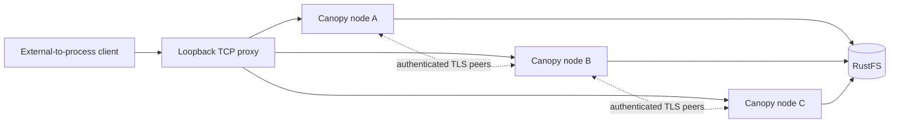

# Qualify three Canopy nodes behind a proxy

**Status: in progress.** This campaign preserves the documented 10,000-repository
reference target. A ready fleet, small socket tests or an incomplete seed does
not qualify throughput, latency, recovery or production capacity.

## Establish the topology



Three distinct server processes have separate node IDs, signing keys and local
directories. The ingress balances TCP connections, not HTTP requests: keep-alive
retains its selected backend. Every node advertises the ingress public URL so
Git/LFS URLs cannot silently bypass it. Private peer transport uses verified TLS;
the local ingress uses HTTP. This is a shared-host diagnostic topology, not
three isolated Linux reference machines or an HTTPS-ingress qualification.

The stream proxy forwards bytes without parsing HTTP, buffering complete Git
packs, or retrying a possible mutation. It limits admitted streams to 256 and
reads at most 64 KiB per relay chunk. Metrics include per-backend connections,
bytes, errors, current/peak streams and explicit admission rejections. TLS
handshake overhead and transport buffers are separate from the chunk size.

## Bind measurements to artifacts

| Input | Current campaign |
| --- | --- |
| Canopy base | `origin/main` at `615a48d`, merged PR #14 |
| Production equivalence | Production manifests, lockfile and crates match the previously tested `a62180e` tree |
| Release server SHA-256 | `dac1ff8f0300c60e26f1b44a02479218379a68467ac740472314561183eb47b6` |
| Cellule | `70bd25f142f1976fdd63ffe60e46e15ae276ffdc` |
| RustFS release | `1.0.0-glibc`, registry index `sha256:bffcab0c9d647aab0055d1c69d340b202d0909966b385932d4ead1aeb7602858` |
| Pinned ARM64 platform manifest | `sha256:0c3c7030ffb93afde8d359fb1db957b85033ede05115518bd0dede51f4353f6a` |
| Image config digest | `sha256:dc3a547b5adb60236a9df37dcc9966b67553fda636df21bc5ef9a09ae8f3690e` |
| Provider | Dedicated `canopy-three-rustfs-q3fo2z`, fixed loopback port 32910, two CPU quota / 2 GiB memory |
| Node admission | Initially 100 active repository entries and a 1.5 GiB configured local disk limit per node |
| Client/server scratch | Separate qualification volume; no node CPU or memory cgroup isolation |
| Requested corpus | 10,000 identities, 100 populated two-commit Git fixtures, 1 MiB LFS body per populated fixture |

The ARM64 manifest and image config are different digests from the
multi-architecture index. A private anonymous Docker configuration avoids a
stalled Desktop credential helper for public-image downloads; global Docker
credentials were not changed. No authority check or TLS verification was disabled.

## Retain failed setup and incomplete work

| Check | Evidence / status |
| --- | --- |
| Proxy socket regressions | Binary body larger than relay chunks, half-close, keep-alive, unchanged authorization, dead backend with no retry, connection-limit rejection |
| Creation driver regressions | Unique names/UUID validation, every arrival counted, HTTP errors and invalid identities rejected, exact recovery receipts, corrupted evidence rejected before requests |
| Python harness and fixture checks | 43 passed on Python 3.12 and 3.14, including fresh-payload push/receipt checks against local stock Git; `python312-push-timing.log` and `python314-push-timing.log` |
| Hosted CI | The original `2ba8c81` Rust job passed format, clippy, tests, isolated RustFS compatibility and build. The `94d135f` harness job exposed a Python 3.12 fixture-mock defect; fix and latest-head CI verification are recorded separately, not relabeled as a historical pass |
| Initial fleet startup | Failed: an old ephemeral RustFS port no longer accepted connections |
| Initial 10,000 seed | Failed at the first create with HTTP 503; zero identities recorded, `complete: false` |
| Cause of that seed's storage failure | Node logs show connection refusal and fencing; the old provider disappeared during concurrent Docker maintenance |
| Replacement fleet | Three live nodes behind one proxy; matching UUID read through each node |
| Fresh 10,000 seed | Running; its manifest remains incomplete until the entire requested seed succeeds |
| Critical stock-Git probe through ingress | Passed 17 functional steps against the live RustFS fixture; exact nine-ref inventories in two repositories, v0/v2 mirror clones and strict full fsck |
| Scheduled load matrix | Not yet qualified |
| Three-owner loss and fresh-state recovery | Not yet qualified |

The old seed is not resumed or merged into a passing manifest. The replacement
uses an independent provider, bucket and deployment prefix. The original 30-second
seed client timeout, production leases and fencing remain unchanged. Setup and
provider interruptions do not establish a Canopy or Cellule throughput bottleneck.

The first live seeding fixture started before the final launcher teardown guards
and source-hash fields were added. It is setup evidence, not a matched performance
candidate. Scheduled load runs must use a committed harness, record its script
digests and distinguish the corresponding fresh fleet from this seeding phase.

The campaign runner rejects old or changed fixture bindings, stale proxy metrics,
missing processes, an incomplete corpus and an active set larger than the eligible
population. It verifies all corpus identities and populated v0/v2 Git/LFS bodies
before starting the arrival clocks. Repeated windows are declared explicitly;
failed windows stay in the campaign rather than being retried or discarded.
Each load report and resource log has a SHA-256 binding in the campaign index.

## Measure the requested operations

Complete and verify the corpus before interpreting scheduled load results.
Use independent 100/500/1,000 active-set sweeps, uniform and skewed access,
separate Git concurrency sweeps and repeated windows. Count every scheduled
arrival, including `driver_busy`, transport errors, HTTP rejection, Git errors
and client timeouts. Keep failures in the report rather than hiding them in a retry.

| Operation | Required correctness / measurement boundary |
| --- | --- |
| `create` | Unique new names, canonical repository UUID, durable reply; later verify every acknowledged creation |
| `metadata` | Exact repository identity; authenticated response consumption |
| `refs`, `ls_remote` | Keep capability-only discovery separate from actual stock-Git ref listing |
| `clone`, `cold_fetch` | Stock Git with exact tip/content; distinguish a cold client from a cold server |
| `incremental_fetch`, `incremental_pull` | Prepared base-only client outside arrival clock, exact new tip and pull body |
| `push_branch` | Unique publication ref, stock receive-pack acknowledgement; later verify exact ref/body and strict fsck |
| `push_commit` | New deterministic incompressible payload and child commit per arrival, exact original parent and unique ref; verify every acknowledged commit/payload after recovery |
| `lfs_upload`, `lfs_download` | Unique upload bodies; exact size and SHA-256, including recovery |
| Other critical Git operations | Initial ingress probe passed atomic multi-ref updates/refusal, mixed refusal, tags/notes/Unicode refs, mirror push, correct/stale force-with-lease, delete/prune, shallow/deepen/unshallow, filtered lazy fetch and invalid-token refusal; repetition under load and after owner loss remains open |

Reports include scheduled p50/p95/p99, service and dispatch times, error fraction,
successful completions inside the offered-load window and successful throughput
including drain. The driver observes the complete offered window; a quick final
response must not inflate the rate by omitting the last inter-arrival interval.
Git timings include client setup/validation where declared. Pack first-byte,
bytes/s, CPU and provider cost still need independent measurements.

The campaign samples each node, the proxy launcher and its own driver once per
second with `ps`: RSS, cumulative process CPU seconds and lifetime CPU percentage.
Resource boundary snapshots include preparation and drain, separately from the
driver's arrival clock. Front/peer byte counters include HTTP headers and Git
framing, not just payload. These observations can distinguish driver, proxy and
server pressure; they do not measure RustFS VM CPU, S3 request cost, pack first-byte
latency or per-payload-GiB CPU. Never label lifetime CPU percentage as interval CPU.

`push_branch` reuses one commit and therefore measures ref publication, not fresh
pack ingestion. `push_commit` clones prepared base objects locally, creates a new
child of the original corpus tip, and sends a distinct payload on a unique ref.
The original `main` remains unchanged. Reports separate local client preparation
from the stock `git push` command (packing, HTTP, transfer and durable reply);
scheduled latency still includes both. Payload bytes acknowledged are not wire
pack bytes. The default payload is 256 KiB; a second size above 768 KiB exercises
the external-blob path. Preparation templates are built before the arrival clock.

After losing all three owners, record process exit and the unchanged lease-expiry
boundary before starting fresh node directories. Verify every original corpus
identity and populated Git/LFS fixture, plus every acknowledged creation, push
and LFS upload from the load ledgers. Unacknowledged arrivals are not rollback
assertions. A verifier alone does not prove that an owner restarted.

For `push_commit`, the recovery verifier independently regenerates each payload
from run ID, sequence and declared size, compares its Git blob ID and the exact
parent/tip, and runs strict full fsck after v0/v2 fetches. The local file-backed
driver regression proves these checks reject a wrong ref and a wrong payload
declaration; it is not Canopy/RustFS performance or owner-loss evidence.

## Repeat with caller-owned disposable storage

Supply the provider endpoint and disposable AWS credentials through the
environment. Do not use a production bucket. Launch the compatible server:

```sh
CANOPY_GIT_TOKEN=local-test-token \
python3 -B scripts/serve_three_gateways.py \
  --binary /path/to/qualified/canopy \
  --storage-url s3://disposable-bucket/three-node-test \
  --work-dir /dedicated-volume/new-fleet \
  --max-active-repositories 100
```

Use the printed proxy URL, not a direct node URL, for load clients:

```sh
python3 -B scripts/benchmark_repositories.py \
  --base-url http://127.0.0.1:PROXY_PORT \
  --manifest /dedicated-volume/corpus.json --timeout 30 \
  seed --repositories 10000 --populated 100 --incremental-fixture \
  --lfs-fixture-bytes 1048576 --work-dir /dedicated-volume/new-seed

python3 -B scripts/benchmark_repositories.py \
  --base-url http://127.0.0.1:PROXY_PORT \
  --manifest /dedicated-volume/corpus.json \
  run --operation create \
  --rate 5 --duration 120 --concurrency 32 \
  --output /dedicated-volume/create.json

python3 -B scripts/benchmark_repositories.py \
  --base-url http://127.0.0.1:RECOVERY_PROXY_PORT \
  --manifest /dedicated-volume/corpus.json \
  verify-creations --report /dedicated-volume/create.json \
  --output /dedicated-volume/recovered-creations.json
```

The fixture keeps configuration, node logs, ready/outcome records and proxy
metrics on shutdown. It never deletes object-store data. Current artifacts are
under experiment `canopy-three-proxy-q3FO2z`; the old failed seed and fresh seed
have separate manifests and logs. Correctness, the original reference target
and the [qualification rules](../performance-plan.md#performance-qualification-rules)
remain acceptance boundaries, not claims inferred from a small passing check.

### Run an explicit repeated load plan

Create a plan declaring the exact corpus size and the fleet's configured admission
limit. For example, this deliberately small diagnostic plan covers creation and
one metadata window; it is **not** the full qualification matrix:

```json
{
  "version": 1,
  "corpus_repositories": 10000,
  "node_active_limit": 100,
  "windows": [
    {
      "id": "create-low", "operation": "create", "distribution": "uniform",
      "active_repositories": null, "rate": 1, "duration": 120,
      "concurrency": 16, "repetitions": 3
    },
    {
      "id": "metadata-uniform-100", "operation": "metadata", "distribution": "uniform",
      "active_repositories": 100, "rate": 20, "duration": 120,
      "concurrency": 32, "repetitions": 3
    }
  ]
}
```

```sh
python3 -B scripts/benchmark_three_node_campaign.py \
  --manifest /dedicated-volume/corpus.json \
  --fleet-dir /dedicated-volume/matched-fresh-fleet \
  --plan /dedicated-volume/declared-plan.json \
  --output-dir /dedicated-volume/new-campaign
```

Expand the plan with the operation table, both distributions, 100/500/1,000 active
identity sets, increasing offered rates and independent Git concurrency. Git read
sets cannot exceed the 100 populated fixtures in this corpus. Use separate matched
fleets for each configured node admission limit. The runner does not raise limits,
reseed failed corpora, restart owners or remove any store data. `campaign.json`
distinguishes completion of the declared windows from success of all arrivals;
neither field establishes recovery or the full hosting-service qualification.

### Check critical Git behavior and retain recovery expectations

The initial functional probe used the seeding fleet, with the same release server
and RustFS artifact identities above. It ran alongside the incomplete corpus seed.
Its timing fields include compound setup/validation work and are **not** scheduled
load latency or throughput. Receipt `critical-initial.json` has SHA-256
`136fe79e3bfd6ae5beda021f48e88ecf728537ca0cd53bf26c39ff2e96b4edf2`.

| Durable fixture | Repository UUID |
| --- | --- |
| `critical-f3810ecc247d-source` | `84b77852-6ddd-41a5-9189-62f55a4cb801` |
| `critical-f3810ecc247d-mirror` | `783a7c01-1288-4407-8c6c-99d685428758` |

The nine final refs include an annotated Unicode tag, a lightweight tag, Unicode
branches, a custom ref and Git notes. A blob offered as a branch target is remotely
rejected: non-atomic publication retains the accepted sibling, while atomic refusal
retains neither sibling. A correct force-with-lease moves only its intended branch;
a stale lease is a client refusal and leaves the inventory unchanged. Filtered v0/v2
clones must actually omit the payload before exact lazy-fetch validation.

```sh
python3 -B scripts/check_proxy_git.py \
  --base-url http://127.0.0.1:PROXY_PORT \
  --work-dir /dedicated-volume/new-critical-probe \
  --receipt /dedicated-volume/critical.json \
  seed --binary /path/to/qualified/canopy

# After separately recording process loss, lease expiry and fresh node state:
python3 -B scripts/check_proxy_git.py \
  --base-url http://127.0.0.1:RECOVERY_PROXY_PORT \
  --work-dir /dedicated-volume/new-critical-recovery \
  --receipt /dedicated-volume/critical.json \
  verify --output /dedicated-volume/critical-recovery.json
```

The verifier compares both repository identities, every live ref/OID, payload bytes
and Git notes, using v0/v2 mirror clones and strict full fsck. An incomplete receipt,
duplicate/nil identities or invalid fixture names are rejected before network work.
This recovery check is additional to the full original corpus and acknowledged
creation/push/LFS ledgers; it does not replace them or establish node loss itself.
