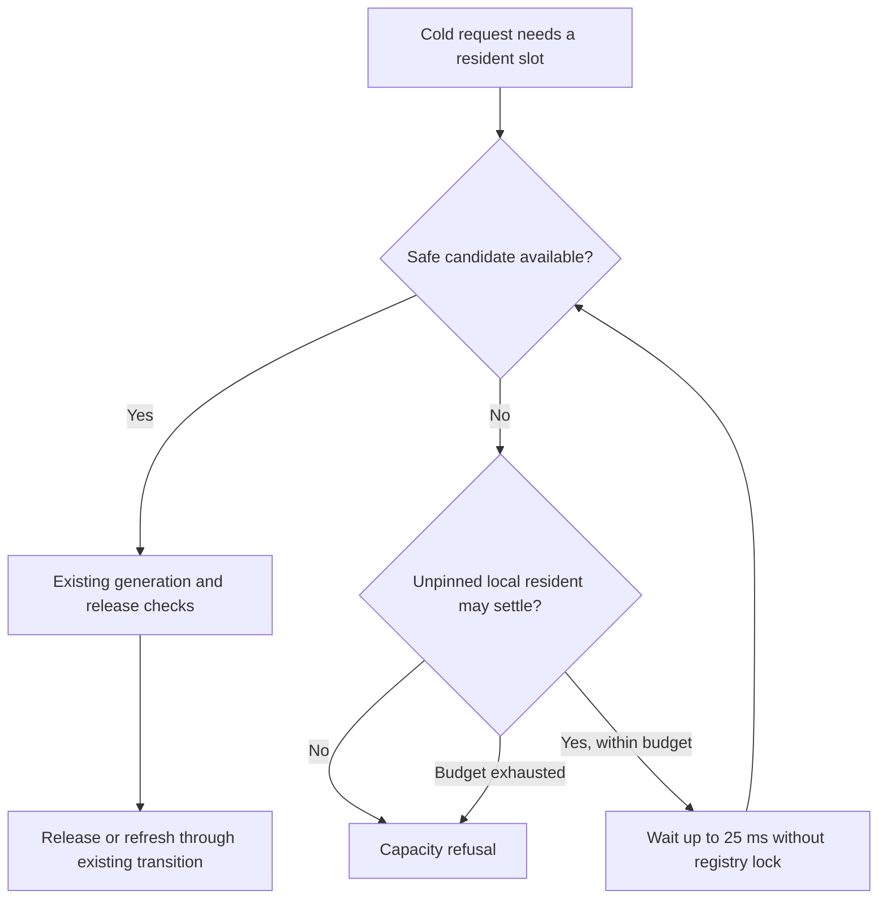

# Bounded authentication and cold repository admission

The combined candidate passes release correctness, all eight isolated RustFS
compatibility gates and repeated cold-activation regressions. It is now included
in PR #18 without temporary diagnostic logging. It has **not** been deployed
against the existing 10,000-repository corpus. Upgrade, full recovery and
performance qualification remain open; no matched speedup is claimed.

This follows the [failed authentication candidate and corpus verification](2026-10-01-evidence-loss-and-c51dd121.md).
Their failures remain intact. The target is still three nodes behind a proxy,
10,000 identities, 100 populated Git/LFS fixtures and all 108 load windows:
114,960 arrivals over 8,640 scheduled seconds.

## Authentication credit matches the result

The actual `DirectoryCell.authenticate` regression holds the SQL worker while
polling 16 valid requests. All ten pre-fix repetitions admitted 15 and refused
the sixteenth with `Cell mailbox bytes`. This reproduces one admission
bottleneck; it does not prove every historical or live HTTP 503 has that cause.

| Contract | Before | Combined candidate |
| --- | --- | --- |
| Authentication query | Generic credential query 4 | Typed query 5, codec 1 |
| Canonical input limit | 1 MiB | 36 bytes: length plus 32-byte token digest |
| Output limit | 1 MiB | 256 bytes: at most one validated principal row |
| Admitted in held-worker regression | 15 of 16 | 16 of 16, zero refusals |
| Retained runtime bytes in regression | 15,732,331 | 4,673 |

Commands 1/3 and queries 2/4 retain their existing contracts. Runtime budgets,
FIFO execution, minimum receipts and principal validation are unchanged. Query 5
binds expiry at SQL execution time, so queued work cannot extend token authority.
The codec test covers the largest valid account name, scope and token ID.
This is a memory-admission result, not an end-to-end latency measurement.

## Cold admission can reobserve settling residents

Replaying the exact failed executable reproduced five failures in 20 attempts
of `paused_cold_repository_does_not_serialize_other_cold_activations`: two HTTP
503s and three waits that never reached the expected store pause. Refusal probes
found local, serving residents without request pins but no runtime-eligible
eviction candidate. A timed-out request had already returned HTTP 503 before
reaching the injected pause. The admission seam is established; every internal
reason for ineligibility is not.

The fix reobserves idle inventory when an unrejected, unpinned local resident
may settle. It sleeps at most eight times, up to 25 ms each, under a 200-ms
settling deadline. Admission permits remain charged and the registry lock is
dropped before waiting. Request-pinned working sets still refuse immediately.



No mutation is replayed or runtime-busy Cell forcibly released. Pin, generation,
movement and capacity checks remain in force. The 200-ms bound is for settling
waits, not an HTTP latency guarantee or a bound on storage I/O.

## Predecessor compatibility is not a completed upgrade

Before retention, the compiled registry rejected the stored predecessor with
`rolling release does not retain predecessor module code`. The candidate retains
only Directory code
`f7254eda9d5d339566f45457502618ad13cbbf6e5a74595f5b3ce46653ea12f1`
at schema 1. The fixture is the exact canonical descriptor read from RustFS,
with BLAKE3 digest
`e31bf1a951e2fa19d91e9f964b2ddeade1a81b05a20ad628362819a1487c16b1`.
Its test verifies rolling descriptor admission and rejects unsupported schemas
and unknown code. It does not open old persisted Cells.

Startup still requires the exact selected release. There is no general upgrade
controller; no selected release or catalog was changed during these checks.
Source inspection identifies another unresolved upgrade risk: `acquire_sql_cell`
provisions the current module code, whereas an existing catalog's initial code
is immutable. A call-site reproduction and actual old-code restore are required.
Do not bypass release selection, rewrite catalog identity or treat a low-level
activation CAS as compatibility proof.

## Closed verification results

The frozen source is local commit `392a343b83a492d49c08a6f3e83ff4dd2917437f`.
The PR production source, tests, scripts and Cargo files are byte-identical to
that candidate. All six Cellule packages remain locked to
`c51dd121284ecc8878b75d32717a4dfbe2c406c2`. Upstream main was rechecked as
`0dc04a658bd99668936f7ec58032d054f6fbc141`; separate qualification is required.

| Check | Closed result | Scope limit |
| --- | --- | --- |
| Locked release build | Passed; executable retained outside Cargo targets | Not live deployment |
| Authentication regression | 16 admitted, zero refused, 4,673 retained bytes | Held-worker overlap, not throughput |
| Directory integration | 12 passed | Includes descriptor admission, not old-code restore |
| Release workspace | 231 top-level tests passed, zero failed, nine ignored; closed 22:14:20 UTC | Nested subprocess tests counted once; ignored gates are separate |
| Real RustFS compatibility | All eight exact gates passed; closed 22:16:45 UTC | Disposable fixture, not matched capacity or five-GiB transfer |
| Original cold-activation regression | All 20 independent repetitions passed | Exact production test artifact; no HTTP retries or relaxed assertions |
| Complete residency suite | All 15 tests passed at four threads; closed 22:17:45 UTC | Pinning, cancellation, release and restore faults; not live corpus recovery |

The cleanup-test correction isolates the parent-fence assertion and adds an
inherited-fork safety regression. Production cleanup remains conservative:
busy fenced files stay present and charged until recovery. Temporary refusal
classification and inventory traces are not in the PR.

With Rust, stock Git, Git LFS, AWS CLI and a reachable Docker daemon:

```sh
cargo test --release --locked --workspace -- --test-threads=4
python3 scripts/qualify_size.py --provider-only --release
```

The second command creates and removes only its own disposable RustFS fixture.
It excludes the non-sparse five-GiB test and is not the three-node load driver.

## Evidence and remaining gates

Release evidence is under
`/Users/haipingfu/.codex/canopy-bounded-auth-residency-release-gwk4TA`.
It binds 260 tracked source/harness files plus the build helper and retains every
workspace executable. All 282 preserved files passed copy and independent reread
checks at `/Volumes/Workspace/CrabData/canopy-combined-correctness-evidence-y1l45kek`.
Provider/repetition evidence is under
`/Users/haipingfu/.codex/canopy-combined-provider-gates-HZBUvh`; its 303 preserved
files passed the same checks at
`/Volumes/Workspace/CrabData/canopy-combined-provider-residency-evidence-jjp_u395`.
These different-filesystem local copies are not off-machine backups.

| Closed artifact | SHA-256 |
| --- | --- |
| Combined executable | `66adab6c8a2b8d801e4ff9d053a4edb22c483e407dc9627dc3ee57c805d29704` |
| `build-tests.json` | `8eedaa338a21db3dd8f5982f37ec57c34f2706a685d1a7362eea9c10d637f1f6` |
| `release-workspace.log` | `1a99446f42216732d63ab2227ecda9ab39060becf7a0bf04e9ee8d0a3bd3b2cc` |
| `provider-tests.json` | `cee298f5314b819b4ee704da6ac4f69e48910a99cdd4dcffc94a8b843ffd9dad` |
| `provider-tests.log` | `cc41133268681850e16105c172ce16db4ab7429afbd479723b765aa07550e344` |
| `residency-repetitions.json` | `db707b06c7af57ab21c569e13cb1878cc62a00d0060c58d18255b3208372ea05` |

The earlier diagnostic fleet subsequently failed: all three nodes exited 1
without forced shutdown. Logs record Cell fencing around 20:58 UTC, then
`node lease bounds are invalid` around 21:00:40 UTC and unconfirmed-drain
quarantine. Terminal logs, outcome and stored node tombstones are preserved.
The unchanged RustFS provider had zero restarts or OOM kills; observed host logs
did not establish a sleep or clock-jump cause. The stall cause remains unresolved.
This candidate has not been deployed and cannot be credited with fixing it.

Required next proofs remain:

- Safe existing-catalog admission, old-code restore and actual same-corpus upgrade.
- Full 10,000-identity/100-fixture Git/LFS verification and fresh-owner recovery.
- The complete schedule, critical concurrent workflows and faults, and every new
  acknowledged write after owner loss.
- Newer Cellule qualification, higher admission profiles, matched comparisons,
  non-sparse five-GiB transfer and complete CPU/cost accounting.
- Isolated Linux reference capacity; the shared Mac/Colima environment does not
  establish it. Missing historical ledgers still prevent old every-ACK proof.

The [performance plan](../performance-plan.md) remains the full scope. PR #18
stays draft while these gates are open.
