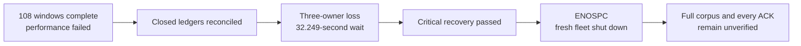

# Preserve failures and rebuild the Cellule candidate

**Status: the old performance attempt failed and its post-load recovery is
incomplete. The new Cellule candidate passed release tests and initial Git
verification; its full corpus setup and performance qualification remain open.**

This checkpoint supersedes earlier running/retained-artifact statements in the
[native-filesystem trial](2026-10-01-native-filesystem.md). It keeps the original
10,000-repository target, all 108 load windows and separate correctness gates.

## What was observed before artifact loss

The three-node/proxy campaign finished its original 114,960 offered arrivals.
The closed controller reported exit 1 and zero diagnostic-probe errors. The
independent auditor reported all 108 ledgers and resource boundaries reconciled.
Neither result was a performance pass.

| Outcome | Arrivals |
| --- | ---: |
| OK | 60,197 |
| Driver busy | 19,137 |
| HTTP 503 | 35,387 |
| Transport error | 15 |
| Git error | 224 |
| Total | 114,960 |

The first 18 metadata windows offered 43,200 arrivals: 30,521 OK, 12,408 busy and
271 HTTP 503. A separate read-only audit replayed those windows and the first
creation window before the files disappeared. Each metadata group below contains
three 120-second repetitions at 20 offered requests/s and 32 clients. Ranges are
the minimum/maximum individual repetition results, not pooled percentiles:

| Active set / selection | OK / busy / HTTP 503 | Successful in-window requests/s | All-attempt p99 range (ms) |
| --- | --- | --- | --- |
| 100 / uniform | 6,466 / 678 / 56 | 14.833–19.683 | 1,681.714–9,139.462 |
| 100 / skewed | 6,678 / 476 / 46 | 17.833–18.908 | 3,821.461–4,428.670 |
| 500 / uniform | 2,769 / 4,379 / 52 | 4.808–10.833 | 8,644.185–19,291.809 |
| 500 / skewed | 6,323 / 834 / 43 | 15.425–19.375 | 3,842.231–11,061.363 |
| 1,000 / uniform | 2,458 / 4,694 / 48 | 3.008–10.458 | 9,178.527–25,248.536 |
| 1,000 / skewed | 5,827 / 1,347 / 26 | 13.575–17.533 | 8,666.377–10,186.262 |

These are active sets inside the full 10,000-identity corpus, with unchanged
100-entry per-node admission; they are not smaller replacement corpora or proof
that every selected repository was resident. The first creation window offered
1 request/s for 120 seconds with 16 clients:

| Creation measurement | Observed value |
| --- | --- |
| OK / busy / HTTP 503 / transport errors | 60 / 19 / 32 / 9 |
| Successful completions within the schedule | 0.500/s |
| All-attempt p50 / p95 / p99 | 16,407.401 / 30,012.684 / 30,020.859 ms |
| Dispatch-delay p99 | 19.254 ms |

Busy drops have no invented latency. These failed-window observations are not
success-only latency, sustained capacity or a matched improvement. The raw
ledgers needed to replay these measurements are no longer locally available.

## Correctness recovery did not finish

The complete ledger recorded 1,547 creation ACKs, 1,184 ref-only push ACKs,
957 fresh-object push ACKs and 942 LFS-upload ACKs. Recovery must cover every
one of these, plus the full original corpus and critical fixtures.

The post-load controller recorded three original owners exiting -9 without
forced fallback and an actual 32.249-second absence wait. Fresh owners started
at 10:17:26 UTC. Critical recovery passed both repositories and four exact
Git-v0/v2 ref inventories. The next full-corpus stage did not close successfully.
The fresh fleet's outcome recorded `No space left on device` while writing proxy
metrics, followed by three graceful exits. Its incomplete controller receipt is
not proof of any remaining recovery scope.

## Evidence availability changed during inspection

At 16:54 UTC the old receipts and ENOSPC outcome could still be read. During
the subsequent free-space check, the external Canopy benchmark directories and
retained executable disappeared. The scoped Cargo dry run had identified
3,552 files/1.1 GiB; the later scoped clean reported **zero files removed**.
It does not explain the disappearance of the other directories.

No receipt copy was found in the checked Trash, preview, checkout or temporary
locations. The cause and recoverability of the removal are not established.
The native RustFS container/data volume was still running with its original
start time and zero restarts. Stored state alone cannot reconstruct which
individual requests received ACKs or certify the old recovery.

Historical digest tables record expected values, not available raw files.
Do not regenerate files under their old names, invent missing observations,
mark old recovery passing, or combine a new run with the old campaign.

## Latest Cellule candidate

The dependency now pins observed upstream main
`c51dd121284ecc8878b75d32717a4dfbe2c406c2`. Five direct declarations and six
lockfile sources changed; unrelated dependencies did not. Locked metadata
resolves all six Cellule packages to that revision.

Unlike the earlier documentation-only `a4500add` advance, this includes upstream
routing and host-permit changes. It reuses resident catalog identity for unleased
requests while still observing fresh authority, and pairs resource charges with
semaphore permits. Source inspection is not a Canopy latency or correctness result.

The locked release build completed successfully. Its retained executable has
SHA-256 `32b114119960608c0a91d1c783bb69eafec432831bfa452d54d8950b09bc0e99`.
The build receipt binds 256 production-source and harness files; those bindings
still match the published candidate. Evidence and the executable are outside the
rebuildable Cargo target directory.

| Verification | Result and scope |
| --- | --- |
| Python harness | 84 tests passed in 44.556 s; accounting and guards, not Rust runtime proof |
| Release Rust workspace | 227 tests passed, 9 ignored; the nested isolated native-Git child test is not counted twice |
| Isolated real RustFS compatibility | All eight exact ignored provider tests passed with `scripts/qualify_size.py --provider-only --release` |
| Three-node proxy Git behavior | The retained production executable passed all 17 critical steps against the separately bound RustFS provider |
| CI at `5b2f95c` | Both Rust and harness jobs passed in the [PR workflow](https://github.com/crabbuild/canopy/actions/runs/36898604222) and [branch workflow](https://github.com/crabbuild/canopy/actions/runs/36898599990) |

The eight provider gates cover SHA-256 round trips and native merge candidates,
signed HTTP push options, signed SHA-256 SSH, stock SSH, bulk refs, partial clones
and SSH-issued LFS access. They ran in the qualification script's own disposable
RustFS fixture. That script selects `rustfs/rustfs:1.0.0-beta.8-glibc`; this is
not a matched provider-envelope comparison with the performance fixture. The
non-sparse 5-GiB size gate was explicitly excluded and remains open for this pin.

The 17-step production check covers atomic multi-ref publication, mixed and
atomic refusal, correct and stale leases, shallow/deepen/unshallow, filtered
lazy fetches, incremental push/pull, branch deletion and pruning, mirror push,
invalid credentials and exact v0/v2 ref inventories with strict fsck. It passed
at 17:39:09 UTC. These are functional checks, not scheduled throughput, owner-loss
recovery or packet-level confirmation of negotiated protocol versions.

### Full corpus setup

The new performance provider has a fresh bucket/prefix on its own native Docker
volume, with the pinned RustFS image, 2 CPUs and 4 GiB memory. Its original
five-second bucket-startup command timed out. A separate startup-completion
receipt first confirmed the bucket absent, then created and checked it without
restarting or replacing the provider. The original failed receipt remains intact.

Three independent foreground nodes use the retained executable, 100-entry
per-node admission and a loopback TCP proxy. Their launcher has its own session
and is not owned by the finite verification controller. The 10,000-repository
seed started after the eight provider tests exited successfully. It keeps seed
`20260926`, 100 two-commit Git fixtures and 100 one-MiB LFS objects, unchanged
30-second HTTP/120-second Git deadlines, and no retry or reseed. Partial manifests
are retained on failure. Serial seed time is not scheduled creation throughput.

Four offline seed-guard tests passed with 18 rejection cases for scope trimming,
invalid or duplicate ACK identities and changed Git/LFS expectations. They do not
prove that the live corpus completed. Full verification, fresh-owner recovery,
the original 108-window matrix and every new ACK after load remain separate gates.

New closed files are under
`/Users/haipingfu/.codex/canopy-three-node-evidence-BwYz7P`, separately from the
rebuildable Cargo target:

| Closed new artifact | SHA-256 |
| --- | --- |
| `harness.log` | `5696368dfdbb6537716b8e35dddc719726c848369dc47df293e4e092319f0176` |
| `metadata.json` | `a4a33f617545d8b7796719b791c9da241b94eb5e89db85fb3f0bb61765418a69` |
| `build_candidate.py` | `1e458a80735bdb8c83edf58755ee3933d6a403704b6dc0e8e8bbec89428f1b62` |
| `build.json` | `818077ca334759e90e16fd3326406831f1840ba2f93b3b93952c3b8e81f9f70c` |
| `build.log` | `63c8b2f9eac5b7a144f4f5bfcb61bcbc02c3cc94d61c4bfcffce107125c87748` |
| `canopy-c51dd121` | `32b114119960608c0a91d1c783bb69eafec432831bfa452d54d8950b09bc0e99` |
| `rust-tests.log` | `8dbf6d432544e39510a7b314a6bf8a4291e008ea3f8664ada2c0d3e6a860a42b` |
| `provider-ready.json` | `dd243add0de22069284ddf3181af1f3ed1c94247d1758e27730de53c0e1e6de0` |
| `critical-controller.json` | `402ac5ced76f9585c57e25fc7642cc066b5c5ec3196441b4135373fdd93193a1` |
| `critical.json` | `84ea23bf95c5b9cc448f1e520c663c05d5cca0a952be1056774e02b34d5d2a03` |
| `provider-tests.json` | `cd94183c06648d26a44da368c8cb3cd49f597124e3b37c338673794eac1e6412` |
| `provider-tests.log` | `27f48704797584c5b08f1297c9e1cae2ef0c5f1ff8965a557a07a5f9eefbc2dd` |
| `run_provider_gates.py` | `c1f0e2a52c474fea0adeb4b671495f2d0980120b3067ebb2b38245a3f3492deb` |
| `seed_full_corpus.py` | `7bbd79a6dae40fec4809720970d80a8465be4c8df4d63c242a4d59ef63a6fc0e` |
| `seed-guard-tests.log` | `3c82e7c0a92ea5b6efa559b91d414936635fdf034fc5182b260ab7d2c0d07cc8` |

The live seed manifest, controller receipt and log are changing outputs, not
closed evidence. Do not use their intermediate counts as a complete-corpus result.

| Required gate | Current status |
| --- | --- |
| Exact new artifact and source provenance | Passed locked build and current binding checks |
| Rust workspace correctness and RustFS Git/LFS compatibility | Passed release suite, eight provider gates and initial 17-step proxy check |
| New-pin non-sparse 5-GiB transfer | Open; excluded by `--provider-only` |
| Full 10,000 identities/100 populated fixtures | Seed running; full verification and fresh-owner recovery open |
| Original matrix, critical Git load and every new ACK after owner loss | Open |
| Higher admission profiles and matched comparisons | Open |
| Old campaign every-ACK recovery | Unverified; original raw inputs unavailable |

The [performance plan](../performance-plan.md) remains the scope. No proven
Cellule bottleneck, matched speedup or isolated Linux reference capacity is claimed.
