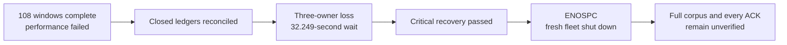

# Preserve failures and rebuild the Cellule candidate

**Status: the old performance attempt failed and its post-load recovery is
incomplete. The new Cellule candidate passed release tests and initial Git
verification. Its full corpus seed completed, but remote verification failed
with HTTP 503. Recovery and timed load did not start.**

This checkpoint supersedes earlier running/retained-artifact statements in the
[native-filesystem trial](2026-10-01-native-filesystem.md). It keeps the original
10,000-repository target, all 108 load windows and separate correctness gates.

## What was observed before artifact loss

The three-node/proxy campaign finished its original 114,960 offered arrivals.
The closed controller reported exit 1 and zero diagnostic-probe errors. The
independent auditor reported all 108 ledgers and resource boundaries reconciled.
Neither result was a performance pass.

| Outcome | Arrivals |
| --- | ---: |
| OK | 60,197 |
| Driver busy | 19,137 |
| HTTP 503 | 35,387 |
| Transport error | 15 |
| Git error | 224 |
| Total | 114,960 |

The first 18 metadata windows offered 43,200 arrivals: 30,521 OK, 12,408 busy and
271 HTTP 503. A separate read-only audit replayed those windows and the first
creation window before the files disappeared. Each metadata group below contains
three 120-second repetitions at 20 offered requests/s and 32 clients. Ranges are
the minimum/maximum individual repetition results, not pooled percentiles:

| Active set / selection | OK / busy / HTTP 503 | Successful in-window requests/s | All-attempt p99 range (ms) |
| --- | --- | --- | --- |
| 100 / uniform | 6,466 / 678 / 56 | 14.833–19.683 | 1,681.714–9,139.462 |
| 100 / skewed | 6,678 / 476 / 46 | 17.833–18.908 | 3,821.461–4,428.670 |
| 500 / uniform | 2,769 / 4,379 / 52 | 4.808–10.833 | 8,644.185–19,291.809 |
| 500 / skewed | 6,323 / 834 / 43 | 15.425–19.375 | 3,842.231–11,061.363 |
| 1,000 / uniform | 2,458 / 4,694 / 48 | 3.008–10.458 | 9,178.527–25,248.536 |
| 1,000 / skewed | 5,827 / 1,347 / 26 | 13.575–17.533 | 8,666.377–10,186.262 |

These are active sets inside the full 10,000-identity corpus, with unchanged
100-entry per-node admission; they are not smaller replacement corpora or proof
that every selected repository was resident. The first creation window offered
1 request/s for 120 seconds with 16 clients:

| Creation measurement | Observed value |
| --- | --- |
| OK / busy / HTTP 503 / transport errors | 60 / 19 / 32 / 9 |
| Successful completions within the schedule | 0.500/s |
| All-attempt p50 / p95 / p99 | 16,407.401 / 30,012.684 / 30,020.859 ms |
| Dispatch-delay p99 | 19.254 ms |

Busy drops have no invented latency. These failed-window observations are not
success-only latency, sustained capacity or a matched improvement. The raw
ledgers needed to replay these measurements are no longer locally available.

## Correctness recovery did not finish

The complete ledger recorded 1,547 creation ACKs, 1,184 ref-only push ACKs,
957 fresh-object push ACKs and 942 LFS-upload ACKs. Recovery must cover every
one of these, plus the full original corpus and critical fixtures.

The post-load controller recorded three original owners exiting -9 without
forced fallback and an actual 32.249-second absence wait. Fresh owners started
at 10:17:26 UTC. Critical recovery passed both repositories and four exact
Git-v0/v2 ref inventories. The next full-corpus stage did not close successfully.
The fresh fleet's outcome recorded `No space left on device` while writing proxy
metrics, followed by three graceful exits. Its incomplete controller receipt is
not proof of any remaining recovery scope.

## Evidence availability changed during inspection

At 16:54 UTC the old receipts and ENOSPC outcome could still be read. During
the subsequent free-space check, the external Canopy benchmark directories and
retained executable disappeared. The scoped Cargo dry run had identified
3,552 files/1.1 GiB; the later scoped clean reported **zero files removed**.
It does not explain the disappearance of the other directories.

No receipt copy was found in the checked Trash, preview, checkout or temporary
locations. The cause and recoverability of the removal are not established.
The native RustFS container/data volume was still running with its original
start time and zero restarts. Stored state alone cannot reconstruct which
individual requests received ACKs or certify the old recovery.

Historical digest tables record expected values, not available raw files.
Do not regenerate files under their old names, invent missing observations,
mark old recovery passing, or combine a new run with the old campaign.

## Latest Cellule candidate

The dependency pins upstream main observed at build preparation,
`c51dd121284ecc8878b75d32717a4dfbe2c406c2`. Five direct declarations and six
lockfile sources changed; unrelated dependencies did not. Locked metadata
resolves all six Cellule packages to that revision.

Unlike the earlier documentation-only `a4500add` advance, this includes upstream
routing and host-permit changes. It reuses resident catalog identity for unleased
requests while still observing fresh authority, and pairs resource charges with
semaphore permits. Source inspection is not a Canopy latency or correctness result.

Upstream advanced at 17:43:36 UTC to
[`0dc04a658bd99668936f7ec58032d054f6fbc141`](https://github.com/crabbuild/cellule/commit/0dc04a658bd99668936f7ec58032d054f6fbc141).
The inspected diff replaces deprecated atomic `fetch_update` calls with
`try_update` in LTX accounting, host disk budgeting and runtime admission, as
well as tests and the website-example checker. It is not documentation-only.
The running experiment remains bound to `c51dd121`; its results do not qualify
this newer SHA. A separately built and verified candidate is required before
upgrading the pin or changing the live experiment.

The locked release build completed successfully. Its retained executable has
SHA-256 `32b114119960608c0a91d1c783bb69eafec432831bfa452d54d8950b09bc0e99`.
The build receipt binds 256 production-source and harness files; those bindings
still match the published candidate. Evidence and the executable are outside the
rebuildable Cargo target directory.

| Verification | Result and scope |
| --- | --- |
| Python harness | 84 tests passed in 44.556 s; accounting and guards, not Rust runtime proof |
| Release Rust workspace | 227 tests passed, 9 ignored; the nested isolated native-Git child test is not counted twice |
| Isolated real RustFS compatibility | All eight exact ignored provider tests passed with `scripts/qualify_size.py --provider-only --release` |
| Three-node proxy Git behavior | The retained production executable passed all 17 critical steps against the separately bound RustFS provider |
| CI at `5b2f95c` | Both Rust and harness jobs passed in the [PR workflow](https://github.com/crabbuild/canopy/actions/runs/36898604222) and [branch workflow](https://github.com/crabbuild/canopy/actions/runs/36898599990) |
| CI at `7d09597` | All four Rust/harness checks passed in the [PR workflow](https://github.com/crabbuild/canopy/actions/runs/36904766930) and [branch workflow](https://github.com/crabbuild/canopy/actions/runs/36904761443) |
| CI at `d6d63a3` | All four Rust/harness checks passed in the [PR workflow](https://github.com/crabbuild/canopy/actions/runs/36913619350) and [branch workflow](https://github.com/crabbuild/canopy/actions/runs/36913616080); later heads need their own results |
| CI at `f0c5d09` | All four Rust/harness checks passed in the [PR workflow](https://github.com/crabbuild/canopy/actions/runs/36921149190) and [branch workflow](https://github.com/crabbuild/canopy/actions/runs/36921143618); this evidence update needs its own results |

The eight provider gates cover SHA-256 round trips and native merge candidates,
signed HTTP push options, signed SHA-256 SSH, stock SSH, bulk refs, partial clones
and SSH-issued LFS access. They ran in the qualification script's own disposable
RustFS fixture. That script selects `rustfs/rustfs:1.0.0-beta.8-glibc`; this is
not a matched provider-envelope comparison with the performance fixture. The
non-sparse 5-GiB size gate was explicitly excluded and remains open for this pin.

The 17-step production check covers atomic multi-ref publication, mixed and
atomic refusal, correct and stale leases, shallow/deepen/unshallow, filtered
lazy fetches, incremental push/pull, branch deletion and pruning, mirror push,
invalid credentials and exact v0/v2 ref inventories with strict fsck. It passed
at 17:39:09 UTC. These are functional checks, not scheduled throughput, owner-loss
recovery or packet-level confirmation of negotiated protocol versions.

### Full corpus setup

The new performance provider has a fresh bucket/prefix on its own native Docker
volume, with the pinned RustFS image, 2 CPUs and 4 GiB memory. Its original
five-second bucket-startup command timed out. A separate startup-completion
receipt first confirmed the bucket absent, then created and checked it without
restarting or replacing the provider. The original failed receipt remains intact.

Three independent foreground nodes use the retained executable, 100-entry
per-node admission and a loopback TCP proxy. Their launcher has its own session
and is not owned by the finite verification controller. The 10,000-repository
seed started after the eight provider tests exited successfully. It keeps seed
`20260926`, 100 two-commit Git fixtures and 100 one-MiB LFS objects, unchanged
30-second HTTP/120-second Git deadlines, and no retry or reseed. Partial manifests
are retained on failure. Serial seed time is not scheduled creation throughput.

Four offline seed-guard tests passed with 18 rejection cases for scope trimming,
invalid or duplicate ACK identities and changed Git/LFS expectations. They do not
prove remote Git/LFS delivery or recovery. Full verification, fresh-owner recovery,
the original 108-window matrix and every new ACK after load remain separate gates.

The seed process exited successfully at **19:02:14 UTC**. Its closed manifest
contains all **10,000 identities, 100 populated Git fixtures and 100 LFS objects**;
the setup controller validated their expected identities and payload declarations.
The serial seed took 3,852.843 seconds. This is setup duration, not scheduled
creation throughput. The separate full-corpus verifier subsequently failed
against the same three owners and unchanged RustFS provider. Setup alone does
not establish that all remote Git/LFS bytes survive owner loss.

The initial fault, independent fresh fleet, full recovery and original 108-window
matrix controllers were armed behind that verifier. Separate post-load fault,
independent fresh fleet and every-ACK recovery controllers were also armed.
All stopped after the verification failure, without owner signals or timed load.
The post-load gate requires an independent replay of all closed ledgers and
resource boundaries. Failed performance would not discard ACKs or prevent their
recovery check; an interrupted or reduced matrix cannot satisfy this gate.

Eleven offline post-load guard tests passed, covering complete arrival/ACK
accounting, changed kernel identities, launcher resumption after a signal or
receipt-write failure, and rejection of missing corpus/critical/ACK coverage.
These are local helper tests, not actual owner-loss or delivered-body proof.

### Remote verification failed

At **19:10:19 UTC**, the verifier exited 1 on HTTP 503 for
`density-3a92b05e1d80-07076` (`f2a0f25e-9db4-4a16-8a5b-1db1d43aeac9`),
request ID `6a4a923c-fbe1-419a-8943-930c7a02a67c`. Its last progress line was
6,800/10,000 identities; that is not the exact count of completed concurrent
requests or a passing prefix. No complete Git/LFS result was returned.
At the same second, node 0 logged `repository directory operation failed`
without an underlying error chain or request ID. That message does not establish
the root cause or identify a Cellule bottleneck.

All eight finite gate/launcher processes subsequently exited. At that checkpoint,
the original three owners remained live, and the rejected post-load receipt contains an
empty signal list. There is no new recovery fleet or timed campaign directory.
Their terminal receipts and logs have verified independent-filesystem copies;
the provider retained its original start time, zero restarts and zero recorded
cgroup OOM events. Neither the failures nor the data were discarded or reseeded.

A separate read-only replay of the failed identity and its original 16-entry
batch returned matching identities on all 67 requests. It did not reproduce
the 503 and does not overturn the original failure. The metadata-only diagnostic
closed at **19:27:31 UTC**, retaining all 10,000 observations at concurrency 16
and the same 30-second HTTP deadline:

| Diagnostic outcome | Observations |
| --- | ---: |
| HTTP 200 with matching repository identity | 9,999 |
| HTTP 503 | 1 |
| Total | 10,000 |

The failure was for `density-3a92b05e1d80-04322`
(`f39019bc-2063-438c-8f0a-10fa01f17cea`), request ID
`b221bf05-2df9-4b44-9b48-8d95fb4ffa88`, at 19:22:01 UTC. Node 2 logged
`authentication failed` with `repository directory operation failed` at that
time. The original verifier failed at the metadata-read call site; this is a
related Directory failure, not proof of an identical underlying cause.
The diagnostic excludes Git/LFS bodies and is neither a qualification retry
nor a scheduled throughput measurement. **The root cause remains unresolved.**

### Separate diagnostic build and cleanup test investigation

Temporary error-only classification lives in a separate diagnostic worktree,
not this PR's production candidate. It records bounded request IDs and static
error categories without raw headers, private error payloads or provider URLs.
It does not change routing, retries, deadlines or HTTP responses. The later
same-corpus replay is recorded below; the original failed receipts stay intact.

Its first release workspace suite failed the existing
`failed_spawn_releases_parent_fence_before_cache_cleanup` test. Twenty full
library repetitions reproduced that failure four times. A controlled fork
reproduction showed that an unrelated child can inherit the Git cache fence
before executing, so cleanup conservatively retains the files and their
132-byte budget charge. This is separate from the Directory HTTP 503; no causal
link or production performance improvement is established.

The local test correction isolates the parent-fence assertion in a subprocess
and adds a deterministic inherited-fence safety check. Production cleanup stays
unchanged: files remain charged while the fence is busy. The corrected diagnostic
build at local commit `0ee8f69` passed the full locked release workspace suite
at **20:11:04 UTC**: **230 top-level tests passed, 9 ignored**. Nested subprocess
tests are counted once. Its executable and library-test artifact are retained
outside Cargo targets. These local results do not qualify the PR artifact,
newer Cellule upstream, RustFS recovery or performance. Temporary diagnostic
source and the test correction remain separate from this PR while the original
experiment's source bindings stay frozen.

A subsequent check closed at **20:21:06 UTC**: all **20 full-library repetitions**
passed at four test threads, with 115 tests in each repetition and zero failed
attempts. Every attempt log and digest is retained. This verifies the local test
correction without erasing the original failure; it is not runtime recovery or
proof that an intermittent Directory error is fixed.

### Same corpus authentication diagnosis

The original fleet drained gracefully at **20:29:37 UTC**, after signaling only
its launcher. This was not an owner-loss test. Three diagnostic nodes then
started against the unchanged RustFS provider and existing corpus, with the same
admission limits. The UI preview was not changed.

Three full metadata sweeps closed at **20:53:47 UTC**, with concurrency 16,
unchanged 30-second HTTP deadlines and no retries:

| Metadata result | Observations |
| --- | ---: |
| HTTP 200 with matching identity | 29,996 |
| HTTP 503 | 4 |
| Total | 30,000 |

All four failing request IDs matched authentication invocations classified as
`not_started` with a runtime `capacity` error. The bounded classifier reported
the reason as `other`; it did not identify the owner's specific budget.
These observations narrow the investigation, but do not prove that all earlier
503s share a cause. This replay excludes Git/LFS bodies, scheduled throughput
and crash recovery. A failed metadata check remains a failed correctness gate.

### Bounded authentication candidate remains separate

A regression at the actual `DirectoryCell.authenticate` call site held its SQL
worker while polling 16 valid authentication requests. The original generic
query contract admitted 15 and refused the sixteenth with `Cell mailbox bytes`.
All ten pre-fix repetitions reproduced that result. Its declared one-MiB result
bound over-reserves credit for an authentication result containing at most one
small principal row.

The separate candidate adds a typed authentication query with a 36-byte input
bound and 256-byte output bound. It preserves existing query contracts, Cellule
`c51dd121`, runtime budgets, execution-time token expiry and minimum receipts.
The regression admitted all 16 requests without refusal, retaining 4,673 bytes;
all 11 Directory integration tests passed. This is an admission-contract result,
not a measured throughput improvement or a completed live-fleet fix.

| Candidate verification | Closed result |
| --- | --- |
| Locked release build | Passed; executable retained outside Cargo targets |
| Authentication regression | Passed; 16 admitted, zero refused |
| Directory integration suite | 11 passed |
| Release workspace | **Failed**, closed at 21:09:16 UTC; multi-server suite had 95 passed, one failed and nine ignored |
| Failed case | `paused_cold_repository_does_not_serialize_other_cold_activations` returned HTTP 503 during repository creation; exact failing call and cause remain unresolved |
| Runtime upgrade | Not attempted; predecessor compatibility and old-code restore remain open |

The original predecessor release descriptor was read from RustFS and its BLAKE3
digest verified without changing selected state. Reading it is not rolling
compatibility or restore proof. The candidate is **not deployed or included in
this PR**. Its failure cannot be dismissed as test timing, and its passing
focused checks cannot replace full correctness verification.

New closed files are under
`/Users/haipingfu/.codex/canopy-three-node-evidence-BwYz7P`, separately from the
rebuildable Cargo target:

| Closed new artifact | SHA-256 |
| --- | --- |
| `harness.log` | `5696368dfdbb6537716b8e35dddc719726c848369dc47df293e4e092319f0176` |
| `metadata.json` | `a4a33f617545d8b7796719b791c9da241b94eb5e89db85fb3f0bb61765418a69` |
| `build_candidate.py` | `1e458a80735bdb8c83edf58755ee3933d6a403704b6dc0e8e8bbec89428f1b62` |
| `build.json` | `818077ca334759e90e16fd3326406831f1840ba2f93b3b93952c3b8e81f9f70c` |
| `build.log` | `63c8b2f9eac5b7a144f4f5bfcb61bcbc02c3cc94d61c4bfcffce107125c87748` |
| `canopy-c51dd121` | `32b114119960608c0a91d1c783bb69eafec432831bfa452d54d8950b09bc0e99` |
| `rust-tests.log` | `8dbf6d432544e39510a7b314a6bf8a4291e008ea3f8664ada2c0d3e6a860a42b` |
| `provider-ready.json` | `dd243add0de22069284ddf3181af1f3ed1c94247d1758e27730de53c0e1e6de0` |
| `critical-controller.json` | `402ac5ced76f9585c57e25fc7642cc066b5c5ec3196441b4135373fdd93193a1` |
| `critical.json` | `84ea23bf95c5b9cc448f1e520c663c05d5cca0a952be1056774e02b34d5d2a03` |
| `provider-tests.json` | `cd94183c06648d26a44da368c8cb3cd49f597124e3b37c338673794eac1e6412` |
| `provider-tests.log` | `27f48704797584c5b08f1297c9e1cae2ef0c5f1ff8965a557a07a5f9eefbc2dd` |
| `run_provider_gates.py` | `c1f0e2a52c474fea0adeb4b671495f2d0980120b3067ebb2b38245a3f3492deb` |
| `seed_full_corpus.py` | `7bbd79a6dae40fec4809720970d80a8465be4c8df4d63c242a4d59ef63a6fc0e` |
| `seed-guard-tests.log` | `3c82e7c0a92ea5b6efa559b91d414936635fdf034fc5182b260ab7d2c0d07cc8` |

The seed manifest, controller receipt and log are now closed:

| Closed seed artifact | SHA-256 |
| --- | --- |
| `corpus-10000.json` | `9ce7da04a7642bc7342d204c874cabf39ceea6c40ffd51211797687f4dd46397` |
| `seed-controller.json` | `b93d3e4ab71f2f8e98f63efd29b67c2477bd7089e8658a941368d81a162a2f1c` |
| `seed.log` | `be3fdb0b01b04c6205ce456ec8c33230cac9a7f27175c8645ebd63606d62a7b7` |

| Closed failed verification or diagnostic | SHA-256 |
| --- | --- |
| `full-seed-verification.json` | `981dd75f4bc0fc1605cc06b579d9966b0c597ac64e2c5e4c6e3a29a9561fdf01` |
| `full-seed-verification.log` | `273e945deb34c5792e12da3d7d4a01819cc80e402a55ea64d04346c1a25be593` |
| `identity-503-replay.json` | `2410d2c63edcd1d4700b20bb795dc680b012190517a3ee063f3f87904c174caf` |
| `metadata-churn-diagnostic.json` | `9dfb64b72791e252bcbe1ebb8cb1e6192dd12c4e8bd07f45b77ca8155b9a2337` |
| `metadata-churn-diagnostic.samples.jsonl` | `a6b1827ca695e7ea0eea47ce1b96e535d1a14b87d02ebc18752d6cb06906b8d0` |

The separate local diagnostic evidence is under
`/Users/haipingfu/.codex/canopy-directory-diagnostics-v2-rNr2qi`:

| Closed diagnostic artifact | SHA-256 |
| --- | --- |
| `build-tests.json` | `03aaefd41ba4dc594b635921a7a3cd5087a2f973dd8dae0e1ad995ca08f8e263` |
| `rust-tests.log` | `a91eeeb87b1f232d692cfa5a2121b63a1f52cd78cfa73e6c2b17c7542898d665` |
| `canopy-c51-directory-diagnostics` | `e2e5c12e504b9e73d11e7b6f650fa3f35e46b137136e7eddaaf6ed7b339638a2` |
| `canopy-c51-diagnostic-library-tests` | `795b6ff0abc2d1eee01c83d927b8e8b0a2b0827293b2f42acaee8f7e1496980f` |
| `test-artifact.json` | `fbdd719e2dd5e0d12dfab935ff470eff5b5f87206354462fd5df97e844ad8ae9` |
| `cleanup-reproduction/reproduction.json` | `7e71923d85025177a7b0a273656a4daccded11ba6c9f0e174814cfc4aaec50ed` |
| `instrumented-metadata-replay.json` | `75047e541aeb877966a1e52797eebcf1f762b4c2626bb3b2e6dd0d779cb998c9` |
| `instrumented-metadata-replay.samples.jsonl` | `1bdce950788e730011648c6614f633ee3d1e2f3a435029f37ea36388cd3a2e73` |
| `classification-correlations.json` | `4fd685ec69d3d55f67fc7ca20ee66ec7c74b4f1b7bbac67245f6f72bfed0e382` |

The separate bounded candidate evidence is under
`/Users/haipingfu/.codex/canopy-authentication-bounded-query-PvyQdK`:

| Closed candidate artifact | SHA-256 |
| --- | --- |
| `build-tests.json` | `81cb8ecb5be43ac4311ac3ec1356805f87cb8a81c4165626048af6fcfcc23099` |
| `authentication-regression.log` | `79c3114be7d3dd15a4faa56cefda884d749758f803b6afec50e28f12f507dbf1` |
| `directory-correctness.log` | `5210b95ffeec1196be875a18c5f469e738f17e146a7d58295705175610309af4` |
| `release-workspace.log` | `2aea6bf39c8ed8480070a8175b5af45711850d0742f3b9630d26f647b82ca07a` |
| `canopy-bounded-authentication-c51` | `e52ac937bb34d154185b5b6d49268d0ce6b7b39fab6e220478937f7a42472b2d` |
| `failed-workspace-multi-server-tests` | `8a79042dc26364dfd8844624d6ab0b448f65350c04e48cb3a53647aa57baf399` |
| `closed-failure-backup.json` | `9be839c98998ef970c1f25dda53e98e8ddd16958c09150ebf56962dd92f93081` |

### Independent evidence backup

A new backup under
`/Volumes/Workspace/CrabData/canopy-evidence-backup-BwYz7P-bYyTQg`
is outside Cargo targets and on a different filesystem from the evidence root.
The initial copy contains 270 files: all 15 then-published closed artifacts and
all 256 build bindings, with one shared helper counted once. Every source and
copy digest matched, and a separate read replayed all copied digests. The closed
full seed was copied separately only after its process actually exited.
The closed metadata diagnostic, all 10,000 samples and its helper also have
verified copies in the backup's `closed-metadata-churn-diagnostic` directory.

`closed-backup.json` has SHA-256
`4622fa3b31ca5eeb76ccfd48e4a352480e262f173efeb0dce676ff0afd879a41`;
`full-seed-backup.json` has SHA-256
`8f95fc0073c6156792c766b7539ca1e3fb1e7ce4908f0559ababdfcab0b49521`.
This local preservation does not recover the old missing ledgers or constitute
an off-machine backup. Private fleet configs and changing verifier/load receipts
are excluded. Their existence or intermediate counts are not passing results.

The closed 30,000-observation replay and correlations also have verified copies
at `/Volumes/Workspace/CrabData/canopy-closed-directory-replay-fk36kinj`.
The failed bounded candidate, its source bindings, exact test executables and
predecessor inputs have 278 verified file copies at
`/Volumes/Workspace/CrabData/canopy-bounded-auth-failure-8v6zmudg`.
Neither backup overwrites original failed receipts or certifies recovery.

| Required gate | Current status |
| --- | --- |
| Exact new artifact and source provenance | Passed locked build and current binding checks |
| Rust workspace correctness and RustFS Git/LFS compatibility | Passed release suite, eight provider gates and initial 17-step proxy check |
| New-pin non-sparse 5-GiB transfer | Open; excluded by `--provider-only` |
| Full 10,000 identities/100 populated fixtures | Full seed closed; remote verification failed HTTP 503; cause unresolved |
| Bounded authentication candidate | Focused regression and Directory suite passed; full workspace failed; old-code compatibility and live verification open; not in PR |
| Original matrix and every new ACK after owner loss | Downstream gates stopped without owner signals or timed load; recovery open |
| Critical concurrent Git load and fault coverage | Open; separate from the initial 17-step functional check |
| Higher admission profiles and matched comparisons | Open |
| New upstream `0dc04a6` artifact and runtime qualification | Open; separate from the bound `c51dd121` experiment |
| Old campaign every-ACK recovery | Unverified; original raw inputs unavailable |

The [performance plan](../performance-plan.md) remains the scope. No proven
Cellule bottleneck, matched speedup or isolated Linux reference capacity is claimed.
