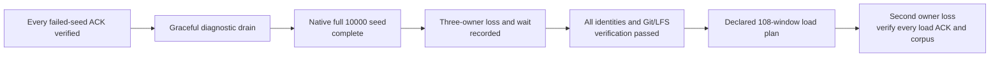
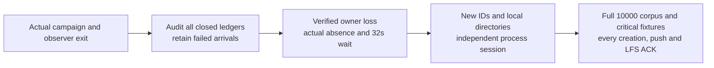
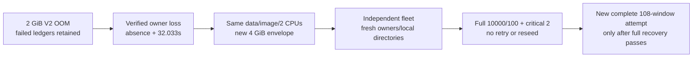
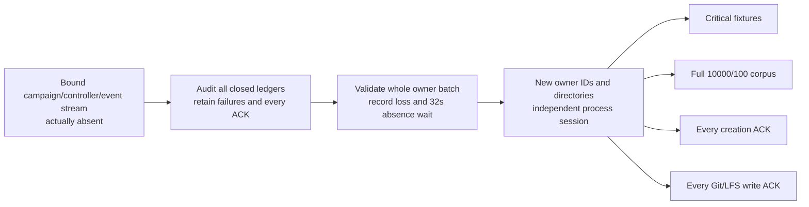

# Compare RustFS filesystem backing

**Status: all 108 4-GiB load windows finished and failed; post-load recovery was interrupted; local raw artifacts are unavailable; performance unqualified.**
This shared-Mac/Colima diagnostic keeps the 10,000-repository target. It tests
filesystem backing without replacing the bound runtime or weakening correctness.

The [later evidence-loss checkpoint](2026-10-01-evidence-loss-and-c51dd121.md)
supersedes running/retained-artifact statements below. At the final inspection,
the campaign retained 60,197 OK and 54,763 failed arrivals. Fresh post-load owners
passed the critical fixtures, then their launcher recorded ENOSPC and graceful
shutdown; full-corpus/every-ACK recovery did not complete. The external benchmark
directories and executable subsequently disappeared. Historical digests below
are expected values, not proof that their local files remain available.

## Preserve the failed run first

| Gate | Observed result |
| --- | --- |
| Original candidate seed | Failed with HTTP 503 after 3,561 identities and 39 Git/LFS fixtures; original manifest remains incomplete |
| ACK recovery | All 3,561 exact UUID/name pairs and all 39 populated fixtures passed through fresh owners, including v0/v2 clones, exact Git/LFS bytes and strict full fsck |
| Independent ACK audit | Exact unique ledger sets and artifact bindings passed; all 78 local Git clones were rechecked with strict full fsck |
| Critical fixtures | Both identities and four exact v0/v2 ref inventories, payload and notes passed |
| Diagnostic drain | Three unforced exit-0 outcomes after verified launcher SIGTERM; old RustFS stopped with data preserved |
| UI | Separate preview remains live; no UI process or provider was stopped |

The ACK verifier's final report is `e9d6e6c804367a69f93c59fae57f98f90062b7fa48393e107ae8759f8f473167`;
its ledger is `9290073f8b460d31a2cb21fcd62805759cf3e31a413c681cb9a3c195cf4d2008`.
The independent audit is `01f2daa462f7f5ee321fc30dba813013ee2fe00415ff60d210224cace0355350`.
These SHA-256 bindings refer to artifacts in `canopy-e07670e-candidate-W0SFiGMz`,
not a passing 10,000-repository run. Unacknowledged creations are not rollback
assertions. The [failed campaign record](2026-09-30-three-node-proxy.md#preserve-the-candidate-seed-failure)
retains the original failure and process-loss boundary.

## Change the storage backing, not the workload

| Input | Native-volume trial |
| --- | --- |
| Runtime | Same immutable production executable, Cellule `e07670e`; binary SHA-256 `e90728c60cbb941cc8caa1c698bc24bcf6edda1935d98853f0c0319933668f16` |
| RustFS | Same pinned ARM64 manifest `sha256:0c3c7030ffb93afde8d359fb1db957b85033ede05115518bd0dede51f4353f6a` |
| Provider limits | Two CPU quota, 2 GiB memory, same swap/restart/network settings |
| Changed backing | Docker local volume `canopy-native-data-cexfad8i` at `/data`, replacing the Mac-backed bind mount in a new fixture |
| Topology | Three new Canopy processes behind one loopback TCP proxy; verified TLS peer transport |
| Node limits | 100 active repository entries and 1.5 GiB configured local disk per node |
| Corpus | 10,000 identities; 100 two-commit Git fixtures and 100 1 MiB LFS bodies; same RNG seed `20260926` |
| Deadlines | Unchanged 30-second HTTP and 120-second stock-Git deadlines |
| Deployment | New bucket/prefix and identities; failed data is neither resumed nor deleted |

The first cold-preparation script failed an exact environment-list ordering
check before RustFS started. An independent reconciliation checked unique
environment names and identical values, image, entrypoint, arguments, resource
settings and owned volume. Only environment ordering differed. The failed
preparation receipt remains preserved; it was not rerun or overwritten.

The native fleet passed all 17 critical Git checks. The full seed completed
with exit 0 on 2026-10-01: **10,000 identities and 100 populated Git/LFS
fixtures in 3,179.240 seconds**. An independent offline audit checked exact
corpus identities, fixture selection/digests and controller/source bindings.
Seed wall time is not scheduled creation, push or fetch throughput. A complete
seed alone does not prove recovery, a root-cause fix or matched improvement.
Different wall-clock load and observer overhead remain shared-host variables.



The seed and recorded fault boundary are also complete. Critical Git setup and
critical-fixture and full native initial owner-loss recovery passed; the
[declared load matrix](three-node-baseline.json),
higher admission profiles, additional critical-operation load/fault coverage
and matched performance comparisons remain open. No stage can substitute a
smaller corpus or retries for its required evidence.

## Gate the transition and complete load plan

The initial recovery controller completed successfully. It
waited for the exact seed and its setup controller to exit, then
reread their final receipt. A failed/incomplete corpus, changed process
identity, provider restart/pause/quota/mount change or source drift stops it
before any owner-loss action.

Only a full 10,000-identity manifest with the original RNG-selected 100 exact
two-commit/LFS fixtures can reach the fault stage. The controller verifies the
whole PID/command/kernel-identity batch before sending three SIGKILLs, records
process absence and the unchanged 32-second expiry wait, and starts fresh
owners from the preserved deployment. Every original identity and Git/LFS
fixture, plus both critical repositories, must pass without retries.

The actual fault sent SIGKILL to PIDs 64706/64748/64836 in one verified batch.
All three exited -9; the launcher recorded no forced fallback. After recorded
process absence, the expiry wait lasted **32.037 seconds**. A new fleet started
at 03:45:31 UTC with three new IDs/PIDs and local directories, the same durable
deployment, admission and immutable binary. Both critical repositories passed
four exact v0/v2 ref inventories, payload/notes and strict full fsck. Full
10,000-identity/100-fixture recovery completed without retries. Its independent
terminal audit rechecked all 200 local v0/v2 clones: exact HEAD/base commits,
README/incremental bytes and strict full fsck. LFS network bytes are bound to
the inspected verifier, not downloaded again by that local audit.

The replacement load controller requires that closed recovery evidence, its
independent audit, all source and
receipt digests, three recorded SIGKILLs and fresh owners. Its plan is the
unchanged 108 windows: 114,960 offered arrivals over 8,640 offered seconds.
Failed arrivals, interrupted windows and diagnostic gaps remain visible;
post-load verification of every ACK is a separate, still-open gate.

Offline guard tests passed: four recovery tests cover the simulated complete
path, eight failure-control cases, provider-boundary checks and actual full
manifest/fixture validation; two load tests cover closed-recovery evidence and
five no-launch failure cases. All signals, provider calls, Git and load traffic
were mocked in control tests. Live read-only binding checks also passed before
arming. These are controller guards, not actual owner-loss or performance proof.

### Preserve the failed preflight and fix fixture lifetime

The first load attempt failed before any scheduled window. Its mandatory
identity preflight received `RemoteDisconnected` for
`density-b7c039e34b54-00528` / `1096f600-8ebe-4648-ac1b-d9395ead175f`.
The launcher and all three nodes disappeared with empty node logs and no
launcher outcome. This is not evidence of the earlier invalid-lease-bounds
fencing branch. The original failed campaign, controller and observer remain
preserved; the successful initial recovery does not reclassify them.

Three harmless real-tool process-lifetime trials reproduced a relevant fixture
hazard: an attached child disappeared after its tool command ended, while a
`start_new_session=True` child survived to its natural 45-second exit. An
independent offline audit checked all three process/session layouts and logs.
This supports session cleanup as the fixture explanation; it does not prove
the particular signal that removed the real fleet or globally exclude host
interventions. No production or Cellule behavior was changed.

Actual absence of the old fleet and both controllers was recorded without
sending signals, followed by a fresh **32.040-second** conservative wait.
The replacement fleet is now its own persistent foreground server session,
not a child of a finite recovery controller. It uses new node IDs, signing keys
and local directories, but the same executable, deployment, provider, corpus,
admission and deadlines. Its mandatory preflight subsequently passed all
10,000 identities and all 100 Git v0/v2/LFS fixtures before timed load began.
The unchanged 108-window attempt has a new output directory. It neither resumes
the failed attempt nor removes a failing window.

A read-only binding check and eight mocked rejection cases passed for the
replacement controller. These reject incomplete independent recovery, a short
expiry wait, a still-present old PID, provider changes, the wrong launcher,
binary/deployment changes and reused node IDs. Re-running the full original
scenario remains necessary before declaring fixture-lifetime repair verified
end to end. Every post-load creation, push and LFS ACK still requires recovery.

The separate committed ledger auditor passed against the retained failed
baseline: 21 closed arrival ledgers, 20 bound resource windows and 136 creation
ACKs, with the incomplete 108-window schedule explicitly retained. Nine new
offline auditor tests brought the harness to **75 passing tests** on Python
3.12 and 3.14. Local tests ran during recovery/preflight, not measured load
windows; they are shared-host work, not service performance proof.

### Arm every-ACK recovery without shortening the load

A separately bound post-load controller was armed in `wait_bound_load`. Its
read-only live binding check and four offline guard tests passed. During load
it only inspects the two bound process identities every 15 seconds; it does not
poll provider state or send additional Git traffic. This still adds some host
overhead and is not an isolated reference measurement.



Before any signal, it requires closed controller/campaign/observer evidence,
unchanged source/provider bindings and an independent complete-ledger audit.
Missing or orphan ledgers stop it for reconciliation, not silent omission.
If all old owners remain live, it verifies the entire PID/command/kernel
identity batch before three SIGKILLs. Already-lost fleets get no signals and
must become authoritatively absent before the same conservative wait. A
partially lost fleet that does not close stops takeover. Even a rare mid-batch
exit retains the signals already sent.

Fresh recovery keeps the same durable deployment, executable, provider and
admission. Its launcher uses a new process session so completion of the finite
verifier does not orphan an attached fixture. Critical fixtures, full seeded
corpus, acknowledged creations and acknowledged Git/LFS writes have separate
verification stages; one failed stage does not skip the other scopes. Counts
must match the audited ACK ledgers. There are no retries or failed-arrival
rollback assertions. This controller was armed, not completed, and a recovery
pass cannot turn a failed performance campaign into a pass. In the actual V2
attempt, RustFS OOM changed the provider boundary, so this controller stopped
before any owner-loss or recovery action. Its closed failure receipt is retained.

### Retain the V2 OOM and all failed arrivals

All three repetitions below offered 20 metadata requests/s for 120 seconds,
uniformly across 100 repositories, with concurrency 32. Latencies include every
scheduled arrival, including failures and driver drops; throughput counts only
successes completed inside the offered window.

| Repetition | Outcomes (2,400 offered) | Successful requests/s | p50 / p95 / p99 (ms) |
| --- | --- | --- | --- |
| 1 | 2,400 OK | 19.983 | 59.220 / 463.515 / 1,511.428 |
| 2 | 2,400 OK | 20.000 | 49.283 / 131.151 / 205.672 |
| 3 | 2,328 OK; 29 driver busy; 43 HTTP 503 | 19.400 | 62.648 / 808.954 / 16,883.284 |

The independent audits bind complete arrival sequences, deterministic selection,
latencies and resource boundaries. First-scheduled-hit/time-bin diagnostics
support cold activation contributing to the first tail, but do not explain the
whole failure. These groups do not replace the all-arrival metrics. Installed
CPython asyncio already sets TCP_NODELAY; no proxy-flag optimization is supported.
Small offline audits ran on the shared host during load and add overhead.

The scoped Docker stream recorded OOM at **05:01:19.533453747 UTC** on
2026-10-01, followed by container death. Docker reported `OOMKilled=true`,
exit 137 and zero restarts. The VM kernel independently identified
`CONSTRAINT_MEMCG` for the exact fixture cgroup and killed `rustfs` PID 12755
with 1,976,556 KiB anonymous RSS and 83,976 KiB file RSS. The VM had no swap;
a configured 4-GiB `MemorySwap` value did not provide usable swap. This proves
provider cgroup OOM, not a Cellule bottleneck, RustFS allocation mechanism,
or the cause of the earlier Mac-backed failure.

After preserving that boundary, only the verified campaign PID 82894 received
SIGINT. The final record contains:

| Scope | Retained accounting |
| --- | --- |
| Six closed windows | 14,400 arrivals: 7,128 OK, 29 driver busy, 403 HTTP 503, 6,840 transport errors |
| Interrupted seventh window | Exact 991-arrival sequence prefix, all transport errors; resource boundary incomplete |
| Original matrix | 108 declared: six closed, one interrupted, 101 unstarted |
| Load-write ACKs | Zero: no creation, push or LFS upload window started |

The partial prefix does not fabricate outcomes for its remaining 1,409 declared
arrivals. The generic whole-campaign auditor rejects its orphan ledger; a
separate reconciliation audits the six closed ledgers and retains the exact
interrupted prefix. Neither turns this into a completed or passing matrix.
The diagnostic sidecar closed with 261 probe errors; gaps remain unqualified.

### Change only the provider memory envelope for the next diagnostic

After both controllers actually exited, a guarded batch sent SIGKILL to the
three old owners (80868/80928/80936). All exited -9 without forced fallback.
Recorded launcher/owner absence was followed by a **32.033208-second** wait.
The original OOM state, kernel evidence and all failed ledgers remain preserved.

Only the owned, stopped provider's `HostConfig.Memory` changed: **2 → 4 GiB**.
CPU quota remains two; image, complete container Config, durable local volume,
other HostConfig values, binary, corpus, node admission and deadlines are
unchanged. The same container restarted at `2026-10-01T05:17:59.758811988Z`.
Its dynamic loopback endpoint changed from port 32787 to **32799**; a new
binding records that start/endpoint/resource envelope. The old trial and binding
were not overwritten. No data, unrelated container or UI service was removed.



The independent foreground fleet started at 05:19:35 UTC with fresh owner IDs.
The full verifier exited **0 at 06:27:18 UTC**, retaining four workers,
30-second HTTP and 120-second Git deadlines, with no retry or reseed.

| Closed post-OOM recovery gate | Result |
| --- | --- |
| Original corpus identities | All 10,000 exact UUID/name pairs passed |
| Git/LFS fixtures | All 100 passed stock-Git v0/v2 clones, exact commits/content, strict full fsck and exact network LFS size/hash |
| Critical fixtures | Both identities and four exact ref inventories, payload, notes and strict full fsck passed |
| Independent local Git audit | All 200 corpus clones rechecked for HEAD/base commits, committed/working-copy bytes and strict full fsck; four critical mirrors independently rechecked |
| Closed observer integrity | All 631 samples, process identities, timing bounds and sidecar digests passed; zero probe errors and zero observed OOM/oom_kill counters |

The local audits do not download LFS or recheck network identity again; those
checks remain bound to the inspected original verifier. Cgroup current/max/peak/
events/stat, CPU and shared-VM pressure retain raw file order and host-monotonic
probe bounds. Non-atomic snapshots and self/reaped-child CPU are diagnostics,
not live-child or priced cost proof. This recovery pass cannot qualify the failed
2-GiB load, prove the new full matrix, or demonstrate a code improvement.

A separately bound controller passed its live check and two offline tests
(23 rejection cases). It observed the exact verifier's actual exit, reread the
terminal full 10K/100 and critical-2 receipts, original deadlines and closed
sidecar digests, then launched a **new entire 108-window attempt** in a new
directory. The real campaign PID is 5740; its mandatory preflight passed all
10,000 identities/100 Git-v0/v2/LFS fixtures, and timed load began at
**07:03:58 UTC**. The first three closed metadata windows failed; all 108 windows
subsequently completed without retrying or dropping those failures. The load
controller sent no signals and changed no provider settings.
An incomplete recovery, PID reuse, changed provider/source, reused output or
shortened plan prevents launch. Launch/preflight is not a load pass: all
114,960 declared arrivals over 8,640 offered seconds remain required.

A second independently hosted controller is armed in `wait_bound_load` for
every-ACK recovery. Three offline tests passed, covering 28 rejection cases,
and its actual read-only binding check passed. It captured campaign PID 5740's
actual command/kernel identity and remains in `wait_bound_load`; a
never-observed or replaced campaign, live controller/event stream, incomplete sidecars, changed input or
provider, and orphan ledger stop before owner signals.



The same guarded signal/fresh-boundary functions used by the preserved V2
controller are digest-bound inputs, not reimplemented weaker guards. Failed
performance does not skip recovery of readable ACK ledgers. Each of the four
verification scopes retains failure and continues to the other scopes; counts
must match the audited ledgers. No-ACK stages explicitly say they are not traffic
passes. Provider/binary/admission/deadlines stay fixed; no automatic retries,
restarts or data deletion are permitted. This is an armed gate, not a recovered
ACK claim or completed load result.

### Prepare concurrent critical workflows as a separate gate

The new [critical-workflow driver](../../scripts/benchmark_critical_git.py)
schedules the complete existing 17-step stock-Git suite through a validated
three-node/proxy fleet. Each workflow creates two unique disposable repositories
and covers atomic publication/refusal, mixed refusal, correct/stale force leases,
shallow history, v0/v2 filtered lazy fetch, incremental push/pull, deletion,
pruning, mirroring, invalid credentials and exact mirror/fsck checks.

```sh
# After the current complete matrix and every-ACK recovery gates close:
python3 -B scripts/benchmark_critical_git.py \
  --fleet-dir "$CRITICAL_FLEET_DIR" --node-active-limit 100 \
  run --output-dir "$CRITICAL_OUTPUT_DIR" \
  --duration 300 --interval 15 --concurrency 4
```

This example offers 20 whole workflows over 300 seconds with up to four in
flight. It was **armed, not executed** at the earlier checkpoint; it added no
traffic to the matrix. Those waiter processes are no longer present.
It cannot replace the original 108 windows or higher-admission comparisons.

A separate controller binds the live post-load verifier PID/command/kernel
identity and only reads that process/receipt every 15 seconds while prior load
runs. Before launching, it requires actual verifier/controller/campaign/event
stream absence, the entire passing 108-window matrix, all four recovery scopes,
closed sidecar digests, exact ACK counts, recorded owner loss/expiry and unchanged
provider/source/fresh-owner bindings. Three offline tests passed, including 28
rejection cases, and its live read-only binding check passed. These are terminal
gate tests, not a mocked full workflow or actual critical-load result.

The first timed failures prevented this attempt from satisfying that original
launch gate, even if later windows succeeded. A separately versioned gate later
passed seven offline tests/49 rejection cases and a live binding check. It allowed
failed performance to remain failed while still requiring the entire schedule,
every recovery scope, exact ACK counts and unchanged provider/owner boundaries.
Neither gate produced a live critical-load result: the post-load recovery did
not finish, and its evidence was subsequently lost. The critical live run remains open.
On an eligible future completion, the controller establishes receipt of a scoped
Docker event with a read-only `/proc/uptime` marker before traffic, runs the new
workflow process in an independent session, retains closed provider events and
rechecks the provider/fleet/source boundary. It sends no owner signals or provider
restarts. New critical ACKs still require a separate recorded fault and recovery.

| Driver evidence | Boundary |
| --- | --- |
| Complete arrival ledger | Every workflow or busy drop retained; no backpressure-induced clock slowdown or automatic retry |
| Workflow throughput/latency | Separate offered-window and drained throughput; latency includes failed attempts, dispatch delay and client/validation work |
| Critical step timings | All recorded successes and failures retained; grouped command wall times, not isolated RPC throughput or server-only latency |
| ACK evidence | Each attempted receipt is digest-bound; partial workflows and orphan receipts stop recovery for reconciliation rather than silently skipping writes |
| Fresh-owner verification | All complete workflows checked; a failure does not skip other complete workflows; refused/reused owners and failed load remain explicit |

The driver's verification command sends no signals. The caller must separately
record actual old-process loss, expiry wait, fresh local state, unchanged provider
and complete original-corpus recovery. In-flight fault/partial-ACK reconciliation,
resource/cost boundaries and an actual concurrent critical run remain open.
Nine new offline scheduler and receipt/recovery tests passed, and all **84
harness tests** passed on local Python 3.14 during mandatory preflight, not
measured load. These tests mock Git/provider operations and do not establish
any live result. The real scheduler test retains a simulated failed worker's
partial receipt and verifies client closure; recovery tests check refusal of
reused owners and continued verification after another workflow fails.

### Preserve the first three 4-GiB timed failures

All three repetitions offered 20 metadata requests/s for 120 seconds, with 32
clients and the same deterministic uniform 100-repository selection in the full
10,000-identity corpus. Independent closed-ledger replay verified all 7,200
arrival sequences, selections, outcome counters, nearest-rank percentiles,
in-window/drained throughput and resource/receipt digests. It deliberately does
not hash the changing campaign or active later ledgers as closed evidence.

| Repetition | OK / busy / HTTP 503 | Successful in-window requests/s | All-attempt p50 / p95 / p99 (ms) |
| --- | --- | --- | --- |
| 1 | 2,269 / 128 / 3 | 18.833 | 137.376 / 1,610.926 / 4,621.883 |
| 2 | 2,392 / 8 / 0 | 19.683 | 135.785 / 872.798 / 1,681.714 |
| 3 | 1,805 / 542 / 53 | 14.833 | 639.841 / 5,893.097 / 9,139.462 |

That is **6,466 OK, 678 busy drops and 56 HTTP 503s**: 734 failed arrivals.
Busy drops have no invented latency, and success-only latency does not replace
the all-attempt population. These metadata windows are not creation or Git/LFS
write throughput, and no later success can reclassify this campaign as passing.

Three hypotheses remain open: provider pressure; directory/activation contention;
and driver/shared-host congestion. Dispatch p99 was only 10.511/19.826/20.323 ms,
while service tails were seconds. Failures recur late in windows and in repetition
3, so first-window startup alone is insufficient, and scheduler dispatch alone
does not explain the measured tails. This is captured-ledger replay, not a new
isolated replay of the failing server call or a verified causal fix.

A separate audit froze only complete existing observer samples wholly within
the three closed resource boundaries (22/22/19 samples), retaining non-atomic
raw cgroup files and exact kernel identities. The sampled intervals cover
116.032/114.444/113.105 seconds, excluding edges without interpolation. Provider
CPU averaged 1.290/1.084/1.506 cores; throttled-time counter increments were
10.158/11.573/46.453 seconds. Memory approached the 4-GiB limit in each interval,
with zero observed `oom`/`oom_kill` counters. Some provider-wide 4xx/5xx counters
also increased; these include background work/retries and do not identify a
specific frontend request or establish billed/per-operation cost.

The corresponding server logs report authentication/metadata failures with the
opaque `repository directory operation failed` message. The
[error wrapper](../../crates/canopy-server/src/server/mod.rs) retains a typed
invocation failure, but the [HTTP logs](../../crates/canopy-server/src/repository_http/mod.rs)
print only its outer Display value. That observation cannot distinguish a
durable refusal, pending outcome, invalid published result or not-started failure;
it is not evidence of bad user credentials or a proven Cellule bottleneck. No
live limit, source, binary, lease, deadline or provider setting was tuned.

The closed observer reached a sampled maximum `memory.current` of 4,294,967,296
bytes. At its final sample (06:27:17 UTC), current memory was 4,108,148,736 bytes,
anonymous memory 1,552,654,336 bytes and file memory 1,404,837,888 bytes. The
anonymous counter fell from the earlier 06:16 observation; neither growth nor
that fall distinguishes live allocation from allocator retention. No scoped
OOM, die, pause, update or restart event was observed in this recovery window.
The longest raw probe was 3.026 seconds; observer overhead remains explicit.

At 05:40:44 UTC, the recovery sidecar had 132 samples: cgroup memory had reached
the 4-GiB limit, anonymous memory was 1,658,716,160 bytes and file memory was
1,831,895,040 bytes, with zero observed OOM kills. The separate process probe
identified PID 1 as RustFS with 1,620,432 KiB anonymous RSS. Its signed `types=1`
console response was **scanner metrics, not allocator metrics**: a deep scan
was active, with 98,771 objects and 130,058 directories scanned. The raw response
is retained without relabelling it as allocation evidence. Reclaim counters
show pressure, but RSS does not distinguish live allocations from freed pages
retained by the allocator; scanner activity is not a proven root cause.

The source at the image-reported revision `d47f54b` already
[defaults allocator reclaim to enabled](https://github.com/rustfs/rustfs/blob/d47f54bfb2f39f48bd1adda334bd27e151fe85b8/crates/config/src/constants/runtime.rs)
and [makes object-cache memory resolution container-aware](https://github.com/rustfs/rustfs/blob/d47f54bfb2f39f48bd1adda334bd27e151fe85b8/crates/object-data-cache/src/runtime_memory.rs).
Those defaults are not proof of effective runtime settings or a fix here;
old upstream reports do not justify blindly toggling either knob in this bound
attempt. No live limit, environment or source was changed during verification.

The pinned [console collector](https://github.com/rustfs/rustfs/blob/d47f54bfb2f39f48bd1adda334bd27e151fe85b8/crates/ecstore/src/services/metrics_realtime.rs)
defines MEM as `1 << 6` but leaves that collection branch unimplemented. A
separate signed `types=64` request completed with empty aggregated/by-host/by-disk
samples. That is an **instrumentation gap**, not zero allocator usage or evidence
that memory is safe. Its raw receipt is retained separately from the scanner
probe; allocator attribution remains open.

Two offline admission-plan tests passed, including exact full-matrix retention
and rejection of corpus/rate/duration/trimming changes. Independent normalized
diffs confirm that the 500- and 1,000-entry variants change only admission.
Each keeps 108 windows, 8,640 offered seconds and 114,960 offered arrivals.
Neither variant has been executed; larger caps do not prove residency or capacity.

### Track latest Cellule source without changing the live artifact

At the source audit, `origin/main` was
`a4500add51764fa0415791aefbfa561db6ada203`, one upstream
[web/documentation commit](https://github.com/crabbuild/cellule/pull/35) after
`0573f489`. Five direct declarations and six lockfile source entries now select
that exact commit, with no other manifest/lockfile changes. Locked full Cargo
metadata resolved all six packages to the new SHA. No new executable or
workspace `target` directory was created; metadata briefly waited on the shared
Cargo package-cache lock. Other host work remains a shared-machine variable.

The actual cached checkout and upstream Git trees have the same `crates` object
`587e3215ce1bc0c67db3390a137623b6fead01ac`, Cargo manifest object
`6b7e13d8439558455ea04458357f3a70992fa367` and lock object
`b512761a55bba5165101ce9905dfe7f603f5b079` as `0573f489`/`e07670e`.
The audit also rechecked every frozen input in the live full-recovery, load and
post-load controllers. All matched after source-pin editing; none now runs a
newly built binary. This advance is not a Cellule performance fix, a passing
latest-pin local artifact, or a reason to skip original end-to-end qualification.

## Separate diagnostics from performance

The closed ACK-recovery observer retained 173 samples with zero probe errors.
During that window, maximum provider health latency was 457.624 ms, signed
metrics latency 265.171 ms and VM probe latency 354.850 ms. It captured 522
scoped container events without observed pause/unpause/update/restart/kill/OOM
events; 29 state snapshots had unchanged starts, quotas and zero restarts.
Its independent audit is
`866419ea5503df3ca685789f333f8d8fed03f5ed734b2f8bf8ac822099ef9dec`.
This window was after the failed seed, not an observation of the original stall.
Health and metrics timings do not establish durable-write latency.

The separate native-seed observer started after 1,250 identities and closed
after seed exit: 459 samples, zero probe errors, 77 unchanged provider-state
snapshots and 1,377 scoped events with no observed pause/unpause/update/restart/
kill/OOM events in that observation window. An offline integrity audit checked
timing bounds, kernel identities/counter continuity and signed-counter deltas.
This excludes the later intentional owner loss, not all possible shared-host
interventions or the old failed run. It retained
provider gauges, signed counters, health timings, VM uptime/CPU/I/O pressure,
kernel self/reaped-child CPU and continuous scoped events. Errors and gaps stay
visible. It adds host overhead and cannot account for the whole seed, live child
CPU, per-operation CPU/GiB or priced object-store cost.

## Bind the new trial

These historical artifacts were inspected under `canopy-native-filesystem-ceXFad8I`.
That directory is now absent; this table records expected digests, not currently
available or newly reverified local files:

| Closed input or receipt | SHA-256 |
| --- | --- |
| `provider-binding.json` | `aa6a531365f550611618c91ce8b6cd88974811f543765915f1436bf71a8ec570` |
| `start_full_trial.py` | `973e1c3cdefaf6ef221d9351970d481e7f8ba1c5773b55ae9ea86d74ed1b45d2` |
| `fleet-native-seed/ready.json` | `aaa9769fa8dfa6fa85491a32881448e9b71fe9941ff798b5b8058f8a29720ef9` |
| `critical-native.json` | `2b019dea0a6e89fe26f22d20860775860469ae2a2fd743f65d836e95d03ca04d` |
| `observe_native_seed.py` | `621ee99b88bb839541165417bb3a4c2c333edadfdbff0003f70d025498f119b3` |
| `finish_native_recovery.py` | `2dac2dd18bdbd416c95ab9ff77cbfb8566cad7bb4ae89dc5c6fa55b51c00500e` |
| `test_finish_native_recovery.py` | `bd919dfdff557d6e5fa59a6647d7731661efa37ec7854efd093cf0a08ab4b837` |
| `transition-guard-tests-final.log` | `9155d1771a85043e16da955d5f7f61465a4ca3da7df0518f116cc2093bce6568` |
| `transition-check-final.json` | `d93ac46cef8392eb61dbc666d49a69be89a46841b5e22b9d0bf464aafb1ac865` |
| `start_native_load.py` | `61d7828f2441c2d12061fce9fdb2c366ceb60c746e75322ee8b615e410c4645e` |
| `test_start_native_load.py` | `9a1009d2f57987931beeeead14cb8e1482e3ffd3bbf6f9bb7520a5cd77ae0e0b` |
| `load-guard-tests-final.log` | `6b307282780ae288f168cfceef2ff771a215534923036eb6875258d24e00622d` |
| `load-check-final.json` | `3076fafdfc8881746f728f8db498b08731676e33cba1e3181df7a7092e2f4a54` |
| `corpus-native-10000.json` | `32e7db9cf06a7b4bb57c906f0f2e70c761ed3ae207c95c7057302b55d50a9a32` |
| `trial.json` | `b618be95af59980fac8f3576f208d17ea83c43ab266c388c82288f0037a5ad12` |
| `seed-native.log` | `c9585a548c6e9c5f2a7b4fedfb8e1c54e59e7b2707e6fc194e9cec1b8612747d` |
| `native-seed-audit.json` | `355912c5fb4f21fa15eec96bdfd5301a967a4676a771a4d05307c7aa1fa49db8` |
| `audit_native_seed.py` | `78e24e4993abb9cfaff1c6121e9ac2b2773d9e30601bf88719d8e0d009a965c1` |
| `native-seed-observer/observation.json` | `7569827510978ba20827e57d1629b72dfc370afa8fb452773844e40c931137b8` |
| `native-initial-owner-loss.json` | `3ed0fdb7df452bf586c1c2908f9b66546e73a8177fbbf088531b07ea73baefe7` |
| `fleet-native-recovery/ready.json` | `2823b1e4b9ab4143fb7c9813e2717cf89d099212f50a5e8f8ad305a1d4043154` |
| `native-seed-to-recovery.json` | `0e243c3df72c789321ebc6dbf8b25c5c5dd22cea0a304ebceb6da32fea5cfe10` |
| `full-native-recovered.json` | `49d8acf40cc8e6cc253f7ac4db0cc8ddff143c913000b4e42ee868a40d2915de` |
| `critical-native-recovered.json` | `1031bf601b1e63970198a385fe4f7bacae0124b6d9861a8254729f371967ef31` |
| `initial-native-recovery-audit.json` | `0115a21f2070999189c70ecdb860af9b6f807de9b1f3fb645e53e2a2419edd20` |
| `native-load-108/campaign.json` (failed preflight) | `f27ea086b94048d54a171ee6c93507a814b427f6140887dc2a27743d9b732e9b` |
| `native-load-controller.json` (failed attempt) | `d646486befbf202fae8a5fb6696a1706b5fda82e39b79332936229d7a0548e4c` |
| `lifetime-probe-RIRZo2/audit.json` | `04cec20ab1c97805ddb40355cf2399648b3ec9c2204b237e7cf69921d57c7b04` |
| `fixture-failure-owner-exit.json` | `8deb78805eac55e248ce461955cf9078e99f851ba9ec6ed00fb952d6f2c9caf2` |
| `serve_native_load_v2.py` | `a2c41160d59b7e7cae45164f0a8030766b4eaadc293d1cc71d5ae36846469a96` |
| `start_native_load_v2.py` | `4585e0e0564edfee476e45a4d287ff061181fe5edd40daaadaae67475245ae1f` |
| `fleet-native-load-v2/ready.json` | `2741766230b975811ef46b104b06a2a3904ceea4902537ba18191e73d7c7aa9b` |
| `load-v2-check.json` | `d3a9d6522b1a7fde45b551c8bafafe485711a81fd194559aa35bcaa1aaeb4549` |
| `harness-75-python314.log` | `07cece1c7015f5df010cca8c9b2ada28cd78fdfb33a7eb08c5d7dd63daa0cecb` |
| `harness-75-python312.log` | `77ea19d83080755caf641792dac1c1dd093100d7131e814b6b8b807cfd0d9389` |
| `finish_native_load_v2.py` | `596a713aebe893796b9425d18dcfead2987f03728ac2ccb0cb63216bcb76a036` |
| `test_finish_native_load_v2.py` | `2ad420292ccfd4fe66072b216cb816603dbeeb3c20dbb86568b56cec10495762` |
| `post-load-v2-guard-tests.log` | `28157ddb518f5c1d4f887b07be9710a779324b00d8f73347311839e52606bd59` |
| `post-load-v2-check.json` | `57befacbc9f31ac6564b8cab618c45be0851b8f81c3996c1334eadae485cb281` |
| `native-load-v2/preflight.json` | `9564ba67057758324738dfbf5223ec79c172df1378458145ed586bd786551770` |
| `native-load-v2/campaign.json` | `3dda98f8c3820e151bc2f7eb2c0d72273972a6cbeb3250a84bacce160c2427af` |
| `native-load-v2-controller.json` | `3f82e91c1c4524937bb30f31c78ef39e55579f93e928b2fedd16978c66e909d9` |
| `native-post-load-v2.json` | `968c99e941dbd442326bfeb575a9ba46e46b562f17f0b584dbc857ac331fa0d3` |
| `native-windows-0000-0002-audit.json` | `ebf2ca6aaa189a4facdb0cc5033e76ebbcd9cfef5cd77cc26efbc889a401a7b2` |
| `native-v2-oom-ledger-audit.json` | `619c3ed1e0be121178a7b92379a1ce8b924e9c8d3ee71efc886757580f1e6314` |
| `native-v2-provider-oom-kernel.log` | `496836038f63914a34342a89d0895242d4c997f3dd7c31eb8470beee9304e847` |
| `native-v2-provider-oom-cancellation.json` | `7eca8217db7b9a06246626c1c1cfc652b5d4148f4c04397684eb204fd4ca4105` |
| `native-v2-oom-owner-loss.json` | `c63b5e7d4433e0130a899b0bf0efdb8d44d5b94ad08b6d5ffb5b319d9c6f5720` |
| `provider-recovery-4g.json` | `565cf80795d7d9da78eb4525f247ad3e3a0f687ae6b5804392d09304137d2da0` |
| `fleet-native-recovery-4g/ready.json` | `04b630ac1ad771a62d936071c58823c74243968f350bca14bfb15fa5d38d78af` |
| `verify_native_recovery_4g.py` | `a194d74fed89cc45048fc3378416877e3413cc1cc16c824c0446244f562be916` |
| `critical-recovered-4g.json` | `1031bf601b1e63970198a385fe4f7bacae0124b6d9861a8254729f371967ef31` |
| `critical-recovered-4g-local-audit.json` | `2970d432a30b34574c4afa9f2dd08b91015bc9e7364e53fc5a597efeee92fd96` |
| `native-recovery-4g.json` | `b3a1f3679238cd2a8d9fa5772fe6a099f0ae5e54b4d3b4a4d1ff36a65d4458d5` |
| `full-recovered-4g.json` | `49d8acf40cc8e6cc253f7ac4db0cc8ddff143c913000b4e42ee868a40d2915de` |
| `full-recovered-4g-local-audit.json` | `2a503ba240bf59be51e222e3cb34b9cdca1892ed518f66f758922d70b00150f3` |
| `native-recovery-4g-observer/observation.json` | `8cc916668c7bc5e9ff0f427c32fe3956d936f7dd5976dd9681bee2950bdb2e25` |
| `native-recovery-4g-observer-audit.json` | `c1c91bf017c83a5b2e477b1fa5da5d5fb8906b23a760723383e7f72baba34b01` |
| `start_native_load_4g.py` | `9e3ba38b22b1188923d06a4b01125cdc7921763402368815fc91b41ae10c2cef` |
| `test_start_native_load_4g.py` | `8113463ea6ad6c9e5076a94e05b5c45821f5e040ac9ca1405bd0d223f698b6b0` |
| `load-4g-guard-tests.log` | `ad1dabaf6fd44b97c2ba48c91cc833bc69a88c2e8baf813908fc24f5d1465527` |
| `load-4g-check.json` | `6865f1c3646548feed611843d84a5eb1daa635801e5df78e3c3862ad63b93a61` |
| `finish_native_load_4g.py` | `b2fc51fe7cf336d2c3e64f2807fd52744f5561efd8b078446350422d3f37f570` |
| `test_finish_native_load_4g.py` | `4d198e1148ce20c599b927b8ed33cf498d606f9aa5b3d8c7057d40ba2cb31b3f` |
| `post-load-4g-guard-tests.log` | `e8b87fc14d3c7fb0ea88fff398ba3c257e73c6ca0cc85a63fa696cc53345a07c` |
| `post-load-4g-check.json` | `b5a85134289a9689cbe63e8bf4c0ae9590cfc4965212a317ed66133c5b34af59` |
| `native-recovery-4g-memory-probe.json` | `b078266a61591ff18db05e0efabdca1e11433452e8898ffe65b9bf1e6ae91129` |
| `native-recovery-4g-allocator-probe.json` | `47da1e7f9ade991395715eaa211bdd830e48578f214622c85c4c9519e258381d` |
| `higher-admission-plans-v1/preparation.json` | `f2fec01bc047cbe800580b3c8515fcaf2ab29c3af1aee8fee0ba9327a163bc85` |
| `metadata-a4500add.json` | `78cda3f194d9147dfabc8f1d139de6e2c43ed30f4c3b9736642c9601136dd4a9` |
| `cellule-a450-source-audit.json` | `87bac9bc1c54e8fba393cfec424436532086e0810f03f48b957c5d6cfb5d01a3` |
| `harness-38a51dd-linux-36823311167-job.log` | `963a1636810e0efdc768e1d6f4c8297f3d3b07c7d441e99919ee8969d8ab0bcf` |
| `rust-38a51dd-linux-36823311167-job.log` | `2384cf85dc36736bb8560902e71227ba823b3120cbb109856b2a040159f99842` |
| `harness-84-critical-driver.log` | `ca0bd3cb47be225672e608b5b7a60f036ea82ef15df2d3b58b36ecf8dcafc437` |
| `start_critical_load_4g.py` | `b0ffd626d390a59a0b94e1ce48abd7388561454354dd8fca2ae8979ae5718a5e` |
| `test_start_critical_load_4g.py` | `c1e3bdc631a206cbaa43d681d30cdedc7ec4bca429adda6f111df4cc26b35fc2` |
| `critical-4g-gate-tests.log` | `efae8d6479515f878d6a459abc70a5880a93ef66c8c9712cc86c1d65ddf45fa9` |
| `critical-4g-check.json` | `31424b96b9c18a12dad50bd8688193f871351c9625c24277acb6a7f0a368d993` |
| `native-load-4g/preflight.json` | `78e3950590462eeca9ae8b1df729294ac3ce247056eccc8c342c542e1ca7847d` |
| `load-4g-first-three-audit.json` | `8396bd9f6d29eb5680f791b8288ac8b1e357ed7af9ebdb6861341930fc628f8c` |
| `load-4g-first-three-sidecar-audit.json` | `36602007172205cbec6d0ba1ed7ad1099cf605302ab8bd2dd132f6eb46740b35` |
| `load-4g-first-three-sidecar-prefix.jsonl` | `25162b403cecfdc12de98b1ca06a2da10c8a778c4ee9ab4c053fae1d3fe5982b` |

The baseline's new independent ledger audit is
`5416540c9b78b23e5c89ff24e771ab58012af847df4ec961adfc597bff010639`
in `canopy-three-proxy-q3FO2z`. V2 load and its stopped post-load controller have
closed failure digests above. The separate 4-GiB full verifier and independent
audits now have closed digests; the new load and post-load controllers are still
live and have no completion digests. Setup timings are
not scheduled throughput.
This is not isolated Linux reference capacity, a proven Cellule bottleneck or
a passing latest-pin executable comparison. Both hosted workflows for source
pin `0573f489` passed
([36806695489](https://github.com/crabbuild/canopy/actions/runs/36806695489),
[36806698917](https://github.com/crabbuild/canopy/actions/runs/36806698917));
the running comparison binary remains the original `e07670e` artifact.
Both harness (75 tests) and Rust jobs also passed for published head `772d1dc`
([36816818943](https://github.com/crabbuild/canopy/actions/runs/36816818943),
[36816813337](https://github.com/crabbuild/canopy/actions/runs/36816813337)).
Hosted verification is not the outstanding local full-matrix qualification.
Both Rust and harness jobs also passed for source head `38a51dd`, selecting
Cellule `a4500add`
([36823311167](https://github.com/crabbuild/canopy/actions/runs/36823311167),
[36823307410](https://github.com/crabbuild/canopy/actions/runs/36823307410)).
The retained PR-run logs explicitly show 75 harness tests passing and the
locked Rust workspace tests using that revision. This is hosted correctness,
not a new local release executable or performance comparison.
