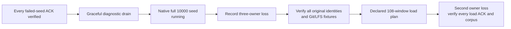

# Compare RustFS filesystem backing

**Status: full native-volume seed running; recovery and performance unqualified.**
This shared-Mac/Colima diagnostic keeps the 10,000-repository target. It tests
filesystem backing without replacing the bound runtime or weakening correctness.

## Preserve the failed run first

| Gate | Observed result |
| --- | --- |
| Original candidate seed | Failed with HTTP 503 after 3,561 identities and 39 Git/LFS fixtures; original manifest remains incomplete |
| ACK recovery | All 3,561 exact UUID/name pairs and all 39 populated fixtures passed through fresh owners, including v0/v2 clones, exact Git/LFS bytes and strict full fsck |
| Independent ACK audit | Exact unique ledger sets and artifact bindings passed; all 78 local Git clones were rechecked with strict full fsck |
| Critical fixtures | Both identities and four exact v0/v2 ref inventories, payload and notes passed |
| Diagnostic drain | Three unforced exit-0 outcomes after verified launcher SIGTERM; old RustFS stopped with data preserved |
| UI | Separate preview remains live; no UI process or provider was stopped |

The ACK verifier's final report is `e9d6e6c804367a69f93c59fae57f98f90062b7fa48393e107ae8759f8f473167`;
its ledger is `9290073f8b460d31a2cb21fcd62805759cf3e31a413c681cb9a3c195cf4d2008`.
The independent audit is `01f2daa462f7f5ee321fc30dba813013ee2fe00415ff60d210224cace0355350`.
These SHA-256 bindings refer to artifacts in `canopy-e07670e-candidate-W0SFiGMz`,
not a passing 10,000-repository run. Unacknowledged creations are not rollback
assertions. The [failed campaign record](2026-09-30-three-node-proxy.md#preserve-the-candidate-seed-failure)
retains the original failure and process-loss boundary.

## Change the storage backing, not the workload

| Input | Native-volume trial |
| --- | --- |
| Runtime | Same immutable production executable, Cellule `e07670e`; binary SHA-256 `e90728c60cbb941cc8caa1c698bc24bcf6edda1935d98853f0c0319933668f16` |
| RustFS | Same pinned ARM64 manifest `sha256:0c3c7030ffb93afde8d359fb1db957b85033ede05115518bd0dede51f4353f6a` |
| Provider limits | Two CPU quota, 2 GiB memory, same swap/restart/network settings |
| Changed backing | Docker local volume `canopy-native-data-cexfad8i` at `/data`, replacing the Mac-backed bind mount in a new fixture |
| Topology | Three new Canopy processes behind one loopback TCP proxy; verified TLS peer transport |
| Node limits | 100 active repository entries and 1.5 GiB configured local disk per node |
| Corpus | 10,000 identities; 100 two-commit Git fixtures and 100 1 MiB LFS bodies; same RNG seed `20260926` |
| Deadlines | Unchanged 30-second HTTP and 120-second stock-Git deadlines |
| Deployment | New bucket/prefix and identities; failed data is neither resumed nor deleted |

The first cold-preparation script failed an exact environment-list ordering
check before RustFS started. An independent reconciliation checked unique
environment names and identical values, image, entrypoint, arguments, resource
settings and owned volume. Only environment ordering differed. The failed
preparation receipt remains preserved; it was not rerun or overwritten.

The native fleet passed all 17 critical Git checks. At **03:10:16 UTC on
2026-10-01**, its incomplete seed contained **3,575 identities and 40 populated
fixtures**. Passing the old failure's repository count does not prove a fix.
Different wall-clock load and observer overhead remain shared-host variables.

Only the first two stages are complete. Critical Git setup also passed;
native owner-loss recovery, the [declared load matrix](three-node-baseline.json),
higher admission profiles, additional critical-operation load/fault coverage
and matched performance comparisons remain open. No stage can substitute a
smaller corpus or retries for its required evidence.

## Separate diagnostics from performance

The closed ACK-recovery observer retained 173 samples with zero probe errors.
During that window, maximum provider health latency was 457.624 ms, signed
metrics latency 265.171 ms and VM probe latency 354.850 ms. It captured 522
scoped container events without observed pause/unpause/update/restart/kill/OOM
events; 29 state snapshots had unchanged starts, quotas and zero restarts.
Its independent audit is
`866419ea5503df3ca685789f333f8d8fed03f5ed734b2f8bf8ac822099ef9dec`.
This window was after the failed seed, not an observation of the original stall.
Health and metrics timings do not establish durable-write latency.

The separate native-seed observer started after 1,250 identities, retaining
provider gauges, signed counters, health timings, VM uptime/CPU/I/O pressure,
kernel self/reaped-child CPU and continuous scoped events. Errors and gaps stay
visible. It adds host overhead and cannot account for the whole seed, live child
CPU, per-operation CPU/GiB or priced object-store cost.

## Bind the new trial

Artifacts are retained under `canopy-native-filesystem-ceXFad8I`:

| Closed input or receipt | SHA-256 |
| --- | --- |
| `provider-binding.json` | `aa6a531365f550611618c91ce8b6cd88974811f543765915f1436bf71a8ec570` |
| `start_full_trial.py` | `973e1c3cdefaf6ef221d9351970d481e7f8ba1c5773b55ae9ea86d74ed1b45d2` |
| `fleet-native-seed/ready.json` | `aaa9769fa8dfa6fa85491a32881448e9b71fe9941ff798b5b8058f8a29720ef9` |
| `critical-native.json` | `2b019dea0a6e89fe26f22d20860775860469ae2a2fd743f65d836e95d03ca04d` |
| `observe_native_seed.py` | `621ee99b88bb839541165417bb3a4c2c333edadfdbff0003f70d025498f119b3` |

The corpus, controller report and observer outputs are still live and do not
have final completion digests. Setup timings are not scheduled throughput.
This is not isolated Linux reference capacity, a proven Cellule bottleneck or
a passing latest-pin executable comparison. Both hosted workflows for source
pin `0573f489` passed
([36806695489](https://github.com/crabbuild/canopy/actions/runs/36806695489),
[36806698917](https://github.com/crabbuild/canopy/actions/runs/36806698917));
the running comparison binary remains the original `e07670e` artifact.
