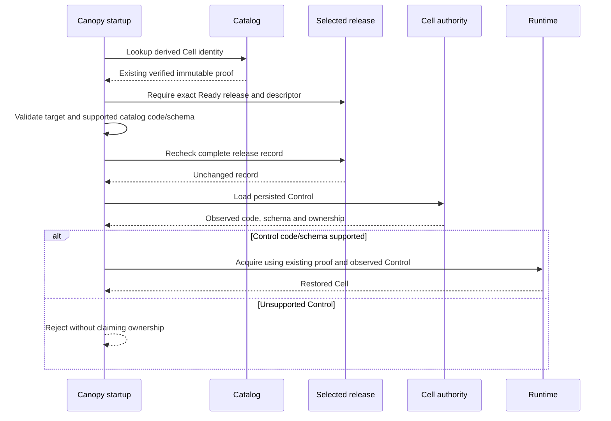

# Retained catalog admission and startup safety

The candidate reopens a supported predecessor Directory Cell after explicit fixture
activation without rewriting its immutable catalog identity. It also rejects
unsupported persisted Control code/schema before ownership changes. PR #18
still does not provide an automatic upgrade controller or establish old-binary
RustFS upgrade, full-corpus recovery or reference performance.

This extends the [authentication and residency checkpoint](2026-10-01-bounded-authentication-and-residency.md).
The Cellule pin remains `c51dd121284ecc8878b75d32717a4dfbe2c406c2`.
Upstream main was rechecked as `0dc04a658bd99668936f7ec58032d054f6fbc141`;
qualifying it remains a separate gate.

## Existing identity is admitted without reprovisioning

The real startup regression failed with `CatalogCollision` in all three
pre-fix attempts. Startup tried to provision the current Directory module code
against an existing entry whose initial code is immutable. Descriptor retention
alone could not repair this call-site behavior.

New entries still use Cellule's strict `ReleaseStore::provision` path and current
code. Existing entries instead require a verified proof, the exact compiled
descriptor and a Ready release with matching current/desired digests. The target,
partition, namespace, SQL role and initial code/schema must be supported.
Admission rereads the complete release record and rejects any change, including
a transition back to Ready with the same digest.



The checks do not select a release, migrate schema, rewrite catalog identity or
remove the runtime's ownership CAS and fencing requirements. Release enrollment
and readiness checks remain in force.

## Refusal must not change unsupported Control metadata

The initial read-only catalog fix passed retained startup but failed a stronger
safety test. Both unsupported-code and unsupported-schema cases failed in all
three attempts: startup returned an error only after runtime acquisition had
changed Control epoch/revision.

The guard now checks the actual persisted Control against the registry before
bootstrap, takeover or restoration. The unchanged three-case regression then
passed in all three attempts. Its negative cases compare the complete canonical
Control bytes before and after refused startup, not merely the returned error.

| Regression | Before correction | After correction |
| --- | --- | --- |
| Supported retained Directory startup | CatalogCollision in all three attempts | Restored persisted token, authenticated it and created/listed a repository |
| Unknown persisted Control code | Startup refused but Control changed in all three attempts | Refused with identical Control bytes in all three attempts |
| Unknown persisted Control schema | Startup refused but Control changed in all three attempts | Refused with identical Control bytes in all three attempts |
| Release and catalog admission guards | New targeted tests | All five passed: current/retained proof, missing/non-Ready release, corrupt descriptor, unsupported identity/wrong target and Ready round trip |

These tests use owned in-memory stores. The predecessor descriptor is the exact
recorded fixture, but the fixture writes its data with the current test runtime.
It is not evidence that an old executable produced those bytes. Its explicit
activation occurs only after fixture-specific admission and with no advertised
writers; it must not be copied as a live upgrade procedure.

## Combined qualification

The frozen tested source is `402e9f93e21c576fc430cd20bbac16a4489d1558`.
PR production files are checked byte-for-byte against that source before publication.

| Check | Closed result | Scope limit |
| --- | --- | --- |
| Locked release build and lints | Passed; all targets checked with warnings denied | Not a live deployment |
| Release workspace | 239 top-level tests passed, zero failed, nine ignored | Nested subprocess tests counted once; ignored provider/size gates are separate |
| Directory integration | All 12 passed | Includes bounded authentication and descriptor admission |
| Read-only catalog admission | All five unit regressions passed | Owned in-memory release/catalog faults |
| RustFS compatibility | All eight exact gates passed; closed 23:20:36 UTC | Disposable fresh fixture, not retained old-binary upgrade |
| Original cold activation | All 20 independent repetitions passed | Unchanged test against retained production artifact |
| Retained startup and refusal | All three cases passed in all 20 independent repetitions | Current test runtime wrote the predecessor fixture |
| Complete residency suite | All 15 passed at four threads; repetitions closed 23:22:14 UTC | Not live corpus recovery or capacity measurement |
| Python harness | All 84 passed | Accounting and guard coverage |

Reproduce the focused checks and provider gates with:

```sh
cargo test --release --locked -p canopy-server --lib server::catalog_admission::tests::
cargo test --release --locked -p canopy-server --test multi_server retained_catalog::
cargo test --release --locked --workspace -- --test-threads=4
cargo clippy --release --workspace --all-targets --locked -- -D warnings
python3 -B scripts/qualify_size.py --provider-only --release
```

The RustFS command owns its disposable fixture. It does not qualify the existing
10,000-repository store, sustained load or the non-sparse five-GiB transfer.

## Preserved evidence and remaining gates

The failed catalog reproduction is retained at
`/Users/haipingfu/.codex/canopy-retained-catalog-before-ZOZqDQ`.
The failed unsupported-Control tests are at
`/Users/haipingfu/.codex/canopy-retained-control-before-kRqUeP`;
the corrected three repetitions are at
`/Users/haipingfu/.codex/canopy-retained-control-after-G4eQeG`.
Closed artifacts and exact source bindings were copied and independently reread
on a different local filesystem before subsequent source changes. These are
local backups, not off-machine copies.

Combined release evidence is at
`/Users/haipingfu/.codex/canopy-catalog-admission-qualification-fsvZZ8`.
Its 290 files passed copy and independent reread checks at
`/Volumes/Workspace/CrabData/canopy-catalog-correctness-evidence-w_ouq9tq`.
Provider/repetition evidence is at
`/Users/haipingfu/.codex/canopy-catalog-provider-gates-p7WF68`;
its 328 files passed the same checks at
`/Volumes/Workspace/CrabData/canopy-catalog-provider-residency-evidence-sx7hfpq4`.

| Closed artifact | SHA-256 |
| --- | --- |
| Combined executable | `04ac334406120d82162c6d2c47e693eaaf4b88215318e8b9b9cf14acd8a2da91` |
| `build-tests.json` | `021f9348bc4377a08339809fe37e696c486802ef0257ec3ca657f6c36f8e299c` |
| `release-workspace.log` | `40e0a801dfafe30d779953ae65d5bc6987a54a060660feaf8fc557d30c9f3098` |
| `provider-tests.json` | `d417e4743ac37bbbb6bd11e3b5441edeeaa76cae58411fa78ecefce7ebd34f5f` |
| `provider-tests.log` | `a0c6a05e14d47ef2362948ed65b154625e8b9b68418241ea2918f1d13ce4a20e` |
| `residency-repetitions.json` | `0d9531a6b1100cbe0423fa14c923b479965e17a257849ea4c1a8e100a32a50a9` |

The existing corpus and UI preview were not upgraded by these checks. Required
gates remain actual old-executable to new-executable restore against RustFS,
fully admitted same-corpus upgrade, full Git/LFS recovery, and an explanation of
the separate diagnostic fleet's terminal lease-fencing failure. No owner restart
or release change is credited as resolving that failure.

The full [performance plan](../performance-plan.md) is unchanged: three nodes
behind a proxy, 10,000 identities, 100 populated Git/LFS fixtures, all 108 windows,
114,960 arrivals and 8,640 scheduled seconds, critical concurrent workflows and
faults, every acknowledged write after owner loss, higher admission profiles,
matched comparisons and isolated Linux qualification. No matched speedup is
claimed; PR #18 remains draft.
