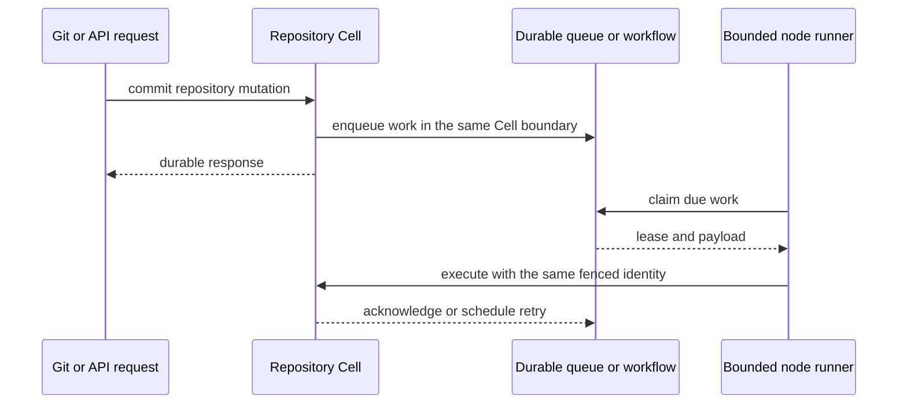

# Design full repository Cell capabilities

This proposal explains the dependency and Canopy changes needed to put SQL, key-value data, queues, workflows, and scheduled work inside each repository's existing Cell. It is separate from the first SQL-backed Git-hosting release. Canopy currently uses SQL Repository Cells, and every [acceptance gate](#acceptance-gates) below remains open.

> **Document type:** Conceptual proposal. **Goal:** evaluate one Cell identity with several durable capabilities and define the black-box proof required before implementation.

## One identity, several capabilities

The intended design keeps one repository UUID, one fenced owner and one durable recovery root. Primitive operations may use distinct typed clients, but they must resolve to that same Cell. A queue or workflow routed to a separate namespace would not meet this objective.

```text
repository UUID ──► one Repository Cell ──► one fenced writer
                         │                    one durable root
                         ├── SQL: Git, ACL, issues, PRs
                         ├── KV and Blob
                         ├── queue and workflow
                         └── Cron, Timer, effects, projections
                                  │
                                  ▼
                         bounded node runners
                         (including cold repositories)
```



Here, **Cell** is Cellule's unit of ownership, transaction and recovery. **Capability** is a primitive API installed in that Cell. **Autonomous progress** means queued and scheduled work advances even when no user request opens the repository.

## Required outcome

The final system must satisfy both the hosting contract and the composed-Cell contract:

Each repository UUID identifies one Cell with SQL, KV, queue, workflow, Blob,
Cron, Timer, durable effects/inbox and projection capabilities. They share its
fenced writer, SQLite transaction domain, request ledger, durable root and
recovery lifecycle. Nodes must host thousands of these repository identities
with bounded memory, disk, descriptors, workers and queued operations.

All existing Git smart-HTTP, LFS, collaboration, ACL and recovery requirements
remain. Ordinary Git objects stay in SQLite; large bodies stay in immutable
object storage. A SQL-only density measurement does not qualify the complete
primitive-enabled repository design.

## Current contract gap

The current runtime and Canopy module bind one exclusive catalog role to a Cell. The table identifies why adding schema tables alone cannot safely enable the other primitives.

Canopy's `RepositoryModule` declares `CatalogRole::Sql`, registers SQL plus
product commands, and has empty workflow-definition and activity inventories
in `src/lib.rs`. `RepositoryCell` holds `SqlCell<RepositoryModule>`. Its schema
contains Git/collaboration state; no repository KV, queue or workflow capability
is wired into the product.

The pinned Cellule revision is `a28de7bc09ce36d87e642adc4f4b6be50d6fcb69`.
Read-only inspection establishes the following constraints in that source:

| Surface | Existing contract | Required change |
| --- | --- | --- |
| `cellule-runtime/src/cell/catalog/mod.rs` | A catalog entry has one exclusive `CatalogRole` | Describe the primitive capabilities of a single Cell independently of its entity partition |
| `cellule-runtime/src/primitives/kv/api.rs` | `KvNamespace::new` requires role KV and hashes scope to shard Cells | Bind a KV capability to an explicit repository Cell target |
| `cellule-runtime/src/primitives/queue/api/mod.rs` | `QueueNamespace` requires role Queue and routes producer/shard identities | Bind queue operations to the existing repository target and registered queue policy |
| `cellule-runtime/src/primitives/workflow/api/mod.rs` | `WorkflowNamespace` requires role Workflow | Bind workflow operations/definitions to the repository target |
| `cellule-runtime/src/registry/schemas/validation.rs` | `validate_queue_bindings` rejects a Queue binding unless its namespace has role Queue; workflow/Cron/Timer validation also uses exclusive roles | Validate capability membership, operation inventory, codecs and effect destinations for composed Cells |
| `cellule-runtime/src/primitives/maintenance.rs` | Persisted-work and transfer inspection checks Queue/Workflow/Blob/Cron/Timer state conditionally on the exclusive role | Inspect every installed primitive when scheduling, moving, retiring or releasing a Cell |
| `cellule-runtime/src/registry/handlers.rs` | Raw primitive transaction access is crate-private | Retain trusted native procedures and typed module composition |

Registering a queue command against the existing SQL namespace is insufficient:
registry validation rejects it, and role-based work inspection would omit live
queue/workflow obligations. Schema additions alone cannot establish safe Cell
release or durable background execution. The newer runtime provides entity
partitioning and due-work discovery, but Canopy has not yet integrated a composed
repository capability set or its runners. Switching dependencies alone does not
close these gates.

## Proposed dependency work

Implement these dependency changes in order. Each step preserves the existing repository identity and fencing rules while extending what can execute inside that Cell:

1. **Capability metadata and identity.** Introduce a validated set of primitive
   capabilities in the namespace/catalog contract. Preserve repository UUID-derived entity
   partitioning and one Cell identity. Cover descriptor hashing, signing,
   catalog proof, release validation, peer resolution and restore admission.
   Determine the format/version transition from shipped contract evidence;
   do not add compatibility readers by default. A fresh preview prefix is
   acceptable for Canopy's unshipped schema change, but persisted runtime
   contracts still require explicit versioning decisions.
2. **Cell-bound typed clients.** Add an explicit-target API for SQL, KV, queues,
   Blob, Cron, Timer and workflows that verifies capability membership and the
   owning module. Define queue/run/timer identity within the repository Cell.
   Keep namespace-shard routing as a distinct partitioning contract only where
   an existing supported caller needs it. Public callers cannot select arbitrary
   modules or bypass the target's declared capabilities.
3. **Native composition.** Compile distinct operation IDs/codecs and primitive
   schemas into one repository module. Register one aggregate maintenance Tick
   that covers installed classes. Use existing native procedures, request
   deduplication and SQL savepoints. Prove that a product command can update
   relational state and enqueue an event atomically in one Cell transaction.
4. **Complete lifecycle inventory.** Replace exclusive-role checks throughout
   maintenance, transfer, recovery, backup, code retirement, scheduler dispatch,
   effect delivery and activity execution. A live queue lease, workflow activity,
   waiting workflow, timer or unpublished Blob must retain its required owner,
   code and artifacts according to the runtime contract. Background obligations
   cannot vanish when a foreground request releases its pin.
5. **Bounded dormant execution.** Make due work discoverable without a polling
   task or thread per repository. Use a durable due-work index and bounded node
   runners. Cold activation, SQL execution, activities and effect delivery need
   separate resource admission. Prove timer/queue/workflow progress after local
   eviction and owner failure, including cells with no incoming HTTP traffic.
   Measure what can sleep, what must stay owned, and what prevents transfer;
   do not infer that all waiting workflows are safely evictable.

The current dependency cutover uses Cellule's runtime, app, host, LTX and store
crates. It does not patch upstream behavior or add a vendor override. Future
runtime implementation work belongs in an isolated Cellule checkout with its
own Cargo target directory, preserving other active work.

## Canopy integration after the runtime contract is ready

After Cellule can compose primitives in one Cell, use real Canopy operations to validate the API and background execution path:

- Keep `RepositoryCell` as the product capability boundary. Add typed repository
  capabilities through the same target and request identity; extend the compiled
  schema and source/operation inventories together.
- Keep per-repository authorization at product entry points and again at mutation
  boundaries where required. Trusted module code owns SQL and primitive policy.
- Use real hosting operations as callers: repository settings/CAS, post-push job
  enqueue, webhook delivery, scheduled maintenance and a durable repository job
  workflow. Queue/workflow APIs must report actual durable state and errors.
- Wire native consumers, Tick, effect and activity runners into supervised node
  startup, admission, readiness and shutdown. Embedded state machines without
  a running delivery path do not satisfy the requirement.
- Extend backups and restoration to include every primitive's roots and external
  bodies. Preserve existing Git/LFS object identities, branch rules and exact
  push-reply replay.

## Acceptance gates

Close a gate only with black-box behavior across eviction, process loss and fresh-disk restore. Unit tests of a typed client alone cannot establish autonomous progress or shared durability.

| Gate | Required black-box evidence |
| --- | --- |
| One Cell identity | SQL/KV/queue/workflow/Blob/Cron/Timer operations for a repository bind to the same Cell ID and authority root; another repository remains isolated |
| Atomic composition | A product SQL mutation and queued event commit together; failure rolls both back; replay adds neither duplicate rows nor duplicate work |
| Primitive contracts | KV CAS/expiry/list; queue send/claim/token validation/ack/retry/dead-letter/control; workflow start/signal/activity/timer/control; Blob multipart/range verification; Cron/Timer delivery; effect inbox deduplication; projection watermark |
| Autonomous progress | Timers, queued work and workflows advance with no foreground HTTP requests, after eviction and after owner takeover |
| Ownership and recovery | Lease loss, interrupted publication and competing owners cannot duplicate acknowledged effects, lose committed state or release required primitive artifacts |
| Hosting integration | Stock Git v0/v2 and LFS, collaboration, repository permissions and push replay still pass with all primitive schemas/runners installed |
| Density and latency | Thousands of fully provisioned repository Cells under mixed Git and primitive workloads; measured active set, queued work, RAM/disk/FD use, errors, latency and recovery time |

Every gate remains open. The current SQL-only density driver is an initial
baseline and must be extended and rerun for the complete capability set.
