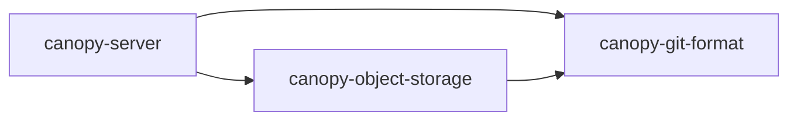

# Rust workspace

Canopy is a Cargo workspace. Run `cargo build --locked`, `cargo test --workspace --locked`,
and `cargo run --bin canopy -- <config.json>` from the repository root.

| Crate | Responsibility |
| --- | --- |
| `canopy-git-format` | Git object kinds, SHA-1/SHA-256 IDs, and canonical object hashing. It has no service or storage dependency. |
| `canopy-object-storage` | Immutable multipart object-store bodies and verified large Git blob reads and writes. It depends on `canopy-git-format`. |
| `canopy-server` | The `canopy` binary, Cell application and schemas, repository and directory behavior, Git/HTTP/SSH gateways, and deployment lifecycle. It composes the other two crates and re-exports the core types. |



The server crate owns Cell commands and their schema because they share one
application registration and transaction boundary. Its integration tests live
beside that crate. The workspace root owns `Cargo.lock`, so every crate builds
against the same dependency graph.

When adding code, put Git ID and hashing rules in `canopy-git-format`, and
object-store body logic in `canopy-object-storage`. Keep request handling and
Cell orchestration in `canopy-server`. Preserve the `canopy-server` re-exports
when moving an existing public type so downstream imports keep working.

The external Git blob module is now `canopy_server::blob` and
`canopy_object_storage::blob`; its `LargeBlob*` type names are unchanged.
Run the renamed benchmark example with `cargo run --example benchmark -- <args>`.

## Source and test organization

Use a single `name.rs` file for a leaf module. When a module needs separate
implementation or test files, put its root in `name/mod.rs` and keep its children
inside that directory. This keeps the module together without a sibling
`name.rs` and `name/` directory.

Small unit tests live in an inline `#[cfg(test)] mod tests` block. Larger unit
test groups live in the module's `tests.rs`, declared with `#[cfg(test)] mod tests;`.
Unit tests can access private implementation details without expanding the
public API.

Integration tests exercise the public API under each crate's `tests/` directory.
Use `tests/name.rs` for a single-file test target and `tests/name/main.rs` for a
suite split into modules. Cargo discovers both layouts automatically. Declare
suite modules normally; reserve `#[path]` for shared helpers in `tests/support/`.

```text
src/
  access.rs
  git_cache/
    mod.rs
    tests.rs
tests/
  git_http.rs
  multi_server/
    main.rs
    ssh/
      mod.rs
      fetch.rs
  support/
    mod.rs
```

The module layout is independent of the public Rust paths. Moving a module root
into `mod.rs` preserves its module name, visibility, and imports. Update relative
`include_str!` and `include_bytes!` paths whenever moving a source file.
